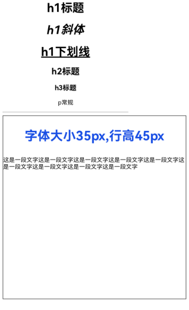

# RichText

富文本组件，解析并显示HTML格式文本。

>  **说明：**
>
> 该组件从API Version 8开始支持。后续版本如有新增内容，则采用上角标单独标记该内容的起始版本。


## 子组件

不包含子组件。

## 接口

RichText(content:string)

**参数:**

| 参数名 | 参数类型 | 必填  | 参数描述 |
| ------- | -------- | ------------- | -------- |
| content | string | 是   | 表示HTML格式的字符串。 |


## 事件


| 名称 | 描述 |
| -------- | -------- |
| onStart(callback: () => void)    | 加载网页时触发。   |
| onComplete(callback: () => void) | 网页加载结束时触发。 |

## 支持标签

| 名称 | 描述 | 示例 |
| -------- | -------- | -------- |
| \<h1>--\<h6> | 被用来定义HTML，\<h1>定义重要等级最高的标题，\<h6>定义重要等级最低的标题。 | \<h1>这是一个标题\</h1>\<h2>这是h2标题\</h2> |
| \<p>\</p> | 定义段落。 | \<p>这是一个段落\</p> |
| \<br/> | 插入一个简单的换行符。 | \<p>这是一个段落\<br/>这是换行段落\</p> |
| \<hr/> | 定义HTML页面中的主题变化（比如话题的转移），并显示为一条水平线。 | \<p>这个一个段落\</p>\<hr/>\<p>这是一个段落\</p> |
| \<image>\</image> | 用来定义图片。 | \<image src="file:///data/storage/el1/bundle/entry/resources/rawfile/icon.png">\</image> |
| \<div>\</div> | 常用于组合块级元素，以便通过CSS来对这些元素进行格式化。 | \<div style='color:#0000FF'>\<h3>这是一个在div元素中的标题。\</h3>\</div> |
| \<i>\</i> | 定义与文本中其余部分不同的部分，并把这部分文本呈现为斜体文本。 | \<i>这是一个斜体\</i> |
| \<u>\</u> | 定义与常规文本风格不同的文本，像拼写错误的单词或者汉语中的专有名词，应尽量避免使用\<u>为文本加下划线，用户会把它混淆为一个超链接。 | \<p>\<u>这是带有下划线的段落\</u>\</p> |
| \<style>\</style> | 定义HTML文档的样式信息。 | \<style>h1{color:red;}p{color:blue;}\</style> |
| style | 属性规定元素的行内样式，写在标签内部，在使用的时候需用引号来进行区分，并以; 间隔样式，style='width: 500px;height: 500px;border: 1px soild;margin: 0 auto;'。 | \<h1 style='color:blue;text-align:center'>这是一个标题\</h1>\<p style='color:green'>这是一个段落。\</p> |
| \<script>\</script> | 用于定义客户端文本，比如JavaScript。 | \<script>document.write("Hello World!")\</script> |

## 示例

示例效果请以真机运行为准，当前IDE预览器不支持。

```ts
// xxx.ets
@Entry
@Component
struct RichTextExample {
  @State data: string = '<h1 style="text-align: center;">h1标题</h1>' +
  '<h1 style="text-align: center;"><i>h1斜体</i></h1>' +
  '<h1 style="text-align: center;"><u>h1下划线</u></h1>' +
  '<h2 style="text-align: center;">h2标题</h2>' +
  '<h3 style="text-align: center;">h3标题</h3>' +
  '<p style="text-align: center;">p常规</p><hr/>' +
  '<div style="width: 500px;height: 500px;border: 1px solid;margin: 0auto;">' +
  '<p style="font-size: 35px;text-align: center;font-weight: bold; color: rgb(24,78,228)">字体大小35px,行高45px</p>' +
  '<p style="background-color: #e5e5e5;line-height: 45px;font-size: 35px;text-indent: 2em;">' +
  '<p>这是一段文字这是一段文字这是一段文字这是一段文字这是一段文字这是一段文字这是一段文字这是一段文字这是一段文字</p>';

  build() {
    Flex({ direction: FlexDirection.Column, alignItems: ItemAlign.Center,
      justifyContent: FlexAlign.Center }) {
      RichText(this.data)
        .onStart(() => {
          console.info('RichText onStart');
        })
        .onComplete(() => {
          console.info('RichText onComplete');
        })
    }
  }
}
```

  