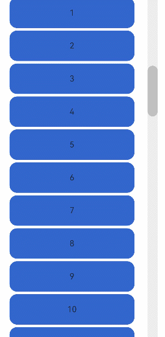

# ScrollBar

滚动条组件ScrollBar，用于配合可滚动组件使用，如List、Grid、Scroll。

>  **说明：**
>
>  该组件从API Version 8开始支持。后续版本如有新增内容，则采用上角标单独标记该内容的起始版本。


## 子组件

可以包含单个子组件。


## 接口

ScrollBar(value: { scroller: Scroller, direction?: ScrollBarDirection, state?: BarState })

**参数：**

| 参数名 | 参数类型 | 必填 | 参数描述 |
| -------- | -------- | -------- | -------- |
| scroller | [Scroller](ts-container-scroll.md#scroller) | 是 | 可滚动组件的控制器。用于与可滚动组件进行绑定。 |
| direction | [ScrollBarDirection](#scrollbardirection枚举说明) | 否 | 滚动条的方向，控制可滚动组件对应方向的滚动。<br/>默认值：ScrollBarDirection.Vertical |
| state | [BarState](ts-appendix-enums.md#barstate) | 否 | 滚动条状态。<br/>默认值：BarState.Auto |

>  **说明：**
>
> ScrollBar组件负责定义可滚动区域的行为样式，ScrollBar的子节点负责定义滚动条的行为样式。
> 
> 滚动条组件与可滚动组件通过Scroller进行绑定，且只有当两者方向相同时，才能联动，ScrollBar与可滚动组件仅支持一对一绑定。

## ScrollBarDirection枚举说明

| 名称 | 描述 |
| -------- | -------- |
| Vertical | 纵向滚动条。 |
| Horizontal | 横向滚动条。 |


## 示例

```ts
// xxx.ets
@Entry
@Component
struct ScrollBarExample {
  private scroller: Scroller = new Scroller()
  private arr: number[] = [0, 1, 2, 3, 4, 5, 6, 7, 8, 9, 10, 11, 12, 13, 14, 15]

  build() {
    Column() {
      Stack({ alignContent: Alignment.End }) {
        Scroll(this.scroller) {
          Flex({ direction: FlexDirection.Column }) {
            ForEach(this.arr, (item: number) => {
              Row() {
                Text(item.toString())
                  .width('80%')
                  .height(60)
                  .backgroundColor('#3366CC')
                  .borderRadius(15)
                  .fontSize(16)
                  .textAlign(TextAlign.Center)
                  .margin({ top: 5 })
              }
            }, (item:number) => item.toString())
          }.margin({ right: 15 })
        }
        .width('90%')
        .scrollBar(BarState.Off)
        .scrollable(ScrollDirection.Vertical)
        ScrollBar({ scroller: this.scroller, direction: ScrollBarDirection.Vertical,state: BarState.Auto }) {
          Text()
            .width(20)
            .height(100)
            .borderRadius(10)
            .backgroundColor('#C0C0C0')
        }.width(20).backgroundColor('#ededed')
      }
    }
  }
}
```



