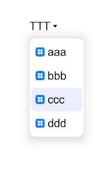

#  Select

提供下拉选择菜单，可以让用户在多个选项之间选择。

>  **说明：** 
>
>  该组件从API Version 8开始支持。后续版本如有新增内容，则采用上角标单独标记该内容的起始版本。

## 子组件

无

## 接口

Select(options: Array\<[SelectOption](#selectoption对象说明)\>)

## SelectOption对象说明

| 参数名 | 参数类型                            | 必填 | 参数描述       |
| ------ | ----------------------------------- | ---- | -------------- |
| value  | [ResourceStr](ts-types.md#resourcestr) | 是   | 下拉选项内容。 |
| icon   | [ResourceStr](ts-types.md#resourcestr) | 否   | 下拉选项图片。 |

## 属性

除支持[通用属性](ts-universal-attributes-size.md)外，还支持以下属性：

| 名称                    | 参数类型                              | 描述                                          |
| ----------------------- | ------------------------------------- | --------------------------------------------- |
| selected                | number                                | 设置下拉菜单初始选项的索引，第一项的索引为0。<br>当不设置selected属性时，默认选择值为-1，菜单项不选中。<br />从API version 10开始，该属性支持[$$](../../quick-start/arkts-two-way-sync.md)双向绑定变量。 |
| value                   | string                                | 设置下拉按钮本身的文本内容。当菜单选中时默认会替换为菜单项文本内容。<br />从API version 10开始，该参数支持[$$](../../quick-start/arkts-two-way-sync.md)双向绑定变量。 |
| font                    | [Font](ts-types.md#font)          | 设置下拉按钮本身的文本样式。<br/>默认值：<br/>{<br/>size:&nbsp;'16fp',<br/>weight:&nbsp;FontWeight.Medium<br/>} |
| fontColor               | [ResourceColor](ts-types.md#resourcecolor) | 设置下拉按钮本身的文本颜色。<br/>默认值：'\#E6FFFFFF' |
| selectedOptionBgColor   | [ResourceColor](ts-types.md#resourcecolor) | 设置下拉菜单选中项的背景色。<br/>默认值：'\#33007DFF' |
| selectedOptionFont      | [Font](ts-types.md#font)          | 设置下拉菜单选中项的文本样式。<br/>默认值：<br/>{<br/>size:&nbsp;'16fp',<br/>weight:&nbsp;FontWeight.Regular<br/>} |
| selectedOptionFontColor | [ResourceColor](ts-types.md#resourcecolor) | 设置下拉菜单选中项的文本颜色。<br/>默认值：'\#ff007dff' |
| optionBgColor           | [ResourceColor](ts-types.md#resourcecolor) | 设置下拉菜单项的背景色。<br/>默认值：'\#ffffffff' |
| optionFont              | [Font](ts-types.md#font)          | 设置下拉菜单项的文本样式。<br/>默认值：<br/>{<br/>size:&nbsp;'16fp',<br/>weight:&nbsp;FontWeight.Regular<br/>} |
| optionFontColor         | [ResourceColor](ts-types.md#resourcecolor) | 设置下拉菜单项的文本颜色。<br/>默认值：'\#ff182431' |
| space<sup>10+</sup>         | [Length](ts-types.md#length)               | 设置下拉菜单项的文本与箭头之间的间距。<br/>**说明：** <br/>不支持设置百分比。 |
| arrowPosition<sup>10+</sup> | [ArrowPosition](#arrowposition10枚举说明)                  | 设置下拉菜单项的文本与箭头之间的对齐方式。<br/>默认值：ArrowPosition.END |

## ArrowPosition<sup>10+</sup>枚举说明

| 名称                | 描述               |
| ------------------- | ------------------ |
| END<sup>10+</sup>   | 文字在前，箭头在后。 |
| START<sup>10+</sup> | 箭头在前，文字在后。 |

## 事件

| 名称                                                         | 功能描述                                                     |
| ------------------------------------------------------------ | ------------------------------------------------------------ |
| onSelect(callback: (index: number, value?:&nbsp;string) => void) | 下拉菜单选中某一项的回调。<br/>index：选中项的索引。<br/>value：选中项的值。 |

##  示例

```ts
// xxx.ets
@Entry
@Component
struct SelectExample {
  @State text: string = "TTTTT"
  @State index: number = 2
  @State space: number = 8
  @State arrowPosition: ArrowPosition = ArrowPosition.END
  build() {
    Column() {
      Select([{ value: 'aaa', icon: "/common/public_icon.svg" },
        { value: 'bbb', icon: "/common/public_icon.svg" },
        { value: 'ccc', icon: "/common/public_icon.svg" },
        { value: 'ddd', icon: "/common/public_icon.svg" }])
        .selected(this.index)
        .value(this.text)
        .font({ size: 16, weight: 500 })
        .fontColor('#182431')
        .selectedOptionFont({ size: 16, weight: 400 })
        .optionFont({ size: 16, weight: 400 })
        .space(this.space)
        .arrowPosition(this.arrowPosition)
        .onSelect((index:number, text: string)=>{
          console.info('Select:' + index)
          this.index = index;
          this.text = text;
        })
    }.width('100%')
  }
}
```

