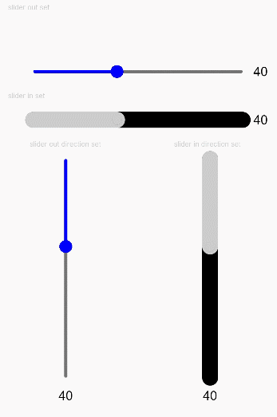

# Slider<a name="ZH-CN_TOPIC_0000001193075098"></a>

> **说明：** 
>该组件从API Version 7开始支持。后续版本如有新增内容，则采用上角标单独标记该内容的起始版本。

滑动条组件，用来快速调节设置值，如音量、亮度等。

## 权限列表<a name="section781125411508"></a>

无

## 子组件<a name="section53281531154915"></a>

无

## 接口<a name="section1989913519718"></a>

Slider\(value:\{value?: number, min?: number, max?: number, step?: number, style?: SliderStyle, direction?: Axis\}\)

-   参数

    <table><thead align="left"><tr><th class="cellrowborder" valign="top" width="16.11%" id="mcps1.1.6.1.1"><p>参数名</p>
    </th>
    <th class="cellrowborder" valign="top" width="14.01%" id="mcps1.1.6.1.2"><p>参数类型</p>
    </th>
    <th class="cellrowborder" valign="top" width="11.99%" id="mcps1.1.6.1.3"><p>必填</p>
    </th>
    <th class="cellrowborder" valign="top" width="11.709999999999999%" id="mcps1.1.6.1.4"><p>默认值</p>
    </th>
    <th class="cellrowborder" valign="top" width="46.18%" id="mcps1.1.6.1.5"><p>参数描述</p>
    </th>
    </tr>
    </thead>
    <tbody><tr><td class="cellrowborder" valign="top" width="16.11%" headers="mcps1.1.6.1.1 "><p>value</p>
    </td>
    <td class="cellrowborder" valign="top" width="14.01%" headers="mcps1.1.6.1.2 "><p>number</p>
    </td>
    <td class="cellrowborder" valign="top" width="11.99%" headers="mcps1.1.6.1.3 "><p>否</p>
    </td>
    <td class="cellrowborder" valign="top" width="11.709999999999999%" headers="mcps1.1.6.1.4 "><p>0</p>
    </td>
    <td class="cellrowborder" valign="top" width="46.18%" headers="mcps1.1.6.1.5 "><p>当前进度值。</p>
    </td>
    </tr>
    <tr><td class="cellrowborder" valign="top" width="16.11%" headers="mcps1.1.6.1.1 "><p>min</p>
    </td>
    <td class="cellrowborder" valign="top" width="14.01%" headers="mcps1.1.6.1.2 "><p>number</p>
    </td>
    <td class="cellrowborder" valign="top" width="11.99%" headers="mcps1.1.6.1.3 "><p>否</p>
    </td>
    <td class="cellrowborder" valign="top" width="11.709999999999999%" headers="mcps1.1.6.1.4 "><p>0</p>
    </td>
    <td class="cellrowborder" valign="top" width="46.18%" headers="mcps1.1.6.1.5 "><p>设置最小值。</p>
    </td>
    </tr>
    <tr><td class="cellrowborder" valign="top" width="16.11%" headers="mcps1.1.6.1.1 "><p>max</p>
    </td>
    <td class="cellrowborder" valign="top" width="14.01%" headers="mcps1.1.6.1.2 "><p>number</p>
    </td>
    <td class="cellrowborder" valign="top" width="11.99%" headers="mcps1.1.6.1.3 "><p>否</p>
    </td>
    <td class="cellrowborder" valign="top" width="11.709999999999999%" headers="mcps1.1.6.1.4 "><p>100</p>
    </td>
    <td class="cellrowborder" valign="top" width="46.18%" headers="mcps1.1.6.1.5 "><p>设置最大值。</p>
    </td>
    </tr>
    <tr><td class="cellrowborder" valign="top" width="16.11%" headers="mcps1.1.6.1.1 "><p>step</p>
    </td>
    <td class="cellrowborder" valign="top" width="14.01%" headers="mcps1.1.6.1.2 "><p>number</p>
    </td>
    <td class="cellrowborder" valign="top" width="11.99%" headers="mcps1.1.6.1.3 "><p>否</p>
    </td>
    <td class="cellrowborder" valign="top" width="11.709999999999999%" headers="mcps1.1.6.1.4 "><p>1</p>
    </td>
    <td class="cellrowborder" valign="top" width="46.18%" headers="mcps1.1.6.1.5 "><p>设置Slider滑动跳动值，当设置相应的step时，Slider为间歇滑动。</p>
    </td>
    </tr>
    <tr><td class="cellrowborder" valign="top" width="16.11%" headers="mcps1.1.6.1.1 "><p>style</p>
    </td>
    <td class="cellrowborder" valign="top" width="14.01%" headers="mcps1.1.6.1.2 "><p><a href="#li1754841215312">SliderStyle</a></p>
    </td>
    <td class="cellrowborder" valign="top" width="11.99%" headers="mcps1.1.6.1.3 "><p>否</p>
    </td>
    <td class="cellrowborder" valign="top" width="11.709999999999999%" headers="mcps1.1.6.1.4 "><p>SliderStyle.OutSet</p>
    </td>
    <td class="cellrowborder" valign="top" width="46.18%" headers="mcps1.1.6.1.5 "><p>设置Slider的滑块样式。</p>
    </td>
    </tr>
    <tr><td class="cellrowborder" valign="top" width="16.11%" headers="mcps1.1.6.1.1 "><p>direction<sup>8+</sup></p>
    </td>
    <td class="cellrowborder" valign="top" width="14.01%" headers="mcps1.1.6.1.2 "><p><a href="ts-appendix-enums.md#section1397918486200">Axis</a></p>
    </td>
    <td class="cellrowborder" valign="top" width="11.99%" headers="mcps1.1.6.1.3 "><p>否</p>
    </td>
    <td class="cellrowborder" valign="top" width="11.709999999999999%" headers="mcps1.1.6.1.4 "><p>Axis.Horizontal</p>
    </td>
    <td class="cellrowborder" valign="top" width="46.18%" headers="mcps1.1.6.1.5 "><p>设置滑动条滑动方向为水平或竖直方向。</p>
    </td>
    </tr>
    </tbody>
    </table>

-   <a name="li1754841215312"></a>SliderStyle枚举说明

    <table><thead align="left"><tr><th class="cellrowborder" valign="top" width="25.2%" id="mcps1.1.3.1.1"><p>名称</p>
    </th>
    <th class="cellrowborder" valign="top" width="74.8%" id="mcps1.1.3.1.2"><p>描述</p>
    </th>
    </tr>
    </thead>
    <tbody><tr><td class="cellrowborder" valign="top" width="25.2%" headers="mcps1.1.3.1.1 "><p>OutSet</p>
    </td>
    <td class="cellrowborder" valign="top" width="74.8%" headers="mcps1.1.3.1.2 "><p>滑块在滑轨上。</p>
    </td>
    </tr>
    <tr><td class="cellrowborder" valign="top" width="25.2%" headers="mcps1.1.3.1.1 "><p>InSet</p>
    </td>
    <td class="cellrowborder" valign="top" width="74.8%" headers="mcps1.1.3.1.2 "><p>滑块在滑轨内。</p>
    </td>
    </tr>
    </tbody>
    </table>


## 属性<a name="section18430105671014"></a>

不支持触摸热区设置。

<table><thead align="left"><tr><th class="cellrowborder" valign="top" width="18.72%" id="mcps1.1.5.1.1"><p>名称</p>
</th>
<th class="cellrowborder" valign="top" width="16.33%" id="mcps1.1.5.1.2"><p>参数类型</p>
</th>
<th class="cellrowborder" valign="top" width="17.62%" id="mcps1.1.5.1.3"><p>默认值</p>
</th>
<th class="cellrowborder" valign="top" width="47.33%" id="mcps1.1.5.1.4"><p>描述</p>
</th>
</tr>
</thead>
<tbody><tr><td class="cellrowborder" valign="top" width="18.72%" headers="mcps1.1.5.1.1 "><p>blockColor</p>
</td>
<td class="cellrowborder" valign="top" width="16.33%" headers="mcps1.1.5.1.2 "><p>Color</p>
</td>
<td class="cellrowborder" valign="top" width="17.62%" headers="mcps1.1.5.1.3 "><p>-</p>
</td>
<td class="cellrowborder" valign="top" width="47.33%" headers="mcps1.1.5.1.4 "><p>设置滑块的颜色。</p>
</td>
</tr>
<tr><td class="cellrowborder" valign="top" width="18.72%" headers="mcps1.1.5.1.1 "><p>trackColor</p>
</td>
<td class="cellrowborder" valign="top" width="16.33%" headers="mcps1.1.5.1.2 "><p>Color</p>
</td>
<td class="cellrowborder" valign="top" width="17.62%" headers="mcps1.1.5.1.3 "><p>-</p>
</td>
<td class="cellrowborder" valign="top" width="47.33%" headers="mcps1.1.5.1.4 "><p>设置滑轨的背景颜色。</p>
</td>
</tr>
<tr><td class="cellrowborder" valign="top" width="18.72%" headers="mcps1.1.5.1.1 "><p>selectedColor</p>
</td>
<td class="cellrowborder" valign="top" width="16.33%" headers="mcps1.1.5.1.2 "><p>Color</p>
</td>
<td class="cellrowborder" valign="top" width="17.62%" headers="mcps1.1.5.1.3 "><p>-</p>
</td>
<td class="cellrowborder" valign="top" width="47.33%" headers="mcps1.1.5.1.4 "><p>设置滑轨的已滑动颜色。</p>
</td>
</tr>
<tr><td class="cellrowborder" valign="top" width="18.72%" headers="mcps1.1.5.1.1 "><p>showSteps</p>
</td>
<td class="cellrowborder" valign="top" width="16.33%" headers="mcps1.1.5.1.2 "><p>boolean</p>
</td>
<td class="cellrowborder" valign="top" width="17.62%" headers="mcps1.1.5.1.3 "><p>false</p>
</td>
<td class="cellrowborder" valign="top" width="47.33%" headers="mcps1.1.5.1.4 "><p>设置当前是否显示步长刻度值。</p>
</td>
</tr>
<tr><td class="cellrowborder" valign="top" width="18.72%" headers="mcps1.1.5.1.1 "><p>showTips</p>
</td>
<td class="cellrowborder" valign="top" width="16.33%" headers="mcps1.1.5.1.2 "><p>boolean</p>
</td>
<td class="cellrowborder" valign="top" width="17.62%" headers="mcps1.1.5.1.3 "><p>false</p>
</td>
<td class="cellrowborder" valign="top" width="47.33%" headers="mcps1.1.5.1.4 "><p>设置滑动时是否显示气泡提示百分比。</p>
</td>
</tr>
</tbody>
</table>

## 事件<a name="section449664852016"></a>

通用事件仅支持：OnAppear，OnDisAppear。

<table><thead align="left"><tr><th class="cellrowborder" colspan="2" valign="top" id="mcps1.1.4.1.1"><p>名称</p>
</th>
<th class="cellrowborder" valign="top" id="mcps1.1.4.1.2"><p>功能描述</p>
</th>
</tr>
</thead>
<tbody><tr><td class="cellrowborder" colspan="2" valign="top" headers="mcps1.1.4.1.1 "><p>onChange(callback: (value: number, mode: <a href="#li164030311374">SliderChangeMode</a>) =&gt; void）</p>
</td>
<td class="cellrowborder" valign="top" headers="mcps1.1.4.1.2 "><p>Slider滑动时触发事件回调。</p>
<p>value：当前进度值。</p>
<p>mode：拖动状态。</p>
</td>
</tr>
</tbody>
</table>

-   <a name="li164030311374"></a>SliderChangeMode枚举说明

    <table><thead align="left"><tr><th class="cellrowborder" valign="top" width="25.2%" id="mcps1.1.3.1.1"><p>名称</p>
    </th>
    <th class="cellrowborder" valign="top" width="74.8%" id="mcps1.1.3.1.2"><p>描述</p>
    </th>
    </tr>
    </thead>
    <tbody><tr><td class="cellrowborder" valign="top" width="25.2%" headers="mcps1.1.3.1.1 "><p>Begin</p>
    </td>
    <td class="cellrowborder" valign="top" width="74.8%" headers="mcps1.1.3.1.2 "><p>用户开始拖动滑块。</p>
    </td>
    </tr>
    <tr><td class="cellrowborder" valign="top" width="25.2%" headers="mcps1.1.3.1.1 "><p>Moving</p>
    </td>
    <td class="cellrowborder" valign="top" width="74.8%" headers="mcps1.1.3.1.2 "><p>用户拖动滑块中。</p>
    </td>
    </tr>
    <tr><td class="cellrowborder" valign="top" width="25.2%" headers="mcps1.1.3.1.1 "><p>End</p>
    </td>
    <td class="cellrowborder" valign="top" width="74.8%" headers="mcps1.1.3.1.2 "><p>用户结束拖动滑块。</p>
    </td>
    </tr>
    </tbody>
    </table>


## 示例<a name="section13800193662114"></a>

```
@Entry
@Component
struct SliderExample {
  @State outSetValue: number = 40
  @State inSetValue: number = 40
  @State outVerticalSetValue: number = 40
  @State inVerticalSetValue: number = 40

  build() {
    Column({ space: 5 }) {
      Text('slider out set').fontSize(9).fontColor(0xCCCCCC).width('90%')
      Row() {
        Slider({
          value: this.outSetValue,
          min: 0,
          max: 100,
          step: 1,
          style: SliderStyle.OutSet
        })
        .blockColor(Color.Blue)
        .trackColor(Color.Gray)
        .selectedColor(Color.Blue)
        .showSteps(true)
        .showTips(true)
        .onChange((value: number, mode: SliderChangeMode) => {
          this.outSetValue = value
          console.info('value:' + value + 'mode:' + mode.toString())
        })
        Text(this.outSetValue.toFixed(0)).fontSize(16)
      }
      .padding({ top: 50 })
      .width('80%')

      Text('slider in set').fontSize(9).fontColor(0xCCCCCC).width('90%')
      Row() {
        Slider({
          value: this.inSetValue,
          min: 0,
          max: 100,
          step: 1,
          style: SliderStyle.InSet
        })
        .blockColor(0xCCCCCC)
        .trackColor(Color.Black)
        .selectedColor(0xCCCCCC)
        .showSteps(false)
        .showTips(false)
        .onChange((value: number, mode: SliderChangeMode) => {
          this.inSetValue = value
          console.info('value:' + value + 'mode:' + mode.toString())
        })
        Text(this.inSetValue.toFixed(0)).fontSize(16)
      }
      .width('80%')

      Row() {
        Column() {
          Text('slider out direction set').fontSize(9).fontColor(0xCCCCCC).width('50%')
          Slider({
            value: this.outVerticalSetValue,
            min: 0,
            max: 100,
            step: 1,
            style: SliderStyle.OutSet,
            direction: Axis.Vertical
          })
          .blockColor(Color.Blue)
          .trackColor(Color.Gray)
          .selectedColor(Color.Blue)
          .showSteps(true)
          .showTips(true)
          .onChange((value: number, mode: SliderChangeMode) => {
            this.outVerticalSetValue = value
            console.info('value:' + value + 'mode:' + mode.toString())
          })
          Text(this.outVerticalSetValue.toFixed(0)).fontSize(16)
        }.width('50%').height(300)

        Column() {
          Text('slider in direction set').fontSize(9).fontColor(0xCCCCCC).width('50%')
          Slider({
            value: this.inVerticalSetValue,
            min: 0,
            max: 100,
            step: 1,
            style: SliderStyle.InSet,
            direction: Axis.Vertical
          })
          .blockColor(0xCCCCCC)
          .trackColor(Color.Black)
          .selectedColor(0xCCCCCC)
          .showSteps(false)
          .showTips(false)
          .onChange((value: number, mode: SliderChangeMode) => {
            this.inVerticalSetValue = value
            console.info('value:' + value + 'mode:' + mode.toString())
          })
          Text(this.inVerticalSetValue.toFixed(0)).fontSize(16)
        }.width('50%').height(300)
      }

    }.width('100%').margin({ top: 5 })
  }
}
```



