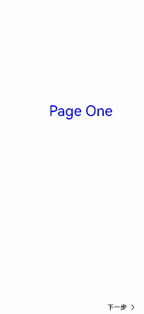

# Stepper

应用步骤方式切换页面的组件。


>  **说明：**
> 该组件从API Version 8开始支持。后续版本如有新增内容，则采用上角标单独标记该内容的起始版本。


## 权限列表

无


## 子组件

仅能包含子组件[StepperItem](ts-basic-components-stepperitem.md)。


## 接口

Stepper(value?: { index?: number })


- 参数
    | 参数名 | 参数类型 | 必填 | 默认值 | 参数描述 |
  | -------- | -------- | -------- | -------- | -------- |
  | index | number | 否 | 0 | 设置步骤导航器显示第几个StepperItem。 |


## 属性

无


## 事件

| 名称 | 描述 |
| -------- | -------- |
| onFinish(callback:&nbsp;()&nbsp;=&gt;&nbsp;void) | 步骤导航器最后一个StepperItem的nextLabel被点击时触发该回调&nbsp;。 |
| onSkip(callback:&nbsp;()&nbsp;=&gt;&nbsp;void) | 当前显示的StepperItem状态为ItemState.Skip时，nextLabel被点击时触发该回调。 |
| onChange(callback:&nbsp;(prevIndex?:&nbsp;number,&nbsp;index?:&nbsp;number)&nbsp;=&gt;&nbsp;void) | 点击左边或者右边文本按钮进行步骤切换时触发该事件。<br/>-&nbsp;prevIndex：切换前的步骤页索引值。<br/>-&nbsp;index：切换后的步骤页（前一页或者下一页）索引值。 |


## 示例

```ts
// xxx.ets
@Entry
@Component
struct StepperExample {
  @State currentIndex: number = 0
  @State firstState: ItemState = ItemState.Normal
  @State secondState: ItemState = ItemState.Normal

  build() {
    Stepper({
      index: this.currentIndex
    }) {
      StepperItem() {
        Text('Page One')
          .fontSize(35)
          .fontColor(Color.Blue)
          .width(200)
          .lineHeight(50)
          .margin({top:250})
      }
      .nextLabel('')
      .position({x: '35%', y: 0})
      StepperItem() {
        Text('Page Two')
          .fontSize(35)
          .fontColor(Color.Blue)
          .width(200)
          .lineHeight(50)
          .margin({top:250})
          .onClick(()=>{
            this.firstState = this.firstState === ItemState.Skip ? ItemState.Normal : ItemState.Skip
          })
      }
      .nextLabel('Next')
      .prevLabel('Previous')
      .status(this.firstState)
      .position({x: '35%', y: 0})
      StepperItem() {
        Text('Page Three')
          .fontSize(35)
          .fontColor(Color.Blue)
          .width(200)
          .lineHeight(50)
          .margin({top:250})
          .onClick(()=>{
            this.secondState = this.secondState === ItemState.Waiting ? ItemState.Normal : ItemState.Waiting
          })
      }
      .position({x: '35%', y: 0})
      .status(this.secondState)
      StepperItem() {
        Text('Page four')
          .fontSize(35)
          .fontColor(Color.Blue)
          .width(200)
          .lineHeight(50)
          .margin({top:250})
      }
      .position({x: '35%', y: 0})
      .nextLabel('Finish')
    }
    .onFinish(() => {
      console.log('onFinish')
    })
    .onSkip(() => {
      console.log('onSkip')
    })
    .onChange((prevIndex: number, index: number) => {
      this.currentIndex = index
    })
    .align(Alignment.Center)
  }
}
```




