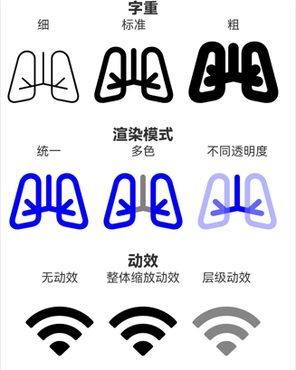

# SymbolGlyph

显示图标小符号的组件。

>  **说明：**
>
>  该组件从API Version 11开始支持。后续版本如有新增内容，则采用上角标单独标记该内容的起始版本。

## 子组件

不支持子组件。

## 接口

SymbolGlyph(value: Resource)

**参数：**

| 参数名 | 参数类型 | 必填 | 参数描述 |
| -------- | -------- | -------- | -------- |
| value | [Resource](../arkui-ts/ts-types.md#resource)| 是 | SymbolGlyph组件的资源名,如 $r('sys.symbol.ohos_wifi')。 |

>  **说明：**
>
>  $r('sys.symbol.ohos_wifi')中引用的资源为系统预置，SymbolGlyph仅支持系统预置的symbol资源名，引用非symbol资源将显示异常。

## 属性

支持[通用属性](ts-universal-attributes-size.md)，不支持文本通用属性，仅支持以下特有属性：

| 名称 | 类型 | 必填 | 描述                               |
| ------ | -------- | ---- | -------------------------------------- |
| fontColor | Array\<[ResourceColor](ts-types.md#resourcecolor)\> | 否 | 设置SymbolGlyph组件颜色。<br/> 默认值：不同渲染策略下默认值不同。 |
| fontSize | number \| string \| [Resource](../arkui-ts/ts-types.md#resource) | 否 | 设置SymbolGlyph组件大小。<br/>默认值：系统默认值。 |
| fontWeight | [FontWeight](ts-appendix-enums.md#fontweight) \| number \| string | 否 | 设置SymbolGlyph组件粗细。<br/>number类型取值[100,900]，取值间隔为100，默认为400，取值越大，字体越粗。<br/>string类型仅支持number类型取值的字符串形式，例如“400”，以及“bold”、“bolder”、“lighter”、“regular” 、“medium”分别对应FontWeight中相应的枚举值。<br/>默认值：FontWeight.Normal。 |
| renderingStrategy | [SymbolRenderingStrategy](ts-appendix-enums.md#symbolrenderingstrategy11)	| 否 | 设置SymbolGlyph组件渲染策略。<br/>默认值：SymbolRenderingStrategy.SINGLE。<br/>说明：$r('sys.symbol.ohos_*')中引用的资源仅ohos_trash_circle、ohos_folder_badge_plus、ohos_lungs支持分层与多色模式。 |
| effectStrategy | [SymbolEffectStrategy](ts-appendix-enums.md#symboleffectstrategy11)	| 否 | 设置SymbolGlyph组件动效策略。<br/>默认值：SymbolEffectStrategy.NONE。<br/>说明：$r('sys.symbol.ohos_*')中引用的资源仅ohos_wifi支持层级动效模式。 |

>  **说明：**
>
>  SymbolSpan多色模式下各个组件的默认颜色与层数展示图。


## 事件

支持[通用事件](ts-universal-events-click.md)。

## 示例

```ts
// xxx.ets
@Entry
@Component
struct Index {
  @State scaleplay:boolean = false
  @State hieraplay:boolean = false
  build() {
    Column() {
      Row() {
        Column(){
          Text("细")
          SymbolGlyph($r('sys.symbol.ohos_lungs'))
            .fontWeight(FontWeight.Lighter)
            .fontSize(96)
        }
        Column(){
          Text("标准")
          SymbolGlyph($r('sys.symbol.ohos_lungs'))
            .fontWeight(FontWeight.Normal)
            .fontSize(96)
        }
        Column(){
          Text("粗")
          SymbolGlyph($r('sys.symbol.ohos_lungs'))
            .fontWeight(FontWeight.Bold)
            .fontSize(96)
        }
      }

      Row() {
        Column(){
          Text("统一")
          SymbolGlyph($r('sys.symbol.ohos_lungs'))
            .fontSize(96)
            .renderingStrategy(SymbolRenderingStrategy.SINGLE)
            .fontColor([Color.Blue,Color.Grey,Color.Green])
        }
        Column(){
          Text("多色")
          SymbolGlyph($r('sys.symbol.ohos_lungs'))
            .fontSize(96)
            .renderingStrategy(SymbolRenderingStrategy.MULTIPLE_COLOR)
            .fontColor([Color.Blue,Color.Grey,Color.Green])
        }
        Column(){
          Text("不同透明度")
          SymbolGlyph($r('sys.symbol.ohos_lungs'))
            .fontSize(96)
            .renderingStrategy(SymbolRenderingStrategy.MULTIPLE_OPACITY)
            .fontColor([Color.Blue,Color.Grey,Color.Green])
        }
      }
      Row() {
        Column(){
          Text("无动效")
          SymbolGlyph($r('sys.symbol.ohos_wifi'))
            .fontSize(96)
            .effectStrategy(SymbolEffectStrategy.NONE)
        }
        Column(){
          Text("整体缩放动效")
          SymbolGlyph($r('sys.symbol.ohos_wifi'))
            .fontSize(96)
            .effectStrategy(this.scaleplay ? 1 : 0)
          Button(this.scaleplay? '关闭':'播放').onClick(()=>{this.scaleplay = !this.scaleplay})
        }
        Column(){
          Text("层级动效")
          SymbolGlyph($r('sys.symbol.ohos_wifi'))
            .fontSize(96)
            .effectStrategy(this.hieraplay ? 2 : 0)
          Button(this.hieraplay? '关闭':'播放').onClick(()=>{this.hieraplay = !this.hieraplay})
        }
      }
    }
  }
}
```
