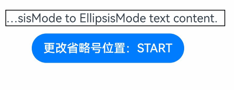

# Text

显示一段文本的组件。

>  **说明：**
>
>  该组件从API Version 7开始支持。后续版本如有新增内容，则采用上角标单独标记该内容的起始版本。


## 子组件

可以包含[Span](ts-basic-components-span.md)和[ImageSpan](ts-basic-components-imagespan.md)子组件。


## 接口

Text(content?: string | Resource)

从API version 9开始，该接口支持在ArkTS卡片中使用。

**参数：**

| 参数名 | 参数类型 | 必填 | 参数描述 |
| -------- | -------- | -------- | -------- |
| content | string \| [Resource](ts-types.md#resource) | 否 | 文本内容。包含子组件Span时不生效，显示Span内容，并且此时text组件的样式不生效。<br/>默认值：' ' |

## 属性

除支持[通用属性](ts-universal-attributes-size.md)和[文本通用属性](ts-universal-attributes-text-style.md)外，还支持以下属性：

| 名称                       | 参数类型                            | 描述                                               |
| ----------------------- | ----------------------------------- | ------------------------------------------- |
| textAlign               | [TextAlign](ts-appendix-enums.md#textalign) | 设置文本段落在水平方向的对齐方式。<br/>默认值：TextAlign.Start<br/>说明：<br/>文本段落宽度占满Text组件宽度；可通过[align](ts-universal-attributes-location.md)属性控制文本段落在垂直方向上的位置，此组件中不可通过align属性控制文本段落在水平方向上的位置，即align属性中Alignment.TopStart、Alignment.Top、Alignment.TopEnd效果相同，控制内容在顶部，Alignment.Start、Alignment.Center、Alignment.End效果相同，控制内容垂直居中，Alignment.BottomStart、Alignment.Bottom、Alignment.BottomEnd效果相同，控制内容在底部。结合TextAlign属性可控制内容在水平方向的位置。<br/>从API version 9开始，该接口支持在ArkTS卡片中使用。 |
| textOverflow            | {overflow:&nbsp;[TextOverflow](ts-appendix-enums.md#textoverflow)} | 设置文本超长时的显示方式。<br/>默认值：{overflow:&nbsp;TextOverflow.Clip}<br/>**说明：**<br/>文本截断是按字截断。例如，英文以单词为最小单位进行截断，若需要以字母为单位进行截断，可在字母间添加零宽空格：\u200B。<br />当`overflow`设置为TextOverflow.None、TextOverflow.Clip、TextOverflow.Ellipsis时，需配合`maxLines`使用，单独设置不生效。设置TextOverflow.None与TextOverflow.Clip效果一样。当`overflow`设置为TextOverflow.Marquee时，文本在一行内滚动显示，设置`maxLines`及`copyOption`属性均不生效。<br/>从API version 9开始，该接口支持在ArkTS卡片中使用。 |
| maxLines                | number | 设置文本的最大行数。<br />**说明：** <br />默认情况下，文本是自动折行的，如果指定此参数，则文本最多不会超过指定的行。如果有多余的文本，可以通过        `textOverflow`来指定截断方式。<br/>从API version 9开始，该接口支持在ArkTS卡片中使用。 |
| lineHeight              | string&nbsp;\|&nbsp;number&nbsp;\|&nbsp;[Resource](ts-types.md#resource)  | 设置文本的文本行高，设置值不大于0时，不限制文本行高，自适应字体大小，Length为number类型时单位为fp。<br/>从API version 9开始，该接口支持在ArkTS卡片中使用。 |
| decoration              | {<br/>type:&nbsp;[TextDecorationType](ts-appendix-enums.md#textdecorationtype),<br/>color?:&nbsp;[ResourceColor](ts-types.md#resourcecolor)<br/>} | 设置文本装饰线样式及其颜色。<br />默认值：{<br/>type:&nbsp;TextDecorationType.None,<br/>color：Color.Black<br/>} <br/>从API version 9开始，该接口支持在ArkTS卡片中使用。|
| baselineOffset          | number&nbsp;\|&nbsp;string | 设置文本基线的偏移量，默认值0。  <br/>从API version 9开始，该接口支持在ArkTS卡片中使用。<br/>**说明：** <br/>设置该值为百分比时，按默认值显示。 |
| letterSpacing           | number&nbsp;\|&nbsp;string | 设置文本字符间距。<br/>从API version 9开始，该接口支持在ArkTS卡片中使用。<br/>**说明：** <br/>设置该值为百分比时，按默认值显示。<br /> 当取值为负值时，文字会发生重叠。 |
| minFontSize             | number&nbsp;\|&nbsp;string&nbsp;\|&nbsp;[Resource](ts-types.md#resource)      | 设置文本最小显示字号。<br/>需配合maxFontSize以及maxline或布局大小限制使用，单独设置不生效。 <br/>从API version 9开始，该接口支持在ArkTS卡片中使用。                               |
| maxFontSize             | number&nbsp;\|&nbsp;string&nbsp;\|&nbsp;[Resource](ts-types.md#resource)      | 设置文本最大显示字号。<br/>需配合minFontSize以及maxline或布局大小限制使用，单独设置不生效。 <br/>从API version 9开始，该接口支持在ArkTS卡片中使用。                                |
| textCase                | [TextCase](ts-appendix-enums.md#textcase) | 设置文本大小写。<br />默认值：TextCase.Normal <br/>从API version 9开始，该接口支持在ArkTS卡片中使用。|
| copyOption<sup>9+</sup> | [CopyOptions](ts-appendix-enums.md#copyoptions9) | 组件支持设置文本是否可复制粘贴。<br />默认值：CopyOptions.None <br/>该接口支持在ArkTS卡片中使用。<br>**说明：** <br/>设置copyOptions为CopyOptions.InApp或者CopyOptions.LocalDevice，长按文本，会弹出文本选择菜单，可选中文本并进行复制、全选操作。 |
| draggable  | boolean | 设置选中文本拖拽效果。<br/>不能和[onDragStart](ts-universal-events-drag-drop.md)事件同时使用；<br/>需配合copyOption一起使用，设置copyOptions为CopyOptions.InApp或者CopyOptions.LocalDevice，并且dragable设置为true时，支持对选中文本的拖拽以及选中内容复制到输入框。<br/>默认值：false <br />**说明：**<br />从 API version 9 开始支持。 |
| textShadow<sup>10+</sup> | [ShadowOptions](ts-universal-attributes-image-effect.md#shadowoptions对象说明)&nbsp;\|&nbsp;Array&lt;[ShadowOptions](ts-universal-attributes-image-effect.md#shadowoptions对象说明)&gt;<sup>11+</sup>  | 设置文字阴影效果。<br/>**说明：**<br/>不支持fill字段,不支持智能取色模式。。<br/>从API version 11开始，该接口支持以数组形式入参，实现多重文字阴影。|
| heightAdaptivePolicy<sup>10+</sup> | [TextHeightAdaptivePolicy](ts-appendix-enums.md#textheightadaptivepolicy10) | 设置文本自适应高度的方式。<br/>默认值：TextHeightAdaptivePolicy.MAX_LINES_FIRST。<br/>**说明：**<br/>当设置为TextHeightAdaptivePolicy.MAX_LINES_FIRST时，优先使用`maxLines`属性来调整文本高度。如果使用`maxLines`属性的布局大小超过了布局约束，则尝试在`minFontSize`和`maxFontSize`的范围内缩小字体以显示更多文本。<br/>当设置为TextHeightAdaptivePolicy.MIN_FONT_SIZE_FIRST时，优先使用`minFontSize`属性来调整文本高度。如果使用`minFontSize`属性可以将文本布局在一行中，则尝试在`minFontSize`和`maxFontSize`的范围内增大字体并使用最大可能的字体大小。<br/>当设置为TextHeightAdaptivePolicy.LAYOUT_CONSTRAINT_FIRST时，优先使用布局约束来调整文本高度。如果布局大小超过布局约束，则尝试在`minFontSize`和`maxFontSize`的范围内缩小字体以满足布局约束。如果将字体大小缩小到`minFontSize`后，布局大小仍然超过布局约束，则删除超过布局约束的行。|
| textIndent<sup>10+</sup> | number&nbsp;\|&nbsp;string | 设置首行文本缩进，默认值0。 |
| font<sup>10+</sup> | [Font](ts-types.md#font) | 设置文本样式。包括字体大小、字体粗细、字体族和字体风格。 |
| wordBreak<sup>11+</sup> | [WordBreak](ts-appendix-enums.md#wordbreak11) | 设置断行规则。 <br />默认值：WordBreak.BREAK_WORD <br/>**说明：** <br/>从API version 11开始，该接口支持在ArkTS卡片中使用。<br/>WordBreak.BREAK_ALL与{overflow:&nbsp;TextOverflow.Ellipsis}，`maxLines`组合使用可实现英文单词按字母截断，超出部分以省略号显示|
| selection<sup>11+</sup> |(selectionStart:&nbsp;number, selectionEnd:&nbsp;number)| 设置选中区域。选中区域高亮且显示手柄和文本选择菜单。 <br />默认值：（-1，-1） <br/>**说明：** <br/>从API version 11开始，该接口支持在ArkTS卡片中使用。<br/>当`copyOption`设置为CopyOptions.None时，设置`selection`属性不生效。<br/>当`overflow`设置为TextOverflow.Marquee时，设置`selection`属性不生效。<br/>当`selectionStart`大于等于`selectionEnd`时不选中。可选范围为[0, textSize],textSize为文本内容最大字符数，入参小于0处理为0，大于textSize处理为textSize。<br/>当`selectionStart`或`selectionEnd`在截断不可见区域时不选中。截断为false时超出父组件的文本选中区域生效。|
| ellipsisMode<sup>11+</sup> |[EllipsisMode](ts-appendix-enums.md#ellipsismode11)| 设置省略位置。 <br />默认值：EllipsisMode.END <br/>**说明：** <br/>从API version 11开始，该接口支持在ArkTS卡片中使用。<br/>当`ellipsisMode`设置为EllipsisMode.END，需要配合`overflow`设置为TextOverflow.Ellipsis以及maxLines使用，单独设置`ellipsisMode`属性不生效。<br/>EllipsisMode.START和EllipsisMode.CENTER仅在单行超长文本生效。|

>  **说明：**
>
>  不支持Text内同时存在文本内容和Span或ImageSpan子组件。如果同时存在，只显示Span或ImageSpan内的内容。
>
>  通用属性中形状裁剪[clip](ts-universal-attributes-sharp-clipping.md#clip)属性，在Text组件中，默认值为true，即文本内容大于组件内容时，文本会截断。如果需要显示超出的部分，可以设置clip为false。

## 事件

除支持[通用事件](ts-universal-events-click.md)外，还支持以下事件：

| 名称                                                         | 功能描述                                                     |
| ------------------------------------------------------------ | ------------------------------------------------------------ |
| onCopy(callback:(value:&nbsp;string)&nbsp;=&gt;&nbsp;void)<sup>11+</sup> | 长按文本内部区域弹出剪贴板后，点击剪切板复制按钮，触发该回调。<br/>value：复制的文本内容。 <br/>**说明：** <br/>从API version 11开始，该接口支持在ArkTS卡片中使用。<br/>目前文本复制仅支持文本。|

## 示例

### 示例1

```ts
// xxx.ets
@Entry
@Component
struct TextExample1 {
  build() {
    Flex({ direction: FlexDirection.Column, alignItems: ItemAlign.Start, justifyContent: FlexAlign.SpaceBetween }) {
      // 文本水平方向对齐方式设置
      // 单行文本
      Text('textAlign').fontSize(9).fontColor(0xCCCCCC)
      Text('TextAlign set to Center.')
        .textAlign(TextAlign.Center)
        .fontSize(12)
        .border({ width: 1 })
        .padding(10)
        .width('100%')
      Text('TextAlign set to Start.')
        .textAlign(TextAlign.Start)
        .fontSize(12)
        .border({ width: 1 })
        .padding(10)
        .width('100%')
      Text('TextAlign set to End.')
        .textAlign(TextAlign.End)
        .fontSize(12)
        .border({ width: 1 })
        .padding(10)
        .width('100%')

      // 多行文本
      Text('This is the text content with textAlign set to Center.')
        .textAlign(TextAlign.Center)
        .fontSize(12)
        .border({ width: 1 })
        .padding(10)
        .width('100%')
      Text('This is the text content with textAlign set to Start.')
        .textAlign(TextAlign.Start)
        .fontSize(12)
        .border({ width: 1 })
        .padding(10)
        .width('100%')
      Text('This is the text content with textAlign set to End.')
        .textAlign(TextAlign.End)
        .fontSize(12)
        .border({ width: 1 })
        .padding(10)
        .width('100%')


      // 文本超长时显示方式
      Text('TextOverflow+maxLines').fontSize(9).fontColor(0xCCCCCC)
      // 超出maxLines截断内容展示
      Text('This is the setting of textOverflow to Clip text content This is the setting of textOverflow to None text content. This is the setting of textOverflow to Clip text content This is the setting of textOverflow to None text content.')
        .textOverflow({ overflow: TextOverflow.Clip })
        .maxLines(1)
        .fontSize(12)
        .border({ width: 1 })
        .padding(10)

      // 超出maxLines展示省略号
      Text('This is set textOverflow to Ellipsis text content This is set textOverflow to Ellipsis text content.'.split('')
        .join('\u200B'))
        .textOverflow({ overflow: TextOverflow.Ellipsis })
        .maxLines(1)
        .fontSize(12)
        .border({ width: 1 })
        .padding(10)

      Text('lineHeight').fontSize(9).fontColor(0xCCCCCC)
      Text('This is the text with the line height set. This is the text with the line height set.')
        .fontSize(12).border({ width: 1 }).padding(10)
      Text('This is the text with the line height set. This is the text with the line height set.')
        .fontSize(12).border({ width: 1 }).padding(10)
        .lineHeight(20)
    }.height(600).width(350).padding({ left: 35, right: 35, top: 35 })
  }
}
```


### 示例2

```ts
@Entry
@Component
struct TextExample2 {
  build() {
    Flex({ direction: FlexDirection.Column, alignItems: ItemAlign.Start, justifyContent: FlexAlign.SpaceBetween }) {
      Text('decoration').fontSize(9).fontColor(0xCCCCCC)
      Text('This is the text content with the decoration set to LineThrough and the color set to Red.')
        .decoration({
          type: TextDecorationType.LineThrough,
          color: Color.Red
        })
        .fontSize(12)
        .border({ width: 1 })
        .padding(10)
        .width('100%')


      Text('This is the text content with the decoration set to Overline and the color set to Red.')
        .decoration({
          type: TextDecorationType.Overline,
          color: Color.Red
        })
        .fontSize(12)
        .border({ width: 1 })
        .padding(10)
        .width('100%')


      Text('This is the text content with the decoration set to Underline and the color set to Red.')
        .decoration({
          type: TextDecorationType.Underline,
          color: Color.Red
        })
        .fontSize(12)
        .border({ width: 1 })
        .padding(10)
        .width('100%')

      // 文本基线偏移
      Text('baselineOffset').fontSize(9).fontColor(0xCCCCCC)
      Text('This is the text content with baselineOffset 0.')
        .baselineOffset(0)
        .fontSize(12)
        .border({ width: 1 })
        .padding(10)
        .width('100%')
      Text('This is the text content with baselineOffset 30.')
        .baselineOffset(30)
        .fontSize(12)
        .border({ width: 1 })
        .padding(10)
        .width('100%')
      Text('This is the text content with baselineOffset -20.')
        .baselineOffset(-20)
        .fontSize(12)
        .border({ width: 1 })
        .padding(10)
        .width('100%')

      // 文本字符间距
      Text('letterSpacing').fontSize(9).fontColor(0xCCCCCC)
      Text('This is the text content with letterSpacing 0.')
        .letterSpacing(0)
        .fontSize(12)
        .border({ width: 1 })
        .padding(10)
        .width('100%')
      Text('This is the text content with letterSpacing 3.')
        .letterSpacing(3)
        .fontSize(12)
        .border({ width: 1 })
        .padding(10)
        .width('100%')
      Text('This is the text content with letterSpacing -1.')
        .letterSpacing(-1)
        .fontSize(12)
        .border({ width: 1 })
        .padding(10)
        .width('100%')

      Text('textCase').fontSize(9).fontColor(0xCCCCCC)
      Text('This is the text content with textCase set to Normal.')
        .textCase(TextCase.Normal)
        .fontSize(12)
        .border({ width: 1 })
        .padding(10)
        .width('100%')
      // 文本全小写展示
      Text('This is the text content with textCase set to LowerCase.')
        .textCase(TextCase.LowerCase)
        .fontSize(12)
        .border({ width: 1 })
        .padding(10)
        .width('100%')
      // 文本全大写展示
      Text('This is the text content with textCase set to UpperCase.')
        .textCase(TextCase.UpperCase)
        .fontSize(12).border({ width: 1 }).padding(10)

    }.height(700).width(350).padding({ left: 35, right: 35, top: 35 })
  }
}
```


### 示例3

textShadow，heightAdaptivePolicy，TextOverflow.MARQUEE使用示例：

```ts
@Entry
@Component
struct TextExample {
  build() {
    Column({ space: 8 }) {
      Text('textShadow').fontSize(9).fontColor(0xCCCCCC).margin(15).width('90%')
      // 设置文字阴影效果
      Text('textShadow')
        .width('80%')
        .height(55)
        .fontSize(40)
        .lineHeight(55)
        .textAlign(TextAlign.Center)
        .textShadow({ radius: 10, color: Color.Black, offsetX: 0, offsetY: 0 })
        .borderWidth(1)
      Divider()
      // 设置文本自适应高度的方式
      Text('heightAdaptivePolicy').fontSize(9).fontColor(0xCCCCCC).margin(15).width('90%')
      Text('This is the text with the height adaptive policy set')
        .width('80%')
        .height(90)
        .borderWidth(1)
        .minFontSize(10)
        .maxFontSize(30)
        .maxLines(3)
        .textOverflow({ overflow: TextOverflow.Ellipsis })
        .heightAdaptivePolicy(TextHeightAdaptivePolicy.MAX_LINES_FIRST)
      Text('This is the text with the height adaptive policy set')
        .width('80%')
        .height(90)
        .borderWidth(1)
        .minFontSize(10)
        .maxFontSize(30)
        .maxLines(3)
        .textOverflow({ overflow: TextOverflow.Ellipsis })
        .heightAdaptivePolicy(TextHeightAdaptivePolicy.MIN_FONT_SIZE_FIRST)
      Text('This is the text with the height adaptive policy set')
        .width('80%')
        .height(90)
        .borderWidth(1)
        .minFontSize(10)
        .maxFontSize(30)
        .maxLines(3)
        .textOverflow({ overflow: TextOverflow.Ellipsis })
        .heightAdaptivePolicy(TextHeightAdaptivePolicy.LAYOUT_CONSTRAINT_FIRST)
      Divider()
      Text('marquee').fontSize(9).fontColor(0xCCCCCC).margin(15).width('90%')
      // 设置文本超长时以跑马灯的方式展示
      Text('This is the text with the text overflow set marquee')
        .width(300)
        .borderWidth(1)
        .textOverflow({ overflow: TextOverflow.MARQUEE })
    }
  }
}
```


### 示例4
wordBreak使用示例

```ts
@Entry
@Component
struct TextExample4 {
  @State type: string = 'WordBreakType:Normal且clip为true'
  @State text: string = 'This is set wordBreak to WordBreak text content This is set wordBreak to WordBreak text content.'

  build() {
    Flex({ direction: FlexDirection.Column, alignItems: ItemAlign.Start, justifyContent: FlexAlign.SpaceBetween }) {
      Text(this.type).fontSize(9).fontColor(0xCCCCCC)
      Text('This is set wordBreak to WordBreak text Taumatawhakatangihangakoauauotamateaturipukakapikimaungahoronukupokaiwhenuakitanatahu.')
        .fontSize(12)
        .border({ width: 1 })
        .wordBreak(WordBreak.NORMAL)
        .lineHeight(20)
        .maxLines(2)
      Text('WordBreakType:Normal且clip为false').fontSize(9).fontColor(0xCCCCCC)
      Text('This is set wordBreak to WordBreak text Taumatawhakatangihangakoauauotamateaturipukakapikimaungahoronukupokaiwhenuakitanatahu.')
        .fontSize(12)
        .border({ width: 1 })
        .wordBreak(WordBreak.NORMAL)
        .lineHeight(20)
        .maxLines(2)
        .clip(false)
      Text("WordBreakType:BreakAll").fontSize(9).fontColor(0xCCCCCC)
      Text(this.text)
        .fontSize(12)
        .border({ width: 1 })
        .maxLines(2)
        .textOverflow({ overflow: TextOverflow.Ellipsis })
        .wordBreak(WordBreak.BREAK_ALL)
        .lineHeight(20)
      Text("WordBreakType:BreakWord").fontSize(9).fontColor(0xCCCCCC)
      Text(this.text)
        .fontSize(12)
        .border({ width: 1 })
        .maxLines(2)
        .textOverflow({ overflow: TextOverflow.Ellipsis })
        .wordBreak(WordBreak.BREAK_WORD)
        .lineHeight(20)
    }.height(300).width(335).padding({ left: 35, right: 35, top: 35 })
  }
}
```


### 示例5
selection, onCopy使用示例

```ts
@Entry
@Component
struct TextExample5 {
  @State onCopy: string = ''
  @State text: string = 'This is set selection to Selection text content This is set selection to Selection text content.'
  @State start: number = 0
  @State end: number = 20

  build() {
    Flex({ direction: FlexDirection.Column, alignItems: ItemAlign.Start, justifyContent: FlexAlign.Start }) {
      Text(this.text)
        .fontSize(12)
        .border({ width: 1 })
        .lineHeight(20)
        .margin(30)
        .copyOption(CopyOptions.InApp)
        .selection(this.start, this.end)
        .onCopy((value: string) => {
          this.onCopy = value
        })
      Button('Set text selection')
        .margin({left:20})
        .onClick(() => {
          // 变更文本选中起始点、终点
          this.start = 10
          this.end = 30
        })
      Text(this.onCopy).fontSize(12).margin(10).key('copy')
    }.height(600).width(335).padding({ left: 35, right: 35, top: 35 })
  }
}
```


### 示例6
ellipsisMode使用示例

```ts
@Entry
@Component
struct TextExample6 {
  @State text: string = 'This is set ellipsisMode to EllipsisMode text content This is set ellipsisMode to EllipsisMode text content.'
  @State ellipsisModeIndex: number = 0;
  @State ellipsisMode: EllipsisMode[] = [EllipsisMode.START, EllipsisMode.CENTER, EllipsisMode.END]
  @State ellipsisModeStr: string[] = ['START', 'CENTER', 'END']
  build() {
    Column() {
      Text(this.text)
        .fontSize(16)
        .border({ width: 1 })
        .lineHeight(20)
        .maxLines(1)
        .textOverflow({overflow:TextOverflow.Ellipsis})
        .ellipsisMode(this.ellipsisMode[this.ellipsisModeIndex])
        .width(300)
        .margin({ left: 20, top: 20 })

      Row() {
        Button('更改省略号位置：' + this.ellipsisModeStr[this.ellipsisModeIndex]).onClick(() => {
          this.ellipsisModeIndex++
          if(this.ellipsisModeIndex > (this.ellipsisModeStr.length - 1)) {
            this.ellipsisModeIndex = 0
          }
        })
      }.margin({ top: 10 })
    }
  }
}
```
