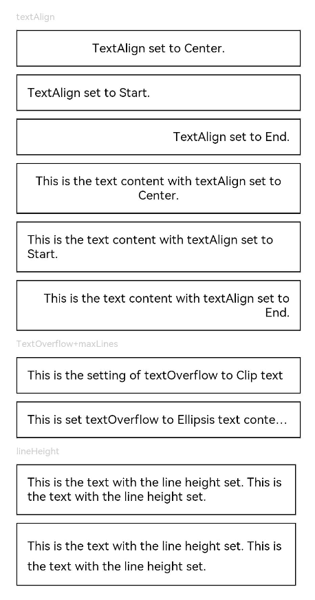

# Text

显示一段文本的组件。

>  **说明：**
>
>  该组件从API Version 7开始支持。后续版本如有新增内容，则采用上角标单独标记该内容的起始版本。


## 子组件

可以包含[Span](ts-basic-components-span.md)子组件。


## 接口

Text(content?: string | Resource)

从API version 9开始，该接口支持在ArkTS卡片中使用。

**参数：**

| 参数名 | 参数类型 | 必填 | 参数描述 |
| -------- | -------- | -------- | -------- |
| content | string \| [Resource](ts-types.md#resource) | 否 | 文本内容。包含子组件Span时不生效，显示Span内容，并且此时text组件的样式不生效。<br/>默认值：' ' |

## 属性

除支持[通用属性](ts-universal-attributes-size.md)外，还支持以下属性：

| 名称                       | 参数类型                            | 描述                                               |
| ----------------------- | ----------------------------------- | ------------------------------------------- |
| textAlign               | [TextAlign](ts-appendix-enums.md#textalign) | 设置文本段落在水平方向的对齐方式<br/>默认值：TextAlign.Start<br/>说明：<br/>文本段落宽度占满Text组件宽度；可通过[align](ts-universal-attributes-location.md)属性控制文本段落在垂直方向上的位置，此组件中不可通过align属性控制文本段落在水平方向上的位置，即align属性中Alignment.TopStart、Alignment.Top、Alignment.TopEnd效果相同，控制内容在顶部，Alignment.Start、Alignment.Center、Alignment.End效果相同，控制内容垂直居中，Alignment.BottomStart、Alignment.Bottom、Alignment.BottomEnd效果相同，控制内容在底部。结合TextAlign属性可控制内容在水平方向的位置。<br/>从API version 9开始，该接口支持在ArkTS卡片中使用。 |
| textOverflow            | {overflow:&nbsp;[TextOverflow](ts-appendix-enums.md#textoverflow)} | 设置文本超长时的显示方式。<br/>默认值：{overflow:&nbsp;TextOverflow.Clip}<br/>**说明：**<br/>文本截断是按字截断。例如，英文以单词为最小单位进行截断，若需要以字母为单位进行截断，可在字母间添加零宽空格：\u200B。<br />需配合`maxLines`使用，单独设置不生效。<br/>从API version 9开始，该接口支持在ArkTS卡片中使用。 |
| maxLines                | number | 设置文本的最大行数。<br />默认值：Infinity<br/>**说明：**<br />默认情况下，文本是自动折行的，如果指定此参数，则文本最多不会超过指定的行。如果有多余的文本，可以通过        `textOverflow`来指定截断方式。<br/>从API version 9开始，该接口支持在ArkTS卡片中使用。 |
| lineHeight              | string&nbsp;\|&nbsp;number&nbsp;\|&nbsp;[Resource](ts-types.md#resource)  | 设置文本的文本行高，设置值不大于0时，不限制文本行高，自适应字体大小，Length为number类型时单位为fp。<br/>从API version 9开始，该接口支持在ArkTS卡片中使用。 |
| decoration              | {<br/>type:&nbsp;[TextDecorationType](ts-appendix-enums.md#textdecorationtype),<br/>color?:&nbsp;[ResourceColor](ts-types.md#resourcecolor)<br/>} | 设置文本装饰线样式及其颜色。<br />默认值：{<br/>type:&nbsp;TextDecorationType.None,<br/>color：Color.Black<br/>} <br/>从API version 9开始，该接口支持在ArkTS卡片中使用。|
| baselineOffset          | number&nbsp;\|&nbsp;string | 设置文本基线的偏移量，默认值0。  <br/>从API version 9开始，该接口支持在ArkTS卡片中使用。<br/>**说明：** <br/>设置该值为百分比时，按默认值显示。 |
| letterSpacing           | number&nbsp;\|&nbsp;string | 设置文本字符间距。<br/>从API version 9开始，该接口支持在ArkTS卡片中使用。<br/>**说明：** <br/>设置该值为百分比时，按默认值显示。 |
| minFontSize             | number&nbsp;\|&nbsp;string&nbsp;\|&nbsp;[Resource](ts-types.md#resource)      | 设置文本最小显示字号。<br/>需配合maxFontSize以及maxline或布局大小限制使用，单独设置不生效。 <br/>从API version 9开始，该接口支持在ArkTS卡片中使用。                               |
| maxFontSize             | number&nbsp;\|&nbsp;string&nbsp;\|&nbsp;[Resource](ts-types.md#resource)      | 设置文本最大显示字号。<br/>需配合minFontSize以及maxline或布局大小限制使用，单独设置不生效。 <br/>从API version 9开始，该接口支持在ArkTS卡片中使用。                                |
| textCase                | [TextCase](ts-appendix-enums.md#textcase) | 设置文本大小写。<br />默认值：TextCase.Normal <br/>从API version 9开始，该接口支持在ArkTS卡片中使用。|
| copyOption<sup>9+</sup> | [CopyOptions](ts-appendix-enums.md#copyoptions9) | 组件支持设置文本是否可复制粘贴。<br />默认值：CopyOptions.None <br/>该接口支持在ArkTS卡片中使用。<br/>**说明：** <br/>设置copyOptions为CopyOptions.InApp或者CopyOptions.LocalDevice，长按文本，会弹出文本选择菜单，可选中文本并进行复制、全选操作。 |

>  **说明：**
>
>  不支持Text内同时存在文本内容和Span子组件。如果同时存在，只显示Span内的内容。

## 事件

支持[通用事件](ts-universal-events-click.md)。


## 示例

### 示例1
textAlign，textOverflow，maxLines，lineHeight使用示例。
```ts
// xxx.ets
@Entry
@Component
struct TextExample1 {
  build() {
    Flex({ direction: FlexDirection.Column, alignItems: ItemAlign.Start, justifyContent: FlexAlign.SpaceBetween }) {
      // 文本水平方向对齐方式设置
      // 单行文本
      Text('textAlign').fontSize(9).fontColor(0xCCCCCC)
      Text('TextAlign set to Center.')
        .textAlign(TextAlign.Center)
        .fontSize(12)
        .border({ width: 1 })
        .padding(10)
        .width('100%')
      Text('TextAlign set to Start.')
        .textAlign(TextAlign.Start)
        .fontSize(12)
        .border({ width: 1 })
        .padding(10)
        .width('100%')
      Text('TextAlign set to End.')
        .textAlign(TextAlign.End)
        .fontSize(12)
        .border({ width: 1 })
        .padding(10)
        .width('100%')

      // 多行文本
      Text('This is the text content with textAlign set to Center.')
        .textAlign(TextAlign.Center)
        .fontSize(12)
        .border({ width: 1 })
        .padding(10)
        .width('100%')
      Text('This is the text content with textAlign set to Start.')
        .textAlign(TextAlign.Start)
        .fontSize(12)
        .border({ width: 1 })
        .padding(10)
        .width('100%')
      Text('This is the text content with textAlign set to End.')
        .textAlign(TextAlign.End)
        .fontSize(12)
        .border({ width: 1 })
        .padding(10)
        .width('100%')


      // 文本超长时显示方式
      Text('TextOverflow+maxLines').fontSize(9).fontColor(0xCCCCCC)
      // 超出maxLines截断内容展示
      Text('This is the setting of textOverflow to Clip text content This is the setting of textOverflow to None text content. This is the setting of textOverflow to Clip text content This is the setting of textOverflow to None text content.')
        .textOverflow({ overflow: TextOverflow.Clip })
        .maxLines(1)
        .fontSize(12)
        .border({ width: 1 })
        .padding(10)

      // 超出maxLines展示省略号
      Text('This is set textOverflow to Ellipsis text content This is set textOverflow to Ellipsis text content.'.split('')
        .join('\u200B'))
        .textOverflow({ overflow: TextOverflow.Ellipsis })
        .maxLines(1)
        .fontSize(12)
        .border({ width: 1 })
        .padding(10)

      Text('lineHeight').fontSize(9).fontColor(0xCCCCCC)
      Text('This is the text with the line height set. This is the text with the line height set.')
        .fontSize(12).border({ width: 1 }).padding(10)
      Text('This is the text with the line height set. This is the text with the line height set.')
        .fontSize(12).border({ width: 1 }).padding(10)
        .lineHeight(20)
    }.height(600).width(350).padding({ left: 35, right: 35, top: 35 })
  }
}
```


### 示例2
decoration，baselineOffset，letterSpacing，textCase使用示例：
```ts
@Entry
@Component
struct TextExample2 {
  build() {
    Flex({ direction: FlexDirection.Column, alignItems: ItemAlign.Start, justifyContent: FlexAlign.SpaceBetween }) {
      Text('decoration').fontSize(9).fontColor(0xCCCCCC)
      Text('This is the text content with the decoration set to LineThrough and the color set to Red.')
        .decoration({
          type: TextDecorationType.LineThrough,
          color: Color.Red
        })
        .fontSize(12)
        .border({ width: 1 })
        .padding(10)
        .width('100%')


      Text('This is the text content with the decoration set to Overline and the color set to Red.')
        .decoration({
          type: TextDecorationType.Overline,
          color: Color.Red
        })
        .fontSize(12)
        .border({ width: 1 })
        .padding(10)
        .width('100%')


      Text('This is the text content with the decoration set to Underline and the color set to Red.')
        .decoration({
          type: TextDecorationType.Underline,
          color: Color.Red
        })
        .fontSize(12)
        .border({ width: 1 })
        .padding(10)
        .width('100%')

      // 文本基线偏移
      Text('baselineOffset').fontSize(9).fontColor(0xCCCCCC)
      Text('This is the text content with baselineOffset 0.')
        .baselineOffset(0)
        .fontSize(12)
        .border({ width: 1 })
        .padding(10)
        .width('100%')
      Text('This is the text content with baselineOffset 30.')
        .baselineOffset(30)
        .fontSize(12)
        .border({ width: 1 })
        .padding(10)
        .width('100%')
      Text('This is the text content with baselineOffset -20.')
        .baselineOffset(-20)
        .fontSize(12)
        .border({ width: 1 })
        .padding(10)
        .width('100%')

      // 文本字符间距
      Text('letterSpacing').fontSize(9).fontColor(0xCCCCCC)
      Text('This is the text content with letterSpacing 0.')
        .letterSpacing(0)
        .fontSize(12)
        .border({ width: 1 })
        .padding(10)
        .width('100%')
      Text('This is the text content with letterSpacing 3.')
        .letterSpacing(3)
        .fontSize(12)
        .border({ width: 1 })
        .padding(10)
        .width('100%')
      Text('This is the text content with letterSpacing -1.')
        .letterSpacing(-1)
        .fontSize(12)
        .border({ width: 1 })
        .padding(10)
        .width('100%')

      Text('textCase').fontSize(9).fontColor(0xCCCCCC)
      Text('This is the text content with textCase set to Normal.')
        .textCase(TextCase.Normal)
        .fontSize(12)
        .border({ width: 1 })
        .padding(10)
        .width('100%')
      // 文本全小写展示
      Text('This is the text content with textCase set to LowerCase.')
        .textCase(TextCase.LowerCase)
        .fontSize(12)
        .border({ width: 1 })
        .padding(10)
        .width('100%')
      // 文本全大写展示
      Text('This is the text content with textCase set to UpperCase.')
        .textCase(TextCase.UpperCase)
        .fontSize(12).border({ width: 1 }).padding(10)

    }.height(700).width(350).padding({ left: 35, right: 35, top: 35 })
  }
}
```

