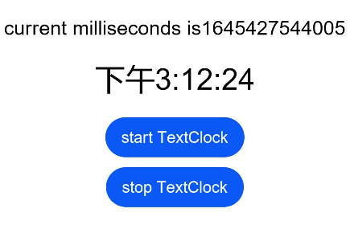

# TextClock

TextClock组件通过文本将当前系统时间显示在设备上。支持不同时区的时间显示，最高精度到秒级。

>**说明：**
>该组件从API Version 8开始支持。后续版本如有新增内容，则采用上角标单独标记该内容的起始版本。

## 权限列表

无

## 子组件

无

## 接口

TextClock(options?: { timeZoneOffset?: number, controller?: TextClockController })

**参数：** 

| 参数名   | 参数类型 | 必填 | 默认值             | 参数描述                                                     |
| -------- | -------- | ---- | ------------------ | ------------------------------------------------------------ |
| timeZoneOffset | number   | 否   | 时区偏移量 | 设置时区偏移量。<br>取值范围为[-14:00, 12:00]，表示东十二区到西十二区，其中负值表示东时区，正值表示西时区，比如东八区为-8:00。<br>对横跨国际日界线的国家或地区，用-13:00（UTC+13）和-14:00（UTC+14）来保证整个国家或者区域处在相同的时间。 |
| contorller | [TextClockContorller](#textclockcontroller) | 否 | null | 绑定一个控制器，用来控制文本时钟的状态。|

## 属性

除支持[通用属性](ts-universal-attributes-size.md)外，还支持以下属性：

| 名称   | 参数类型 | 默认值   | 描述                                                         |
| ------ | -------- | -------- | ------------------------------------------------------------ |
| format | string   | 'hhmmss' | 设置显示时间格式，如“yyyy/mm/dd”、“yyyy-mm-dd”等。<br>支持的时间格式化字符串：<br>- yyyy：年份。<br/>- mm：英文月份简写。<br/>- mmm：英文月份简写。<br/>- mmmm：英文月份全称。<br/>- dd：英文星期简写。<br/>- ddd：英文星期简写。<br/>- dddd：英文星期全称。<br/>- HH：24小时制。<br/>- hh：12小时制。<br/>- MM/mm：分钟。<br/>- SS/ss：秒。 |

## 事件

除支持[通用事件](ts-universal-events-click.md)外，还支持以下事件：

| 名称                                         | 功能描述                                                     |
| -------------------------------------------- | ------------------------------------------------------------ |
| onDateChange(event: (value: number) => void) | 提供时间变化回调，该事件最小回调间隔为秒。<br /> - value: Unix Time Stamp，即自1970年1月1日（UTC）起经过的毫秒数。 |

## TextClockController

TextClock容器组件的控制器，可以将此对象绑定到TextClock组件，再通过它控制文本时钟的启动与停止。

### 导入对象

```ts
controller: TextClockController = new TextClockController()
```

### start

start()

启动文本时钟。

### stop

stop()

停止文本时钟。


## 示例

```ts
@Entry
@Component
struct Second {
  @State accumulateTime: number = 0
  controller: TextClockController = new TextClockController()

  build() {
      Flex({ direction: FlexDirection.Column, alignItems: ItemAlign.Center, justifyContent: FlexAlign.Center}) {
        Text('Current milliseconds is ' + this.accumulateTime)
          .fontSize(20)
        // 以12小时制显示东八区的系统时间，精确到秒。
        TextClock({timeZoneOffset: -8, controller: this.controller})
          .format('hhmmss')
          .onDateChange((value: number) => {
            this.accumulateTime = value
          })
          .margin(20)
          .fontSize(30)
        Button("start TextClock")
          .margin({ bottom: 10 })
          .onClick(()=>{
            this.controller.start()
          })
        Button("stop TextClock")
          .onClick(()=>{
            this.controller.stop()
          })
      }
    .width('100%')
    .height('100%')
  }
}
```


