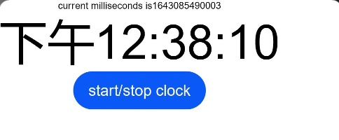

# TextClock<a name="ZH-CN_TOPIC_0000001193075098"></a>

> **说明：** 
>该组件从API Version 8开始支持。后续版本如有新增内容，则采用上角标单独标记该内容的起始版本。

TextClock主要用于显示系统时间，支持不同时区的时间显示，时间显示最高精度到秒级。

## 权限列表<a name="section781125411508"></a>

无

## 子组件<a name="section53281531154915"></a>

无

## 接口<a name="section1989913519718"></a>

TextClock(options?: {hourswest?: number})

- 参数

  <table><thead align="left"><tr><th class="cellrowborder" valign="top" width="16.11%" id="mcps1.1.6.1.1"><p>参数名</p>
  </th>
  <th class="cellrowborder" valign="top" width="14.01%" id="mcps1.1.6.1.2"><p>参数类型</p>
  </th>
  <th class="cellrowborder" valign="top" width="11.99%" id="mcps1.1.6.1.3"><p>必填</p>
  </th>
  <th class="cellrowborder" valign="top" width="11.709999999999999%" id="mcps1.1.6.1.4"><p>默认值</p>
  </th>
  <th class="cellrowborder" valign="top" width="46.18%" id="mcps1.1.6.1.5"><p>参数描述</p>
  </th>
  </tr>
  </thead>
  <tbody><tr><td class="cellrowborder" valign="top" width="16.11%" headers="mcps1.1.6.1.1 "><p>hourwest</p>
  </td>
  <td class="cellrowborder" valign="top" width="14.01%" headers="mcps1.1.6.1.2 "><p>number</p>
  </td>
  <td class="cellrowborder" valign="top" width="11.99%" headers="mcps1.1.6.1.3 "><p>否</p>
  </td>
  <td class="cellrowborder" valign="top" width="11.709999999999999%" headers="mcps1.1.6.1.4 "><p>系统时间所在的时区</p>
  </td>
  <td class="cellrowborder" valign="top" width="46.18%" headers="mcps1.1.6.1.5 "><p>设置时区信息，时区范围为[-14, 12]，其中负值表示东时区，比如东八区为-8，浮点数也会进行相应的换算（30分钟/0.5时区）；理论上时区范围是[-12,+12]，但是一些国家横跨国际日界线，因此用-13（UTC+13）和-14（UTC+14）来保证整个国家或者区域处在相同的时间。</p>
  </td>
  </tbody>
  </table>


## 属性<a name="section18430105671014"></a>

<table><thead align="left"><tr><th class="cellrowborder" valign="top" width="18.72%" id="mcps1.1.5.1.1"><p>名称</p>
</th>
<th class="cellrowborder" valign="top" width="16.33%" id="mcps1.1.5.1.2"><p>参数类型</p>
</th>
<th class="cellrowborder" valign="top" width="17.62%" id="mcps1.1.5.1.3"><p>默认值</p>
</th>
<th class="cellrowborder" valign="top" width="47.33%" id="mcps1.1.5.1.4"><p>描述</p>
</th>
</tr>
</thead>
<tbody><tr><td class="cellrowborder" valign="top" width="18.72%" headers="mcps1.1.5.1.1 "><p>format</p>
</td>
<td class="cellrowborder" valign="top" width="16.33%" headers="mcps1.1.5.1.2 "><p>string</p>
</td>
<td class="cellrowborder" valign="top" width="17.62%" headers="mcps1.1.5.1.3 "><p>'hhmmss'</p>
</td>
<td class="cellrowborder" valign="top" width="47.33%" headers="mcps1.1.5.1.4 "><p>设置显示时间格式，如“yyyy/mm/dd”、“yyyy-mm-dd”等。支持的时间格式化字符串：yyyy（年份），mm（英文月份简写），mmm（英文月份简写），mmmm（英文月份全称），dd（英文星期简写），ddd（英文星期简写），dddd（英文星期全称），HH（24小时制），hh（12小时制），MM/mm（分钟），SS/ss（秒）。</p>
</td>
</tr>
<tr><td class="cellrowborder" valign="top" width="18.72%" headers="mcps1.1.5.1.1 "><p>status</p>
</td>
<td class="cellrowborder" valign="top" width="16.33%" headers="mcps1.1.5.1.2 "><p>boolean</p>
</td>
<td class="cellrowborder" valign="top" width="17.62%" headers="mcps1.1.5.1.3 "><p>-</p>
</td>
    <td class="cellrowborder" valign="top" width="47.33%" headers="mcps1.1.5.1.4 "><p>设置文本时钟的启动和停止。<ul>
        <li>true表示文本时钟是启动状态。</li><li>false表示文本时钟是停止状态。</li>
        </ul></p>
</td>
</tr>
</tbody>
</table>


## 事件<a name="section449664852016"></a>

支持以下通用事件：onClick，onTouch，onKeyEvent，onDeleteEvent，onAppear，onDisAppear

<table><thead align="left"><tr><th class="cellrowborder" colspan="2" valign="top" id="mcps1.1.4.1.1"><p>名称</p>
</th>
<th class="cellrowborder" valign="top" id="mcps1.1.4.1.2"><p>功能描述</p>
</th>
</tr>
</thead>
<tbody><tr><td class="cellrowborder" colspan="2" valign="top" headers="mcps1.1.4.1.1 "><p>onDateChange(event: (value: number) => void)</p>
</td>
<td class="cellrowborder" valign="top" headers="mcps1.1.4.1.2 "><p>提供时间变化回调，回调参数为Unix Time Stamp，即自1970年1月1日（UTC）起经过的毫秒数，该事件最小回调间隔为秒。</p>
</td>
</tr>
</tbody>	
</table>


## 示例<a name="section13800193662114"></a>

```
@Entry
@Component
struct TextClockExmaple {
  format: string = 'hhmmss'
  @State accumulateTime: number = 0
  hourswest: number = -8
  @State isStart: boolean = true

  build() {
    Column() {
      Text('current milliseconds is' + this.accumulateTime)
      TextClock({hourswest:this.hourswest})
        .format(this.format)
        .onDateChange((value: number) => {
          this.accumulateTime = value
        })
        .status(this.isStart)
        .fontSize(50)
      Button("start/stop clock")
        .onClick(()=>{
          this.isStart = !this.isStart
        })
    }
    .align(Alignment.Center)
  }
}
```



