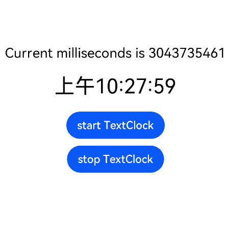

# TextClock

TextClock组件通过文本将当前系统时间显示在设备上。支持不同时区的时间显示，最高精度到秒级。

>**说明：**
>
>该组件从API Version 8开始支持。后续版本如有新增内容，则采用上角标单独标记该内容的起始版本。

## 子组件

无

## 接口

TextClock(options?: { timeZoneOffset?: number, controller?: TextClockController })

**参数：** 

| 参数名            | 参数类型      | 必填     | 参数描述                                                     |
| -------------- | -------- | ------ | --------------------------------------------------------------------------- |
| timeZoneOffset | number   | 否     | 设置时区偏移量。<br>取值范围为[-14, 12]，表示东十二区到西十二区，其中负值表示东时区，正值表示西时区，比如东八区为-8。<br>对横跨国际日界线的国家或地区，用-13（UTC+13）和-14（UTC+14）来保证整个国家或者区域处在相同的时间，当设置的值不在取值范围内时，将使用当前系统的时区偏移量。<br/>默认值：当前系统的时区偏移量 |
| controller     | [TextClockController](#textclockcontroller) | 否      | 绑定一个控制器，用来控制文本时钟的状态。|

## 属性

除支持[通用属性](ts-universal-attributes-size.md)外，还支持以下属性：

| 名称   | 参数类型    | 描述                                                         |
| ------ | --------------- | ------------------------------------------------------------ |
| format | string    | 设置显示时间格式。<br/>日期间隔符固定为"/"，时间间隔符为":"。<br/>如yyyyMMdd，yyyy-MM-dd显示为yyyy/MM/dd，<br/>hhmmss显示为hh:mm:ss。 <br/>时间格式只用写一位即可，如"hhmmss"等同于"hms"。<br/>支持的时间格式化字符串：<br/>- YYYY/yyyy：完整年份。<br/>- YY/yy：年份后两位。<br/>- M：月份(若想使用01月则使用MM)。<br/>- d：日期(若想使用01日则使用dd)。<br/>- D：年中日(一年中的第几天)。<br/>- H：24小时制。<br/>- h：12小时制。<br/>- m：分钟。<br/>- s：秒。<br/>- SSS：毫秒。<br/>若格式未匹配，则使用默认值。<br/>默认值： 'hms'|

## 事件

除支持[通用事件](ts-universal-events-click.md)外，还支持以下事件：

| 名称                                         | 功能描述                                                     |
| -------------------------------------------- | ------------------------------------------------------------ |
| onDateChange(event: (value: number) => void) | 提供时间变化回调，该事件最小回调间隔为秒。<br/>- value: Unix Time Stamp，即自1970年1月1日（UTC）起经过的毫秒数。 |

## TextClockController

TextClock容器组件的控制器，可以将该控制器绑定到TextClock组件，通过它控制文本时钟的启动与停止。一个TextClock组件仅支持绑定一个控制器。

### 导入对象

```ts
controller: TextClockController = new TextClockController();
```

### start

start()

启动文本时钟。

### stop

stop()

停止文本时钟。

## 示例

```ts
@Entry
@Component
struct Second {
  @State accumulateTime: number = 0
  // 导入对象
  controller: TextClockController = new TextClockController()
  build() {
    Flex({ direction: FlexDirection.Column, alignItems: ItemAlign.Center, justifyContent: FlexAlign.Center }) {
      Text('Current milliseconds is ' + this.accumulateTime)
        .fontSize(20)
      // 以12小时制显示东八区的系统时间，精确到秒。
      TextClock({ timeZoneOffset: -8, controller: this.controller })
        .format('hms')
        .onDateChange((value: number) => {
          this.accumulateTime = value
        })
        .margin(20)
        .fontSize(30)
      Button("start TextClock")
        .margin({ bottom: 10 })
        .onClick(() => {
          // 启动文本时钟
          this.controller.start()
        })
      Button("stop TextClock")
        .onClick(() => {
          // 停止文本时钟
          this.controller.stop()
        })
    }
    .width('100%')
    .height('100%')
  }
}
```

