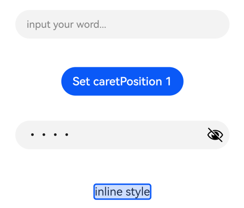

# TextInput

单行文本输入框组件。

>  **说明：**
>
>  该组件从API Version 7开始支持。后续版本如有新增内容，则采用上角标单独标记该内容的起始版本。


## 子组件

无


## 接口

TextInput(value?:{placeholder?: ResourceStr, text?: ResourceStr, controller?: TextInputController})

**参数：**

| 参数名                     | 参数类型                                     | 必填   | 参数描述            |
| ----------------------- | ---------------------------------------- | ---- | --------------- |
| placeholder   | [ResourceStr](ts-types.md#resourcestr)       | 否    | 设置无输入时的提示文本。      |
| text          | [ResourceStr](ts-types.md#resourcestr)       | 否    | 设置输入框当前的文本内容。</br>当组件设置[stateStyles](ts-universal-attributes-polymorphic-style.md)等刷新属性时，建议通过onChange事件将状态变量与文本实时绑定，</br>避免组件刷新时TextInput中的文本内容异常。<br />从API version 10开始，该参数支持[$$](../../quick-start/arkts-two-way-sync.md)双向绑定变量。 |
| controller<sup>8+</sup> | [TextInputController](#textinputcontroller8) | 否    | 设置TextInput控制器。 |


## 属性

除支持[通用属性](ts-universal-attributes-size.md)和[文本通用属性](ts-universal-attributes-text-style.md)的fontColor、fontSize、fontStyle、fontWeight、fontFamily外，还支持以下属性：

| 名称                       | 参数类型                                     | 描述                                       |
| ------------------------ | ---------------------------------------- | ---------------------------------------- |
| type                     | [InputType](#inputtype枚举说明)     | 设置输入框类型。<br/>默认值：InputType.Normal        |
| placeholderColor         | [ResourceColor](ts-types.md#resourcecolor)     | 设置placeholder文本颜色。<br/>默认值跟随主题。   |
| placeholderFont          | [Font](ts-types.md#font) | 设置placeholder文本样式。 |
| enterKeyType             | [EnterKeyType](#enterkeytype枚举说明) | 设置输入法回车键类型。<br/>默认值：EnterKeyType.Done |
| caretColor               | [ResourceColor](ts-types.md#resourcecolor)    | 设置输入框光标颜色。<br/>默认值：'#007DFF'。                                |
| maxLength                | number                                   | 设置文本的最大输入字符数。                            |
| inputFilter<sup>8+</sup> | {<br/>value:&nbsp;[ResourceStr](ts-types.md#resourcestr),<br/>error?:&nbsp;(value:&nbsp;string)&nbsp;=&gt;&nbsp;void<br/>} | 正则表达式，匹配表达式的输入允许显示，不匹配的输入将被过滤。目前仅支持单个字符匹配，不支持字符串匹配。<br/>-&nbsp;value：设置正则表达式。<br/>-&nbsp;error：正则匹配失败时，返回被过滤的内容。 |
| copyOption<sup>9+</sup>  | [CopyOptions](ts-appendix-enums.md#copyoptions9) | 设置输入的文本是否可复制。<br/>默认值：CopyOptions.LocalDevice，支持设备内复制。<br/>设置CopyOptions.None时，当前TextInput中的文字无法被复制或剪切，仅支持粘贴。 |
| showPasswordIcon<sup>9+</sup> | boolean | 密码输入模式时，输入框末尾的图标是否显示。<br/>默认值：true |
| style<sup>9+</sup> | [TextInputStyle](#textinputstyle9枚举说明) \| [TextContentStyle](ts-appendix-enums.md#textcontentstyle10) | 设置输入框为默认风格或内联输入风格（内联输入风格只支持InputType.Normal类型）。<br/>默认值：TextInputStyle.Default |
| textAlign<sup>9+</sup>   | [TextAlign](ts-appendix-enums.md#textalign) | 设置文本在输入框中的水平对齐方式。<br/>默认值：TextAlign.Start<br/>**说明：**<br/>仅支持TextAlign.Start、TextAlign.Center和TextAlign.End。<br/>可通过[align](ts-universal-attributes-location.md)属性控制文本段落在垂直方向上的位置，此组件中不可通过align属性控制文本段落在水平方向上的位置，即align属性中Alignment.TopStart、Alignment.Top、Alignment.TopEnd效果相同，控制内容在顶部，Alignment.Start、Alignment.Center、Alignment.End效果相同，控制内容垂直居中，Alignment.BottomStart、Alignment.Bottom、Alignment.BottomEnd效果相同，控制内容在底部。  |
| selectedBackgroundColor<sup>10+</sup> | [ResourceColor](ts-types.md#resourcecolor) | 设置文本选中底板颜色。<br/>如果未设置透明度，默认为不透明（例如：“0x80000000”为50%透明度黑色）。 |
| caretStyle<sup>10+</sup> | {<br/>width:&nbsp;[Length](ts-types.md#length)<br/>} | 设置光标风格，不支持百分比设置。                                        |
| caretPosition<sup>10+</sup> | number | 设置光标位置。 |
| showUnit<sup>10+</sup>                | [CustomBuilder](ts-types.md#CustomBuilder8)         | 设置控件作为文本框单位。<br/>默认无单位。 |
| showError<sup>10+</sup> | string&nbsp;\|&nbsp;undefined | 设置错误状态下提示的错误文本或者不显示错误状态。<br/>默认不显示错误状态。<br/>**说明：** <br/>当参数类型为string并且输入内容不符合定义规范时，提示错误文本。当参数类型为undefined时，不显示错误状态。请参考[示例2](#示例2) |
| showUnderline<sup>10+</sup> | boolean | 设置是否开启下划线。下划线默认颜色为'#33182431'，默认粗细为1px，文本框尺寸48vp（下划线只支持InputType.Normal类型）。<br/>默认值：false |
| passwordIcon<sup>10+</sup> | [PasswordIcon](#passwordicon10对象说明) | 密码输入模式时，设置输入框末尾的图标。<br/>默认为系统提供的密码图标。 |
| enableKeyboardOnFocus<sup>10+</sup> | boolean | TextInput获焦时，是否绑定输入法<br/>默认值：true。从API version 10开始，获焦默认绑定输入法。 |
| selectionMenuHidden<sup>10+</sup> | boolean | 设置长按输入框或者右键输入框时，是否弹出文本选择菜单。<br />默认值：false |
| barState<sup>10+</sup> | [BarState](ts-appendix-enums.md#BarState) | 设置内联输入风格编辑态时滚动条的显示模式。<br/>默认值：BarState.Auto |
| maxLines<sup>10+</sup> | number | 设置内联输入风格编辑态时文本可显示的最大行数。<br/>默认值：3 <br/>**说明：**<br/>取值范围：(0, +∞)。|
| customKeyboard<sup>10+</sup> | [CustomBuilder](ts-types.md#custombuilder8) | 设置自定义键盘。<br/>**说明：**<br/>当设置自定义键盘时，输入框激活后不会打开系统输入法，而是加载指定的自定义组件，针对系统键盘的enterKeyType属性设置将无效。<br/>自定义键盘的高度可以通过自定义组件根节点的height属性设置，宽度不可设置，使用系统默认值。<br/>自定义键盘采用覆盖原始界面的方式呈现，不会对应用原始界面产生压缩或者上提。<br/>自定义键盘无法获取焦点，但是会拦截手势事件。<br/>默认在输入控件失去焦点时，关闭自定义键盘，开发者也可以通过[TextInputController](#textinputcontroller8).[stopEditing](#stopediting10)方法控制键盘关闭。 |
>  **说明：**    
>  [通用属性padding](ts-universal-attributes-size.md)的默认值为：<br>{<br>&nbsp;top: 8 vp,<br>&nbsp;right: 16 vp,<br>&nbsp;bottom: 8 vp,<br>&nbsp;left: 16 vp<br> }    
>   从API version 10开始，单行输入框可设置.width('auto')使组件宽度自适应文本宽度，自适应时组件宽度受constraintSize属性以及父容器传递的最大最小宽度限制，其余使用方式参考[尺寸设置](ts-universal-attributes-size.md#属性)。       

## EnterKeyType枚举说明

| 名称                  | 描述        |
| ------------------- | --------- |
| Go     | 显示为前往样式。   |
| Search | 显示为搜索样式。  |
| Send   | 显示为发送样式。  |
| Next   | 显示为下一个样式。 |
| Done   | 显示为确认样式。     |

## InputType枚举说明

| 名称                 | 描述            |
| ------------------ | ------------- |
| Normal   | 基本输入模式。<br/>支持输入数字、字母、下划线、空格、特殊字符。 |
| Password | 密码输入模式。支持输入数字、字母、下划线、空格、特殊字符。密码显示小眼睛图标并且默认会将文字变成圆点。密码输入模式不支持下划线样式。 |
| Email    | 邮箱地址输入模式。支持数字，字母，下划线，以及@字符（只能存在一个@字符）。 |
| Number   | 纯数字输入模式。      |
| PhoneNumber<sup>9+</sup> | 电话号码输入模式。<br/>支持输入数字、+ 、-、*、#，长度不限。 |

## TextInputStyle<sup>9+</sup>枚举说明

| 名称                 | 描述            |
| ------------------ | ------------- |
| Default   | 默认风格，光标宽1.5vp，光标高度与文本选中底板高度和字体大小相关。   |
| Inline    | 内联输入风格。文本选中底板高度与输入框高度相同。<br/>内联输入是在有明显的编辑态/非编辑态的区分场景下使用，例如：文件列表视图中的重命名。<br/>不支持showError属性。 |

## PasswordIcon<sup>10+</sup>对象说明

| 名称       | 类型                                               | 必填 | 描述                                               |
| ---------- | -------------------------------------------------- | ---- | -------------------------------------------------- |
| onIconSrc  | string&nbsp;\|[Resource](ts-types.md#resource类型) | 否   | 密码输入模式时，能够切换密码隐藏的显示状态的图标。 |
| offIconSrc | string&nbsp;\|[Resource](ts-types.md#resource类型) | 否   | 密码输入模式时，能够切换密码显示的隐藏状态的图标。 |

## 事件

除支持[通用事件](ts-universal-events-click.md)外，还支持以下事件：

| 名称                                                         | 功能描述                                                     |
| ------------------------------------------------------------ | ------------------------------------------------------------ |
| onChange(callback:&nbsp;(value:&nbsp;string)&nbsp;=&gt;&nbsp;void) | 输入内容发生变化时，触发该回调。<br/>value：输入的文本内容。<br/>触发该事件的条件：<br/>1、键盘输入。<br/>2、粘贴、剪切。<br/>3、键盘快捷键Ctrl+v。 |
| onSubmit(callback:&nbsp;(enterKey:&nbsp;EnterKeyType)&nbsp;=&gt;&nbsp;void) | 按下输入法回车键触发该回调，返回值为当前输入法回车键的类型。<br/>enterKeyType：输入法回车键类型。具体类型见[EnterKeyType枚举说明](#enterkeytype枚举说明)。 |
| onEditChanged(callback:&nbsp;(isEditing:&nbsp;boolean)&nbsp;=&gt;&nbsp;void)<sup>(deprecated)</sup> | 输入状态变化时，触发该回调。从API 8开始，建议使用onEditChange。 |
| onEditChange(callback:&nbsp;(isEditing:&nbsp;boolean)&nbsp;=&gt;&nbsp;void)<sup>8+</sup> | 输入状态变化时，触发该回调。有光标时为编辑态，无光标时为非编辑态。isEditing为true表示正在输入。 |
| onCopy(callback:(value:&nbsp;string)&nbsp;=&gt;&nbsp;void)<sup>8+</sup> | 长按输入框内部区域弹出剪贴板后，点击剪切板复制按钮，触发该回调。<br/>value：复制的文本内容。 |
| onCut(callback:(value:&nbsp;string)&nbsp;=&gt;&nbsp;void)<sup>8+</sup> | 长按输入框内部区域弹出剪贴板后，点击剪切板剪切按钮，触发该回调。<br/>value：剪切的文本内容。 |
| onPaste(callback:(value:&nbsp;string)&nbsp;=&gt;&nbsp;void)<sup>8+</sup> | 长按输入框内部区域弹出剪贴板后，点击剪切板粘贴按钮，触发该回调。<br/>value：粘贴的文本内容。 |
| onTextSelectionChange(callback: (selectionStart: number, selectionEnd: number) => void)<sup>10+</sup> | 文本选择的位置发生变化时，触发该回调。<br />selectionStart：文本选择区域起始位置，文本框中文字的起始位置为0。<br />selectionEnd：文本选择区域结束位置。 |
| onContentScroll(callback: (totalOffsetX: number, totalOffsetY: number) => void)<sup>10+</sup> | 文本内容滚动时，触发该回调。<br />totalOffsetX：文本在内容区的横坐标偏移。<br />totalOffsetY：文本在内容区的纵坐标偏移。 |

## TextInputController<sup>8+</sup>

TextInput组件的控制器。

### 导入对象
```
controller: TextInputController = new TextInputController()
```
### caretPosition<sup>8+</sup>

caretPosition(value:&nbsp;number): void

设置输入光标的位置。

**参数：**

| 参数名 | 参数类型 | 必填 | 参数描述                               |
| ------ | -------- | ---- | -------------------------------------- |
| value  | number   | 是   | 从字符串开始到光标所在位置的字符长度。 |
### setTextSelection<sup>10+</sup>

setTextSelection(selectionStart:&nbsp;number, selectionEnd:&nbsp;number): void

设置文本选择区域并高亮显示。

**参数：**

| 参数名         | 参数类型 | 必填 | 参数描述               |
| -------------- | -------- | ---- | ---------------------- |
| selectionStart | number   | 是   | 文本选择区域起始位置，文本框中文字的起始位置为0。 |
| selectionEnd   | number   | 是   | 文本选择区域结束位置。 |

### stopEditing<sup>10+</sup>

stopEditing(): void

退出编辑态。

### getTextContentRect<sup>10+</sup>

getTextContentRect(): [RectResult](#rectresult)

获取已编辑文本内容区域相对组件的位置和大小，返回值单位为像素。

**返回值：**

| 类型       | 说明       |
| -------------------  | -------- |
| [RectResult](#rectresult) | 已编辑文本内容的相对组件的位置和大小。 |

> **说明：**
>
> - 初始不输入文本时，返回值中有相对组件的位置信息，大小为0。
> - 返回值中的位置信息是第一个字符相对于可编辑组件的位置。

### RectResult<sup>10+</sup>

位置和大小。

| 参数      | 类型     | 描述 |
| ------- | ------ | ----------------------- |
| x     | number | 水平方向横坐标。|
| y     | number | 竖直方向纵坐标。|
| width | number | 内容宽度大小。|
| height | number | 内容高度大小。|


### getTextContentLineCount<sup>10+</sup>

getTextContentLineCount(): number

获取已编辑文本内容的行数。

**返回值：**

| 类型  | 说明       |
| ----- | -------- |
| number| 已编辑文本内容行数。 |

## 示例

### 示例1

```ts
// xxx.ets
@Entry
@Component
struct TextInputExample {
  @State text: string = ''
  controller: TextInputController = new TextInputController()

  build() {
    Column() {
      TextInput({ text: this.text, placeholder: 'input your word...', controller: this.controller })
        .placeholderColor(Color.Grey)
        .placeholderFont({ size: 14, weight: 400 })
        .caretColor(Color.Blue)
        .width(400)
        .height(40)
        .margin(20)
        .fontSize(14)
        .fontColor(Color.Black)
        .inputFilter('[a-z]', (e) => {
          console.log(JSON.stringify(e))
        })
        .onChange((value: string) => {
          this.text = value
        })
      Text(this.text)
      Button('Set caretPosition 1')
        .margin(15)
        .onClick(() => {
          // 将光标移动至第一个字符后
          this.controller.caretPosition(1)
        })
      // 密码输入框
      TextInput({ placeholder: 'input your password...' })
        .width(400)
        .height(40)
        .margin(20)
        .type(InputType.Password)
        .maxLength(9)
        .showPasswordIcon(true)
      // 内联风格输入框
      TextInput({ text: 'inline style' })
        .width(400)
        .height(50)
        .margin(20)
        .borderRadius(0)
        .style(TextInputStyle.Inline)
    }.width('100%')
  }
}
```



### 示例2

```ts
@Entry
@Component
struct TextInputExample {
  @State PassWordSrc1: Resource = $r('app.media.onIcon')
  @State PassWordSrc2: Resource = $r('app.media.offIcon')
  @State TextError: string = ''
  @State Text: string = ''
  @State NameText: string = 'test'

  @Builder itemEnd() {
    Select([{ value: 'KB' },
      { value: 'MB' },
      { value: 'GB' },
      { value: 'TB', }])
      .height("48vp")
      .borderRadius(0)
      .selected(2)
      .align(Alignment.Center)
      .value('MB')
      .font({ size: 20, weight: 500 })
      .fontColor('#182431')
      .selectedOptionFont({ size: 20, weight: 400 })
      .optionFont({ size: 20, weight: 400 })
      .backgroundColor(Color.Transparent)
      .responseRegion({ height: "40vp", width: "80%", x: '10%', y: '6vp' })
      .onSelect((index: number) => {
        console.info('Select:' + index)
      })
  }

  build() {
    Column({ space: 20 }) {
      // 自定义密码显示图标
      TextInput({ placeholder: 'user define password icon' })
        .type(InputType.Password)
        .width(380)
        .height(60)
        .passwordIcon({ onIconSrc: this.PassWordSrc1, offIconSrc: this.PassWordSrc2 })
      // 下划线模式
      TextInput({ placeholder: 'underline style' })
        .showUnderline(true)
        .width(380)
        .height(60)
        .showError('Error')
        .showUnit(this.itemEnd.bind(this))

      Text(`用户名：${this.Text}`)
        .width('95%')
      TextInput({ placeholder: '请输入用户名', text: this.Text })
        .showUnderline(true)
        .width(380)
        .showError(this.TextError)
        .onChange((value: string) => {
          this.Text = value
        })
        .onSubmit(() => { // 用户名不正确会清空输入框和用户名并提示错误文本
          if (this.Text == this.NameText) {
            this.TextError = ''
          } else {
            this.TextError = '用户名输入错误'
            this.Text = ''
          }
        })

    }.width('100%')
  }
}
```


### 示例3

```ts
// xxx.ets
@Entry
@Component
struct TextInputExample {
  controller: TextInputController = new TextInputController()
  @State inputValue: string = ""

  // 自定义键盘组件
  @Builder CustomKeyboardBuilder() {
    Column() {
      Button('x').onClick(() => {
        // 关闭自定义键盘
        this.controller.stopEditing()
      })
      Grid() {
        ForEach([1, 2, 3, 4, 5, 6, 7, 8, 9, '*', 0, '#'], (item:number|string) => {
          GridItem() {
            Button(item + "")
              .width(110).onClick(() => {
              this.inputValue += item
            })
          }
        })
      }.maxCount(3).columnsGap(10).rowsGap(10).padding(5)
    }.backgroundColor(Color.Gray)
  }

  build() {
    Column() {
      TextInput({ controller: this.controller, text: this.inputValue })
        // 绑定自定义键盘
        .customKeyboard(this.CustomKeyboardBuilder()).margin(10).border({ width: 1 })
    }
  }
}
```


