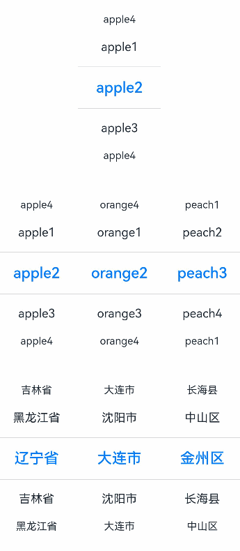

# TextPicker

滑动选择文本内容的组件。

>  **说明：**
>
>  该组件从API Version 8开始支持。后续版本如有新增内容，则采用上角标单独标记该内容的起始版本。


## 子组件

无


## 接口

TextPicker(options?: {range: string[] | string[][] | Resource | TextPickerRangeContent[] | TextCascadePickerRangeContent[], selected?: number&nbsp;\|&nbsp;number[], value?: string&nbsp;\|&nbsp;string[]})

根据range指定的选择范围创建文本选择器。

**参数：**

| 参数名 | 参数类型 | 必填 | 参数描述 |
| -------- | -------- | -------- | -------- |
| range | string[]&nbsp;\|&nbsp;string[][]<sup>10+</sup>&nbsp;\|&nbsp;[Resource](ts-types.md#resource类型)&nbsp;\|<br/>[TextPickerRangeContent](#textpickerrangecontent10类型说明)[]<sup>10+</sup>&nbsp;\|&nbsp;[TextCascadePickerRangeContent](#textcascadepickerrangecontent10类型说明)[]<sup>10+</sup> | 是 | 选择器的数据选择列表。不可设置为空数组，若设置为空数组，则不显示；若动态变化为空数组，则保持当前正常值显示。<br/>**说明**：单列数据选择器使用string[]，Resource，TextPickerRangeContent[]类型。<br/>多列数据选择器使用string[][]类型。 <br/>多列联动数据选择器使用TextCascadePickerRangeContent[]类型。<br/>Resource类型只支持[strarray.json](../../quick-start/resource-categories-and-access.md#资源组目录)。 |
| selected | number&nbsp;\|&nbsp;number[]<sup>10+</sup> | 否 | 设置默认选中项在数组中的索引值。<br/>默认值：0 <br/>**说明**：单列数据选择器使用number类型。<br/>多列、多列联动数据选择器使用number[]类型。<br />从API version 10开始，该参数支持[$$](../../quick-start/arkts-two-way-sync.md)双向绑定变量。|
| value | string&nbsp;\|&nbsp;string[]<sup>10+</sup> | 否 | 设置默认选中项的值，优先级低于selected。<br/>默认值：第一个元素值<br/>**说明**：只有显示文本列表时该值有效。显示图片或图片加文本的列表时，该值无效。 <br/>单列数据选择器使用string类型。<br/>多列、多列联动数据选择器使用string[]类型。<br />从API version 10开始，该参数支持[$$](../../quick-start/arkts-two-way-sync.md)双向绑定变量。|

## TextPickerRangeContent<sup>10+</sup>类型说明

| 参数名 | 参数类型                                                 | 必填 | 参数描述   |
| ------ | -------------------------------------------------------- | ---- | ---------- |
| icon   | string&nbsp;\|&nbsp;[Resource](ts-types.md#resource) | 是   | 图片资源。 |
| text   | string&nbsp;\|&nbsp;[Resource](ts-types.md#resource) | 否   | 文本信息。 |

## TextCascadePickerRangeContent<sup>10+</sup>类型说明

| 参数名 | 参数类型                                                 | 必填 | 参数描述   |
| ------ | -------------------------------------------------------- | ---- | ---------- |
| text   | string&nbsp;\|&nbsp;[Resource](ts-types.md#resource) | 是   | 文本信息。 |
| children   | [TextCascadePickerRangeContent](#textcascadepickerrangecontent10类型说明)[] | 否   | 联动数据。 |

## 属性

除支持[通用属性](ts-universal-attributes-size.md)外，还支持以下属性：

| 名称 | 参数类型 | 描述 |
| -------- | -------- | -------- |
| defaultPickerItemHeight | number \| string | 设置Picker各选择项的高度。 |
| disappearTextStyle<sup>10+</sup> | [PickerTextStyle](ts-basic-components-datepicker.md#pickertextstyle10类型说明) | 设置所有选项中最上和最下两个选项的文本颜色、字号、字体粗细。<br/>默认值：<br/>{<br/>color: '#ff182431',<br/>font: {<br>size: '14fp', <br/>weight: FontWeight.Regular<br/>}<br/>} |
| textStyle<sup>10+</sup> | [PickerTextStyle](ts-basic-components-datepicker.md#pickertextstyle10类型说明) | 设置所有选项中除了最上、最下及选中项以外的文本颜色、字号、字体粗细。<br/>默认值：<br/>{<br/>color: '#ff182431',<br/>font: {<br/>size: '16fp', <br/>weight: FontWeight.Regular<br/>}<br/>} |
| selectedTextStyle<sup>10+</sup> | [PickerTextStyle](ts-basic-components-datepicker.md#pickertextstyle10类型说明) | 设置选中项的文本颜色、字号、字体粗细。<br/>默认值：<br/>{<br/>color: '#ff007dff',<br/>font: {<br/>size: '20vp', <br/>weight: FontWeight.Medium<br/>}<br/>} |
| selectedIndex<sup>10+</sup> | number&nbsp;\|&nbsp;number[] | 设置默认选中项在数组中的索引值，优先级高于options中的选中值。 <br/>**说明**：单列数据选择器使用number类型。多列、多列联动数据选择器使用number[]类型。 |
| canLoop<sup>10+</sup> | boolean | 设置是否可循环滚动，true：可循环，false：不可循环，默认值：true。 |

## 事件

除支持[通用事件](ts-universal-events-click.md)外，还支持以下事件：

| 名称 | 描述 |
| -------- | -------- |
| onAccept(callback: (value: string, index: number) => void)<sup>(deprecated) </sup>  | 点击弹窗中的“确定”按钮时触发该回调。<br/>-&nbsp;value:&nbsp;当前选中项的文本。<br/>-&nbsp;index:&nbsp;当前选中项的索引值。<br/> 从API version 10开始废弃。 <br/>**说明：** <br/>该事件仅在[文本滑动选择器弹窗](ts-methods-textpicker-dialog.md)中生效。|
| onCancel(callback: () => void)<sup>(deprecated) </sup>  | 点击弹窗中的“取消”按钮时触发该回调。<br/> 从API version 10开始废弃。<br/>**说明：** <br/>该事件仅在[文本滑动选择器弹窗](ts-methods-textpicker-dialog.md)中生效。 |
| onChange(callback:&nbsp;(value:&nbsp;string&nbsp;\|&nbsp;string[]<sup>10+</sup>,&nbsp;index:&nbsp;number&nbsp;\|&nbsp;number[]<sup>10+</sup>)&nbsp;=&gt;&nbsp;void) | 滑动选中TextPicker文本内容后，触发该回调。<br/>-&nbsp;value:&nbsp;当前选中项的文本。（多列的情况，value为数组类型。）<br/>-&nbsp;index:&nbsp;当前选中项的索引值。（多列的情况，index为数组类型。）<br/>**说明**：当显示文本或图片加文本列表时，value值为选中项中的文本值，当显示图片列表时，value值为空。 |


## 示例

```ts
// xxx.ets
class bottom {
  bottom:number = 50
}
let bott:bottom = new bottom()
@Entry
@Component
struct TextPickerExample {
  private select: number = 1
  private apfruits: string[] = ['apple1', 'apple2', 'apple3', 'apple4']
  private orfruits: string[] = ['orange1', 'orange2', 'orange3', 'orange4']
  private pefruits: string[] = ['peach1', 'peach2', 'peach3', 'peach4']
  private multi: string[][] = [this.apfruits, this.orfruits, this.pefruits]
  private cascade: TextCascadePickerRangeContent[] = [
    {
      text: '辽宁省',
      children: [{ text: '沈阳市', children: [{ text: '沈河区' }, { text: '和平区' }, { text: '浑南区' }] },
        { text: '大连市', children: [{ text: '中山区' }, { text: '金州区' }, { text: '长海县' }] }]
    },
    {
      text: '吉林省',
      children: [{ text: '长春市', children: [{ text: '南关区' }, { text: '宽城区' }, { text: '朝阳区' }] },
        { text: '四平市', children: [{ text: '铁西区' }, { text: '铁东区' }, { text: '梨树县' }] }]
    },
    {
      text: '黑龙江省',
      children: [{ text: '哈尔滨市', children: [{ text: '道里区' }, { text: '道外区' }, { text: '南岗区' }] },
        { text: '牡丹江市', children: [{ text: '东安区' }, { text: '西安区' }, { text: '爱民区' }] }]
    }
  ]

  build() {
    Column() {

      TextPicker({ range: this.apfruits, selected: this.select })
        .onChange((value: string | string[], index: number | number[]) => {
          console.info('Picker item changed, value: ' + value + ', index: ' + index)
        }).margin(bott)

      TextPicker({ range: this.multi })
        .onChange((value: string | string[], index: number | number[]) => {
          console.info('TextPicker 多列:onChange ' + JSON.stringify(value) + ', ' + 'index: ' + JSON.stringify(index))
        }).margin(bott)

      TextPicker({ range: this.cascade })
        .onChange((value: string | string[], index: number | number[]) => {
          console.info('TextPicker 多列联动:onChange ' + JSON.stringify(value) + ', ' + 'index: ' + JSON.stringify(index))
        })
    }
  }
}
```



```ts
// xxx.ets
@Entry
@Component
struct TextPickerExample {
  private select: number = 1
  private fruits: string[] = ['apple1', 'orange2', 'peach3', 'grape4']

  build() {
    Column() {
      TextPicker({ range: this.fruits, selected: this.select })
        .onChange((value: string | string[], index: number | number[]) => {
          console.info('Picker item changed, value: ' + value + ', index: ' + index)
        })
        .disappearTextStyle({color: Color.Red, font: {size: 15, weight: FontWeight.Lighter}})
        .textStyle({color: Color.Black, font: {size: 20, weight: FontWeight.Normal}})
        .selectedTextStyle({color: Color.Blue, font: {size: 30, weight: FontWeight.Bolder}})
    }.width('100%').height('100%')
  }
}
```


