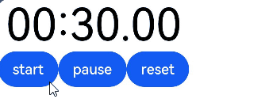
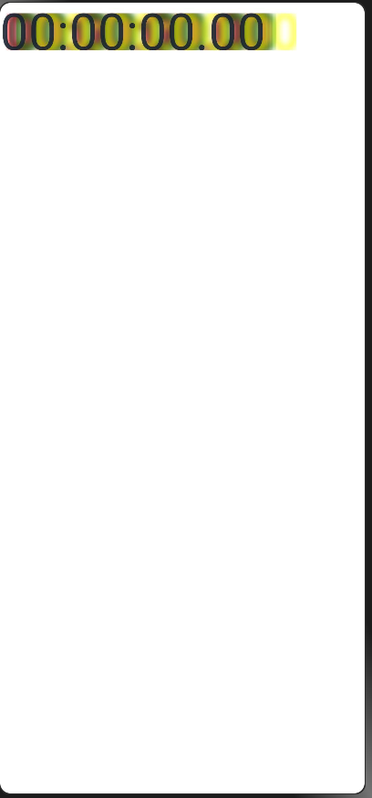

# TextTimer

通过文本显示计时信息并控制其计时器状态的组件。

>  **说明：**
>
> 该组件从API Version 8开始支持。后续版本如有新增内容，则采用上角标单独标记该内容的起始版本。

## 子组件

无

## 接口

TextTimer(options?: { isCountDown?: boolean, count?: number, controller?: TextTimerController })

**参数：**

| 参数名     | 参数类型     | 必填  | 参数描述                   |
| ----------- | -------- | -------- | -------- |
| isCountDown | boolean  | 否   | 是否倒计时。<br/>默认值：false |
| count       | number   | 否   | 倒计时时间（isCountDown为true时生效），单位为毫秒。最长不超过86400000毫秒（24小时）。&nbsp;0&lt;count&lt;86400000时，count值为倒计时初始值。否则，使用默认值为倒计时初始值。<br/>默认值：60000 |
| controller  | [TextTimerController](#texttimercontroller) | 否  | TextTimer控制器。 |

## 属性

| 名称        | 参数类型       | 描述                             |
| -------- | ---------------------- | ---------------------- |
| format   | string   | 自定义格式，需至少包含一个HH、mm、ss、SS中的关键字。如使用yy、MM、dd等日期格式，则使用默认值。<br/>默认值：'HH:mm:ss.SS' |
| textShadow<sup>11+</sup>  |  [ShadowOptions](ts-universal-attributes-image-effect.md#shadowoptions对象说明)&nbsp;\|&nbsp;Array&lt;[ShadowOptions](ts-universal-attributes-image-effect.md#shadowoptions对象说明)> | 设置文字阴影效果。该接口支持以数组形式入参，实现多重文字阴影。<br/>**说明：**<br/>不支持fill字段, 不支持智能取色模式。 |

## 事件

| 名称                                       | 功能描述                                     |
| ---------------------------------------- | ---------------------------------------- |
| onTimer(event:&nbsp;(utc:&nbsp;number,&nbsp;elapsedTime:&nbsp;number)&nbsp;=&gt;&nbsp;void) | 时间文本发生变化时触发。<br/>utc：Linux时间戳，即自1970年1月1日起经过的时间，单位为设置格式的最小单位。<br/>elapsedTime：计时器经过的时间，单位为设置格式的最小单位。 <br/> **说明：** <br/>锁屏状态和应用后台状态下不会触发该事件。|

## TextTimerController

TextTimer组件的控制器，用于控制文本计时器。一个TextTimer组件仅支持绑定一个控制器。

### 导入对象

```
textTimerController: TextTimerController = new TextTimerController()

```

### start

start()

计时开始。

### pause

pause()

计时暂停。

### reset

reset()

重置计时器。

## 示例

```ts
// xxx.ets
@Entry
@Component
struct TextTimerExample {
  textTimerController: TextTimerController = new TextTimerController()
  @State format: string = 'mm:ss.SS'

  build() {
    Column() {
      TextTimer({ isCountDown: true, count: 30000, controller: this.textTimerController })
        .format(this.format)
        .fontColor(Color.Black)
        .fontSize(50)
        .onTimer((utc: number, elapsedTime: number) => {
          console.info('textTimer notCountDown utc is：' + utc + ', elapsedTime: ' + elapsedTime)
        })
      Row() {
        Button("start").onClick(() => {
          this.textTimerController.start()
        })
        Button("pause").onClick(() => {
          this.textTimerController.pause()
        })
        Button("reset").onClick(() => {
          this.textTimerController.reset()
        })
      }
    }
  }
}
```




## 示例2
``` ts
@Entry
@Component
struct TextTimerExample {
  @State textShadows : ShadowOptions | Array<ShadowOptions> = [{ radius: 10, color: Color.Red, offsetX: 10, offsetY: 0 },{ radius: 10, color: Color.Black, offsetX: 20, offsetY: 0 },
      { radius: 10, color: Color.Brown, offsetX: 30, offsetY: 0 },{ radius: 10, color: Color.Green, offsetX: 40, offsetY: 0 },
      { radius: 10, color: Color.Yellow, offsetX: 100, offsetY: 0 }]
  build() {
    Column({ space: 8 }) {
      TextTimer().fontSize(50).textShadow(this.textShadows)
    }
  }
}
```
