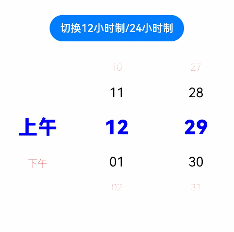

# TimePicker

时间选择组件，根据指定参数创建选择器，支持选择小时及分钟。

>  **说明：**
>
>  该组件从API Version 8开始支持。后续版本如有新增内容，则采用上角标单独标记该内容的起始版本。


## 子组件

无


## 接口

TimePicker(options?: {selected?: Date})

默认以24小时的时间区间创建滑动选择器。

**参数：**

| 参数名   | 参数类型 | 必填 | 参数描述                                                     |
| -------- | -------- | ---- | ------------------------------------------------------------ |
| selected | Date     | 否   | 设置选中项的时间。<br/>默认值：当前系统时间<br />从API version 10开始，该参数支持[$$](../../quick-start/arkts-two-way-sync.md)双向绑定变量。 |

## 属性

除支持[通用属性](ts-universal-attributes-size.md)外，还支持以下属性：

| 名称                             | 参数类型                                                     | 描述                                                         |
| -------------------------------- | ------------------------------------------------------------ | ------------------------------------------------------------ |
| useMilitaryTime                  | boolean                                                      | 展示时间是否为24小时制。<br/>默认值：false                   |
| disappearTextStyle<sup>10+</sup> | [PickerTextStyle](ts-basic-components-datepicker.md#pickertextstyle10类型说明) | 设置所有选项中最上和最下两个选项的文本颜色、字号、字体粗细。<br/>默认值：<br/>{<br/>color: '#ff182431',<br/>font: {<br/>size: '14fp', <br/>weight: FontWeight.Regular<br/>}<br/>} |
| textStyle<sup>10+</sup>          | [PickerTextStyle](ts-basic-components-datepicker.md#pickertextstyle10类型说明) | 设置所有选项中除了最上、最下及选中项以外的文本颜色、字号、字体粗细。<br/>默认值：<br/>{<br/>color: '#ff182431',<br/>font: {<br/>size: '16fp', <br/>weight: FontWeight.Regular<br/>}<br/>} |
| selectedTextStyle<sup>10+</sup>  | [PickerTextStyle](ts-basic-components-datepicker.md#pickertextstyle10类型说明) | 设置选中项的文本颜色、字号、字体粗细。<br/>默认值：<br/>{<br/>color: '#ff007dff',<br/>font: {<br/>size: '20vp', <br/>weight: FontWeight.Medium<br/>}<br/>} |

## 事件

除支持[通用事件](ts-universal-events-click.md)外，还支持以下事件：

| 名称                                       | 功能描述        |
| ---------------------------------------- | ----------- |
| onChange(callback:&nbsp;(value:&nbsp;TimePickerResult )&nbsp;=&gt;&nbsp;void) | 选择时间时触发该事件。 |

## TimePickerResult对象说明

| 名称     | 参数类型   | 描述      |
| ------ | ------ | ------- |
| hour   | number | 选中时间的时。 |
| minute | number | 选中时间的分。 |


## 示例

```ts
// xxx.ets
@Entry
@Component
struct TimePickerExample {
  @State isMilitaryTime: boolean = false
  private selectedTime: Date = new Date('2022-07-22T08:00:00')

  build() {
    Column() {
      Button('切换12小时制/24小时制')
        .margin({ top: 30 })
        .onClick(() => {
          this.isMilitaryTime = !this.isMilitaryTime
        })
      TimePicker({
        selected: this.selectedTime,
      })
        .useMilitaryTime(this.isMilitaryTime)
        .onChange((value: TimePickerResult) => {
          this.selectedTime.setHours(value.hour, value.minute)
          console.info('select current date is: ' + JSON.stringify(value))
        })
    }.width('100%')
  }
}
```

