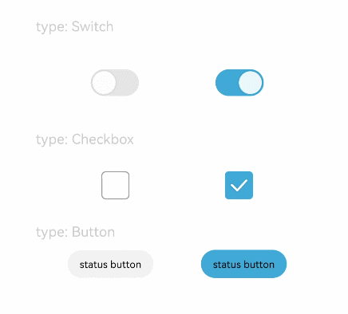

# Toggle

>  **说明：**
> 该组件从API Version 8开始支持。后续版本如有新增内容，则采用上角标单独标记该内容的起始版本。


## 权限列表

无


## 子组件

无


## 接口

Toggle(options: { type: ToggleType, isOn?: boolean })

- 参数
  | 参数名 | 参数类型 | 必填 | 默认值 | 参数描述 |
  | -------- | -------- | -------- | -------- | -------- |
  | type | ToggleType | 是 | - | 开关类型。 |
  | isOn | boolean | 否 | false | 开关是否打开，true：打开，false：关闭。 |


- ToggleType枚举说明
  | 名称 | 描述 | 
  | -------- | -------- |
  | Checkbox | 提供单选框样式，子组件设置文本不生效，如需文本设置，可将Text和当前组件放入布局组件中。<br>>&nbsp;**说明：**<br/>>&nbsp;[通用属性padding](ts-universal-attributes-size.md)的默认值为：<br>{<br>&nbsp;top: 14 vp,<br>&nbsp;right: 6 vp,<br>&nbsp;bottom: 14 vp,<br>&nbsp;left: 6 vp<br> } | 
  | Button | 提供状态按钮样式，如果有文本设置，则相应的文本内容会显示在按钮内部。 | 
  | Switch | 提供开关样式，子组件设置文本不生效，如需文本设置，可将Text和当前组件放入布局组件中。<br>>&nbsp;**说明：**<br/>>&nbsp;[通用属性padding](ts-universal-attributes-size.md)默认值为：<br>{<br/>&nbsp;top: 12 vp,<br/>&nbsp;right: 12 vp,<br/>&nbsp;bottom: 12 vp,<br/>&nbsp;left: 12 vp<br/> } | 


## 属性

| 名称 | 参数 | 默认值 | 参数描述 | 
| -------- | -------- | -------- | -------- |
| selectedColor | Color | - | 设置组件打开状态的背景颜色。 | 
| switchPointColor | Color | - | 设置Switch类型的圆形滑块颜色。<br/>>&nbsp;**说明：**<br/>>&nbsp;仅对type为ToggleType.Switch生效。 | 


## 事件

| 名称 | 功能描述 | 
| -------- | -------- |
| onChange(callback:&nbsp;(isOn:&nbsp;boolean)&nbsp;=&gt;&nbsp;void) | 开关状态切换时触发该事件。 | 


## 示例

```
@Entry
@Component
struct ToggleExample {
  build() {
    Column({ space: 10 }) {
      Text('type: Switch').fontSize(12).fontColor(0xcccccc).width('90%')
      Flex({ justifyContent: FlexAlign.SpaceEvenly, alignItems: ItemAlign.Center }) {
        Toggle({ type: ToggleType.Switch, isOn: false })
          .selectedColor(0xed6f21)
          .switchPointColor(0xe5ffffff)
          .onChange((isOn: boolean) => {
            console.info('Component status:' + isOn)
          })

        Toggle({ type: ToggleType.Switch, isOn: true })
          .selectedColor(0x39a2db)
          .switchPointColor(0xe5ffffff)
          .onChange((isOn: boolean) => {
            console.info('Component status:' + isOn)
          })
      }

      Text('type: Checkbox').fontSize(12).fontColor(0xcccccc).width('90%')
      Flex({ justifyContent: FlexAlign.SpaceEvenly, alignItems: ItemAlign.Center }) {
        Toggle({ type: ToggleType.Checkbox, isOn: false })
          .size({ width: 28, height: 28 })
          .selectedColor(0xed6f21)
          .onChange((isOn: boolean) => {
            console.info('Component status:' + isOn)
          })

        Toggle({ type: ToggleType.Checkbox, isOn: true })
          .size({ width: 28, height: 28 })
          .selectedColor(0x39a2db)
          .onChange((isOn: boolean) => {
            console.info('Component status:' + isOn)
          })
      }

      Text('type: Button').fontSize(12).fontColor(0xcccccc).width('90%')
      Flex({ justifyContent: FlexAlign.SpaceEvenly, alignItems: ItemAlign.Center }) {
        Toggle({ type: ToggleType.Button, isOn: false }) {
          Text('status button').padding({ left: 12, right: 12 })
        }
        .selectedColor(0xed6f21)
        .onChange((isOn: boolean) => {
          console.info('Component status:' + isOn)
        })

        Toggle({ type: ToggleType.Button, isOn: true }) {
          Text('status button').padding({ left: 12, right: 12 })
        }
        .selectedColor(0x39a2db)
        .onChange((isOn: boolean) => {
          console.info('Component status:' + isOn)
        })
      }
    }.width('100%').padding(24)
  }
}
```


