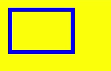
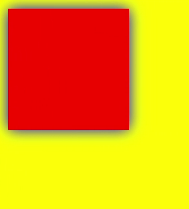
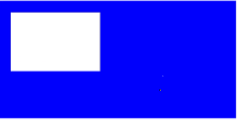
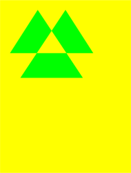
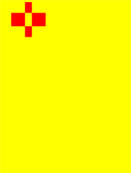
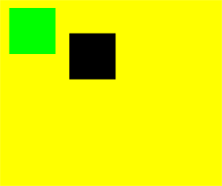

# CanvasRenderingContext2D对象

使用RenderingContext在Canvas组件上进行绘制，绘制对象可以是矩形、文本、图片等。

> **说明：**
>
> 从API Version 8开始支持。后续版本如有新增内容，则采用上角标单独标记该内容的起始版本。


## 接口

CanvasRenderingContext2D(setting: RenderingContextSetting)

**参数：**

| 参数名     | 参数类型                                     | 必填   | 参数描述                                     |
| ------- | ---------------------------------------- | ---- | ---------------------------------------- |
| setting | [RenderingContextSettings](#renderingcontextsettings) | 是    | 见[RenderingContextSettings](#renderingcontextsettings)。 |


### RenderingContextSettings

RenderingContextSettings(antialias?: boolean)

用来配置CanvasRenderingContext2D对象的参数，包括是否开启抗锯齿。

**参数：**

| 参数名       | 参数类型    | 必填   | 参数描述                          |
| --------- | ------- | ---- | ----------------------------- |
| antialias | boolean | 否    | 表明canvas是否开启抗锯齿。<br>默认值：false |


## 属性

| 名称                                                  | 类型                                                         | 描述                                                         |
| ----------------------------------------------------- | ------------------------------------------------------------ | ------------------------------------------------------------ |
| [fillStyle](#fillstyle)                               | string&nbsp;\|&nbsp;[CanvasGradient](ts-components-canvas-canvasgradient.md)&nbsp;\|&nbsp;[CanvasPattern](#canvaspattern) | 指定绘制的填充色。<br/>-&nbsp;类型为string时，表示设置填充区域的颜色。<br/>-&nbsp;类型为CanvasGradient时，表示渐变对象，使用[createLinearGradient](#createlineargradient)方法创建。<br/>-&nbsp;类型为CanvasPattern时，使用[createPattern](#createpattern)方法创建。 |
| [lineWidth](#linewidth)                               | number                                                       | 设置绘制线条的宽度。                                         |
| [strokeStyle](#strokestyle)                           | string&nbsp;\|&nbsp;[CanvasGradient](ts-components-canvas-canvasgradient.md)&nbsp;\|&nbsp;[CanvasPattern](#canvaspattern) | 设置描边的颜色。<br/>-&nbsp;类型为string时，表示设置描边使用的颜色。<br/>-&nbsp;类型为CanvasGradient时，表示渐变对象，使用[createLinearGradient](#createlineargradient)方法创建。<br/>-&nbsp;类型为CanvasPattern时，使用[createPattern](#createpattern)方法创建。 |
| [lineCap](#linecap)                                   | CanvasLineCap                                                | 指定线端点的样式，可选值为：<br/>-&nbsp;'butt'：线端点以方形结束。<br/>-&nbsp;'round'：线端点以圆形结束。<br/>-&nbsp;'square'：线端点以方形结束，该样式下会增加一个长度和线段厚度相同，宽度是线段厚度一半的矩形。<br/>默认值：'butt' |
| [lineJoin](#linejoin)                                 | CanvasLineJoin                                               | 指定线段间相交的交点样式，可选值为：<br/>-&nbsp;'round'：在线段相连处绘制一个扇形，扇形的圆角半径是线段的宽度。<br/>-&nbsp;'bevel'：在线段相连处使用三角形为底填充，&nbsp;每个部分矩形拐角独立。<br/>-&nbsp;'miter'：在相连部分的外边缘处进行延伸，使其相交于一点，形成一个菱形区域，该属性可以通过设置miterLimit属性展现效果。<br/>默认值：'miter' |
| [miterLimit](#miterlimit)                             | number                                                       | 设置斜接面限制值，该值指定了线条相交处内角和外角的距离。  <br/>默认值：10 |
| [font](#font)                                         | string                                                       | 设置文本绘制中的字体样式。<br/>语法：ctx.font='font-size&nbsp;font-family'<br/>-&nbsp;font-size(可选)，指定字号和行高，单位只支持px。<br/>-&nbsp;font-family(可选)，指定字体系列。<br/>语法：ctx.font='font-style&nbsp;font-weight&nbsp;font-size&nbsp;font-family'<br/>-&nbsp;font-style(可选)，用于指定字体样式，支持如下几种样式：'normal','italic'。<br/>-&nbsp;font-weight(可选)，用于指定字体的粗细，支持如下几种类型：'normal',&nbsp;'bold',&nbsp;'bolder',&nbsp;'lighter',&nbsp;100,&nbsp;200,&nbsp;300,&nbsp;400,&nbsp;500,&nbsp;600,&nbsp;700,&nbsp;800,&nbsp;900。<br/>-&nbsp;font-size(可选)，指定字号和行高，单位只支持px。<br/>-&nbsp;font-family(可选)，指定字体系列，支持如下几种类型：'sans-serif',&nbsp;'serif',&nbsp;'monospace'。<br/>默认值：'normal normal 14px sans-serif' |
| [textAlign](#textalign)                               | CanvasTextAlign                                              | 设置文本绘制中的文本对齐方式，可选值为：<br/>-&nbsp;'left'：文本左对齐。<br/>-&nbsp;'right'：文本右对齐。<br/>-&nbsp;'center'：文本居中对齐。<br/>-&nbsp;'start'：文本对齐界线开始的地方。<br/>-&nbsp;'end'：文本对齐界线结束的地方。<br/>ltr布局模式下'start'和'left'一致，rtl布局模式下'start'和'right'一致·。<br/>默认值：'left' |
| [textBaseline](#textbaseline)                         | CanvasTextBaseline                                           | 设置文本绘制中的水平对齐方式，可选值为：<br/>-&nbsp;'alphabetic'：文本基线是标准的字母基线。<br/>-&nbsp;'top'：文本基线在文本块的顶部。<br/>-&nbsp;'hanging'：文本基线是悬挂基线。<br/>-&nbsp;'middle'：文本基线在文本块的中间。<br/>-&nbsp;'ideographic'：文字基线是表意字基线；如果字符本身超出了alphabetic基线，那么ideograhpic基线位置在字符本身的底部。<br/>-&nbsp;'bottom'：文本基线在文本块的底部。&nbsp;与ideographic基线的区别在于ideographic基线不需要考虑下行字母。<br/>默认值：'alphabetic' |
| [globalAlpha](#globalalpha)                           | number                                                       | 设置透明度，0.0为完全透明，1.0为完全不透明。                 |
| [lineDashOffset](#linedashoffset)                     | number                                                       | 设置画布的虚线偏移量，精度为float。    <br/>默认值：0.0      |
| [globalCompositeOperation](#globalcompositeoperation) | string                                                       | 设置合成操作的方式。类型字段可选值有'source-over'，'source-atop'，'source-in'，'source-out'，'destination-over'，'destination-atop'，'destination-in'，'destination-out'，'lighter'，'copy'，'xor'。<br/>默认值：'source-over' |
| [shadowBlur](#shadowblur)                             | number                                                       | 设置绘制阴影时的模糊级别，值越大越模糊，精度为float。   <br/>默认值：0.0 |
| [shadowColor](#shadowcolor)                           | string                                                       | 设置绘制阴影时的阴影颜色。                                   |
| [shadowOffsetX](#shadowoffsetx)                       | number                                                       | 设置绘制阴影时和原有对象的水平偏移值。                       |
| [shadowOffsetY](#shadowoffsety)                       | number                                                       | 设置绘制阴影时和原有对象的垂直偏移值。                       |
| [imageSmoothingEnabled](#imagesmoothingenabled)       | boolean                                                      | 用于设置绘制图片时是否进行图像平滑度调整，true为启用，false为不启用。 <br/>默认值：true |

> **说明：**
>
> fillStyle、shadowColor与 strokeStyle 中string类型格式为 'rgb(255, 255, 255)'，'rgba(255, 255, 255, 1.0)'，'\#FFFFFF'。


### fillStyle

```ts
// xxx.ets
@Entry
@Component
struct FillStyleExample {
  private settings: RenderingContextSettings = new RenderingContextSettings(true)
  private context: CanvasRenderingContext2D = new CanvasRenderingContext2D(this.settings)

  build() {
    Flex({ direction: FlexDirection.Column, alignItems: ItemAlign.Center, justifyContent: FlexAlign.Center }) {
      Canvas(this.context)
        .width('100%')
        .height('100%')
        .backgroundColor('#ffff00')
        .onReady(() =>{
          this.context.fillStyle = '#0000ff'
          this.context.fillRect(20, 160, 150, 100)
        })
    }
    .width('100%')
    .height('100%')
  }
}
```


### lineWidth

```ts
// xxx.ets
@Entry
@Component
struct LineWidthExample {
  private settings: RenderingContextSettings = new RenderingContextSettings(true)
  private context: CanvasRenderingContext2D = new CanvasRenderingContext2D(this.settings)

  build() {
    Flex({ direction: FlexDirection.Column, alignItems: ItemAlign.Center, justifyContent: FlexAlign.Center }) {
      Canvas(this.context)
        .width('100%')
        .height('100%')
        .backgroundColor('#ffff00')
        .onReady(() =>{
        this.context.lineWidth = 5
        this.context.strokeRect(25, 25, 85, 105)
      })
    }
    .width('100%')
    .height('100%')
  }
}
```


### strokeStyle

```ts
// xxx.ets
@Entry
@Component
struct StrokeStyleExample {
  private settings: RenderingContextSettings = new RenderingContextSettings(true)
  private context: CanvasRenderingContext2D = new CanvasRenderingContext2D(this.settings)

  build() {
    Flex({ direction: FlexDirection.Column, alignItems: ItemAlign.Center, justifyContent: FlexAlign.Center }) {
      Canvas(this.context)
        .width('100%')
        .height('100%')
        .backgroundColor('#ffff00')
        .onReady(() =>{
          this.context.lineWidth = 10
          this.context.strokeStyle = '#0000ff'
          this.context.strokeRect(25, 25, 155, 105)
        })
    }
    .width('100%')
    .height('100%')
  }
}
```





### lineCap

```ts
// xxx.ets
@Entry
@Component
struct LineCapExample {
  private settings: RenderingContextSettings = new RenderingContextSettings(true)
  private context: CanvasRenderingContext2D = new CanvasRenderingContext2D(this.settings)

  build() {
    Flex({ direction: FlexDirection.Column, alignItems: ItemAlign.Center, justifyContent: FlexAlign.Center }) {
      Canvas(this.context)
        .width('100%')
        .height('100%')
        .backgroundColor('#ffff00')
        .onReady(() =>{
          this.context.lineWidth = 8
          this.context.beginPath()
          this.context.lineCap = 'round'
          this.context.moveTo(30, 50)
          this.context.lineTo(220, 50)
          this.context.stroke()
        })
    }
    .width('100%')
    .height('100%')
  }
}
```


### lineJoin

```ts
// xxx.ets
@Entry
@Component
struct LineJoinExample {
  private settings: RenderingContextSettings = new RenderingContextSettings(true)
  private context: CanvasRenderingContext2D = new CanvasRenderingContext2D(this.settings)

  build() {
    Flex({ direction: FlexDirection.Column, alignItems: ItemAlign.Center, justifyContent: FlexAlign.Center }) {
      Canvas(this.context)
        .width('100%')
        .height('100%')
        .backgroundColor('#ffff00')
        .onReady(() =>{
        this.context.beginPath()
        this.context.lineWidth = 8
        this.context.lineJoin = 'miter'
        this.context.moveTo(30, 30)
        this.context.lineTo(120, 60)
        this.context.lineTo(30, 110)
        this.context.stroke()
      })
    }
    .width('100%')
    .height('100%')
  }
}
```


### miterLimit

```ts
// xxx.ets
@Entry
@Component
struct MiterLimit {
  private settings: RenderingContextSettings = new RenderingContextSettings(true)
  private context: CanvasRenderingContext2D = new CanvasRenderingContext2D(this.settings)
  
  build() {
    Flex({ direction: FlexDirection.Column, alignItems: ItemAlign.Center, justifyContent: FlexAlign.Center }) {
      Canvas(this.context)
        .width('100%')
        .height('100%')
        .backgroundColor('#ffff00')
        .onReady(() =>{
          this.context.lineWidth = 8
          this.context.lineJoin = 'miter'
          this.context.miterLimit = 3
          this.context.moveTo(30, 30)
          this.context.lineTo(60, 35)
          this.context.lineTo(30, 37)
          this.context.stroke()
      })
    }
    .width('100%')
    .height('100%')
  }
}
```


### font

```ts
// xxx.ets
@Entry
@Component
struct Fonts {
  private settings: RenderingContextSettings = new RenderingContextSettings(true)
  private context: CanvasRenderingContext2D = new CanvasRenderingContext2D(this.settings)
  
  build() {
    Flex({ direction: FlexDirection.Column, alignItems: ItemAlign.Center, justifyContent: FlexAlign.Center }) {
      Canvas(this.context)
        .width('100%')
        .height('100%')
        .backgroundColor('#ffff00')
        .onReady(() =>{
          this.context.font = '30px sans-serif'
          this.context.fillText("Hello World", 20, 60)
      })
    }
    .width('100%')
    .height('100%')
  }
}
```


### textAlign

```ts
// xxx.ets
@Entry
@Component
struct CanvasExample {
  private settings: RenderingContextSettings = new RenderingContextSettings(true)
  private context: CanvasRenderingContext2D = new CanvasRenderingContext2D(this.settings)
  
  build() {
    Flex({ direction: FlexDirection.Column, alignItems: ItemAlign.Center, justifyContent: FlexAlign.Center }) {
      Canvas(this.context)
        .width('100%')
        .height('100%')
        .backgroundColor('#ffff00')
        .onReady(() =>{
        this.context.strokeStyle = '#0000ff'
        this.context.moveTo(140, 10)
        this.context.lineTo(140, 160)
        this.context.stroke()
        this.context.font = '18px sans-serif'
        this.context.textAlign = 'start'
        this.context.fillText('textAlign=start', 140, 60)
        this.context.textAlign = 'end'
        this.context.fillText('textAlign=end', 140, 80)
        this.context.textAlign = 'left'
        this.context.fillText('textAlign=left', 140, 100)
        this.context.textAlign = 'center'
        this.context.fillText('textAlign=center',140, 120)
        this.context.textAlign = 'right'
        this.context.fillText('textAlign=right',140, 140)
      })
    }
    .width('100%')
    .height('100%')
  }
}
```


### textBaseline

```ts
// xxx.ets
@Entry
@Component
struct TextBaseline {
  private settings: RenderingContextSettings = new RenderingContextSettings(true)
  private context: CanvasRenderingContext2D = new CanvasRenderingContext2D(this.settings)
  
  build() {
    Flex({ direction: FlexDirection.Column, alignItems: ItemAlign.Center, justifyContent: FlexAlign.Center }) {
      Canvas(this.context)
        .width('100%')
        .height('100%')
        .backgroundColor('#ffff00')
        .onReady(() =>{
          this.context.strokeStyle = '#0000ff'
          this.context.moveTo(0, 120)
          this.context.lineTo(400, 120)
          this.context.stroke()
          this.context.font = '20px sans-serif'
          this.context.textBaseline = 'top'
          this.context.fillText('Top', 10, 120)
          this.context.textBaseline = 'bottom'
          this.context.fillText('Bottom', 55, 120)
          this.context.textBaseline = 'middle'
          this.context.fillText('Middle', 125, 120)
          this.context.textBaseline = 'alphabetic'
          this.context.fillText('Alphabetic', 195, 120)
          this.context.textBaseline = 'hanging'
          this.context.fillText('Hanging', 295, 120)
      })
    }
    .width('100%')
    .height('100%')
  }
}
```


### globalAlpha

```ts
// xxx.ets
@Entry
@Component
struct GlobalAlpha {
  private settings: RenderingContextSettings = new RenderingContextSettings(true)
  private context: CanvasRenderingContext2D = new CanvasRenderingContext2D(this.settings)
  
  build() {
    Flex({ direction: FlexDirection.Column, alignItems: ItemAlign.Center, justifyContent: FlexAlign.Center }) {
      Canvas(this.context)
        .width('100%')
        .height('100%')
        .backgroundColor('#ffff00')
        .onReady(() =>{
        this.context.fillStyle = 'rgb(255,0,0)'
        this.context.fillRect(0, 0, 50, 50)
        this.context.globalAlpha = 0.4
        this.context.fillStyle = 'rgb(0,0,255)'
        this.context.fillRect(50, 50, 50, 50)
      })
    }
    .width('100%')
    .height('100%')
  }
}
```


### lineDashOffset

```ts
// xxx.ets
@Entry
@Component
struct LineDashOffset {
  private settings: RenderingContextSettings = new RenderingContextSettings(true)
  private context: CanvasRenderingContext2D = new CanvasRenderingContext2D(this.settings)
  
  build() {
    Flex({ direction: FlexDirection.Column, alignItems: ItemAlign.Center, justifyContent: FlexAlign.Center }) {
      Canvas(this.context)
        .width('100%')
        .height('100%')
        .backgroundColor('#ffff00')
        .onReady(() =>{
          this.context.arc(100, 75, 50, 0, 6.28)
          this.context.setLineDash([10,20])
          this.context.lineDashOffset = 10.0
          this.context.stroke()
      })
    }
    .width('100%')
    .height('100%')
  }
}
```


### globalCompositeOperation

| 名称               | 描述                       |
| ---------------- | ------------------------ |
| source-over      | 在现有绘制内容上显示新绘制内容，属于默认值。   |
| source-atop      | 在现有绘制内容顶部显示新绘制内容。        |
| source-in        | 在现有绘制内容中显示新绘制内容。         |
| source-out       | 在现有绘制内容之外显示新绘制内容。        |
| destination-over | 在新绘制内容上方显示现有绘制内容。        |
| destination-atop | 在新绘制内容顶部显示现有绘制内容。        |
| destination-in   | 在新绘制内容中显示现有绘制内容。         |
| destination-out  | 在新绘制内容外显示现有绘制内容。         |
| lighter          | 显示新绘制内容和现有绘制内容。          |
| copy             | 显示新绘制内容而忽略现有绘制内容。        |
| xor              | 使用异或操作对新绘制内容与现有绘制内容进行融合。 |

```ts
// xxx.ets
@Entry
@Component
struct GlobalCompositeOperation {
  private settings: RenderingContextSettings = new RenderingContextSettings(true)
  private context: CanvasRenderingContext2D = new CanvasRenderingContext2D(this.settings)
  
  build() {
    Flex({ direction: FlexDirection.Column, alignItems: ItemAlign.Center, justifyContent: FlexAlign.Center }) {
      Canvas(this.context)
        .width('100%')
        .height('100%')
        .backgroundColor('#ffff00')
        .onReady(() =>{
          this.context.fillStyle = 'rgb(255,0,0)'
          this.context.fillRect(20, 20, 50, 50)
          this.context.globalCompositeOperation = 'source-over'
          this.context.fillStyle = 'rgb(0,0,255)'
          this.context.fillRect(50, 50, 50, 50)
          this.context.fillStyle = 'rgb(255,0,0)'
          this.context.fillRect(120, 20, 50, 50)
          this.context.globalCompositeOperation = 'destination-over'
          this.context.fillStyle = 'rgb(0,0,255)'
          this.context.fillRect(150, 50, 50, 50)
      })
    }
    .width('100%')
    .height('100%')
  }
}
```


### shadowBlur

```ts
// xxx.ets
@Entry
@Component
struct ShadowBlur {
  private settings: RenderingContextSettings = new RenderingContextSettings(true)
  private context: CanvasRenderingContext2D = new CanvasRenderingContext2D(this.settings)
  
  build() {
    Flex({ direction: FlexDirection.Column, alignItems: ItemAlign.Center, justifyContent: FlexAlign.Center }) {
      Canvas(this.context)
        .width('100%')
        .height('100%')
        .backgroundColor('#ffff00')
        .onReady(() =>{
          this.context.shadowBlur = 30
          this.context.shadowColor = 'rgb(0,0,0)'
          this.context.fillStyle = 'rgb(255,0,0)'
          this.context.fillRect(20, 20, 100, 80)
      })
    }
    .width('100%')
    .height('100%')
  }
}
```


### shadowColor

```ts
// xxx.ets
@Entry
@Component
struct ShadowColor {
  private settings: RenderingContextSettings = new RenderingContextSettings(true)
  private context: CanvasRenderingContext2D = new CanvasRenderingContext2D(this.settings)
  
  build() {
    Flex({ direction: FlexDirection.Column, alignItems: ItemAlign.Center, justifyContent: FlexAlign.Center }) {
      Canvas(this.context)
        .width('100%')
        .height('100%')
        .backgroundColor('#ffff00')
        .onReady(() =>{
          this.context.shadowBlur = 30
          this.context.shadowColor = 'rgb(0,0,255)'
          this.context.fillStyle = 'rgb(255,0,0)'
          this.context.fillRect(30, 30, 100, 100)
      })
    }
    .width('100%')
    .height('100%')
  }
}
```




### shadowOffsetX

```ts
// xxx.ets
@Entry
@Component
struct ShadowOffsetX {
  private settings: RenderingContextSettings = new RenderingContextSettings(true)
  private context: CanvasRenderingContext2D = new CanvasRenderingContext2D(this.settings)
  
  build() {
    Flex({ direction: FlexDirection.Column, alignItems: ItemAlign.Center, justifyContent: FlexAlign.Center }) {
      Canvas(this.context)
        .width('100%')
        .height('100%')
        .backgroundColor('#ffff00')
        .onReady(() =>{
          this.context.shadowBlur = 10
          this.context.shadowOffsetX = 20
          this.context.shadowColor = 'rgb(0,0,0)'
          this.context.fillStyle = 'rgb(255,0,0)'
          this.context.fillRect(20, 20, 100, 80)
      })
    }
    .width('100%')
    .height('100%')
  }
}
```


### shadowOffsetY

```ts
// xxx.ets
@Entry
@Component
struct ShadowOffsetY {
  private settings: RenderingContextSettings = new RenderingContextSettings(true)
  private context: CanvasRenderingContext2D = new CanvasRenderingContext2D(this.settings)
  build() {
    Flex({ direction: FlexDirection.Column, alignItems: ItemAlign.Center, justifyContent: FlexAlign.Center }) {
      Canvas(this.context)
        .width('100%')
        .height('100%')
        .backgroundColor('#ffff00')
        .onReady(() =>{
          this.context.shadowBlur = 10
          this.context.shadowOffsetY = 20
          this.context.shadowColor = 'rgb(0,0,0)'
          this.context.fillStyle = 'rgb(255,0,0)'
          this.context.fillRect(30, 30, 100, 100)
      })
    }
    .width('100%')
    .height('100%')
  }
}
```


### imageSmoothingEnabled

```ts
// xxx.ets
@Entry
@Component
struct ImageSmoothingEnabled {
  private settings: RenderingContextSettings = new RenderingContextSettings(true)
  private context: CanvasRenderingContext2D = new CanvasRenderingContext2D(this.settings)
  private img:ImageBitmap = new ImageBitmap("common/images/icon.jpg")
  
  build() {
    Flex({ direction: FlexDirection.Column, alignItems: ItemAlign.Center, justifyContent: FlexAlign.Center }) {
      Canvas(this.context)
        .width('100%')
        .height('100%')
        .backgroundColor('#ffff00')
        .onReady(() =>{
          this.context.imageSmoothingEnabled = false
          this.context.drawImage( this.img,0,0,400,200)
      })
    }
    .width('100%')
    .height('100%')
  }
}
```


## 方法


### fillRect

fillRect(x: number, y: number, w: number, h: number): void

填充一个矩形。

**参数：**

| 参数     | 类型     | 必填   | 默认值  | 说明            |
| ------ | ------ | ---- | ---- | ------------- |
| x      | number | 是    | 0    | 指定矩形左上角点的x坐标。 |
| y      | number | 是    | 0    | 指定矩形左上角点的y坐标。 |
| width  | number | 是    | 0    | 指定矩形的宽度。      |
| height | number | 是    | 0    | 指定矩形的高度。      |

**示例：**

  ```ts
  // xxx.ets
  @Entry
  @Component
  struct FillRect {
    private settings: RenderingContextSettings = new RenderingContextSettings(true)
    private context: CanvasRenderingContext2D = new CanvasRenderingContext2D(this.settings)
    
    build() {
      Flex({ direction: FlexDirection.Column, alignItems: ItemAlign.Center, justifyContent: FlexAlign.Center }) {
        Canvas(this.context)
          .width('100%')
          .height('100%')
          .backgroundColor('#ffff00')
          .onReady(() =>{
            this.context.fillRect(0,30,100,100)
         })
        }
      .width('100%')
      .height('100%')
    }
  }
  ```

  


### strokeRect

strokeRect(x: number, y: number, w: number, h: number): void

绘制具有边框的矩形，矩形内部不填充。

**参数：**

| 参数   | 类型     | 必填   | 默认值  | 说明           |
| ---- | ------ | ---- | ---- | ------------ |
| x    | number | 是    | 0    | 指定矩形的左上角x坐标。 |
| y    | number | 是    | 0    | 指定矩形的左上角y坐标。 |
| w    | number | 是    | 0    | 指定矩形的宽度。     |
| h    | number | 是    | 0    | 指定矩形的高度。     |

**示例：**

  ```ts
  // xxx.ets
  @Entry
  @Component
  struct StrokeRect {
    private settings: RenderingContextSettings = new RenderingContextSettings(true)
    private context: CanvasRenderingContext2D = new CanvasRenderingContext2D(this.settings)

    build() {
      Flex({ direction: FlexDirection.Column, alignItems: ItemAlign.Center, justifyContent: FlexAlign.Center }) {
        Canvas(this.context)
          .width('100%')
          .height('100%')
          .backgroundColor('#ffff00')
          .onReady(() =>{
            this.context.strokeRect(30, 30, 200, 150)
        })
      }
      .width('100%')
      .height('100%')
    }
  }
  ```

  


### clearRect

clearRect(x: number, y: number, w: number, h: number): void

删除指定区域内的绘制内容。

**参数：**

| 参数   | 类型     | 必填   | 默认值  | 描述            |
| ---- | ------ | ---- | ---- | ------------- |
| x    | number | 是    | 0    | 指定矩形上的左上角x坐标。 |
| y    | number | 是    | 0    | 指定矩形上的左上角y坐标。 |
| w    | number | 是    | 0    | 指定矩形的宽度。      |
| h    | number | 是    | 0    | 指定矩形的高度。      |

**示例：**

  ```ts
  // xxx.ets
  @Entry
  @Component
  struct ClearRect {
    private settings: RenderingContextSettings = new RenderingContextSettings(true)
    private context: CanvasRenderingContext2D = new CanvasRenderingContext2D(this.settings)

    build() {
      Flex({ direction: FlexDirection.Column, alignItems: ItemAlign.Center, justifyContent: FlexAlign.Center }) {
        Canvas(this.context)
          .width('100%')
          .height('100%')
          .backgroundColor('#ffffff')
          .onReady(() =>{
            this.context.fillStyle = 'rgb(0,0,255)'
            this.context.fillRect(20,20,200,200)
            this.context.clearRect(30,30,150,100)
        })
      }
      .width('100%')
      .height('100%')
    }
  }
  ```

  


### fillText

fillText(text: string, x: number, y: number, maxWidth?: number): void

绘制填充类文本。

**参数：**

| 参数     | 类型   | 必填 | 默认值 | 说明                          |
| -------- | ------ | ---- | ------ | ----------------------------- |
| text     | string | 是   | ''     | 需要绘制的文本内容。          |
| x        | number | 是   | 0      | 需要绘制的文本的左下角x坐标。 |
| y        | number | 是   | 0      | 需要绘制的文本的左下角y坐标。 |
| maxWidth | number | 否   | -      | 指定文本允许的最大宽度。      |

**示例：**

  ```ts
  // xxx.ets
  @Entry
  @Component
  struct FillText {
    private settings: RenderingContextSettings = new RenderingContextSettings(true)
    private context: CanvasRenderingContext2D = new CanvasRenderingContext2D(this.settings)

    build() {
      Flex({ direction: FlexDirection.Column, alignItems: ItemAlign.Center, justifyContent: FlexAlign.Center }) {
        Canvas(this.context)
          .width('100%')
          .height('100%')
          .backgroundColor('#ffff00')
          .onReady(() =>{
            this.context.font = '30px sans-serif'
            this.context.fillText("Hello World!", 20, 100)
        })
      }
      .width('100%')
      .height('100%')
    }
  }
  ```

  


### strokeText

strokeText(text: string, x: number, y: number, maxWidth?:number): void

绘制描边类文本。

**参数：**

| 参数     | 类型   | 必填 | 默认值 | 描述                          |
| -------- | ------ | ---- | ------ | ----------------------------- |
| text     | string | 是   | ''     | 需要绘制的文本内容。          |
| x        | number | 是   | 0      | 需要绘制的文本的左下角x坐标。 |
| y        | number | 是   | 0      | 需要绘制的文本的左下角y坐标。 |
| maxWidth | number | 否   | -      | 需要绘制的文本的最大宽度 。   |

**示例：**

  ```ts
  // xxx.ets
  @Entry
  @Component
  struct StrokeText {
    private settings: RenderingContextSettings = new RenderingContextSettings(true)
    private context: CanvasRenderingContext2D = new CanvasRenderingContext2D(this.settings)

    build() {
      Flex({ direction: FlexDirection.Column, alignItems: ItemAlign.Center, justifyContent: FlexAlign.Center }) {
        Canvas(this.context)
          .width('100%')
          .height('100%')
          .backgroundColor('#ffff00')
          .onReady(() =>{
            this.context.font = '55px sans-serif'
            this.context.strokeText("Hello World!", 20, 60)
        })
      }
      .width('100%')
      .height('100%')
    }
  }
  ```

  


### measureText

measureText(text: string): TextMetrics

该方法返回一个文本测算的对象，通过该对象可以获取指定文本的宽度值。

**参数：**

| 参数 | 类型   | 必填 | 默认值 | 说明                 |
| ---- | ------ | ---- | ------ | -------------------- |
| text | string | 是   | ''     | 需要进行测量的文本。 |

**返回值：**

| 类型        | 说明             |
| ----------- | ---------------- |
| TextMetrics | 文本的尺寸信息。 |

**TextMetrics类型描述:**

| 属性                       | 类型     | 描述                                       |
| ------------------------ | ------ | ---------------------------------------- |
| width                    | number | 字符串的宽度。                                  |
| height                   | number | 字符串的高度。                                  |
| actualBoundingBoxAscent  | number | 从CanvasRenderingContext2D.textBaseline 属性标明的水平线到渲染文本的矩形边界顶部的距离，当前值为0。 |
| actualBoundingBoxDescent | number | 从CanvasRenderingContext2D.textBaseline 属性标明的水平线到渲染文本的矩形边界底部的距离，当前值为0。 |
| actualBoundingBoxLeft    | number | 平行于基线，从CanvasRenderingContext2D.textAlign 属性确定的对齐点到文本矩形边界左侧的距离，当前值为0。 |
| actualBoundingBoxRight   | number | 平行于基线，从CanvasRenderingContext2D.textAlign 属性确定的对齐点到文本矩形边界右侧的距离，当前值为0。 |
| alphabeticBaseline       | number | 从CanvasRenderingContext2D.textBaseline 属性标明的水平线到线框的 alphabetic 基线的距离，当前值为0。 |
| emHeightAscent           | number | 从CanvasRenderingContext2D.textBaseline 属性标明的水平线到线框中 em 方块顶部的距离，当前值为0。 |
| emHeightDescent          | number | 从CanvasRenderingContext2D.textBaseline 属性标明的水平线到线框中 em 方块底部的距离，当前值为0。 |
| fontBoundingBoxAscent    | number | 从CanvasRenderingContext2D.textBaseline 属性标明的水平线到渲染文本的所有字体的矩形最高边界顶部的距离，当前值为0。 |
| fontBoundingBoxDescent   | number | 从CanvasRenderingContext2D.textBaseline 属性标明的水平线到渲染文本的所有字体的矩形边界最底部的距离，当前值为0。 |
| hangingBaseline          | number | 从CanvasRenderingContext2D.textBaseline 属性标明的水平线到线框的 hanging 基线的距离，当前值为0。 |
| ideographicBaseline      | number | 从CanvasRenderingContext2D.textBaseline 属性标明的水平线到线框的 ideographic 基线的距离，当前值为0。 |

  


**示例：**

  ```ts
  // xxx.ets
  @Entry
  @Component
  struct MeasureText {
    private settings: RenderingContextSettings = new RenderingContextSettings(true)
    private context: CanvasRenderingContext2D = new CanvasRenderingContext2D(this.settings)

    build() {
      Flex({ direction: FlexDirection.Column, alignItems: ItemAlign.Center, justifyContent: FlexAlign.Center }) {
        Canvas(this.context)
          .width('100%')
          .height('100%')
          .backgroundColor('#ffff00')
          .onReady(() =>{
            this.context.font = '50px sans-serif'
            this.context.fillText("Hello World!", 20, 100)
            this.context.fillText("width:" + this.context.measureText("Hello World!").width, 20, 200)
        })
      }
      .width('100%')
      .height('100%')
    }
  }
  ```

  


### stroke

stroke(path?: Path2D): void

进行边框绘制操作。

**参数：**

| 参数   | 类型                                       | 必填   | 默认值  | 描述           |
| ---- | ---------------------------------------- | ---- | ---- | ------------ |
| path | [Path2D](ts-components-canvas-path2d.md) | 否    | null | 需要绘制的Path2D。 |

**示例：**

  ```ts
  // xxx.ets
  @Entry
  @Component
  struct Stroke {
    private settings: RenderingContextSettings = new RenderingContextSettings(true)
    private context: CanvasRenderingContext2D = new CanvasRenderingContext2D(this.settings)

    build() {
      Flex({ direction: FlexDirection.Column, alignItems: ItemAlign.Center, justifyContent: FlexAlign.Center }) {
        Canvas(this.context)
          .width('100%')
          .height('100%')
          .backgroundColor('#ffff00')
          .onReady(() =>{
            this.context.moveTo(25, 25)
            this.context.lineTo(25, 105)
            this.context.lineTo(75, 105)
            this.context.lineTo(75, 25)
            this.context.strokeStyle = 'rgb(0,0,255)'
            this.context.stroke()
          })
      }
      .width('100%')
      .height('100%')
    }
  }
  ```

  


### beginPath

beginPath(): void

创建一个新的绘制路径。

**示例：**

  ```ts
  // xxx.ets
  @Entry
  @Component
  struct BeginPath {
    private settings: RenderingContextSettings = new RenderingContextSettings(true)
    private context: CanvasRenderingContext2D = new CanvasRenderingContext2D(this.settings)

    build() {
      Flex({ direction: FlexDirection.Column, alignItems: ItemAlign.Center, justifyContent: FlexAlign.Center }) {
        Canvas(this.context)
          .width('100%')
          .height('100%')
          .backgroundColor('#ffff00')
          .onReady(() =>{
            this.context.beginPath()
            this.context.lineWidth = 6
            this.context.strokeStyle = '#0000ff'
            this.context.moveTo(15, 80)
            this.context.lineTo(280, 160)
            this.context.stroke()
          })
      }
      .width('100%')
      .height('100%')
    }
  }
  ```

  


### moveTo

moveTo(x: number, y: number): void

路径从当前点移动到指定点。

**参数：**

| 参数   | 类型     | 必填   | 默认值  | 说明        |
| ---- | ------ | ---- | ---- | --------- |
| x    | number | 是    | 0    | 指定位置的x坐标。 |
| y    | number | 是    | 0    | 指定位置的y坐标。 |

**示例：**

  ```ts
  // xxx.ets
  @Entry
  @Component
  struct MoveTo {
    private settings: RenderingContextSettings = new RenderingContextSettings(true)
    private context: CanvasRenderingContext2D = new CanvasRenderingContext2D(this.settings)

    build() {
      Flex({ direction: FlexDirection.Column, alignItems: ItemAlign.Center, justifyContent: FlexAlign.Center }) {
        Canvas(this.context)
          .width('100%')
          .height('100%')
          .backgroundColor('#ffff00')
          .onReady(() =>{
            this.context.beginPath()
            this.context.moveTo(10, 10)
            this.context.lineTo(280, 160)
            this.context.stroke()
          })
      }
      .width('100%')
      .height('100%')
    }
  }
  ```

  


### lineTo

lineTo(x: number, y: number): void

从当前点到指定点进行路径连接。

**参数：**

| 参数   | 类型     | 必填   | 默认值  | 描述        |
| ---- | ------ | ---- | ---- | --------- |
| x    | number | 是    | 0    | 指定位置的x坐标。 |
| y    | number | 是    | 0    | 指定位置的y坐标。 |

**示例：**

  ```ts
  // xxx.ets
  @Entry
  @Component
  struct LineTo {
    private settings: RenderingContextSettings = new RenderingContextSettings(true)
    private context: CanvasRenderingContext2D = new CanvasRenderingContext2D(this.settings)

    build() {
      Flex({ direction: FlexDirection.Column, alignItems: ItemAlign.Center, justifyContent: FlexAlign.Center }) {
        Canvas(this.context)
          .width('100%')
          .height('100%')
          .backgroundColor('#ffff00')
          .onReady(() =>{
            this.context.beginPath()
            this.context.moveTo(10, 10)
            this.context.lineTo(280, 160)
            this.context.stroke()
          })
      }
      .width('100%')
      .height('100%')
    }
  }
  ```

  


### closePath

closePath(): void

结束当前路径形成一个封闭路径。

**示例：**

  ```ts
  // xxx.ets
  @Entry
  @Component
  struct ClosePath {
    private settings: RenderingContextSettings = new RenderingContextSettings(true)
    private context: CanvasRenderingContext2D = new CanvasRenderingContext2D(this.settings)

    build() {
      Flex({ direction: FlexDirection.Column, alignItems: ItemAlign.Center, justifyContent: FlexAlign.Center }) {
        Canvas(this.context)
          .width('100%')
          .height('100%')
          .backgroundColor('#ffff00')
          .onReady(() =>{
              this.context.beginPath()
              this.context.moveTo(30, 30)
              this.context.lineTo(110, 30)
              this.context.lineTo(70, 90)
              this.context.closePath()
              this.context.stroke()
          })
      }
      .width('100%')
      .height('100%')
    }
  }
  ```

  


### createPattern

createPattern(image: ImageBitmap, repetition: string | null): CanvasPattern | null

通过指定图像和重复方式创建图片填充的模板。

**参数：**

| 参数       | 类型                                               | 必填 | 描述                                                         |
| ---------- | -------------------------------------------------- | ---- | ------------------------------------------------------------ |
| image      | [ImageBitmap](ts-components-canvas-imagebitmap.md) | 是   | 图源对象，具体参考ImageBitmap对象。                          |
| repetition | string                                             | 是   | 设置图像重复的方式，取值为：'repeat'、'repeat-x'、&nbsp'repeat-y'、'no-repeat'。<br/>默认值：'' |

**返回值：**：

| 类型                              | 说明                      |
| ------------------------------- | ----------------------- |
| [CanvasPattern](#canvaspattern) | 通过指定图像和重复方式创建图片填充的模板对象。 |

**示例：**

  ```ts
  // xxx.ets
  @Entry
  @Component
  struct CreatePattern {
    private settings: RenderingContextSettings = new RenderingContextSettings(true)
    private context: CanvasRenderingContext2D = new CanvasRenderingContext2D(this.settings)
    private img:ImageBitmap = new ImageBitmap("common/images/icon.jpg")

    build() {
      Flex({ direction: FlexDirection.Column, alignItems: ItemAlign.Center, justifyContent: FlexAlign.Center }) {
        Canvas(this.context)
          .width('100%')
          .height('100%')
          .backgroundColor('#ffff00')
          .onReady(() =>{
            var pattern = this.context.createPattern(this.img, 'repeat')
            this.context.fillStyle = pattern
            this.context.fillRect(0, 0, 200, 200)
          })
      }
      .width('100%')
      .height('100%')
    }
  }
  ```

  


### bezierCurveTo

bezierCurveTo(cp1x: number, cp1y: number, cp2x: number, cp2y: number, x: number, y: number): void

创建三次贝赛尔曲线的路径。

**参数：**

| 参数   | 类型     | 必填   | 默认值  | 描述             |
| ---- | ------ | ---- | ---- | -------------- |
| cp1x | number | 是    | 0    | 第一个贝塞尔参数的x坐标值。 |
| cp1y | number | 是    | 0    | 第一个贝塞尔参数的y坐标值。 |
| cp2x | number | 是    | 0    | 第二个贝塞尔参数的x坐标值。 |
| cp2y | number | 是    | 0    | 第二个贝塞尔参数的y坐标值。 |
| x    | number | 是    | 0    | 路径结束时的x坐标值。    |
| y    | number | 是    | 0    | 路径结束时的y坐标值。    |

**示例：**

  ```ts
  // xxx.ets
  @Entry
  @Component
  struct BezierCurveTo {
    private settings: RenderingContextSettings = new RenderingContextSettings(true)
    private context: CanvasRenderingContext2D = new CanvasRenderingContext2D(this.settings)

    build() {
      Flex({ direction: FlexDirection.Column, alignItems: ItemAlign.Center, justifyContent: FlexAlign.Center }) {
        Canvas(this.context)
          .width('100%')
          .height('100%')
          .backgroundColor('#ffff00')
          .onReady(() =>{
            this.context.beginPath()
            this.context.moveTo(10, 10)
            this.context.bezierCurveTo(20, 100, 200, 100, 200, 20)
            this.context.stroke()
          })
      }
      .width('100%')
      .height('100%')
    }
  }
  ```

  


### quadraticCurveTo

quadraticCurveTo(cpx: number, cpy: number, x: number, y: number): void

创建二次贝赛尔曲线的路径。

**参数：**

| 参数   | 类型     | 必填   | 默认值  | 描述          |
| ---- | ------ | ---- | ---- | ----------- |
| cpx  | number | 是    | 0    | 贝塞尔参数的x坐标值。 |
| cpy  | number | 是    | 0    | 贝塞尔参数的y坐标值。 |
| x    | number | 是    | 0    | 路径结束时的x坐标值。 |
| y    | number | 是    | 0    | 路径结束时的y坐标值。 |

**示例：**

  ```ts
  // xxx.ets
  @Entry
  @Component
  struct QuadraticCurveTo {
    private settings: RenderingContextSettings = new RenderingContextSettings(true)
    private context: CanvasRenderingContext2D = new CanvasRenderingContext2D(this.settings)

    build() {
      Flex({ direction: FlexDirection.Column, alignItems: ItemAlign.Center, justifyContent: FlexAlign.Center }) {
        Canvas(this.context)
          .width('100%')
          .height('100%')
          .backgroundColor('#ffff00')
          .onReady(() =>{
            this.context.beginPath()
            this.context.moveTo(20, 20)
            this.context.quadraticCurveTo(100, 100, 200, 20)
            this.context.stroke()
        })
      }
      .width('100%')
      .height('100%')
    }
  }
  ```

  


### arc

arc(x: number, y: number, radius: number, startAngle: number, endAngle: number, counterclockwise?: boolean): void

绘制弧线路径。

**参数：**

| 参数               | 类型      | 必填   | 默认值   | 描述         |
| ---------------- | ------- | ---- | ----- | ---------- |
| x                | number  | 是    | 0     | 弧线圆心的x坐标值。 |
| y                | number  | 是    | 0     | 弧线圆心的y坐标值。 |
| radius           | number  | 是    | 0     | 弧线的圆半径。    |
| startAngle       | number  | 是    | 0     | 弧线的起始弧度。   |
| endAngle         | number  | 是    | 0     | 弧线的终止弧度。   |
| counterclockwise | boolean | 否    | false | 是否逆时针绘制圆弧。 |

**示例：**

  ```ts
  // xxx.ets
  @Entry
  @Component
  struct Arc {
    private settings: RenderingContextSettings = new RenderingContextSettings(true)
    private context: CanvasRenderingContext2D = new CanvasRenderingContext2D(this.settings)

    build() {
      Flex({ direction: FlexDirection.Column, alignItems: ItemAlign.Center, justifyContent: FlexAlign.Center }) {
        Canvas(this.context)
          .width('100%')
          .height('100%')
          .backgroundColor('#ffff00')
          .onReady(() =>{
            this.context.beginPath()
            this.context.arc(100, 75, 50, 0, 6.28)
            this.context.stroke()
          })
      }
      .width('100%')
      .height('100%')
    }
  }
  ```

  


### arcTo

arcTo(x1: number, y1: number, x2: number, y2: number, radius: number): void

依据圆弧经过的点和圆弧半径创建圆弧路径。

**参数：**

| 参数     | 类型     | 必填   | 默认值  | 描述              |
| ------ | ------ | ---- | ---- | --------------- |
| x1     | number | 是    | 0    | 圆弧经过的第一个点的x坐标值。 |
| y1     | number | 是    | 0    | 圆弧经过的第一个点的y坐标值。 |
| x2     | number | 是    | 0    | 圆弧经过的第二个点的x坐标值。 |
| y2     | number | 是    | 0    | 圆弧经过的第二个点的y坐标值。 |
| radius | number | 是    | 0    | 圆弧的圆半径值。        |

**示例：**

  ```ts
  // xxx.ets
  @Entry
  @Component
  struct ArcTo {
    private settings: RenderingContextSettings = new RenderingContextSettings(true)
    private context: CanvasRenderingContext2D = new CanvasRenderingContext2D(this.settings)

    build() {
      Flex({ direction: FlexDirection.Column, alignItems: ItemAlign.Center, justifyContent: FlexAlign.Center }) {
        Canvas(this.context)
          .width('100%')
          .height('100%')
          .backgroundColor('#ffff00')
          .onReady(() =>{
            this.context.moveTo(100, 20)
            this.context.arcTo(150, 20, 150, 70, 50)
            this.context.stroke()
          })
      }
      .width('100%')
      .height('100%')
    }
  }
  ```

  


### ellipse

ellipse(x: number, y: number, radiusX: number, radiusY: number, rotation: number, startAngle: number, endAngle: number, counterclockwise?: boolean): void

在规定的矩形区域绘制一个椭圆。

**参数：**

| 参数               | 类型      | 必填   | 默认值   | 说明                |
| ---------------- | ------- | ---- | ----- | ----------------- |
| x                | number  | 是    | 0     | 椭圆圆心的x轴坐标。        |
| y                | number  | 是    | 0     | 椭圆圆心的y轴坐标。        |
| radiusX          | number  | 是    | 0     | 椭圆x轴的半径长度。        |
| radiusY          | number  | 是    | 0     | 椭圆y轴的半径长度。        |
| rotation         | number  | 是    | 0     | 椭圆的旋转角度，单位为弧度。    |
| startAngle       | number  | 是    | 0     | 椭圆绘制的起始点角度，以弧度表示。 |
| endAngle         | number  | 是    | 0     | 椭圆绘制的结束点角度，以弧度表示。 |
| counterclockwise | boolean | 否    | false | 是否以逆时针方向绘制椭圆。<br>true:逆时针方向绘制椭圆。<br>false:顺时针方向绘制椭圆。     |

**示例：**

  ```ts
  // xxx.ets
  @Entry
  @Component
  struct CanvasExample {
    private settings: RenderingContextSettings = new RenderingContextSettings(true)
    private context: CanvasRenderingContext2D = new CanvasRenderingContext2D(this.settings)

    build() {
      Flex({ direction: FlexDirection.Column, alignItems: ItemAlign.Center, justifyContent: FlexAlign.Center }) {
        Canvas(this.context)
          .width('100%')
          .height('100%')
          .backgroundColor('#ffff00')
          .onReady(() =>{
            this.context.beginPath()
            this.context.ellipse(200, 200, 50, 100, Math.PI * 0.25, Math.PI * 0.5, Math.PI * 2)
            this.context.stroke()
          })
      }
      .width('100%')
      .height('100%')
    }
  }
  ```

  


### rect

rect(x: number, y: number, w: number, h: number): void

创建矩形路径。

**参数：**

| 参数   | 类型     | 必填   | 默认值  | 描述            |
| ---- | ------ | ---- | ---- | ------------- |
| x    | number | 是    | 0    | 指定矩形的左上角x坐标值。 |
| y    | number | 是    | 0    | 指定矩形的左上角y坐标值。 |
| w    | number | 是    | 0    | 指定矩形的宽度。      |
| h    | number | 是    | 0    | 指定矩形的高度。      |

**示例：**

  ```ts
  // xxx.ets
  @Entry
  @Component
  struct CanvasExample {
    private settings: RenderingContextSettings = new RenderingContextSettings(true)
    private context: CanvasRenderingContext2D = new CanvasRenderingContext2D(this.settings)

    build() {
      Flex({ direction: FlexDirection.Column, alignItems: ItemAlign.Center, justifyContent: FlexAlign.Center }) {
        Canvas(this.context)
          .width('100%')
          .height('100%')
          .backgroundColor('#ffff00')
          .onReady(() =>{
            this.context.rect(20, 20, 100, 100) // Create a 100*100 rectangle at (20, 20)
            this.context.stroke()
          })
      }
      .width('100%')
      .height('100%')
    }
  }
  ```

  


### fill

fill(fillRule?: CanvasFillRule): void

对封闭路径进行填充。

**参数:** 

| 参数       | 类型             | 必填   | 默认值       | 描述                                       |
| -------- | -------------- | ---- | --------- | ---------------------------------------- |
| fillRule | CanvasFillRule | 否    | "nonzero" | 指定要填充对象的规则。<br/>可选参数为："nonzero", "evenodd"。 |


**示例:**   

  ```ts
  // xxx.ets
  @Entry
  @Component
  struct Fill {
    private settings: RenderingContextSettings = new RenderingContextSettings(true)
    private context: CanvasRenderingContext2D = new CanvasRenderingContext2D(this.settings)

    build() {
      Flex({ direction: FlexDirection.Column, alignItems: ItemAlign.Center, justifyContent: FlexAlign.Center }) {
        Canvas(this.context)
          .width('100%')
          .height('100%')
          .backgroundColor('#ffff00')
          .onReady(() =>{
            this.context.rect(20, 20, 100, 100) // Create a 100*100 rectangle at (20, 20)
            this.context.fill()
          })
      }
      .width('100%')
      .height('100%')
    }
  }
  ```

  


fill(path: Path2D, fillRule?: CanvasFillRule): void

对封闭路径进行填充。

**参数:** 

| 参数       | 类型             | 必填   | 默认值       | 描述                                       |
| -------- | -------------- | ---- | --------- | ---------------------------------------- |
| path     | Path2D         | 是    |           | Path2D填充路径。                              |
| fillRule | CanvasFillRule | 否    | "nonzero" | 指定要填充对象的规则。<br/>可选参数为："nonzero", "evenodd"。 |


**示例:**   

```ts
// xxx.ets
@Entry
@Component
struct Fill {
  private settings: RenderingContextSettings = new RenderingContextSettings(true)
  private context: CanvasRenderingContext2D = new CanvasRenderingContext2D(this.settings)

  build() {
    Flex({ direction: FlexDirection.Column, alignItems: ItemAlign.Center, justifyContent: FlexAlign.Center }) {
      Canvas(this.context)
        .width('100%')
        .height('100%')
        .backgroundColor('#ffff00')
        .onReady(() =>{
          let region = new Path2D()
          region.moveTo(30, 90)
          region.lineTo(110, 20)
          region.lineTo(240, 130)
          region.lineTo(60, 130)
          region.lineTo(190, 20)
          region.lineTo(270, 90)
          region.closePath()
          // Fill path
          this.context.fillStyle = 'green'
          this.context.fill(region, "evenodd")
        })
    }
    .width('100%')
    .height('100%')
  }
}
```

 


### clip

clip(fillRule?: CanvasFillRule): void

设置当前路径为剪切路径。

**参数:** 

| 参数       | 类型             | 必填   | 默认值       | 描述                                       |
| -------- | -------------- | ---- | --------- | ---------------------------------------- |
| fillRule | CanvasFillRule | 否    | "nonzero" | 指定要剪切对象的规则。<br/>可选参数为："nonzero", "evenodd"。 |

**示例:** 

  ```ts
  // xxx.ets
  @Entry
  @Component
  struct Clip {
    private settings: RenderingContextSettings = new RenderingContextSettings(true)
    private context: CanvasRenderingContext2D = new CanvasRenderingContext2D(this.settings)

    build() {
      Flex({ direction: FlexDirection.Column, alignItems: ItemAlign.Center, justifyContent: FlexAlign.Center }) {
        Canvas(this.context)
          .width('100%')
          .height('100%')
          .backgroundColor('#ffff00')
          .onReady(() =>{
            this.context.rect(0, 0, 100, 200)
            this.context.stroke()
            this.context.clip()
            this.context.fillStyle = "rgb(255,0,0)"
            this.context.fillRect(0, 0, 200, 200)
          })
      }
      .width('100%')
      .height('100%')
    }
  }
  ```

  


clip(path: Path2D, fillRule?: CanvasFillRule): void

设置当前路径为剪切路径

**参数:** 

| 参数       | 类型             | 必填   | 默认值       | 描述                                       |
| -------- | -------------- | ---- | --------- | ---------------------------------------- |
| path     | Path2D         | 是    | -         | Path2D剪切路径。                              |
| fillRule | CanvasFillRule | 否    | "nonzero" | 指定要剪切对象的规则。<br/>可选参数为："nonzero", "evenodd"。 |


**示例:** 

  ```ts
  // xxx.ets
@Entry
@Component
struct Clip {
  private settings: RenderingContextSettings = new RenderingContextSettings(true)
  private context: CanvasRenderingContext2D = new CanvasRenderingContext2D(this.settings)
  build() {
    Flex({ direction: FlexDirection.Column, alignItems: ItemAlign.Center, justifyContent: FlexAlign.Center }) {
      Canvas(this.context)
        .width('100%')
        .height('100%')
        .backgroundColor('#ffff00')
        .onReady(() =>{
          let region = new Path2D()
          region.rect(80,10,20,130)
          region.rect(40,50,100,50)
          this.context.clip(region,"evenodd")
          this.context.fillStyle = "rgb(255,0,0)"
          this.context.fillRect(0, 0, this.context.width, this.context.height)
        })
    }
    .width('100%')
    .height('100%')
  }
}
  ```

  


### filter

filter(filter: string): void

为Canvas图形设置各类滤镜效果。该接口为空接口。

**参数:**

| 参数     | 类型     | 必填   | 默认值  | 说明           |
| ------ | ------ | ---- | ---- | ------------ |
| filter | string | 是    | -    | 接受各类滤镜效果的函数。 |


### getTransform

getTransform(): Matrix2D

获取当前被应用到上下文的转换矩阵。该接口为空接口。


### resetTransform

resetTransform(): void

使用单位矩阵重新设置当前变形。该接口为空接口。


### direction

direction(direction: CanvasDirection): void

绘制文本时，描述当前文本方向的属性。该接口为空接口。


### rotate

rotate(angle: number): void

针对当前坐标轴进行顺时针旋转。

**参数：**

| 参数    | 类型     | 必填   | 默认值  | 描述                                       |
| ----- | ------ | ---- | ---- | ---------------------------------------- |
| angle | number | 是    | 0    | 设置顺时针旋转的弧度值，可以通过Math.PI&nbsp;/&nbsp;180将角度转换为弧度值。 |

**示例：**

  ```ts
  // xxx.ets
  @Entry
  @Component
  struct Rotate {
    private settings: RenderingContextSettings = new RenderingContextSettings(true)
    private context: CanvasRenderingContext2D = new CanvasRenderingContext2D(this.settings)

    build() {
      Flex({ direction: FlexDirection.Column, alignItems: ItemAlign.Center, justifyContent: FlexAlign.Center }) {
        Canvas(this.context)
          .width('100%')
          .height('100%')
          .backgroundColor('#ffff00')
          .onReady(() =>{
            this.context.rotate(45 * Math.PI / 180)
            this.context.fillRect(70, 20, 50, 50)
          })
      }
      .width('100%')
      .height('100%')
    }
  }
  ```

  


### scale

scale(x: number, y: number): void

设置canvas画布的缩放变换属性，后续的绘制操作将按照缩放比例进行缩放。

**参数：**

| 参数   | 类型     | 必填   | 默认值  | 描述          |
| ---- | ------ | ---- | ---- | ----------- |
| x    | number | 是    | 0    | 设置水平方向的缩放值。 |
| y    | number | 是    | 0    | 设置垂直方向的缩放值。 |

**示例：**

  ```ts
  // xxx.ets
  @Entry
  @Component
  struct Scale {
    private settings: RenderingContextSettings = new RenderingContextSettings(true)
    private context: CanvasRenderingContext2D = new CanvasRenderingContext2D(this.settings)

    build() {
      Flex({ direction: FlexDirection.Column, alignItems: ItemAlign.Center, justifyContent: FlexAlign.Center }) {
        Canvas(this.context)
          .width('100%')
          .height('100%')
          .backgroundColor('#ffff00')
          .onReady(() =>{
            this.context.lineWidth = 3
            this.context.strokeRect(30, 30, 50, 50)
            this.context.scale(2, 2) // Scale to 200%
            this.context.strokeRect(30, 30, 50, 50)
          })
      }
      .width('100%')
      .height('100%')
    }
  }
  ```

  


### transform

transform(a: number, b: number, c: number, d: number, e: number, f: number): void

transform方法对应一个变换矩阵，想对一个图形进行变化的时候，只要设置此变换矩阵相应的参数，对图形的各个定点的坐标分别乘以这个矩阵，就能得到新的定点的坐标。矩阵变换效果可叠加。

>  **说明：**
> 变换后的坐标计算方式（x和y为变换前坐标，x'和y'为变换后坐标）：
>
> - x' = scaleX \* x + skewY \* y + translateX
>
> - y' = skewX \* x + scaleY \* y + translateY

**参数：**

| 参数   | 类型     | 必填   | 默认值  | 描述                   |
| ---- | ------ | ---- | ---- | -------------------- |
| a    | number | 是    | 0    | scaleX: 指定水平缩放值。     |
| b    | number | 是    | 0    | skewX: 指定水平倾斜值。      |
| c    | number | 是    | 0    | skewY: 指定垂直倾斜值。      |
| d    | number | 是    | 0    | scaleY: 指定垂直缩放值。     |
| e    | number | 是    | 0    | translateX: 指定水平移动值。 |
| f    | number | 是    | 0    | translateY: 指定垂直移动值。 |

**示例：**

  ```ts
  // xxx.ets
  @Entry
  @Component
  struct Transform {
    private settings: RenderingContextSettings = new RenderingContextSettings(true)
    private context: CanvasRenderingContext2D = new CanvasRenderingContext2D(this.settings)

    build() {
      Flex({ direction: FlexDirection.Column, alignItems: ItemAlign.Center, justifyContent: FlexAlign.Center }) {
        Canvas(this.context)
          .width('100%')
          .height('100%')
          .backgroundColor('#ffff00')
          .onReady(() =>{
            this.context.fillStyle = 'rgb(0,0,0)'
            this.context.fillRect(0, 0, 100, 100)
            this.context.transform(1, 0.5, -0.5, 1, 10, 10)
            this.context.fillStyle = 'rgb(255,0,0)'
            this.context.fillRect(0, 0, 100, 100)
            this.context.transform(1, 0.5, -0.5, 1, 10, 10)
            this.context.fillStyle = 'rgb(0,0,255)'
            this.context.fillRect(0, 0, 100, 100)
          })
      }
      .width('100%')
      .height('100%')
    }
  }
  ```

  


### setTransform

setTransform(a: number, b: number, c: number, d: number, e: number, f: number): void

setTransform方法使用的参数和transform()方法相同，但setTransform()方法会重置现有的变换矩阵并创建新的变换矩阵。

**参数：**

| 参数   | 类型     | 必填   | 默认值  | 描述                   |
| ---- | ------ | ---- | ---- | -------------------- |
| a    | number | 是    | 0    | scaleX: 指定水平缩放值。     |
| b    | number | 是    | 0    | skewX: 指定水平倾斜值。      |
| c    | number | 是    | 0    | skewY: 指定垂直倾斜值。      |
| d    | number | 是    | 0    | scaleY: 指定垂直缩放值。     |
| e    | number | 是    | 0    | translateX: 指定水平移动值。 |
| f    | number | 是    | 0    | translateY: 指定垂直移动值。 |

**示例：**

  ```ts
  // xxx.ets
  @Entry
  @Component
  struct SetTransform {
    private settings: RenderingContextSettings = new RenderingContextSettings(true)
    private context: CanvasRenderingContext2D = new CanvasRenderingContext2D(this.settings)

    build() {
      Flex({ direction: FlexDirection.Column, alignItems: ItemAlign.Center, justifyContent: FlexAlign.Center }) {
        Canvas(this.context)
          .width('100%')
          .height('100%')
          .backgroundColor('#ffff00')
          .onReady(() =>{
            this.context.fillStyle = 'rgb(255,0,0)'
            this.context.fillRect(0, 0, 100, 100)
            this.context.setTransform(1,0.5, -0.5, 1, 10, 10)
            this.context.fillStyle = 'rgb(0,0,255)'
            this.context.fillRect(0, 0, 100, 100)
          })
      }
      .width('100%')
      .height('100%')
    }
  }
  ```

  


setTransform(transform?: Matrix2D): void

以Matrix2D对象为模板重置现有的变换矩阵并创建新的变换矩阵。该接口为空接口。


### translate

translate(x: number, y: number): void

移动当前坐标系的原点。

**参数：**

| 参数   | 类型     | 必填   | 默认值  | 描述       |
| ---- | ------ | ---- | ---- | -------- |
| x    | number | 是    | 0    | 设置水平平移量。 |
| y    | number | 是    | 0    | 设置竖直平移量。 |

**示例：**

  ```ts
  // xxx.ets
  @Entry
  @Component
  struct Translate {
    private settings: RenderingContextSettings = new RenderingContextSettings(true)
    private context: CanvasRenderingContext2D = new CanvasRenderingContext2D(this.settings)

    build() {
      Flex({ direction: FlexDirection.Column, alignItems: ItemAlign.Center, justifyContent: FlexAlign.Center }) {
        Canvas(this.context)
          .width('100%')
          .height('100%')
          .backgroundColor('#ffff00')
          .onReady(() =>{
            this.context.fillRect(10, 10, 50, 50)
            this.context.translate(70, 70)
            this.context.fillRect(10, 10, 50, 50)
          })
      }
      .width('100%')
      .height('100%')
    }
  }
  ```

  


### drawImage

drawImage(image: ImageBitmap | PixelMap, dx: number, dy: number): void

drawImage(image: ImageBitmap | PixelMap, dx: number, dy: number, dw: number, dh: number): void

drawImage(image: ImageBitmap | PixelMap, sx: number, sy: number, sw: number, sh: number, dx: number, dy: number, dw: number, dh: number):void

进行图像绘制。

**参数：**

| 参数    | 类型                                       | 必填   | 默认值  | 描述                                       |
| ----- | ---------------------------------------- | ---- | ---- | ---------------------------------------- |
| image | [ImageBitmap](ts-components-canvas-imagebitmap.md)或[PixelMap](../apis/js-apis-image.md#pixelmap7) | 是    | null | 图片资源，请参考ImageBitmap或PixelMap。            |
| sx    | number                                   | 否    | 0    | 裁切源图像时距离源图像左上角的x坐标值。                     |
| sy    | number                                   | 否    | 0    | 裁切源图像时距离源图像左上角的y坐标值。                     |
| sw    | number                                   | 否    | 0    | 裁切源图像时需要裁切的宽度。                           |
| sh    | number                                   | 否    | 0    | 裁切源图像时需要裁切的高度。                           |
| dx    | number                                   | 是    | 0    | 绘制区域左上角在x轴的位置。                           |
| dy    | number                                   | 是    | 0    | 绘制区域左上角在y&nbsp;轴的位置。                     |
| dw    | number                                   | 否    | 0    | 绘制区域的宽度。当绘制区域的宽度和裁剪图像的宽度不一致时，将图像宽度拉伸或压缩为绘制区域的宽度。 |
| dh    | number                                   | 否    | 0    | 绘制区域的高度。当绘制区域的高度和裁剪图像的高度不一致时，将图像高度拉伸或压缩为绘制区域的高度。 |


**示例：**

  ```ts
  // xxx.ets
  @Entry
  @Component
  struct ImageExample {
    private settings: RenderingContextSettings = new RenderingContextSettings(true)
    private context: CanvasRenderingContext2D = new CanvasRenderingContext2D(this.settings)
    private img:ImageBitmap = new ImageBitmap("common/images/example.jpg")

    build() {
      Flex({ direction: FlexDirection.Column, alignItems: ItemAlign.Center, justifyContent: FlexAlign.Center }) {
        Canvas(this.context)
          .width('100%')
          .height('100%')
          .backgroundColor('#ffff00')
          .onReady(() =>{
            this.context.drawImage( this.img,0,0,500,500,0,0,400,200)
        })
      }
      .width('100%')
      .height('100%')
    }
  }
  ```

  


### createImageData

createImageData(sw: number, sh: number): ImageData

创建新的ImageData 对象，请参考[ImageData](ts-components-canvas-imagedata.md)。

**参数：**

| 参数   | 类型     | 必填   | 默认   | 描述            |
| ---- | ------ | ---- | ---- | ------------- |
| sw   | number | 是    | 0    | ImageData的宽度。 |
| sh   | number | 是    | 0    | ImageData的高度。 |


createImageData(imageData: ImageData): ImageData

创建新的ImageData 对象，请参考[ImageData](ts-components-canvas-imagedata.md)。

**参数：**

| 参数        | 类型                                       | 必填   | 默认   | 描述                |
| --------- | ---------------------------------------- | ---- | ---- | ----------------- |
| imagedata | [ImageData](ts-components-canvas-imagedata.md) | 是    | null | 复制现有的ImageData对象。 |

  **返回值：**

| 类型                                       | 说明             |
| ---------------------------------------- | -------------- |
| [ImageData](ts-components-canvas-imagedata.md) | 新的ImageData对象。 |


### getPixelMap

getPixelMap(sx: number, sy: number, sw: number, sh: number): PixelMap

以当前canvas指定区域内的像素创建[PixelMap](../apis/js-apis-image.md#pixelmap7)对象。

**参数：**

| 参数   | 类型     | 必填   | 默认值  | 描述              |
| ---- | ------ | ---- | ---- | --------------- |
| sx   | number | 是    | 0    | 需要输出的区域的左上角x坐标。 |
| sy   | number | 是    | 0    | 需要输出的区域的左上角y坐标。 |
| sw   | number | 是    | 0    | 需要输出的区域的宽度。     |
| sh   | number | 是    | 0    | 需要输出的区域的高度。     |

**返回值：**

| 类型                                       | 说明            |
| ---------------------------------------- | ------------- |
| [PixelMap](../apis/js-apis-image.md#pixelmap7) | 新的PixelMap对象。 |

### getImageData

getImageData(sx: number, sy: number, sw: number, sh: number): ImageData

以当前canvas指定区域内的像素创建[ImageData](ts-components-canvas-imagedata.md)对象。

**参数：**

| 参数   | 类型     | 必填   | 默认值  | 描述              |
| ---- | ------ | ---- | ---- | --------------- |
| sx   | number | 是    | 0    | 需要输出的区域的左上角x坐标。 |
| sy   | number | 是    | 0    | 需要输出的区域的左上角y坐标。 |
| sw   | number | 是    | 0    | 需要输出的区域的宽度。     |
| sh   | number | 是    | 0    | 需要输出的区域的高度。     |

  **返回值：**

| 类型                                       | 说明             |
| ---------------------------------------- | -------------- |
| [ImageData](ts-components-canvas-imagedata.md) | 新的ImageData对象。 |


**示例：**

  ```ts
  // xxx.ets
@Entry
@Component
struct GetImageData {
  private settings: RenderingContextSettings = new RenderingContextSettings(true)
  private context: CanvasRenderingContext2D = new CanvasRenderingContext2D(this.settings)
  private img:ImageBitmap = new ImageBitmap("/common/images/1234.png")

  build() {
    Flex({ direction: FlexDirection.Column, alignItems: ItemAlign.Center, justifyContent: FlexAlign.Center }) {
      Canvas(this.context)
        .width('100%')
        .height('100%')
        .backgroundColor('#ffff00')
        .onReady(() =>{
          this.context.drawImage(this.img,0,0,130,130)
          var imagedata = this.context.getImageData(50,50,130,130)
          this.context.putImageData(imagedata,150,150)
        })
    }
    .width('100%')
    .height('100%')
  }
}
  ```

  


### putImageData

putImageData(imageData: ImageData, dx: number, dy: number): void

putImageData(imageData: ImageData, dx: number, dy: number, dirtyX: number, dirtyY: number, dirtyWidth: number, dirtyHeight: number): void

使用[ImageData](ts-components-canvas-imagedata.md)数据填充新的矩形区域。

**参数：**

| 参数          | 类型                                       | 必填   | 默认值          | 描述                            |
| ----------- | ---------------------------------------- | ---- | ------------ | ----------------------------- |
| imagedata   | [ImageData](ts-components-canvas-imagedata.md) | 是    | null         | 包含像素值的ImageData对象。            |
| dx          | number                                   | 是    | 0            | 填充区域在x轴方向的偏移量。                |
| dy          | number                                   | 是    | 0            | 填充区域在y轴方向的偏移量。                |
| dirtyX      | number                                   | 否    | 0            | 源图像数据矩形裁切范围左上角距离源图像左上角的x轴偏移量。 |
| dirtyY      | number                                   | 否    | 0            | 源图像数据矩形裁切范围左上角距离源图像左上角的y轴偏移量。 |
| dirtyWidth  | number                                   | 否    | imagedata的宽度 | 源图像数据矩形裁切范围的宽度。               |
| dirtyHeight | number                                   | 否    | imagedata的高度 | 源图像数据矩形裁切范围的高度。               |

**示例：**

  ```ts
  // xxx.ets
  @Entry
  @Component
  struct PutImageData {
    private settings: RenderingContextSettings = new RenderingContextSettings(true)
    private context: CanvasRenderingContext2D = new CanvasRenderingContext2D(this.settings)

    build() {
      Flex({ direction: FlexDirection.Column, alignItems: ItemAlign.Center, justifyContent: FlexAlign.Center }) {
        Canvas(this.context)
          .width('100%')
          .height('100%')
          .backgroundColor('#ffff00')
          .onReady(() =>{
            var imageData = this.context.createImageData(100, 100)
            for (var i = 0; i < imageData.data.length; i += 4) {
              imageData.data[i + 0] = 255
              imageData.data[i + 1] = 0
              imageData.data[i + 2] = 255
              imageData.data[i + 3] = 255
            }
            this.context.putImageData(imageData, 10, 10)
          })
      }
      .width('100%')
      .height('100%')
    }
  }
  ```

  


### setLineDash

setLineDash(segments: number[]): void

设置画布的虚线样式。

**参数：** 

| 参数       | 类型       | 描述                  |
| -------- | -------- | ------------------- |
| segments | number[] | 描述线段如何交替和线段间距长度的数组。 |

**示例：** 

  ```ts
  // xxx.ets
  @Entry
  @Component
  struct SetLineDash {
    private settings: RenderingContextSettings = new RenderingContextSettings(true)
    private context: CanvasRenderingContext2D = new CanvasRenderingContext2D(this.settings)
    
    build() {
      Flex({ direction: FlexDirection.Column, alignItems: ItemAlign.Center, justifyContent: FlexAlign.Center }) {
        Canvas(this.context)
          .width('100%')
          .height('100%')
          .backgroundColor('#ffff00')
          .onReady(() =>{
            this.context.arc(100, 75, 50, 0, 6.28)
            this.context.setLineDash([10,20])
            this.context.stroke()
          })
      }
      .width('100%')
      .height('100%')
    }
  }
  ```

  


### getLineDash

getLineDash(): number[]

获得当前画布的虚线样式。

**返回值：** 

| 类型       | 说明                       |
| -------- | ------------------------ |
| number[] | 返回数组，该数组用来描述线段如何交替和间距长度。 |


**示例：** 

  ```ts
  // xxx.ets
@Entry
@Component
struct CanvasGetLineDash {
  @State message: string = 'Hello World'
  private settings: RenderingContextSettings = new RenderingContextSettings(true)
  private context: CanvasRenderingContext2D = new CanvasRenderingContext2D(this.settings)

  build() {
    Row() {
      Column() {
        Text(this.message)
          .fontSize(50)
          .fontWeight(FontWeight.Bold)
          .onClick(()=>{
            console.error('before getlinedash clicked')
            let res = this.context.getLineDash()
            console.error(JSON.stringify(res))
          })
        Canvas(this.context)
          .width('100%')
          .height('100%')
          .backgroundColor('#ffff00')
          .onReady(() => {
            this.context.arc(100, 75, 50, 0, 6.28)
            this.context.setLineDash([10,20])
            this.context.stroke()
            let res = this.context.getLineDash()
          })
      }
      .width('100%')
    }
    .height('100%')
  }
}
  ```
 


### imageSmoothingQuality

imageSmoothingQuality(quality: imageSmoothingQuality)

用于设置图像平滑度。该接口为空接口。

 **参数：** 

| 参数      | 类型                    | 描述                                       |
| ------- | --------------------- | ---------------------------------------- |
| quality | imageSmoothingQuality | 支持如下三种类型：'low',&nbsp;'medium',&nbsp;'high'。 |


### transferFromImageBitmap

transferFromImageBitmap(bitmap: ImageBitmap): void

显示给定的ImageBitmap对象。

**参数：** 

| 参数     | 类型                                       | 描述                 |
| ------ | ---------------------------------------- | ------------------ |
| bitmap | [ImageBitmap](ts-components-canvas-imagebitmap.md) | 待显示的ImageBitmap对象。 |

**示例：** 

  ```ts
  // xxx.ets
  @Entry
  @Component
  struct TransferFromImageBitmap {
    private settings: RenderingContextSettings = new RenderingContextSettings(true)
    private context: CanvasRenderingContext2D = new CanvasRenderingContext2D(this.settings)
    private offContext: OffscreenCanvasRenderingContext2D = new OffscreenCanvasRenderingContext2D(600, 600, this.settings)

    build() {
      Flex({ direction: FlexDirection.Column, alignItems: ItemAlign.Center, justifyContent: FlexAlign.Center }) {
        Canvas(this.context)
          .width('100%')
          .height('100%')
          .backgroundColor('#ffff00')
          .onReady(() =>{
            var imageData = this.offContext.createImageData(100, 100)
            for (var i = 0; i < imageData.data.length; i += 4) {
              imageData.data[i + 0] = 255
              imageData.data[i + 1] = 0
              imageData.data[i + 2] = 255
              imageData.data[i + 3] = 255
            }
            this.offContext.putImageData(imageData, 10, 10)
            var image = this.offContext.transferToImageBitmap()
            this.context.transferFromImageBitmap(image)
          })
      }
      .width('100%')
      .height('100%')
    }
  }
  ```
    


### toDataURL

toDataURL(type?: string, quality?: number): string

生成一个包含图片展示的URL。

**参数：** 

| 参数名     | 参数类型   | 必填   | 描述                                       |
| ------- | ------ | ---- | ---------------------------------------- |
| type    | string | 否    | 可选参数，用于指定图像格式，默认格式为image/png。            |
| quality | number | 否    | 在指定图片格式为image/jpeg或image/webp的情况下，可以从0到1的区间内选择图片的质量。如果超出取值范围，将会使用默认值0.92。 |

**返回值：** 

| 类型     | 说明        |
| ------ | --------- |
| string | 图像的URL地址。 |

**示例：**

  ```ts
  // xxx.ets
@Entry
@Component
struct ToDataURL {
  private settings: RenderingContextSettings = new RenderingContextSettings(true)
  private context: CanvasRenderingContext2D = new CanvasRenderingContext2D(this.settings)

  build() {
    Flex({ direction: FlexDirection.Column, alignItems: ItemAlign.Center, justifyContent: FlexAlign.Center }) {
      Canvas(this.context)
        .width('100%')
        .height('100%')
        .backgroundColor('#ffff00')
        .onReady(() =>{
          var dataURL = this.context.toDataURL()
        })
    }
    .width('100%')
    .height('100%')
  }
}
  ```


### restore

restore(): void

对保存的绘图上下文进行恢复。

**示例：**

  ```ts
  // xxx.ets
  @Entry
  @Component
  struct CanvasExample {
    private settings: RenderingContextSettings = new RenderingContextSettings(true)
    private context: CanvasRenderingContext2D = new CanvasRenderingContext2D(this.settings)

    build() {
      Flex({ direction: FlexDirection.Column, alignItems: ItemAlign.Center, justifyContent: FlexAlign.Center }) {
        Canvas(this.context)
          .width('100%')
          .height('100%')
          .backgroundColor('#ffff00')
          .onReady(() =>{
            this.context.save() // save the default state
            this.context.fillStyle = "green"
            this.context.fillRect(20, 20, 100, 100)
            this.context.restore() // restore to the default state
            this.context.fillRect(150, 75, 100, 100)
          })
      }
      .width('100%')
      .height('100%')
    }
  }
  ```
  


### save

save(): void

将当前状态放入栈中，保存canvas的全部状态，通常在需要保存绘制状态时调用。

**示例：**

  ```ts
  // xxx.ets
  @Entry
  @Component
  struct CanvasExample {
    private settings: RenderingContextSettings = new RenderingContextSettings(true)
    private context: CanvasRenderingContext2D = new CanvasRenderingContext2D(this.settings)

    build() {
      Flex({ direction: FlexDirection.Column, alignItems: ItemAlign.Center, justifyContent: FlexAlign.Center }) {
        Canvas(this.context)
          .width('100%')
          .height('100%')
          .backgroundColor('#ffff00')
          .onReady(() =>{
            this.context.save() // save the default state
            this.context.fillStyle = "green"
            this.context.fillRect(20, 20, 100, 100)
            this.context.restore() // restore to the default state
            this.context.fillRect(150, 75, 100, 100)
          })
      }
      .width('100%')
      .height('100%')
    }
  }
  ```
  


### createLinearGradient

createLinearGradient(x0: number, y0: number, x1: number, y1: number): void

创建一个线性渐变色。

**参数：**

| 参数   | 类型     | 必填   | 默认值  | 描述       |
| ---- | ------ | ---- | ---- | -------- |
| x0   | number | 是    | 0    | 起点的x轴坐标。 |
| y0   | number | 是    | 0    | 起点的y轴坐标。 |
| x1   | number | 是    | 0    | 终点的x轴坐标。 |
| y1   | number | 是    | 0    | 终点的y轴坐标。 |

**示例：**

  ```ts
  // xxx.ets
  @Entry
  @Component
  struct CreateLinearGradient {
    private settings: RenderingContextSettings = new RenderingContextSettings(true)
    private context: CanvasRenderingContext2D = new CanvasRenderingContext2D(this.settings)
    
    build() {
      Flex({ direction: FlexDirection.Column, alignItems: ItemAlign.Center, justifyContent: FlexAlign.Center }) {
        Canvas(this.context)
          .width('100%')
          .height('100%')
          .backgroundColor('#ffff00')
          .onReady(() =>{
            var grad = this.context.createLinearGradient(50,0, 300,100)
            grad.addColorStop(0.0, 'red')
            grad.addColorStop(0.5, 'white')
            grad.addColorStop(1.0, 'green')
            this.context.fillStyle = grad
            this.context.fillRect(0, 0, 500, 500)
          })
      }
      .width('100%')
      .height('100%')
    }
  }
  ```

  


### createRadialGradient

createRadialGradient(x0: number, y0: number, r0: number, x1: number, y1: number, r1: number): void

创建一个径向渐变色。

**参数：**

| 参数   | 类型     | 必填   | 默认值  | 描述                |
| ---- | ------ | ---- | ---- | ----------------- |
| x0   | number | 是    | 0    | 起始圆的x轴坐标。         |
| y0   | number | 是    | 0    | 起始圆的y轴坐标。         |
| r0   | number | 是    | 0    | 起始圆的半径。必须是非负且有限的。 |
| x1   | number | 是    | 0    | 终点圆的x轴坐标。         |
| y1   | number | 是    | 0    | 终点圆的y轴坐标。         |
| r1   | number | 是    | 0    | 终点圆的半径。必须为非负且有限的。 |

**示例：**

  ```ts
  // xxx.ets
  @Entry
  @Component
  struct CreateRadialGradient {
    private settings: RenderingContextSettings = new RenderingContextSettings(true)
    private context: CanvasRenderingContext2D = new CanvasRenderingContext2D(this.settings)
    
    build() {
      Flex({ direction: FlexDirection.Column, alignItems: ItemAlign.Center, justifyContent: FlexAlign.Center }) {
        Canvas(this.context)
          .width('100%')
          .height('100%')
          .backgroundColor('#ffff00')
          .onReady(() =>{
            var grad = this.context.createRadialGradient(200,200,50, 200,200,200)
            grad.addColorStop(0.0, 'red')
            grad.addColorStop(0.5, 'white')
            grad.addColorStop(1.0, 'green')
            this.context.fillStyle = grad
            this.context.fillRect(0, 0, 500, 500)
          })
      }
      .width('100%')
      .height('100%')
    }
  }
  ```

  


## CanvasPattern

一个Object对象, 通过[createPattern](#createpattern)方法创建。
