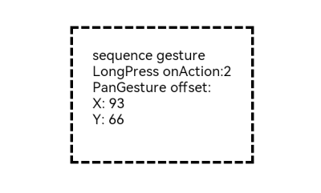

# 组合手势

手势识别组合，即多种手势组合为复合手势，支持连续识别、并行识别和互斥识别。

>  **说明：**
>
>  从API Version 7开始支持。后续版本如有新增内容，则采用上角标单独标记该内容的起始版本。

## 接口

GestureGroup(mode: GestureMode, ...gesture: GestureType[])

**参数：**

| 参数名     | 参数类型                                     | 必填   | 参数描述                           |
| ------- | ---------------------------------------- | ---- | ------------------------------ |
| mode    | [GestureMode](#gesturemode枚举说明)          | 是    | 设置组合手势识别模式。                    |
| gesture | [TapGesture](ts-basic-gestures-tapgesture.md)<br/>\|&nbsp;[LongPressGesture](ts-basic-gestures-longpressgesture.md)<br/>\|&nbsp;[PanGesture](ts-basic-gestures-pangesture.md)<br/>\|&nbsp;[PinchGesture](ts-basic-gestures-pinchgesture.md)<br/>\|&nbsp;[RotationGesture](ts-basic-gestures-rotationgesture.md) | 是    | 可变长参数，1个或者多个基础手势类型，这些手势会被组合识别。 |

## GestureMode枚举说明

| 名称        | 描述                                       |
| --------- | ---------------------------------------- |
| Sequence  | 顺序识别，按照手势的注册顺序识别手势，直到所有手势识别成功。当有一个手势识别失败时，所有手势识别失败。 |
| Parallel  | 并发识别，注册的手势同时识别，直到所有手势识别结束，手势识别互相不影响。     |
| Exclusive | 互斥识别，注册的手势同时识别，若有一个手势识别成功，则结束手势识别。       |


## 事件

| 名称                                       | 功能描述                                 |
| ---------------------------------------- | ------------------------------------ |
| onCancel(event:&nbsp;()&nbsp;=&gt;&nbsp;void) | 顺序组合手势（GestureMode.Sequence）取消后触发回调。 |


## 示例

```ts
// xxx.ets
@Entry
@Component
struct GestureGroupExample {
  @State count: number = 0
  @State offsetX: number = 0
  @State offsetY: number = 0
  @State positionX: number = 0
  @State positionY: number = 0
  @State borderStyles: BorderStyle = BorderStyle.Solid

  build() {
    Column() {
      Text('sequence gesture\n' + 'LongPress onAction:' + this.count + '\nPanGesture offset:\nX: ' + this.offsetX + '\n' + 'Y: ' + this.offsetY)
        .fontSize(15)
    }
    .translate({ x: this.offsetX, y: this.offsetY, z: 0 })
    .height(150)
    .width(200)
    .padding(20)
    .margin(20)
    .border({ width: 3, style: this.borderStyles })
    .gesture(
      // 以下组合手势为顺序识别，当长按手势事件未正常触发时则不会触发拖动手势事件
    GestureGroup(GestureMode.Sequence,
    LongPressGesture({ repeat: true })
      .onAction((event: GestureEvent) => {
        if (event.repeat) {
          this.count++
        }
        console.info('LongPress onAction')
      })
      .onActionEnd(() => {
        console.info('LongPress end')
      }),
    PanGesture()
      .onActionStart(() => {
        this.borderStyles = BorderStyle.Dashed
        console.info('pan start')
      })
      .onActionUpdate((event: GestureEvent) => {
        this.offsetX = this.positionX + event.offsetX
        this.offsetY = this.positionY + event.offsetY
        console.info('pan update')
      })
      .onActionEnd(() => {
        this.positionX = this.offsetX
        this.positionY = this.offsetY
        this.borderStyles = BorderStyle.Solid
        console.info('pan end')
      })
    )
      .onCancel(() => {
        console.info('sequence gesture canceled')
      })
    )
  }
}
```

示意图：

按顺序首先触发长按事件：


按顺序首先触发长按事件，长按事件识别结束之后，其次触发拖动事件，向右下方拖动：

  