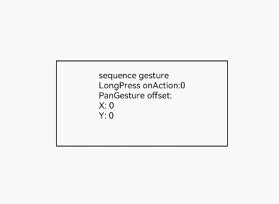

# 组合手势<a name="ZH-CN_TOPIC_0000001193075118"></a>

> **说明：** 
>从API Version 7开始支持。后续版本如有新增内容，则采用上角标单独标记该内容的起始版本。

## 权限列表<a name="section781125411508"></a>

无

## 接口<a name="section46581530142116"></a>

GestureGroup\(mode: GestureMode, ...gesture: GestureType\[\]\)

-   参数

    <table><thead align="left"><tr><th class="cellrowborder" valign="top" width="16.11%" id="mcps1.1.6.1.1"><p>参数名</p>
    </th>
    <th class="cellrowborder" valign="top" width="20.330000000000002%" id="mcps1.1.6.1.2"><p>参数类型</p>
    </th>
    <th class="cellrowborder" valign="top" width="11.450000000000001%" id="mcps1.1.6.1.3"><p>必填</p>
    </th>
    <th class="cellrowborder" valign="top" width="9.35%" id="mcps1.1.6.1.4"><p>默认值</p>
    </th>
    <th class="cellrowborder" valign="top" width="42.76%" id="mcps1.1.6.1.5"><p>参数描述</p>
    </th>
    </tr>
    </thead>
    <tbody><tr><td class="cellrowborder" valign="top" width="16.11%" headers="mcps1.1.6.1.1 "><p>mode</p>
    </td>
    <td class="cellrowborder" valign="top" width="20.330000000000002%" headers="mcps1.1.6.1.2 "><p><a href="#li1176517215161">GestureMode</a></p>
    </td>
    <td class="cellrowborder" valign="top" width="11.450000000000001%" headers="mcps1.1.6.1.3 "><p>是</p>
    </td>
    <td class="cellrowborder" valign="top" width="9.35%" headers="mcps1.1.6.1.4 "><p>-</p>
    </td>
    <td class="cellrowborder" valign="top" width="42.76%" headers="mcps1.1.6.1.5 "><p>设置组合手势识别模式。</p>
    </td>
    </tr>
    <tr><td class="cellrowborder" valign="top" width="16.11%" headers="mcps1.1.6.1.1 "><p>gesture</p>
    </td>
    <td class="cellrowborder" valign="top" width="20.330000000000002%" headers="mcps1.1.6.1.2 "><p><a href="ts-basic-gestures-tapgesture.md">TapGesture</a></p>
    <p>| <a href="ts-basic-gestures-longpressgesture.md">LongPressGesture</a></p>
    <p>| <a href="ts-basic-gestures-pangesture.md">PanGesture</a></p>
    <p>| <a href="ts-basic-gestures-pinchgesture.md">PinchGesture</a></p>
    <p>| <a href="ts-basic-gestures-rotationgesture.md">RotationGesture</a></p>
    </td>
    <td class="cellrowborder" valign="top" width="11.450000000000001%" headers="mcps1.1.6.1.3 "><p>是</p>
    </td>
    <td class="cellrowborder" valign="top" width="9.35%" headers="mcps1.1.6.1.4 "><p>-</p>
    </td>
    <td class="cellrowborder" valign="top" width="42.76%" headers="mcps1.1.6.1.5 "><p>可变长参数，1个或者多个基础手势类型，这些手势会被组合识别。</p>
    </td>
    </tr>
    </tbody>
    </table>

-   <a name="li1176517215161"></a>GestureMode枚举说明

    <table><thead align="left"><tr><th class="cellrowborder" valign="top" width="25.2%" id="mcps1.1.3.1.1"><p>名称</p>
    </th>
    <th class="cellrowborder" valign="top" width="74.8%" id="mcps1.1.3.1.2"><p>描述</p>
    </th>
    </tr>
    </thead>
    <tbody><tr><td class="cellrowborder" valign="top" width="25.2%" headers="mcps1.1.3.1.1 "><p>Sequence</p>
    </td>
    <td class="cellrowborder" valign="top" width="74.8%" headers="mcps1.1.3.1.2 "><p>顺序识别，按照手势的注册顺序识别手势，直到所有手势识别成功。当有一个手势识别失败时，所有手势识别失败。</p>
    </td>
    </tr>
    <tr><td class="cellrowborder" valign="top" width="25.2%" headers="mcps1.1.3.1.1 "><p>Parallel</p>
    </td>
    <td class="cellrowborder" valign="top" width="74.8%" headers="mcps1.1.3.1.2 "><p>并发识别，注册的手势同时识别，直到所有手势识别结束，手势识别互相不影响。</p>
    </td>
    </tr>
    <tr><td class="cellrowborder" valign="top" width="25.2%" headers="mcps1.1.3.1.1 "><p>Exclusive</p>
    </td>
    <td class="cellrowborder" valign="top" width="74.8%" headers="mcps1.1.3.1.2 "><p>互斥识别，注册的手势同时识别，若有一个手势识别成功，则结束手势识别。</p>
    </td>
    </tr>
    </tbody>
    </table>


## 事件<a name="section660220206578"></a>

<table><thead align="left"><tr><th class="cellrowborder" colspan="2" valign="top" id="mcps1.1.4.1.1"><p>名称</p>
</th>
<th class="cellrowborder" valign="top" id="mcps1.1.4.1.2"><p>功能描述</p>
</th>
</tr>
</thead>
<tbody><tr><td class="cellrowborder" colspan="2" valign="top" headers="mcps1.1.4.1.1 "><p>onCancel(event: () =&gt; void)</p>
</td>
<td class="cellrowborder" valign="top" headers="mcps1.1.4.1.2 "><p>顺序组合手势（GestureMode.Sequence）取消后触发回调。</p>
</td>
</tr>
</tbody>
</table>

## 示例<a name="section16900453182718"></a>

```
@Entry
@Component
struct GestureGroupExample {
  @State count: number = 0
  @State offsetX: number = 0
  @State offsetY: number = 0
  @State borderStyle: BorderStyle = BorderStyle.Solid

  build() {
    Flex({ direction: FlexDirection.Column, alignItems: ItemAlign.Center, justifyContent: FlexAlign.SpaceBetween }) {
      Text('sequence gesture\n' + 'LongPress onAction:' + this.count + '\nPanGesture offset:\nX: ' + this.offsetX + '\n' + 'Y: ' + this.offsetY)
    }.translate({ x: this.offsetX, y: this.offsetY, z: 5 })
    .height(100).width(200).padding(10).margin(80).border({ width: 1, style: this.borderStyle })
    .gesture(
      GestureGroup(GestureMode.Sequence,
        LongPressGesture({ repeat: true })
          .onAction((event: GestureEvent) => {
            if (event.repeat) {this.count++}
            console.log('LongPress onAction')
          })
          .onActionEnd(() => {
            console.log('LongPress end')
          }),
        PanGesture({})
          .onActionStart(() => {
            this.borderStyle = BorderStyle.Dashed
            console.log('pan start')
          })
          .onActionUpdate((event: GestureEvent) => {
            this.offsetX = event.offsetX
            this.offsetY = event.offsetY
            console.log('pan update')
          })
      )
      .onCancel(() => {
        console.log('sequence gesture canceled')
      })
    )
  }
}
```



