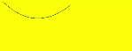

# Path2D对象<a name="ZH-CN_TOPIC_0000001237355081"></a>

> **说明：** 
>从 API Version 8 开始支持。后续版本如有新增内容，则采用上角标单独标记该内容的起始版本。

路径对象，支持通过对象的接口进行路径的描述，并通过Canvas的stroke接口进行绘制。

## addPath<a name="section1271914475715"></a>

addPath\(path: Object\): void

将另一个路径添加到当前的路径对象中。

-   参数

    <table><thead align="left"><tr><th class="cellrowborder" valign="top" width="18.55185518551855%" id="mcps1.1.6.1.1"><p>参数</p>
    </th>
    <th class="cellrowborder" valign="top" width="21.922192219221923%" id="mcps1.1.6.1.2"><p>类型</p>
    </th>
    <th class="cellrowborder" valign="top" width="10.001000100010002%" id="mcps1.1.6.1.3"><p>必填</p>
    </th>
    <th class="cellrowborder" valign="top" width="12.26122612261226%" id="mcps1.1.6.1.4"><p>默认值</p>
    </th>
    <th class="cellrowborder" valign="top" width="37.263726372637265%" id="mcps1.1.6.1.5"><p>描述</p>
    </th>
    </tr>
    </thead>
    <tbody><tr><td class="cellrowborder" valign="top" width="18.55185518551855%" headers="mcps1.1.6.1.1 "><p>path</p>
    </td>
    <td class="cellrowborder" valign="top" width="21.922192219221923%" headers="mcps1.1.6.1.2 "><p>Object</p>
    </td>
    <td class="cellrowborder" valign="top" width="10.001000100010002%" headers="mcps1.1.6.1.3 "><p>是</p>
    </td>
    <td class="cellrowborder" valign="top" width="12.26122612261226%" headers="mcps1.1.6.1.4 "><p>null</p>
    </td>
    <td class="cellrowborder" valign="top" width="37.263726372637265%" headers="mcps1.1.6.1.5 "><p>需要添加到当前路径的路径对象</p>
    </td>
    </tr>
    </tbody>
    </table>

-   示例

    ```
    @Entry
    @Component
    struct AddPath {
      private settings: RenderingContextSettings = new RenderingContextSettings(true)
      private context: CanvasRenderingContext2D = new CanvasRenderingContext2D(this.settings)
    
      private path2Da: Path2D = new Path2D("M250 150 L150 350 L350 350 Z")
      private path2Db: Path2D = new Path2D()
    
      build() {
        Flex({ direction: FlexDirection.Column, alignItems: ItemAlign.Center, justifyContent: FlexAlign.Center }) {
          Canvas(this.context)
            .width('100%')
            .height('100%')
            .backgroundColor('#ffff00')
            .onReady(() =>{
              this.path2Db.addPath(this.path2Da)
              this.context.stroke(this.path2Db)
            })
        }
        .width('100%')
        .height('100%')
      }
    }
    ```

    


## closePath<a name="section1968819330812"></a>

closePath\(\): void

将路径的当前点移回到路径的起点，当前点到起点间画一条直线。如果形状已经闭合或只有一个点，则此功能不执行任何操作。

-   示例

    ```
    @Entry
    @Component
    struct ClosePath {
      private settings: RenderingContextSettings = new RenderingContextSettings(true)
      private context: CanvasRenderingContext2D = new CanvasRenderingContext2D(this.settings)
      private path2Db: Path2D = new Path2D()
    
      build() {
        Flex({ direction: FlexDirection.Column, alignItems: ItemAlign.Center, justifyContent: FlexAlign.Center }) {
          Canvas(this.context)
            .width('100%')
            .height('100%')
            .backgroundColor('#ffff00')
            .onReady(() =>{
              this.path2Db.moveTo(200, 100)
              this.path2Db.lineTo(300, 100)
              this.path2Db.lineTo(200, 200)
              this.path2Db.closePath()
              this.context.stroke(this.path2Db)
            })
        }
        .width('100%')
        .height('100%')
      }
    }
    ```

    .png)


## moveTo<a name="section583345918819"></a>

moveTo\(x: number, y: number\): void

将路径的当前坐标点移动到目标点，移动过程中不绘制线条。

-   参数

    <table><thead align="left"><tr><th class="cellrowborder" valign="top" width="18.55185518551855%" id="mcps1.1.6.1.1"><p>参数</p>
    </th>
    <th class="cellrowborder" valign="top" width="15.74157415741574%" id="mcps1.1.6.1.2"><p>类型</p>
    </th>
    <th class="cellrowborder" valign="top" width="14.96149614961496%" id="mcps1.1.6.1.3"><p>必填</p>
    </th>
    <th class="cellrowborder" valign="top" width="13.481348134813482%" id="mcps1.1.6.1.4"><p>默认值</p>
    </th>
    <th class="cellrowborder" valign="top" width="37.263726372637265%" id="mcps1.1.6.1.5"><p>描述</p>
    </th>
    </tr>
    </thead>
    <tbody><tr><td class="cellrowborder" valign="top" width="18.55185518551855%" headers="mcps1.1.6.1.1 "><p>x</p>
    </td>
    <td class="cellrowborder" valign="top" width="15.74157415741574%" headers="mcps1.1.6.1.2 "><p>number</p>
    </td>
    <td class="cellrowborder" valign="top" width="14.96149614961496%" headers="mcps1.1.6.1.3 "><p>是</p>
    </td>
    <td class="cellrowborder" valign="top" width="13.481348134813482%" headers="mcps1.1.6.1.4 "><p>0</p>
    </td>
    <td class="cellrowborder" valign="top" width="37.263726372637265%" headers="mcps1.1.6.1.5 "><p>目标点X轴坐标</p>
    </td>
    </tr>
    <tr><td class="cellrowborder" valign="top" width="18.55185518551855%" headers="mcps1.1.6.1.1 "><p>y</p>
    </td>
    <td class="cellrowborder" valign="top" width="15.74157415741574%" headers="mcps1.1.6.1.2 "><p>number</p>
    </td>
    <td class="cellrowborder" valign="top" width="14.96149614961496%" headers="mcps1.1.6.1.3 "><p>是</p>
    </td>
    <td class="cellrowborder" valign="top" width="13.481348134813482%" headers="mcps1.1.6.1.4 "><p>0</p>
    </td>
    <td class="cellrowborder" valign="top" width="37.263726372637265%" headers="mcps1.1.6.1.5 "><p>目标点Y轴坐标</p>
    </td>
    </tr>
    </tbody>
    </table>

-   示例

    ```
    @Entry
    @Component
    struct MoveTo {
      private settings: RenderingContextSettings = new RenderingContextSettings(true)
      private context: CanvasRenderingContext2D = new CanvasRenderingContext2D(this.settings)
      private path2Db: Path2D = new Path2D()
    
      build() {
        Flex({ direction: FlexDirection.Column, alignItems: ItemAlign.Center, justifyContent: FlexAlign.Center }) {
          Canvas(this.context)
            .width('100%')
            .height('100%')
            .backgroundColor('#ffff00')
            .onReady(() =>{
              this.path2Db.moveTo(50, 100)
              this.path2Db.lineTo(250, 100)
              this.path2Db.lineTo(150, 200)
              this.path2Db.closePath()
              this.context.stroke(this.path2Db)
            })
        }
        .width('100%')
        .height('100%')
      }
    }
    ```

    


## lineTo<a name="section11118291297"></a>

lineTo\(x: number, y: number\): void

从当前点绘制一条直线到目标点。

-   参数

    <table><thead align="left"><tr><th class="cellrowborder" valign="top" width="18.55185518551855%" id="mcps1.1.6.1.1"><p>参数</p>
    </th>
    <th class="cellrowborder" valign="top" width="16.471647164716472%" id="mcps1.1.6.1.2"><p>类型</p>
    </th>
    <th class="cellrowborder" valign="top" width="12.771277127712771%" id="mcps1.1.6.1.3"><p>必填</p>
    </th>
    <th class="cellrowborder" valign="top" width="14.941494149414941%" id="mcps1.1.6.1.4"><p>默认值</p>
    </th>
    <th class="cellrowborder" valign="top" width="37.263726372637265%" id="mcps1.1.6.1.5"><p>描述</p>
    </th>
    </tr>
    </thead>
    <tbody><tr><td class="cellrowborder" valign="top" width="18.55185518551855%" headers="mcps1.1.6.1.1 "><p>x</p>
    </td>
    <td class="cellrowborder" valign="top" width="16.471647164716472%" headers="mcps1.1.6.1.2 "><p>number</p>
    </td>
    <td class="cellrowborder" valign="top" width="12.771277127712771%" headers="mcps1.1.6.1.3 "><p>是</p>
    </td>
    <td class="cellrowborder" valign="top" width="14.941494149414941%" headers="mcps1.1.6.1.4 "><p>0</p>
    </td>
    <td class="cellrowborder" valign="top" width="37.263726372637265%" headers="mcps1.1.6.1.5 "><p>目标点X轴坐标</p>
    </td>
    </tr>
    <tr><td class="cellrowborder" valign="top" width="18.55185518551855%" headers="mcps1.1.6.1.1 "><p>y</p>
    </td>
    <td class="cellrowborder" valign="top" width="16.471647164716472%" headers="mcps1.1.6.1.2 "><p>number</p>
    </td>
    <td class="cellrowborder" valign="top" width="12.771277127712771%" headers="mcps1.1.6.1.3 "><p>是</p>
    </td>
    <td class="cellrowborder" valign="top" width="14.941494149414941%" headers="mcps1.1.6.1.4 "><p>0</p>
    </td>
    <td class="cellrowborder" valign="top" width="37.263726372637265%" headers="mcps1.1.6.1.5 "><p>目标点Y轴坐标</p>
    </td>
    </tr>
    </tbody>
    </table>

-   示例

    ```
    @Entry
    @Component
    struct LineTo {
      private settings: RenderingContextSettings = new RenderingContextSettings(true)
      private context: CanvasRenderingContext2D = new CanvasRenderingContext2D(this.settings)
      private path2Db: Path2D = new Path2D()
    
      build() {
        Flex({ direction: FlexDirection.Column, alignItems: ItemAlign.Center, justifyContent: FlexAlign.Center }) {
          Canvas(this.context)
            .width('100%')
            .height('100%')
            .backgroundColor('#ffff00')
            .onReady(() =>{
              this.path2Db.moveTo(100, 100)
              this.path2Db.lineTo(100, 200)
              this.path2Db.lineTo(200, 200)
              this.path2Db.lineTo(200, 100)
              this.path2Db.closePath()
              this.context.stroke(this.path2Db)
            })
        }
        .width('100%')
        .height('100%')
      }
    }
    ```

    .png)


## bezierCurveTo<a name="section5704481695"></a>

bezierCurveTo\(cp1x: number, cp1y: number, cp2x: number, cp2y: number, x: number, y: number\): void

创建三次贝赛尔曲线的路径。

-   参数

    <table><thead align="left"><tr><th class="cellrowborder" valign="top" width="28.51%" id="mcps1.1.6.1.1"><p>参数</p>
    </th>
    <th class="cellrowborder" valign="top" width="15.989999999999998%" id="mcps1.1.6.1.2"><p>类型</p>
    </th>
    <th class="cellrowborder" valign="top" width="10.23%" id="mcps1.1.6.1.3"><p>必填</p>
    </th>
    <th class="cellrowborder" valign="top" width="16.76%" id="mcps1.1.6.1.4"><p>默认值</p>
    </th>
    <th class="cellrowborder" valign="top" width="28.51%" id="mcps1.1.6.1.5"><p>描述</p>
    </th>
    </tr>
    </thead>
    <tbody><tr><td class="cellrowborder" valign="top" width="28.51%" headers="mcps1.1.6.1.1 "><p>cp1x</p>
    </td>
    <td class="cellrowborder" valign="top" width="15.989999999999998%" headers="mcps1.1.6.1.2 "><p>number</p>
    </td>
    <td class="cellrowborder" valign="top" width="10.23%" headers="mcps1.1.6.1.3 "><p>是</p>
    </td>
    <td class="cellrowborder" valign="top" width="16.76%" headers="mcps1.1.6.1.4 "><p>0</p>
    </td>
    <td class="cellrowborder" valign="top" width="28.51%" headers="mcps1.1.6.1.5 "><p>第一个贝塞尔参数的x坐标值。</p>
    </td>
    </tr>
    <tr><td class="cellrowborder" valign="top" width="28.51%" headers="mcps1.1.6.1.1 "><p>cp1y</p>
    </td>
    <td class="cellrowborder" valign="top" width="15.989999999999998%" headers="mcps1.1.6.1.2 "><p>number</p>
    </td>
    <td class="cellrowborder" valign="top" width="10.23%" headers="mcps1.1.6.1.3 "><p>是</p>
    </td>
    <td class="cellrowborder" valign="top" width="16.76%" headers="mcps1.1.6.1.4 "><p>0</p>
    </td>
    <td class="cellrowborder" valign="top" width="28.51%" headers="mcps1.1.6.1.5 "><p>第一个贝塞尔参数的y坐标值。</p>
    </td>
    </tr>
    <tr><td class="cellrowborder" valign="top" width="28.51%" headers="mcps1.1.6.1.1 "><p>cp2x</p>
    </td>
    <td class="cellrowborder" valign="top" width="15.989999999999998%" headers="mcps1.1.6.1.2 "><p>number</p>
    </td>
    <td class="cellrowborder" valign="top" width="10.23%" headers="mcps1.1.6.1.3 "><p>是</p>
    </td>
    <td class="cellrowborder" valign="top" width="16.76%" headers="mcps1.1.6.1.4 "><p>0</p>
    </td>
    <td class="cellrowborder" valign="top" width="28.51%" headers="mcps1.1.6.1.5 "><p>第二个贝塞尔参数的x坐标值。</p>
    </td>
    </tr>
    <tr><td class="cellrowborder" valign="top" width="28.51%" headers="mcps1.1.6.1.1 "><p>cp2y</p>
    </td>
    <td class="cellrowborder" valign="top" width="15.989999999999998%" headers="mcps1.1.6.1.2 "><p>number</p>
    </td>
    <td class="cellrowborder" valign="top" width="10.23%" headers="mcps1.1.6.1.3 "><p>是</p>
    </td>
    <td class="cellrowborder" valign="top" width="16.76%" headers="mcps1.1.6.1.4 "><p>0</p>
    </td>
    <td class="cellrowborder" valign="top" width="28.51%" headers="mcps1.1.6.1.5 "><p>第二个贝塞尔参数的y坐标值。</p>
    </td>
    </tr>
    <tr><td class="cellrowborder" valign="top" width="28.51%" headers="mcps1.1.6.1.1 "><p>x</p>
    </td>
    <td class="cellrowborder" valign="top" width="15.989999999999998%" headers="mcps1.1.6.1.2 "><p>number</p>
    </td>
    <td class="cellrowborder" valign="top" width="10.23%" headers="mcps1.1.6.1.3 "><p>是</p>
    </td>
    <td class="cellrowborder" valign="top" width="16.76%" headers="mcps1.1.6.1.4 "><p>0</p>
    </td>
    <td class="cellrowborder" valign="top" width="28.51%" headers="mcps1.1.6.1.5 "><p>路径结束时的x坐标值。</p>
    </td>
    </tr>
    <tr><td class="cellrowborder" valign="top" width="28.51%" headers="mcps1.1.6.1.1 "><p>y</p>
    </td>
    <td class="cellrowborder" valign="top" width="15.989999999999998%" headers="mcps1.1.6.1.2 "><p>number</p>
    </td>
    <td class="cellrowborder" valign="top" width="10.23%" headers="mcps1.1.6.1.3 "><p>是</p>
    </td>
    <td class="cellrowborder" valign="top" width="16.76%" headers="mcps1.1.6.1.4 "><p>0</p>
    </td>
    <td class="cellrowborder" valign="top" width="28.51%" headers="mcps1.1.6.1.5 "><p>路径结束时的y坐标值。</p>
    </td>
    </tr>
    </tbody>
    </table>


-   示例

    ```
    @Entry
    @Component
    struct BezierCurveTo {
      private settings: RenderingContextSettings = new RenderingContextSettings(true)
      private context: CanvasRenderingContext2D = new CanvasRenderingContext2D(this.settings)
      private path2Db: Path2D = new Path2D()
    
      build() {
        Flex({ direction: FlexDirection.Column, alignItems: ItemAlign.Center, justifyContent: FlexAlign.Center }) {
          Canvas(this.context)
            .width('100%')
            .height('100%')
            .backgroundColor('#ffff00')
            .onReady(() =>{
              this.path2Db.moveTo(10, 10)
              this.path2Db.bezierCurveTo(20, 100, 200, 100, 200, 20);this.context.stroke(this.path2Db)
            })
        }
        .width('100%')
        .height('100%')
      }
    }
    ```

    


## quadraticCurveTo<a name="section1031101112107"></a>

quadraticCurveTo\(cpx: number, cpy: number, x: number ,y: number\): void

创建二次贝赛尔曲线的路径。

-   参数

    <table><thead align="left"><tr><th class="cellrowborder" valign="top" width="28.51%" id="mcps1.1.6.1.1"><p>参数</p>
    </th>
    <th class="cellrowborder" valign="top" width="16.11%" id="mcps1.1.6.1.2"><p>类型</p>
    </th>
    <th class="cellrowborder" valign="top" width="7.21%" id="mcps1.1.6.1.3"><p>必填</p>
    </th>
    <th class="cellrowborder" valign="top" width="19.66%" id="mcps1.1.6.1.4"><p>默认值</p>
    </th>
    <th class="cellrowborder" valign="top" width="28.51%" id="mcps1.1.6.1.5"><p>描述</p>
    </th>
    </tr>
    </thead>
    <tbody><tr><td class="cellrowborder" valign="top" width="28.51%" headers="mcps1.1.6.1.1 "><p>cpx</p>
    </td>
    <td class="cellrowborder" valign="top" width="16.11%" headers="mcps1.1.6.1.2 "><p>number</p>
    </td>
    <td class="cellrowborder" valign="top" width="7.21%" headers="mcps1.1.6.1.3 "><p>是</p>
    </td>
    <td class="cellrowborder" valign="top" width="19.66%" headers="mcps1.1.6.1.4 "><p>0</p>
    </td>
    <td class="cellrowborder" valign="top" width="28.51%" headers="mcps1.1.6.1.5 "><p>贝塞尔参数的x坐标值。</p>
    </td>
    </tr>
    <tr><td class="cellrowborder" valign="top" width="28.51%" headers="mcps1.1.6.1.1 "><p>cpy</p>
    </td>
    <td class="cellrowborder" valign="top" width="16.11%" headers="mcps1.1.6.1.2 "><p>number</p>
    </td>
    <td class="cellrowborder" valign="top" width="7.21%" headers="mcps1.1.6.1.3 "><p>是</p>
    </td>
    <td class="cellrowborder" valign="top" width="19.66%" headers="mcps1.1.6.1.4 "><p>0</p>
    </td>
    <td class="cellrowborder" valign="top" width="28.51%" headers="mcps1.1.6.1.5 "><p>贝塞尔参数的y坐标值。</p>
    </td>
    </tr>
    <tr><td class="cellrowborder" valign="top" width="28.51%" headers="mcps1.1.6.1.1 "><p>x</p>
    </td>
    <td class="cellrowborder" valign="top" width="16.11%" headers="mcps1.1.6.1.2 "><p>number</p>
    </td>
    <td class="cellrowborder" valign="top" width="7.21%" headers="mcps1.1.6.1.3 "><p>是</p>
    </td>
    <td class="cellrowborder" valign="top" width="19.66%" headers="mcps1.1.6.1.4 "><p>0</p>
    </td>
    <td class="cellrowborder" valign="top" width="28.51%" headers="mcps1.1.6.1.5 "><p>路径结束时的x坐标值。</p>
    </td>
    </tr>
    <tr><td class="cellrowborder" valign="top" width="28.51%" headers="mcps1.1.6.1.1 "><p>y</p>
    </td>
    <td class="cellrowborder" valign="top" width="16.11%" headers="mcps1.1.6.1.2 "><p>number</p>
    </td>
    <td class="cellrowborder" valign="top" width="7.21%" headers="mcps1.1.6.1.3 "><p>是</p>
    </td>
    <td class="cellrowborder" valign="top" width="19.66%" headers="mcps1.1.6.1.4 "><p>0</p>
    </td>
    <td class="cellrowborder" valign="top" width="28.51%" headers="mcps1.1.6.1.5 "><p>路径结束时的y坐标值。</p>
    </td>
    </tr>
    </tbody>
    </table>

-   示例

    ```
    @Entry
    @Component
    struct QuadraticCurveTo {
      private settings: RenderingContextSettings = new RenderingContextSettings(true)
      private context: CanvasRenderingContext2D = new CanvasRenderingContext2D(this.settings)
      private path2Db: Path2D = new Path2D()
    
      build() {
        Flex({ direction: FlexDirection.Column, alignItems: ItemAlign.Center, justifyContent: FlexAlign.Center }) {
          Canvas(this.context)
            .width('100%')
            .height('100%')
            .backgroundColor('#ffff00')
            .onReady(() =>{
              this.path2Db.moveTo(10, 10)
              this.path2Db.quadraticCurveTo(100, 100, 200, 20)
              this.context.stroke(this.path2Db)
          })
        }
        .width('100%')
        .height('100%')
      }
    }
    ```

    


## arc<a name="section17961639151011"></a>

arc\(x: number, y: number, radius: number, startAngle: number, endAngle: number, anticlockwise?: number\): void

绘制弧线路径。

-   参数

    <table><thead align="left"><tr><th class="cellrowborder" valign="top" width="28.51%" id="mcps1.1.6.1.1"><p>参数</p>
    </th>
    <th class="cellrowborder" valign="top" width="16.48%" id="mcps1.1.6.1.2"><p>类型</p>
    </th>
    <th class="cellrowborder" valign="top" width="16.05%" id="mcps1.1.6.1.3"><p>必填</p>
    </th>
    <th class="cellrowborder" valign="top" width="10.45%" id="mcps1.1.6.1.4"><p>默认值</p>
    </th>
    <th class="cellrowborder" valign="top" width="28.51%" id="mcps1.1.6.1.5"><p>描述</p>
    </th>
    </tr>
    </thead>
    <tbody><tr><td class="cellrowborder" valign="top" width="28.51%" headers="mcps1.1.6.1.1 "><p>x</p>
    </td>
    <td class="cellrowborder" valign="top" width="16.48%" headers="mcps1.1.6.1.2 "><p>number</p>
    </td>
    <td class="cellrowborder" valign="top" width="16.05%" headers="mcps1.1.6.1.3 "><p>是</p>
    </td>
    <td class="cellrowborder" valign="top" width="10.45%" headers="mcps1.1.6.1.4 "><p>0</p>
    </td>
    <td class="cellrowborder" valign="top" width="28.51%" headers="mcps1.1.6.1.5 "><p>弧线圆心的x坐标值。</p>
    </td>
    </tr>
    <tr><td class="cellrowborder" valign="top" width="28.51%" headers="mcps1.1.6.1.1 "><p>y</p>
    </td>
    <td class="cellrowborder" valign="top" width="16.48%" headers="mcps1.1.6.1.2 "><p>number</p>
    </td>
    <td class="cellrowborder" valign="top" width="16.05%" headers="mcps1.1.6.1.3 "><p>是</p>
    </td>
    <td class="cellrowborder" valign="top" width="10.45%" headers="mcps1.1.6.1.4 "><p>0</p>
    </td>
    <td class="cellrowborder" valign="top" width="28.51%" headers="mcps1.1.6.1.5 "><p>弧线圆心的y坐标值。</p>
    </td>
    </tr>
    <tr><td class="cellrowborder" valign="top" width="28.51%" headers="mcps1.1.6.1.1 "><p>radius</p>
    </td>
    <td class="cellrowborder" valign="top" width="16.48%" headers="mcps1.1.6.1.2 "><p>number</p>
    </td>
    <td class="cellrowborder" valign="top" width="16.05%" headers="mcps1.1.6.1.3 "><p>是</p>
    </td>
    <td class="cellrowborder" valign="top" width="10.45%" headers="mcps1.1.6.1.4 "><p>0</p>
    </td>
    <td class="cellrowborder" valign="top" width="28.51%" headers="mcps1.1.6.1.5 "><p>弧线的圆半径。</p>
    </td>
    </tr>
    <tr><td class="cellrowborder" valign="top" width="28.51%" headers="mcps1.1.6.1.1 "><p>startAngle</p>
    </td>
    <td class="cellrowborder" valign="top" width="16.48%" headers="mcps1.1.6.1.2 "><p>number</p>
    </td>
    <td class="cellrowborder" valign="top" width="16.05%" headers="mcps1.1.6.1.3 "><p>是</p>
    </td>
    <td class="cellrowborder" valign="top" width="10.45%" headers="mcps1.1.6.1.4 "><p>0</p>
    </td>
    <td class="cellrowborder" valign="top" width="28.51%" headers="mcps1.1.6.1.5 "><p>弧线的起始弧度。</p>
    </td>
    </tr>
    <tr><td class="cellrowborder" valign="top" width="28.51%" headers="mcps1.1.6.1.1 "><p>endAngle</p>
    </td>
    <td class="cellrowborder" valign="top" width="16.48%" headers="mcps1.1.6.1.2 "><p>number</p>
    </td>
    <td class="cellrowborder" valign="top" width="16.05%" headers="mcps1.1.6.1.3 "><p>是</p>
    </td>
    <td class="cellrowborder" valign="top" width="10.45%" headers="mcps1.1.6.1.4 "><p>0</p>
    </td>
    <td class="cellrowborder" valign="top" width="28.51%" headers="mcps1.1.6.1.5 "><p>弧线的终止弧度。</p>
    </td>
    </tr>
    <tr><td class="cellrowborder" valign="top" width="28.51%" headers="mcps1.1.6.1.1 "><p>anticlockwise</p>
    </td>
    <td class="cellrowborder" valign="top" width="16.48%" headers="mcps1.1.6.1.2 "><p>boolean</p>
    </td>
    <td class="cellrowborder" valign="top" width="16.05%" headers="mcps1.1.6.1.3 "><p>否</p>
    </td>
    <td class="cellrowborder" valign="top" width="10.45%" headers="mcps1.1.6.1.4 "><p>false</p>
    </td>
    <td class="cellrowborder" valign="top" width="28.51%" headers="mcps1.1.6.1.5 "><p>是否逆时针绘制圆弧。</p>
    </td>
    </tr>
    </tbody>
    </table>

-   示例

    ```
    @Entry
    @Component
    struct Arc {
      private settings: RenderingContextSettings = new RenderingContextSettings(true)
      private context: CanvasRenderingContext2D = new CanvasRenderingContext2D(this.settings)
      private path2Db: Path2D = new Path2D()
    
      build() {
        Flex({ direction: FlexDirection.Column, alignItems: ItemAlign.Center, justifyContent: FlexAlign.Center }) {
          Canvas(this.context)
            .width('100%')
            .height('100%')
            .backgroundColor('#ffff00')
            .onReady(() =>{
              this.path2Db.arc(100, 75, 50, 0, 6.28);this.context.stroke(this.path2Db)
            })
        }
        .width('100%')
        .height('100%')
      }
    }
    ```

    


## arcTo<a name="section172971709119"></a>

arcTo\(x1: number, y1: number, x2: number, y2: number, radius: number\): void

依据圆弧经过的点和圆弧半径创建圆弧路径。

-   参数

    <table><thead align="left"><tr><th class="cellrowborder" valign="top" width="28.51%" id="mcps1.1.6.1.1"><p>参数</p>
    </th>
    <th class="cellrowborder" valign="top" width="16.96%" id="mcps1.1.6.1.2"><p>类型</p>
    </th>
    <th class="cellrowborder" valign="top" width="10.96%" id="mcps1.1.6.1.3"><p>必填</p>
    </th>
    <th class="cellrowborder" valign="top" width="12.5%" id="mcps1.1.6.1.4"><p>默认值</p>
    </th>
    <th class="cellrowborder" valign="top" width="31.069999999999997%" id="mcps1.1.6.1.5"><p>描述</p>
    </th>
    </tr>
    </thead>
    <tbody><tr><td class="cellrowborder" valign="top" width="28.51%" headers="mcps1.1.6.1.1 "><p>x1</p>
    </td>
    <td class="cellrowborder" valign="top" width="16.96%" headers="mcps1.1.6.1.2 "><p>number</p>
    </td>
    <td class="cellrowborder" valign="top" width="10.96%" headers="mcps1.1.6.1.3 "><p>是</p>
    </td>
    <td class="cellrowborder" valign="top" width="12.5%" headers="mcps1.1.6.1.4 "><p>0</p>
    </td>
    <td class="cellrowborder" valign="top" width="31.069999999999997%" headers="mcps1.1.6.1.5 "><p>圆弧经过的第一个点的x坐标值。</p>
    </td>
    </tr>
    <tr><td class="cellrowborder" valign="top" width="28.51%" headers="mcps1.1.6.1.1 "><p>y1</p>
    </td>
    <td class="cellrowborder" valign="top" width="16.96%" headers="mcps1.1.6.1.2 "><p>number</p>
    </td>
    <td class="cellrowborder" valign="top" width="10.96%" headers="mcps1.1.6.1.3 "><p>是</p>
    </td>
    <td class="cellrowborder" valign="top" width="12.5%" headers="mcps1.1.6.1.4 "><p>0</p>
    </td>
    <td class="cellrowborder" valign="top" width="31.069999999999997%" headers="mcps1.1.6.1.5 "><p>圆弧经过的第一个点的y坐标值。</p>
    </td>
    </tr>
    <tr><td class="cellrowborder" valign="top" width="28.51%" headers="mcps1.1.6.1.1 "><p>x2</p>
    </td>
    <td class="cellrowborder" valign="top" width="16.96%" headers="mcps1.1.6.1.2 "><p>number</p>
    </td>
    <td class="cellrowborder" valign="top" width="10.96%" headers="mcps1.1.6.1.3 "><p>是</p>
    </td>
    <td class="cellrowborder" valign="top" width="12.5%" headers="mcps1.1.6.1.4 "><p>0</p>
    </td>
    <td class="cellrowborder" valign="top" width="31.069999999999997%" headers="mcps1.1.6.1.5 "><p>圆弧经过的第二个点的x坐标值。</p>
    </td>
    </tr>
    <tr><td class="cellrowborder" valign="top" width="28.51%" headers="mcps1.1.6.1.1 "><p>y2</p>
    </td>
    <td class="cellrowborder" valign="top" width="16.96%" headers="mcps1.1.6.1.2 "><p>number</p>
    </td>
    <td class="cellrowborder" valign="top" width="10.96%" headers="mcps1.1.6.1.3 "><p>是</p>
    </td>
    <td class="cellrowborder" valign="top" width="12.5%" headers="mcps1.1.6.1.4 "><p>0</p>
    </td>
    <td class="cellrowborder" valign="top" width="31.069999999999997%" headers="mcps1.1.6.1.5 "><p>圆弧经过的第二个点的y坐标值。</p>
    </td>
    </tr>
    <tr><td class="cellrowborder" valign="top" width="28.51%" headers="mcps1.1.6.1.1 "><p>radius</p>
    </td>
    <td class="cellrowborder" valign="top" width="16.96%" headers="mcps1.1.6.1.2 "><p>number</p>
    </td>
    <td class="cellrowborder" valign="top" width="10.96%" headers="mcps1.1.6.1.3 "><p>是</p>
    </td>
    <td class="cellrowborder" valign="top" width="12.5%" headers="mcps1.1.6.1.4 "><p>0</p>
    </td>
    <td class="cellrowborder" valign="top" width="31.069999999999997%" headers="mcps1.1.6.1.5 "><p>圆弧的圆半径值。</p>
    </td>
    </tr>
    </tbody>
    </table>

-   示例

    ```
    @Entry
    @Component
    struct ArcTo {
      private settings: RenderingContextSettings = new RenderingContextSettings(true)
      private context: CanvasRenderingContext2D = new CanvasRenderingContext2D(this.settings)
      private path2Db: Path2D = new Path2D()
    
      build() {
        Flex({ direction: FlexDirection.Column, alignItems: ItemAlign.Center, justifyContent: FlexAlign.Center }) {
          Canvas(this.context)
            .width('100%')
            .height('100%')
            .backgroundColor('#ffff00')
            .onReady(() =>{
              this.path2Db.arcTo(150, 20, 150, 70, 50)
              this.context.stroke(this.path2Db)
            })
        }
        .width('100%')
        .height('100%')
      }
    }
    ```

    


## ellipse<a name="section1144192321119"></a>

ellipse\(x: number, y: number, radiusX: number, radiusY: number, rotation: number, startAngle: number, endAngle: number, anticlockwise?: number\): void

在规定的矩形区域绘制一个椭圆。

-   参数

    <table><thead align="left"><tr><th class="cellrowborder" valign="top" width="22.759999999999998%" id="mcps1.1.6.1.1"><p>参数</p>
    </th>
    <th class="cellrowborder" valign="top" width="14.360000000000001%" id="mcps1.1.6.1.2"><p>类型</p>
    </th>
    <th class="cellrowborder" valign="top" width="9.120000000000001%" id="mcps1.1.6.1.3"><p>必填</p>
    </th>
    <th class="cellrowborder" valign="top" width="13.83%" id="mcps1.1.6.1.4"><p>默认值</p>
    </th>
    <th class="cellrowborder" valign="top" width="39.93%" id="mcps1.1.6.1.5"><p>描述</p>
    </th>
    </tr>
    </thead>
    <tbody><tr><td class="cellrowborder" valign="top" width="22.759999999999998%" headers="mcps1.1.6.1.1 "><p>x</p>
    </td>
    <td class="cellrowborder" valign="top" width="14.360000000000001%" headers="mcps1.1.6.1.2 "><p>number</p>
    </td>
    <td class="cellrowborder" valign="top" width="9.120000000000001%" headers="mcps1.1.6.1.3 "><p>是</p>
    </td>
    <td class="cellrowborder" valign="top" width="13.83%" headers="mcps1.1.6.1.4 "><p>0</p>
    </td>
    <td class="cellrowborder" valign="top" width="39.93%" headers="mcps1.1.6.1.5 "><p>椭圆圆心的x轴坐标。</p>
    </td>
    </tr>
    <tr><td class="cellrowborder" valign="top" width="22.759999999999998%" headers="mcps1.1.6.1.1 "><p>y</p>
    </td>
    <td class="cellrowborder" valign="top" width="14.360000000000001%" headers="mcps1.1.6.1.2 "><p>number</p>
    </td>
    <td class="cellrowborder" valign="top" width="9.120000000000001%" headers="mcps1.1.6.1.3 "><p>是</p>
    </td>
    <td class="cellrowborder" valign="top" width="13.83%" headers="mcps1.1.6.1.4 "><p>0</p>
    </td>
    <td class="cellrowborder" valign="top" width="39.93%" headers="mcps1.1.6.1.5 "><p>椭圆圆心的y轴坐标。</p>
    </td>
    </tr>
    <tr><td class="cellrowborder" valign="top" width="22.759999999999998%" headers="mcps1.1.6.1.1 "><p>radiusX</p>
    </td>
    <td class="cellrowborder" valign="top" width="14.360000000000001%" headers="mcps1.1.6.1.2 "><p>number</p>
    </td>
    <td class="cellrowborder" valign="top" width="9.120000000000001%" headers="mcps1.1.6.1.3 "><p>是</p>
    </td>
    <td class="cellrowborder" valign="top" width="13.83%" headers="mcps1.1.6.1.4 "><p>0</p>
    </td>
    <td class="cellrowborder" valign="top" width="39.93%" headers="mcps1.1.6.1.5 "><p>椭圆x轴的半径长度。</p>
    </td>
    </tr>
    <tr><td class="cellrowborder" valign="top" width="22.759999999999998%" headers="mcps1.1.6.1.1 "><p>radiusY</p>
    </td>
    <td class="cellrowborder" valign="top" width="14.360000000000001%" headers="mcps1.1.6.1.2 "><p>number</p>
    </td>
    <td class="cellrowborder" valign="top" width="9.120000000000001%" headers="mcps1.1.6.1.3 "><p>是</p>
    </td>
    <td class="cellrowborder" valign="top" width="13.83%" headers="mcps1.1.6.1.4 "><p>0</p>
    </td>
    <td class="cellrowborder" valign="top" width="39.93%" headers="mcps1.1.6.1.5 "><p>椭圆y轴的半径长度。</p>
    </td>
    </tr>
    <tr><td class="cellrowborder" valign="top" width="22.759999999999998%" headers="mcps1.1.6.1.1 "><p>rotation</p>
    </td>
    <td class="cellrowborder" valign="top" width="14.360000000000001%" headers="mcps1.1.6.1.2 "><p>number</p>
    </td>
    <td class="cellrowborder" valign="top" width="9.120000000000001%" headers="mcps1.1.6.1.3 "><p>是</p>
    </td>
    <td class="cellrowborder" valign="top" width="13.83%" headers="mcps1.1.6.1.4 "><p>0</p>
    </td>
    <td class="cellrowborder" valign="top" width="39.93%" headers="mcps1.1.6.1.5 "><p>椭圆的旋转角度，单位为弧度。</p>
    </td>
    </tr>
    <tr><td class="cellrowborder" valign="top" width="22.759999999999998%" headers="mcps1.1.6.1.1 "><p>startAngle</p>
    </td>
    <td class="cellrowborder" valign="top" width="14.360000000000001%" headers="mcps1.1.6.1.2 "><p>number</p>
    </td>
    <td class="cellrowborder" valign="top" width="9.120000000000001%" headers="mcps1.1.6.1.3 "><p>是</p>
    </td>
    <td class="cellrowborder" valign="top" width="13.83%" headers="mcps1.1.6.1.4 "><p>0</p>
    </td>
    <td class="cellrowborder" valign="top" width="39.93%" headers="mcps1.1.6.1.5 "><p>椭圆绘制的起始点角度，以弧度表示。</p>
    </td>
    </tr>
    <tr><td class="cellrowborder" valign="top" width="22.759999999999998%" headers="mcps1.1.6.1.1 "><p>endAngle</p>
    </td>
    <td class="cellrowborder" valign="top" width="14.360000000000001%" headers="mcps1.1.6.1.2 "><p>number</p>
    </td>
    <td class="cellrowborder" valign="top" width="9.120000000000001%" headers="mcps1.1.6.1.3 "><p>是</p>
    </td>
    <td class="cellrowborder" valign="top" width="13.83%" headers="mcps1.1.6.1.4 "><p>0</p>
    </td>
    <td class="cellrowborder" valign="top" width="39.93%" headers="mcps1.1.6.1.5 "><p>椭圆绘制的结束点角度，以弧度表示。</p>
    </td>
    </tr>
    <tr><td class="cellrowborder" valign="top" width="22.759999999999998%" headers="mcps1.1.6.1.1 "><p>anticlockwise</p>
    </td>
    <td class="cellrowborder" valign="top" width="14.360000000000001%" headers="mcps1.1.6.1.2 "><p>number</p>
    </td>
    <td class="cellrowborder" valign="top" width="9.120000000000001%" headers="mcps1.1.6.1.3 "><p>否</p>
    </td>
    <td class="cellrowborder" valign="top" width="13.83%" headers="mcps1.1.6.1.4 "><p>0</p>
    </td>
    <td class="cellrowborder" valign="top" width="39.93%" headers="mcps1.1.6.1.5 "><p>是否以逆时针方向绘制椭圆，0为顺时针，1为逆时针。(可选参数，默认为0)</p>
    </td>
    </tr>
    </tbody>
    </table>

-   示例

    ```
    @Entry
    @Component
    struct CanvasExample {
      private settings: RenderingContextSettings = new RenderingContextSettings(true)
      private context: CanvasRenderingContext2D = new CanvasRenderingContext2D(this.settings)
      private path2Db: Path2D = new Path2D()
    
      build() {
        Flex({ direction: FlexDirection.Column, alignItems: ItemAlign.Center, justifyContent: FlexAlign.Center }) {
          Canvas(this.context)
            .width('100%')
            .height('100%')
            .backgroundColor('#ffff00')
            .onReady(() =>{
              this.path2Db.ellipse(200, 200, 50, 100, Math.PI * 0.25, Math.PI * 0.5, Math.PI, true)
              this.context.stroke(this.path2Db)
            })
        }
        .width('100%')
        .height('100%')
      }
    }
    ```

    


## rect<a name="section49087439119"></a>

rect\(x: number, y: number, width: number, height: number\): void

创建矩形路径。

-   参数

    <table><thead align="left"><tr><th class="cellrowborder" valign="top" width="28.51%" id="mcps1.1.6.1.1"><p>参数</p>
    </th>
    <th class="cellrowborder" valign="top" width="14.78%" id="mcps1.1.6.1.2"><p>类型</p>
    </th>
    <th class="cellrowborder" valign="top" width="13.750000000000002%" id="mcps1.1.6.1.3"><p>必填</p>
    </th>
    <th class="cellrowborder" valign="top" width="14.45%" id="mcps1.1.6.1.4"><p>默认值</p>
    </th>
    <th class="cellrowborder" valign="top" width="28.51%" id="mcps1.1.6.1.5"><p>描述</p>
    </th>
    </tr>
    </thead>
    <tbody><tr><td class="cellrowborder" valign="top" width="28.51%" headers="mcps1.1.6.1.1 "><p>x</p>
    </td>
    <td class="cellrowborder" valign="top" width="14.78%" headers="mcps1.1.6.1.2 "><p>number</p>
    </td>
    <td class="cellrowborder" valign="top" width="13.750000000000002%" headers="mcps1.1.6.1.3 "><p>是</p>
    </td>
    <td class="cellrowborder" valign="top" width="14.45%" headers="mcps1.1.6.1.4 "><p>0</p>
    </td>
    <td class="cellrowborder" valign="top" width="28.51%" headers="mcps1.1.6.1.5 "><p>指定矩形的左上角x坐标值。</p>
    </td>
    </tr>
    <tr><td class="cellrowborder" valign="top" width="28.51%" headers="mcps1.1.6.1.1 "><p>y</p>
    </td>
    <td class="cellrowborder" valign="top" width="14.78%" headers="mcps1.1.6.1.2 "><p>number</p>
    </td>
    <td class="cellrowborder" valign="top" width="13.750000000000002%" headers="mcps1.1.6.1.3 "><p>是</p>
    </td>
    <td class="cellrowborder" valign="top" width="14.45%" headers="mcps1.1.6.1.4 "><p>0</p>
    </td>
    <td class="cellrowborder" valign="top" width="28.51%" headers="mcps1.1.6.1.5 "><p>指定矩形的左上角y坐标值。</p>
    </td>
    </tr>
    <tr><td class="cellrowborder" valign="top" width="28.51%" headers="mcps1.1.6.1.1 "><p>width</p>
    </td>
    <td class="cellrowborder" valign="top" width="14.78%" headers="mcps1.1.6.1.2 "><p>number</p>
    </td>
    <td class="cellrowborder" valign="top" width="13.750000000000002%" headers="mcps1.1.6.1.3 "><p>是</p>
    </td>
    <td class="cellrowborder" valign="top" width="14.45%" headers="mcps1.1.6.1.4 "><p>0</p>
    </td>
    <td class="cellrowborder" valign="top" width="28.51%" headers="mcps1.1.6.1.5 "><p>指定矩形的宽度。</p>
    </td>
    </tr>
    <tr><td class="cellrowborder" valign="top" width="28.51%" headers="mcps1.1.6.1.1 "><p>height</p>
    </td>
    <td class="cellrowborder" valign="top" width="14.78%" headers="mcps1.1.6.1.2 "><p>number</p>
    </td>
    <td class="cellrowborder" valign="top" width="13.750000000000002%" headers="mcps1.1.6.1.3 "><p>是</p>
    </td>
    <td class="cellrowborder" valign="top" width="14.45%" headers="mcps1.1.6.1.4 "><p>0</p>
    </td>
    <td class="cellrowborder" valign="top" width="28.51%" headers="mcps1.1.6.1.5 "><p>指定矩形的高度。</p>
    </td>
    </tr>
    </tbody>
    </table>

-   示例

    ```
    @Entry
    @Component
    struct CanvasExample {
      private settings: RenderingContextSettings = new RenderingContextSettings(true)
      private context: CanvasRenderingContext2D = new CanvasRenderingContext2D(this.settings)
      private path2Db: Path2D = new Path2D()
    
      build() {
        Flex({ direction: FlexDirection.Column, alignItems: ItemAlign.Center, justifyContent: FlexAlign.Center }) {
          Canvas(this.context)
            .width('100%')
            .height('100%')
            .backgroundColor('#ffff00')
            .onReady(() =>{
              this.path2Db.rect(20, 20, 100, 100);this.context.stroke(this.path2Db)
            })
        }
        .width('100%')
        .height('100%')
      }
    }
    ```

    


