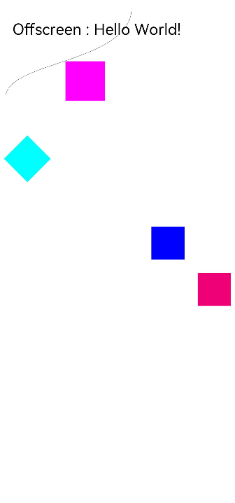

#  OffscreenCanvas

提供离屏画布组件，用于自定义绘制图形。

> **说明：** 
>
> 该组件从API Version 8开始支持。后续版本如有新增内容，则采用上角标单独标记该内容的起始版本。

## 子组件

不支持。

## 接口

OffscreenCanvas(width: number, height: number)

从API version 9开始，该接口支持在ArkTS卡片中使用。

**参数：**

| 参数名 | 参数类型 | 必填 | 默认值 | 参数描述                   |
| ------ | -------- | ---- | ------ | -------------------------- |
| width  | number   | 是   | 0      | 离屏画布的宽度，单位为vp。 |
| height | number   | 是   | 0      | 离屏画布的高度，单位为vp。 |

## 属性

除支持[通用属性](ts-universal-attributes-size.md)外，还支持以下属性：

| 名称   | 类型   | 默认值 | 描述                                                         |
| ------ | ------ | ------ | ------------------------------------------------------------ |
| width  | number | 0      | 离屏画布的宽度，单位为vp。从API version 9开始，该接口支持在ArkTS卡片中使用。 |
| height | number | 0      | 离屏画布的高度，单位为vp。从API version 9开始，该接口支持在ArkTS卡片中使用。 |

### width

```ts
// xxx.ets
@Entry
@Component
struct OffscreenCanvasPage {
  private settings: RenderingContextSettings = new RenderingContextSettings(true);
  private context: CanvasRenderingContext2D = new CanvasRenderingContext2D(this.settings);
  private offscreenCanvas: OffscreenCanvas = new OffscreenCanvas(600, 600)

  build() {
    Flex({ direction: FlexDirection.Row, alignItems: ItemAlign.Start, justifyContent: FlexAlign.Start }) {
      Column() {
        Canvas(this.context)
          .width('100%')
          .height('100%')
          .backgroundColor('#ffff00')
          .onReady(() => {
            console.log(this.offscreenCanvas.width.toString())
          })
      }
    }.width('100%').height('100%')
  }
}
```

### height

```ts
// xxx.ets
@Entry
@Component
struct OffscreenCanvasPage {
  private settings: RenderingContextSettings = new RenderingContextSettings(true);
  private context: CanvasRenderingContext2D = new CanvasRenderingContext2D(this.settings);
  private offscreenCanvas: OffscreenCanvas = new OffscreenCanvas(600, 600)

  build() {
    Flex({ direction: FlexDirection.Row, alignItems: ItemAlign.Start, justifyContent: FlexAlign.Start }) {
      Column() {
        Canvas(this.context)
          .width('100%')
          .height('100%')
          .backgroundColor('#ffff00')
          .onReady(() => {
            console.log(this.offscreenCanvas.height.toString())
          })
      }
    }.width('100%').height('100%')
  }
}
```

## 方法

### transferToImageBitmap

transferToImageBitmap(): ImageBitmap

从离屏画布中最近渲染的图像创建一个ImageBitmap对象。

从API version 9开始，该接口支持在ArkTS卡片中使用。

**返回值：**

| 类型                                               | 描述                    |
| -------------------------------------------------- | ----------------------- |
| [ImageBitmap](ts-components-canvas-imagebitmap.md) | 创建的ImageBitmap对象。 |

**示例：**

```ts
// xxx.ets
@Entry
@Component
struct OffscreenCanvasPage {
  private settings: RenderingContextSettings = new RenderingContextSettings(true)
  private context: CanvasRenderingContext2D = new CanvasRenderingContext2D(this.settings)
  private offCanvas: OffscreenCanvas = new OffscreenCanvas(600, 600)

  build() {
    Flex({ direction: FlexDirection.Column, alignItems: ItemAlign.Center, justifyContent: FlexAlign.Center }) {
      Canvas(this.context)
        .width('100%')
        .height('100%')
        .backgroundColor('#ffff00')
        .onReady(() => {
          var imageData = this.offCanvas.transferToImageBitmap()
          this.context.transferFromImageBitmap(imageData)
        })
    }
    .width('100%')
    .height('100%')
  }
}
```
### getContext<sup>10+</sup>

getContext(contextType: "2d", option?: RenderingContextSettings): OffscreenCanvasRenderingContext2D

返回离屏画布的绘图上下文。

**参数：**

| 参数        | 类型                                                         | 必填 | 默认值 | 说明                                                         |
| ----------- | ------------------------------------------------------------ | ---- | ------ | ------------------------------------------------------------ |
| contextType | string                                                       | 是   | "2d"   | 离屏画布绘图上下文的类型。                                   |
| option      | [RenderingContextSettings](ts-canvasrenderingcontext2d.md#renderingcontextsettings) | 否   | -      | 见[RenderingContextSettings](ts-canvasrenderingcontext2d.md#renderingcontextsettings)。 |

**返回值：**

| 类型                                                         | 描述                   |
| ------------------------------------------------------------ | ---------------------- |
| [OffscreenCanvasRenderingContext2D](ts-offscreencanvasrenderingcontext2d.md) | 离屏画布的绘图上下文。 |

**示例：**

```ts
@Entry
@Component
struct OffscreenCanvasExamplePage {
  private settings: RenderingContextSettings = new RenderingContextSettings(true);
  private context: CanvasRenderingContext2D = new CanvasRenderingContext2D(this.settings);
  private offscreenCanvas: OffscreenCanvas = new OffscreenCanvas(600, 600)

  build() {
    Flex({ direction: FlexDirection.Row, alignItems: ItemAlign.Start, justifyContent: FlexAlign.Start }) {
      Column() {
        Canvas(this.context)
          .width('100%')
          .height('100%')
          .backgroundColor('#FFFFFF')
          .onReady(() => {
            var offContext = this.offscreenCanvas.getContext("2d", this.settings)
            offContext.font = '70px sans-serif'
            offContext.fillText("Offscreen : Hello World!", 20, 60)
            offContext.fillStyle = "#0000ff"
            offContext.fillRect(230, 350, 50, 50)
            offContext.fillStyle = "#EE0077"
            offContext.translate(70, 70)
            offContext.fillRect(230, 350, 50, 50)
            offContext.fillStyle = "#77EE0077"
            offContext.translate(-70, -70)
            offContext.fillStyle = "#00ffff"
            offContext.rotate(45 * Math.PI / 180);
            offContext.fillRect(180, 120, 50, 50);
            offContext.rotate(-45 * Math.PI / 180);
            offContext.beginPath()
            offContext.moveTo(10, 150)
            offContext.bezierCurveTo(20, 100, 200, 100, 200, 20)
            offContext.stroke()
            offContext.fillStyle = '#FF00FF'
            offContext.fillRect(100, 100, 60, 60)
            var imageData = offContext.transferToImageBitmap()
            this.context.transferFromImageBitmap(imageData)
          })
      }.width('100%').height('100%')
    }
    .width('100%')
    .height('100%')
  }
}
```

  

