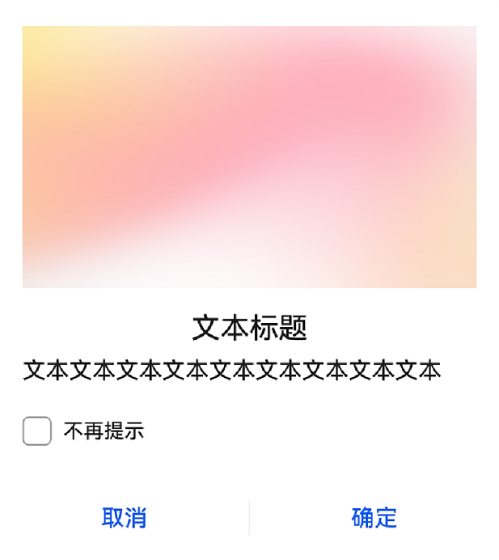
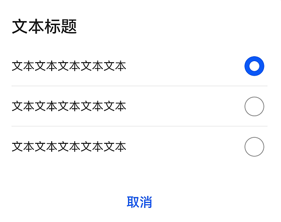
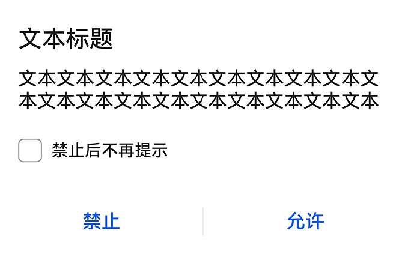
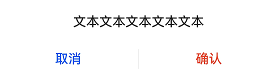
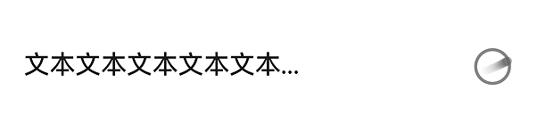

# @ohos.arkui.advanced.Dialog（弹出框）


弹出框是一种模态窗口，通常用于在保持当前的上下文环境时，临时展示用户需关注的信息或待处理的操作，用户在模态弹出框内完成上述交互任务。模态弹出框需要用户进行交互才能够退出模态模式。


> **说明：**
>
> 该组件从API Version 10开始支持。后续版本如有新增内容，则采用上角标单独标记该内容的起始版本。


## 导入模块

```
import { TipsDialog, SelectDialog, ConfirmDialog, AlertDialog, LoadingDialog } from '@ohos.arkui.advanced.Dialog'
```


## 子组件

无

## 属性
不支持[通用属性](ts-universal-attributes-size.md)

## TipsDialog


TipsDialog({controller: CustomDialogController, imageRes: Resource, imageSize: SizeOptions, title: ResourceStr, content?: ResourceStr, checkTips?: ResourceStr, ischecked?: boolean, primaryButton?: ButtonOptions, secondaryButton?: ButtonOptions})


提示弹出框，即为带图形确认框，必要时可通过图形化方式展现确认框。


**装饰器类型：**\@CustomDialog


**系统能力：** SystemCapability.ArkUI.ArkUI.Full


**参数：**


| 名称 | 参数类型 | 必填 | 装饰器类型 | 说明 | 
| -------- | -------- | -------- | -------- | -------- |
| controller | [CustomDialogController](ts-methods-custom-dialog-box.md) | 是 | - | 提示弹出框控制器。 | 
| imageRes | [Resource](ts-types.md#resource) | 是 | - | 展示的图片。 | 
| imageSize | [SizeOptions](ts-types.md#sizeoptions) | 是 | - | 自定义图片尺寸。 | 
| title | [ResourceStr](ts-types.md#resourcestr) | 是 | - | 提示弹出框标题。 | 
| content | [ResourceStr](ts-types.md#resourcestr) | 否 | - | 提示弹出框内容。 | 
| checkTips | [ResourceStr](ts-types.md#resourcestr) | 否 | - | checkbox的提示内容。 | 
| isChecked | boolean | 否 | \@Prop | value为true时，表示checkbox已选中，value为false时，表示未选中。<br/>默认值：false。 | 
| primaryButton | [ButtonOptions](#buttonoptions) | 否 | - | 提示框左侧按钮。 | 
| secondaryButton | [ButtonOptions](#buttonoptions) | 否 | - | 提示框右侧按钮。 | 


## SelectDialog

SelectDialog({controller: CustomDialogController, title: ResourceStr, content?: ResourceStr, selectedIndex?: number, confirm?: ButtonOptions, radioContent?: Array&lt;SheetInfo&gt;})

选择类弹出框，弹框中以列表或网格的形式提供可选的的内容。

**装饰器类型：**\@CustomDialog

**系统能力：** SystemCapability.ArkUI.ArkUI.Full

**参数：**

| 名称 | 参数类型 | 必填 | 说明 | 
| -------- | -------- | -------- | -------- |
| controller | CustomDialogController | 是 | 选择弹出框控制器。 | 
| title | [ResourceStr](ts-types.md#resourcestr) | 是 | 选择弹出框标题。 | 
| content | [ResourceStr](ts-types.md#resourcestr) | 否 | 选择弹出框内容。 | 
| selectedIndex | number | 否 | 选择弹出框的选中项。<br/>默认值：-1。 | 
| confirm | [ButtonOptions](#buttonoptions) | 否 | 确认按钮。 | 
| radioContent | Array&lt;[SheetInfo](ts-methods-action-sheet.md)&gt; | 否 | 选择弹出框的子项内容列表，每个选择项支持设置文本和选中的回调事件。 | 


## ConfirmDialog

ConfirmDialog({controller: CustomDialogController, title: ResourceStr, content?: ResourceStr, checkTips?: ResourceStr, ischecked?: boolean, primaryButton?: ButtonOptions, secondaryButton?: ButtonOptions})

信息确认类弹出框，操作未正确执行（如网络错误、电池电量过低），或未正确操作时（如指纹录入），反馈的错误或提示信息。

**装饰器类型：**\@CustomDialog

**系统能力：** SystemCapability.ArkUI.ArkUI.Full

**参数：**

| 名称 | 参数类型 | 必填 | 装饰器类型 | 说明 | 
| -------- | -------- | -------- | -------- | -------- |
| controller | CustomDialogController | 是 | - | 确认弹出框控制器。 | 
| title | [ResourceStr](ts-types.md#resourcestr) | 是 | - | 确认弹出框标题。 | 
| content | [ResourceStr](ts-types.md#resourcestr) | 否 | - | 确认弹出框内容。 | 
| checkTips | [ResourceStr](ts-types.md#resourcestr) | 否 | - | checkbox的提示内容。 | 
| isChecked | boolean | 否 | \@Prop | value为true时，表示checkbox已选中，value为false时，表示未选中。<br/>默认值：false。 | 
| primaryButton | [ButtonOptions](#buttonoptions) | 否 | - | 确认框左侧按钮。 | 
| secondaryButton | [ButtonOptions](#buttonoptions) | 否 | - | 确认框右侧按钮。 | 


## AlertDialog

AlertDialog({controller: CustomDialogController, content?: ResourceStr, primaryButton?: ButtonOptions, secondaryButton?: ButtonOptions})

操作确认类弹出框，触发一个将产生严重后果的不可逆操作时，如删除、重置、取消编辑、停止等。

**装饰器类型：**\@CustomDialog

**系统能力：** SystemCapability.ArkUI.ArkUI.Full

**参数：**

| 名称 | 参数类型 | 必填 | 说明 | 
| -------- | -------- | -------- | -------- |
| controller | CustomDialogController | 是 | 确认弹出框控制器。 | 
| content | [ResourceStr](ts-types.md#resourcestr) | 是 | 确认弹出框内容。 | 
| primaryButton | [ButtonOptions](#buttonoptions) | 否 | 确认框左侧按钮。 | 
| secondaryButton | [ButtonOptions](#buttonoptions) | 否 | 确认框右侧按钮。 | 


## LoadingDialog

LoadingDialog({controller: CustomDialogController, content?: ResourceStr})

**参数：**

| 名称 | 参数类型 | 必填 | 说明 | 
| -------- | -------- | -------- | -------- |
| controller | CustomDialogController | 是 | 加载弹出框控制器。 | 
| content | [ResourceStr](ts-types.md#resourcestr) | 是 | 加载弹出框内容。 | 


## ButtonOptions

**系统能力：** SystemCapability.ArkUI.ArkUI.Full

| 名称 | 类型 | 必填 | 说明 | 
| -------- | -------- | -------- | -------- |
| value | [ResourceStr](ts-types.md#resourcestr) | 是 | 按钮的内容。 | 
| action | ()&nbsp;=&gt;&nbsp;void | 否 | 按钮的点击事件。 | 
| background | [ResourceColor](ts-types.md#resourcecolor) | 否 | 按钮的背景。 | 
| fontColor | [ResourceColor](ts-types.md#resourcecolor) | 否 | 按钮的字体颜色。 | 


## 事件
不支持[通用事件](ts-universal-events-click.md)

## 示例

### 示例1

```ts
import { TipsDialog } from '@ohos.arkui.advanced.Dialog'
@Entry
@Component
struct Index {
  isChecked = false;
  dialogControllerImage: CustomDialogController = new CustomDialogController({
    builder: TipsDialog({
      imageRes: $r('app.media.icon'),
      title: '文本标题',
      content: '文本文本文本文本文本文本文本文本文本',
      isChecked: this.isChecked,
      checkTips: '不再提示',
      primaryButton: {
        value: '取消',
        action: () => {
          console.info('Callback when the CheckBox is clicked')
        },
      },
      secondaryButton: {
        value: '确定',
        action: () => {
          console.info('Callback when the second button is clicked')
        }
      },
    }),
    autoCancel: true,
    customStyle: true,
    alignment: DialogAlignment.Bottom
  })

  build() {
    Row() {
      Stack() {
        Column(){
          Button("上图下文弹出框")
            .width(96)
            .height(40)
            .onClick(() => {
              this.dialogControllerImage.open()
            })
          }.margin({bottom: 300})
        }.align(Alignment.Bottom)
        .width('100%').height('100%')
      }
     .backgroundImageSize({ width: '100%', height: '100%' })
     .height('100%')
   }
}
```




### 示例2

```ts
import { SelectDialog } from '@ohos.arkui.advanced.Dialog'
@Entry
@Component
struct Index {
  radioIndex = 0;
dialogControllerList: CustomDialogController = new CustomDialogController({
  builder: SelectDialog({
    title: '文本标题',
      selectedIndex: this.radioIndex,
    confirm: {
      value: '取消',
      action: () => {},
    },
    radioContent: [
      {
      title: '文本文本文本文本文本',
      action: () => {
        this.radioIndex = 0
      }
    },
      {
      title: '文本文本文本文本',
      action: () => {
        this.radioIndex = 1
      }
    },
      {
      title: '文本文本文本文本',
      action: () => {
        this.radioIndex = 2
      }
    },
    ]
  }),
  customStyle: true,
  alignment: DialogAlignment.Bottom,
  autoCancel: false
})

  build() {
    Row() {
      Stack() {
        Column(){
          Button("纯列表弹出框")
            .width(96)
            .height(40)
            .onClick(() => {
              this.dialogControllerList.open()
            })
          }.margin({bottom: 300})
        }.align(Alignment.Bottom)
        .width('100%').height('100%')
      }
     .backgroundImageSize({ width: '100%', height: '100%' })
     .height('100%')
   }
}
```




### 示例3

```ts
import { ConfirmDialog } from '@ohos.arkui.advanced.Dialog'
@Entry
@Component
struct Index {
  isChecked = false;
dialogControllerCheckBox: CustomDialogController = new CustomDialogController({
  builder: ConfirmDialog({
    title: '文本标题',
    content: '文本文本文本文本文本文本文本文本文本文本文本文本文本文本文本文本文本文本文本',
    isChecked: this.isChecked,
    checkTips: '禁止后不再提示',
    primaryButton: {
      value: '禁止',
      action: () => {},
    },
    secondaryButton: {
      value: '允许',
      action: () => {
        this.isChecked = false
        console.info('Callback when the second button is clicked')
      }
    },
  }),
  autoCancel: true,
  customStyle: true,
  alignment: DialogAlignment.Bottom
})

  build() {
    Row() {
      Stack() {
        Column(){
          Button("文本+勾选弹出框")
            .width(96)
            .height(40)
            .onClick(() => {
              this.dialogControllerCheckBox.open()
            })
          }.margin({bottom: 300})
        }.align(Alignment.Bottom)
        .width('100%').height('100%')
      }
     .backgroundImageSize({ width: '100%', height: '100%' })
     .height('100%')
   }
}
```




### 示例4

```ts
import { AlertDialog } from '@ohos.arkui.advanced.Dialog'
@Entry
@Component
struct Index {
dialogControllerConfirm: CustomDialogController = new CustomDialogController({
  builder: AlertDialog({
    content: '文本文本文本文本文本',
    primaryButton: {
      value: '取消',
      action: () => {},
    },
    secondaryButton: {
      value: '确认',
      fontColor: $r('sys.color.ohos_id_color_warning'),
      action: () => {
        console.info('Callback when the second button is clicked')
      }
    },
  }),
  autoCancel: true,
  customStyle: true,
  alignment: DialogAlignment.Bottom
})

  build() {
    Row() {
      Stack() {
        Column(){
          Button("纯文本弹出框")
            .width(96)
            .height(40)
            .onClick(() => {
              this.dialogControllerConfirm.open()
            })
          }.margin({bottom: 300})
        }.align(Alignment.Bottom)
        .width('100%').height('100%')
      }
     .backgroundImageSize({ width: '100%', height: '100%' })
     .height('100%')
   }
}
```




### 示例5

```ts
import { LoadingDialog } from '@ohos.arkui.advanced.Dialog'
@Entry
@Component
struct Index {
dialogControllerProgress: CustomDialogController = new CustomDialogController({
  builder: LoadingDialog({
    content: '文本文本文本文本文本...',
  }),
  autoCancel: true,
  customStyle: true,
  alignment: DialogAlignment.Bottom
})

  build() {
    Row() {
      Stack() {
        Column(){
          Button("进度条弹出框")
            .width(96)
            .height(40)
            .onClick(() => {
              this.dialogControllerProgress.open()
            })
          }.margin({bottom: 300})
        }.align(Alignment.Bottom)
        .width('100%').height('100%')
      }
     .backgroundImageSize({ width: '100%', height: '100%' })
     .height('100%')
   }
}
```


