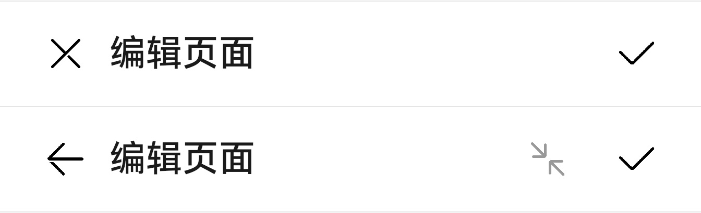

# @ohos.arkui.advanced.EditableTitleBar（编辑页面标题栏）


编辑型标题栏，适用于多选界面或者内容的编辑界面，一般采取左叉右勾的形式。


> **说明：**
>
> 该组件从API Version 10开始支持。后续版本如有新增内容，则采用上角标单独标记该内容的起始版本。


## 导入模块

```
import { EditableTitleBar } from "@ohos.arkui.advanced.EditableTitleBar"
```


## 子组件

无

## 属性
不支持[通用属性](ts-universal-attributes-size.md)


## EditableTitleBar

EditableTitleBar({leftIconType: EditableLeftIconType, title: ResourceStr, menuItems?: Array&lt;EditableTitleBarMenuItem&gt;, onSave?: () =&gt; void, onCancel?: () =&gt;void})

**装饰器类型：**\@Component

**系统能力：** SystemCapability.ArkUI.ArkUI.Full

**参数：**

| 名称 | 参数类型 | 必填 | 说明 | 
| -------- | -------- | -------- | -------- |
| leftIconStyle | [EditableLeftIconType](#editablelefticontype) | 是 | 左侧按钮类型。 | 
| title | [ResourceStr](ts-types.md#resourcestr) | 是 | 标题。 | 
| menuItems | Array&lt;[EditableTitleBarMenuItem](#editabletitlebarmenuitem)&gt; | 否 | 右侧菜单项目列表。 | 
| onSave | ()&nbsp;=&gt;&nbsp;void | 否 | 保存时的动作闭包。 | 
| onCancel | ()&nbsp;=&gt;&nbsp;void | 否 | 当左侧按钮类型为&nbsp;Left，触发取消时的动作闭包。 | 


## EditableLeftIconType

| 名称 | 说明 | 
| -------- | -------- |
| Back | 返回按钮。 | 
| Cancel | 取消按钮。 | 


## EditableTitleBarMenuItem

| 名称 | 类型 | 必填 | 说明 | 
| -------- | -------- | -------- | -------- |
| value | [ResourceStr](ts-types.md#resourcestr) | 是 | 图标资源。 | 
| isEnabled | boolean | 是 | 是否启用，默认启用。 | 
| action | ()&nbsp;=&gt;&nbsp;void | 否 | 触发时的动作闭包。 | 

## 事件
不支持[通用事件](ts-universal-events-click.md)

## 示例

```ts
import { EditableLeftIconType } from "@ohos.arkui.advanced.EditableTitleBar"
import { EditableTitleBar } from "@ohos.arkui.advanced.EditableTitleBar"
import promptAction from '@ohos.promptAction'

@Entry
@Component
struct Index {
  build() {
    Row() {
      Column() {
		Divider().height(2).color(0xCCCCCC)
        EditableTitleBar({
          leftIconStyle: EditableLeftIconType.Cancel,
          title: "编辑页面",
          menuItems: [],
          onCancel: () => {
            promptAction.showToast({ message: "on cancel" })
          },
          onSave: () => {
            promptAction.showToast({ message: "on save" })
          }
        })
        Divider().height(2).color(0xCCCCCC)
        EditableTitleBar({
          leftIconStyle: EditableLeftIconType.Back,
          title: "编辑页面",
          menuItems: [
            { value: $r('app.media.ic_public_reduce'),
              isEnabled: false,
              action: () => {
                promptAction.showToast({ message: "show toast index 2" })
              }
            }
          ],
          onCancel: () => {
            promptAction.showToast({ message: "on cancel" })
          },
          onSave: () => {
            promptAction.showToast({ message: "on save" })
          }
        })
		Divider().height(2).color(0xCCCCCC)
      }.width('100%')
    }.height('100%')
  }
}
```


