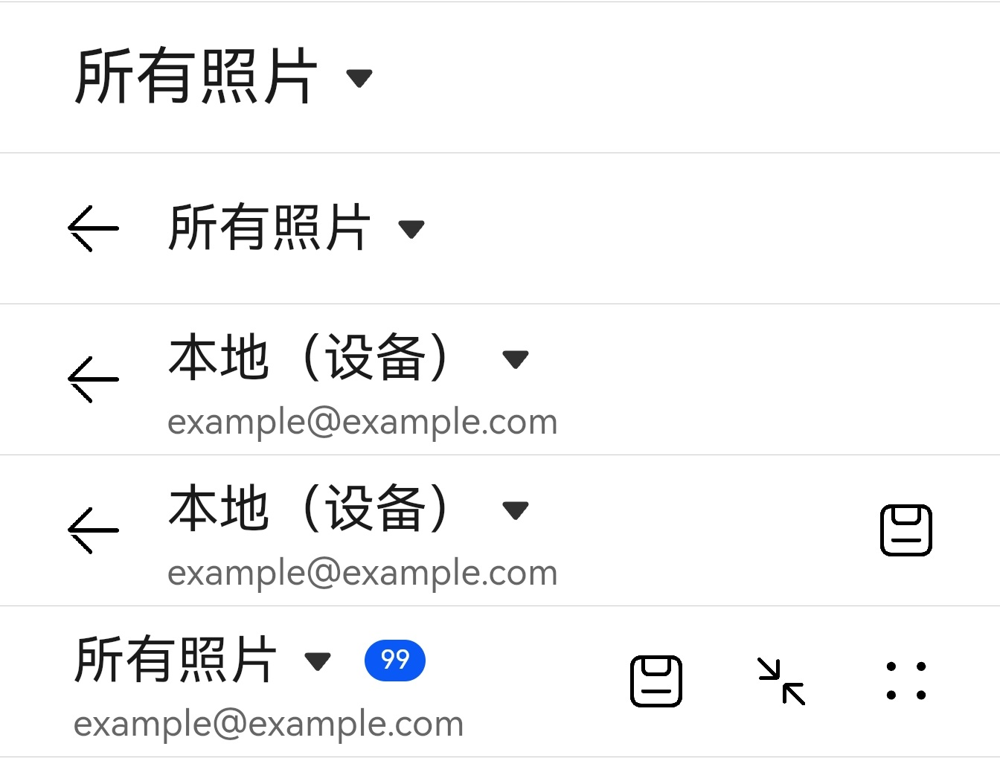

# @ohos.arkui.advanced.SelectTitleBar（下拉菜单标题栏）


下拉菜单标题栏包含一个下拉菜单，可用于页面之间的切换；可用于一级页面、二级及其以上界面（配置返回键）。


> **说明：**
>
> 该组件从API Version 10开始支持。后续版本如有新增内容，则采用上角标单独标记该内容的起始版本。


## 导入模块

```
import { SelectTitleBar } from "@ohos.arkui.advanced.SelectTitleBar"
```


## 子组件

无

## 属性
不支持[通用属性](ts-universal-attributes-size.md)

## SelectTitleBar

SelectTitleBar({selected: number, options: Array&lt;SelectOption&gt;, menuItems?: Array&lt;SelectTitleBarMenuItem&gt;, subtitle?: ResourceStr, badgeValue?: number, hidesBackButton?: boolean, onSelected?: (index: number) =&gt; void})

**装饰器类型：**\@Component

**系统能力：** SystemCapability.ArkUI.ArkUI.Full

**参数：**

| 名称 | 参数类型 | 必填 | 装饰器类型 | 说明 |
| -------- | -------- | -------- | -------- | -------- |
| selected | number | 是 | \@Prop | 当前选中项目的索引。 |
| options | Array&lt;[SelectOption](ts-basic-components-select.md#selectoption)&gt; | 是 | - | 下拉菜单中的项目。 |
| menuItems | Array&lt;[SelectTitleBarMenuItem](#selecttitlebarmenuitem)&gt; | 否 | - | 右侧菜单项目列表，定义标题栏右侧的菜单项目。 |
| subtitle | [ResourceStr](ts-types.md#resourcestr) | 否 | - | 子标题。 |
| badgeValue | number | 否 | - | 新事件标记。 |
| hidesBackButton | boolean | 否 | - | 是否隐藏。|
| onSelected | (index:&nbsp;number)&nbsp;=&gt;&nbsp;void | 否 | - | 下拉菜单项目选中触发的闭包，传入选中项的索引。 |


## SelectTitleBarMenuItem

| 名称 | 类型 | 必填 | 说明 | 
| -------- | -------- | -------- | -------- |
| value | [ResourceStr](ts-types.md#resourcestr) | 是 | 图标资源。 | 
| isEnabled | boolean | 是 | 是否启用。 | 
| action | ()&nbsp;=&gt;&nbsp;void | 否 | 触发时的动作闭包。 | 

## 事件
不支持[通用事件](ts-universal-events-click.md)

## 示例

```ts
import { SelectTitleBar } from "@ohos.arkui.advanced.SelectTitleBar"
import promptAction from '@ohos.promptAction'

class menuItems {
  value: Resource;
  isEnabled: boolean;
  action: () => void

  constructor(value: Resource,isEnabled: boolean,action: () => void) {
    this.value = value
    this.isEnabled = isEnabled
    this.action = action
  }
}

@Entry
@Component
struct Index {
private  menuItems:Array<menuItems> =
  [
    new menuItems($r('app.media.ic_public_save'),true,() => promptAction.showToast({ message: "show toast index 1" })),
    new menuItems($r('app.media.ic_public_reduce'),true,() => promptAction.showToast({ message: "show toast index 2" })),
    new menuItems($r('app.media.ic_public_edit'),true,() => promptAction.showToast({ message: "show toast index 3" })),
    new menuItems($r('app.media.ic_public_reduce'),true,() => promptAction.showToast({ message: "show toast index 4" }))
  ]

  build() {
    Row() {
      Column() {
		Divider().height(2).color(0xCCCCCC)
        SelectTitleBar({
          options: [
            { value: '所有照片' },
            { value: '本地（设备）' },
            { value: '本地本地本地本地本地（储存卡）' }
          ],
          selected: 0,
          onSelected: (index) => promptAction.showToast({ message: 'page index ' + index }),
          hidesBackButton: true
        })
        Divider().height(2).color(0xCCCCCC)
        SelectTitleBar({
          options: [
            { value: '所有照片' },
            { value: '本地（设备）' },
            { value: '本地本地本地本地本地（储存卡）' }
          ],
          selected: 0,
          onSelected: (index) => promptAction.showToast({ message: 'page index ' + index }),
          hidesBackButton: false
        })
        Divider().height(2).color(0xCCCCCC)
        SelectTitleBar({
          options: [
            { value: '所有照片' },
            { value: '本地（设备）' },
            { value: '本地本地本地本地本地（储存卡）' }
          ],
          selected: 1,
          onSelected: (index) => promptAction.showToast({ message: 'page index ' + index }),
          subtitle: "example@example.com"
        })
        Divider().height(2).color(0xCCCCCC)
        SelectTitleBar({
          options: [
            { value: '所有照片' },
            { value: '本地（设备）' },
            { value: '本地本地本地本地本地（储存卡）' }
          ],
          selected: 1,
          onSelected: (index) => promptAction.showToast({ message: 'page index ' + index }),
          subtitle: "example@example.com",
          menuItems: [{ isEnabled: true, value: $r('app.media.ic_public_save'),
            action: () => promptAction.showToast({ message: "show toast index 1" })
          }]
        })
        Divider().height(2).color(0xCCCCCC)
        SelectTitleBar({
          options: [
            { value: '所有照片' },
            { value: '本地（设备）' },
            { value: '本地本地本地本地本地（储存卡）' }
          ],
          selected: 0,
          onSelected: (index) => promptAction.showToast({ message: 'page index ' + index }),
          subtitle: "example@example.com",
          menuItems: this.menuItems,
          badgeValue: 99,
          hidesBackButton: true
        })
        Divider().height(2).color(0xCCCCCC)
      }.width('100%')
    }.height('100%')
  }
}
```


