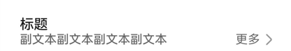

# @ohos.arkui.advanced.SubHeader（子标题）


子标题，用于列表项顶部，将该组列表划分为一个区块，子标题名称用来概括该区块内容。也可以用于内容项顶部，子标题名称用来概括该区块内容。


> **说明：**
>
> 该组件从API Version 10开始支持。后续版本如有新增内容，则采用上角标单独标记该内容的起始版本。


## 导入模块

```ts
import { SubHeader } from '@ohos.arkui.advanced.SubHeader'
```


## 子组件

无

## 属性
支持[通用属性](ts-universal-attributes-size.md)

## SubHeader

SubHeader({primaryTitle?: ResourceStr, secondaryTitle?: ResourceStr, icon?: ResourceStr, select?: SelectOptions, operationType?: OperationType, operationItem?: Array&lt;OperationOption&gt;})

**装饰器类型：**\@Component

**系统能力：** SystemCapability.ArkUI.ArkUI.Full


**参数：**


| 名称 | 参数类型 | 必填 | 装饰器类型 | 说明 | 
| -------- | -------- | -------- | -------- | -------- |
| primaryTitle | [ResourceStr](ts-types.md#resourcestr) | 否 | \@Prop | 标题内容。 | 
| secondaryTitle | [ResourceStr](ts-types.md#resourcestr) | 否 | \@Prop | 副标题内容。 | 
| icon | [ResourceStr](ts-types.md#resourcestr) | 否 | \@Prop | 图标设置项。 | 
| select | [SelectOptions](#selectoptions) | 否 | - | select内容以及事件。 | 
| operationType | [OperationType](#operationtype) | 否 | \@Prop | 操作区(右侧)元素样式。<br/>默认值：OperationType.BUTTON | 
| operationItem | Array&lt;[OperationOption](#operationoption)&gt; | 否 | - | 操作区（右侧）的设置项。 | 


## OperationType

| 名称 | 说明 | 
| -------- | -------- |
| TEXT_ARROW | 文本按钮（带右箭头）。 | 
| BUTTON | 文本按钮（不带右箭头）。 | 
| ICON_GROUP | 图标按钮（最多支持配置三张图标）。 | 
| LOADING | 加载动画。 | 


## SelectOptions

| 名称 | 类型 | 必填 | 说明 | 
| -------- | -------- | -------- | -------- |
| options | Array&lt;[SelectOption](ts-basic-components-select.md)&gt; | 是 | 下拉选项内容。 | 
| selected | number | 否 | 设置下拉菜单初始选项的索引。<br/>第一项的索引为0。<br/>当不设置selected属性时，<br/>默认选择值为-1，菜单项不选中。 | 
| value | [ResourceStr](ts-types.md#resourcestr) | 否 | 设置下拉按钮本身的文本内容。 | 
| onSelect | callback:&nbsp;(index:&nbsp;number,&nbsp;value?:&nbsp;string)&nbsp;=&gt;&nbsp;void | 否 | 下拉菜单选中某一项的回调。<br/>-&nbsp;index：选中项的索引。<br/>-&nbsp;value：选中项的值。 | 


## OperationOption

| 名称 | 类型 | 必填 | 说明 | 
| -------- | -------- | -------- | -------- |
| value | [ResourceStr](ts-types.md#resourcestr) | 是 | 文本内容。 | 
| action | ()=&gt;void | 否 | 事件。 | 

## 事件
支持[通用事件](ts-universal-events-click.md)

## 示例
### 示例1

```ts
import promptAction from '@ohos.promptAction'
import { OperationType, SubHeader } from '@ohos.arkui.advanced.SubHeader'

@Entry
@Component
struct SubHeaderExample {
  build() {
    Column() {
      SubHeader({
        icon: $r('app.media.ic_public_community_messages'),
        secondaryTitle: '子标题',
        primaryTitle: '子标题',
        operationType: OperationType.BUTTON,
        operationItem: [{ value: '操作',
          action: () => {
            promptAction.showToast({ message: 'demo' })
          }
        }]
      })
    }
  }
}
```


### 示例2

```ts
import promptAction from '@ohos.promptAction'
import { OperationType, SubHeader } from '@ohos.arkui.advanced.SubHeader'

@Entry
@Component
struct SubHeaderExample {
  build() {
    Column() {
      SubHeader({
        primaryTitle: '标题',
        secondaryTitle: '副文本副文本副文本副文本',
        operationType: OperationType.TEXT_ARROW,
        operationItem: [{ value: '更多',
          action: () => {
            promptAction.showToast({ message: 'demo' })
          }
        }]
      })
    }
  }
}
```



### 示例3

```ts
import promptAction from '@ohos.promptAction'
import { OperationType, SubHeader } from '@ohos.arkui.advanced.SubHeader'

@Entry
@Component
struct SubHeaderExample {
  build() {
    Column() {
      SubHeader({
        select: {
          options: [{ value: 'aaa' }, { value: 'bbb' }, { value: 'ccc' }],
          value: 'selectdemo',
          selected: 2,
          onSelect: (index: number, value?: string) => {
            promptAction.showToast({ message: 'demo' })
          }
        },
        operationType: OperationType.ICON_GROUP,
        operationItem: [{
          value: $r('app.media.ic_public_community_messages'),
          action: () => {
            promptAction.showToast({ message: 'demo' })
          }
        }, {
          value: $r('app.media.ic_public_community_messages'),
          action: () => {
            promptAction.showToast({ message: 'demo' })
          }
        }, {
          value: $r('app.media.ic_public_community_messages'),
          action: () => {
            promptAction.showToast({ message: 'demo' })
          }
        }]
      })
    }
  }
}
```


