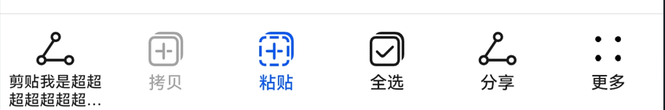

# @ohos.arkui.advanced.ToolBar（工具栏）


工具栏用于展示针对当前界面内容的操作选项，在界面底部显示。底部最多显示5个入口，超过则收纳入“更多”子项中，在最右侧显示。


> **说明：**
>
> 该组件从API Version 10开始支持。后续版本如有新增内容，则采用上角标单独标记该内容的起始版本。


## 导入模块

```
import { ToolBar, ToolBarOptions } from '@ohos.arkui.advanced.ToolBar'
```


## 子组件

无

## 属性
支持[通用属性](ts-universal-attributes-size.md)

## 接口

Toolbar({toolBarList: ToolBarOptions, activateIndex?: number, controller: TabsController})

**装饰器类型：**\@Component

**系统能力：** SystemCapability.ArkUI.ArkUI.Full

**参数：**

| 名称 | 参数类型 | 必填 | 说明 | 
| -------- | -------- | -------- | -------- |
| toolBarList | [ToolBarOptions](#toolbaroptions) | 是 | 工具栏列表。 | 
| activateIndex | number | 否 | 激活态的子项。<br/>默认值：-1。 | 
| controller | [TabsController](ts-container-tabs.md#tabscontroller) | 是 | 筛选器的样式类型。 | 


## ToolBarOptions

继承自Array&lt;ToolBarOption&gt;

**ToolBarOption：**

| 名称 | 类型 | 必填 | 说明 | 
| -------- | -------- | -------- | -------- |
| content | [ResourceStr](ts-types.md#resourcestr) | 是 | 工具栏子项的文本。 | 
| action | void | 否 | 工具栏子项点击事件。 | 
| icon | [Resource](ts-types.md#resource) | 否 | 工具栏子项的图标。 | 
| state | [ItemState](#itemstate) | 否 | 工具栏子项的状态，默认为ENABLE。 | 


## ItemState

| 名称 | 说明 | 
| -------- | -------- |
| ENABLE | 工具栏子项为正常可点击状态。 | 
| DISABLE | 工具栏子项为不可点击状态。 | 
| ACTIVATE | 工具栏子项为激活状态，可点击。 | 

## 事件
支持[通用事件](ts-universal-events-click.md)

## 示例

```ts
import { ToolBar, ToolBarOptions } from '@ohos.arkui.advanced.ToolBar'
@Entry
@Component
struct Index {
  @State toolbarList: ToolBarOptions = new ToolBarOptions()
    aboutToAppear() {
    this.toolbarList.push({ text: '剪贴我是超超超超超超超超超长样式',
      icon: $r('sys.media.ohos_ic_public_share'),
      action: () => {
      },
    })
    this.toolbarList.push({ text: '拷贝',
      icon: $r('sys.media.ohos_ic_public_copy'),
      action: () => {
      },
      state:2
    })
    this.toolbarList.push({ text: '粘贴',
      icon: $r('sys.media.ohos_ic_public_paste'),
      action: () => {
      },
      state:3
    })
    this.toolbarList.push({ text: '全选',
      icon: $r('sys.media.ohos_ic_public_select_all'),
      action: () => {
      },
    })
    this.toolbarList.push({ text: '分享',
      icon: $r('sys.media.ohos_ic_public_share'),
      action: () => {
      },
    })
    this.toolbarList.push({ text: '分享',
      icon: $r('sys.media.ohos_ic_public_share'),
      action: () => {
      },
    })
  }
  build() {
    Row() {
      Stack() {
        Column(){
          Button("修改减少item")
            .width(96)
            .height(40)
            .onClick(() => {
              this.toolbarList.pop()
            })
          Button("修改增加item")
            .width(96)
            .height(40)
            .onClick(() => {
              this.toolbarList.push(this.toolbarList[1])
            })
        }.margin({bottom: 300})
        Column() {
          ToolBar({
            currentIndex: 2,
            hwToolBarList: this.toolbarList,
          })
        }
      }.align(Alignment.Bottom)
      .width('100%').height('100%')
    }
  }
}
```


