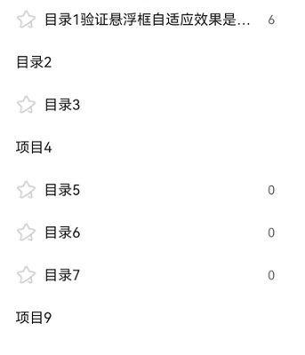

# @ohos.arkui.advanced.TreeView（树视图）


树视图作为一种分层显示的列表，适合显示嵌套结构。拥有父列表项和子列表项，可展开或折叠。


用于效率型应用，如备忘录、电子邮件、图库中的侧边导航栏中。


> **说明：**
>
> 该组件从API Version 10开始支持。后续版本如有新增内容，则采用上角标单独标记该内容的起始版本。


## 导入模块

```
import { TreeView } from "@ohos.arkui.advanced.TreeView"
```


## 子组件

无

## 属性
不支持[通用属性](ts-universal-attributes-size.md)

## TreeView

TreeView({ treeController: TreeController })

**装饰器类型：**\@Component

**系统能力：** SystemCapability.ArkUI.ArkUI.Full


**参数：**


| 名称 | 参数类型 | 必填 | 说明 | 
| -------- | -------- | -------- | -------- |
| treeController | [TreeController](#treecontroller) | 是 | 树视图节点信息。 | 


## TreeController

树视图组件的控制器，可以将此对象绑定至树视图组件，然后通过它控制树的节点信息，同一个控制器不可以控制多个树视图组件。


### addNode


addNode(nodeParam?: NodeParam): void


点击某个节点后，调用该方法可以触发新增孩子节点


**参数：**


| 名称 | 参数类型 | 必填 | 说明 | 
| -------- | -------- | -------- | -------- |
| nodeParam | [NodeParam](#nodeparam) | 否 | 节点信息。 | 


### removeNode

removeNode(): void

点击某个节点后，调用该方法可以触发删除该节点


### modifyNode


modifyNode(): void


点击某个节点后，调用该方法可以触发修改该节点


### buildDone

buildDone(): void

建立树视图。节点增加完毕后，必须调用该方法，触发树信息的保存


### refreshNode

refreshNode(parentId: number, parentSubTitle: ResourceStr, currentSubtitle: ResourceStr): void

**参数：**

| 名称 | 参数类型 | 必填 | 说明 | 
| -------- | -------- | -------- | -------- |
| parentId | number | 是 | 父节点Id。 | 
| parentSubTitle | [ResourceStr](ts-types.md#resourcestr) | 是 | 父节点副文本。 | 
| currentSubtitle | [ResourceStr](ts-types.md#resourcestr) | 是 | 当前节点副文本。 | 


## NodeParam

| 名称 | 类型 | 必填 | 说明 | 
| -------- | -------- | -------- | -------- |
| parentNodeId | number | 否 | 父亲节点。 | 
| currentNodeId | number | 否 | 当前孩子节点。 | 
| isFolder | boolean | 否 | 是否是目录。 | 
| icon | ResourceStr | 否 | 图标。 | 
| selectedIcon | ResourceStr | 否 | 选中图标。 | 
| editIcon | ResourceStr | 否 | 编辑图标。 | 
| primaryTitle | ResourceStr | 否 | 主标题。 | 
| secondaryTitle | ResourceStr | 否 | 副标题。 | 
| container | ()&nbsp;=&gt;&nbsp;void | 否 | 绑定在节点上的右键子组件，子组件由@Builder修饰。 | 


## TreeListenerManager

树视图组件的监听器，可以将此对象绑定至树视图组件，然后通过它监听树的节点的变化，同一个监听器不可以控制多个树视图组件。


### getInstance

getInstance(): TreeListenerManager

获取监听管理器单例对象


### getTreeListener()

getTreeListener(): TreeListener

获取监听器


## TreeListener

树视图组件的监听器，可以将此对象绑定至树视图组件，然后通过它监听树的节点的变化，同一个监听器不可以控制多个树视图组件。


### on

on(type: TreeListenType, callback: (callbackParam: CallbackParam) =&gt; void): void;

注册监听

**参数：**

| 名称 | 参数类型 | 必填 | 说明 | 
| -------- | -------- | -------- | -------- |
| type | [TreeListenType](#treelistentype) | 是 | 监听类型。 | 
| callbackParam | [CallbackParam](#callbackparam) | 是 | 节点信息。 | 


### once

once(type: TreeListenType, callback: (callbackParam: CallbackParam) =&gt; void): void;

注册一次监听

**参数：**

| 名称 | 参数类型 | 必填 | 说明 | 
| -------- | -------- | -------- | -------- |
| type | [TreeListenType](#treelistentype) | 是 | 监听类型。 | 
| callbackParam | [CallbackParam](#callbackparam) | 是 | 节点信息。 | 


### off


off(type: TreeListenType, callback?: (callbackParam: CallbackParam) =&gt; void): void;


取消监听


**参数：**


| 名称 | 参数类型 | 必填 | 说明 | 
| -------- | -------- | -------- | -------- |
| type | [TreeListenType](#treelistentype) | 是 | 监听类型。 | 
| nodeParam | [NodeParam](#nodeparam) | 是 | 节点信息。 | 


## TreeListenType

| 名称 | 说明 | 
| -------- | -------- |
| NODE_CLICK | 监听节点点击事件。 | 
| NODE_ADD | 监听节点增加事件。 | 
| NODE_DELETE | 监听节点删除事件。 | 
| NODE_MODIFY | 监听节点修改事件。 | 
| NODE_MOVE | 监听节点移动事件。 | 


## CallbackParam

| 名称 | 类型 | 必填 | 说明 | 
| -------- | -------- | -------- | -------- |
| currentNodeId | number | 是 | 当前孩子节点。 | 
| parentNodeId | number | 否 | 父亲节点表。 | 
| childIndex:&nbsp;number | number | 否 | 孩子索引。 | 

## 事件
不支持[通用事件](ts-universal-events-click.md)

## 示例

```ts
import { TreeController, TreeListener, TreeListenerManager, TreeListenType, NodeParam, TreeView, CallbackParam } from '@ohos.arkui.advanced.TreeView'

@Entry
@Component
struct TreeViewDemo {
  private treeController: TreeController = new TreeController();
  private treeListener: TreeListener = TreeListenerManager.getInstance().getTreeListener();
  @State clickNodeId: number = 0;
  @State numbers: string[] = ['one', 'two', 'three', 'four', 'five', 'six'];

  aboutToDisappear(): void {
    this.treeListener.off(TreeListenType.NODE_CLICK, null);
    this.treeListener.off(TreeListenType.NODE_ADD, null);
    this.treeListener.off(TreeListenType.NODE_DELETE, null);
  }

  aboutToAppear(): void {
    this.treeListener.on(TreeListenType.NODE_MOVE, (callbackParam: CallbackParam) => {
    })
    this.treeListener.on(TreeListenType.NODE_CLICK, (callbackParam: CallbackParam) => {
    })

    let normalResource: Resource = $r('app.media.ic_public_collect_normal');
    let selectedResource: Resource = $r('app.media.ic_public_collect_selected');
    let editResource: Resource = $r('app.media.ic_public_collect_edit');
    let nodeParam: NodeParam = { parentNodeId:-1, currentNodeId: 1, isFolder: true, icon: normalResource, selectedIcon: selectedResource,
      editIcon: editResource, primaryTitle: "目录1验证悬浮框自适应效果是否OK",
      secondaryTitle: "6" };
    this.treeController
      .addNode(nodeParam)
      .addNode({parentNodeId:1, currentNodeId: 2, isFolder: false, primaryTitle: "项目1_1" })
      .addNode({ parentNodeId:-1, currentNodeId: 7, isFolder: true, primaryTitle: "目录2" })
      .addNode({ parentNodeId:-1, currentNodeId: 23, isFolder: true, icon: normalResource, selectedIcon: selectedResource,
        editIcon: editResource, primaryTitle: "目录3" })
      .addNode({ parentNodeId:-1, currentNodeId: 24, isFolder: false, primaryTitle: "项目4" })
      .addNode({ parentNodeId:-1, currentNodeId: 31, isFolder: true, icon: normalResource, selectedIcon: selectedResource,
        editIcon: editResource, primaryTitle: "目录5", secondaryTitle: "0" })
      .addNode({ parentNodeId:-1, currentNodeId: 32, isFolder: true, icon: normalResource, selectedIcon: selectedResource,
        editIcon: editResource, primaryTitle: "目录6", secondaryTitle: "0" })
      .addNode({ parentNodeId:32, currentNodeId: 35, isFolder: true, icon: normalResource, selectedIcon: selectedResource,
        editIcon: editResource, primaryTitle: "目录6-1", secondaryTitle: "0" })
      .addNode({ parentNodeId:-1, currentNodeId: 33, isFolder: true, icon: normalResource, selectedIcon: selectedResource,
        editIcon: editResource, primaryTitle: "目录7", secondaryTitle: "0" })
      .addNode({ parentNodeId:33, currentNodeId: 34, isFolder: false, primaryTitle: "项目8" })
      .addNode({ parentNodeId:-1, currentNodeId: 36, isFolder: false, primaryTitle: "项目9" })
      .buildDone();
  }

  build() {
    SideBarContainer(SideBarContainerType.Embed)
    {
      TreeView({ treeController: this.treeController })
      Row() {
        Divider().vertical(true).strokeWidth(2).color(0x000000).lineCap(LineCapStyle.Round)
        Column() {
          Row() {
            Text('ClickNodeId=' + this.clickNodeId).fontSize('16fp')
            Button('Add', { type: ButtonType.Normal, stateEffect: true })
              .borderRadius(8).backgroundColor(0x317aff).width(90)
              .onClick((event: ClickEvent) => {
                this.treeController.addNode();
              })
            Button('Modify', { type: ButtonType.Normal, stateEffect: true })
              .borderRadius(8).backgroundColor(0x317aff).width(90)
              .onClick((event: ClickEvent) => {
                this.treeController.modifyNode();
              })
            Button('Remove', { type: ButtonType.Normal, stateEffect: true })
              .borderRadius(8).backgroundColor(0x317aff).width(120)
              .onClick((event: ClickEvent) => {
                this.treeController.removeNode();
              })
          }
        }.height('100%').width('70%').alignItems(HorizontalAlign.Start)
      }
    }
    .focusable(true)
    .showControlButton(false)
    .showSideBar(true)
  }
}
```


