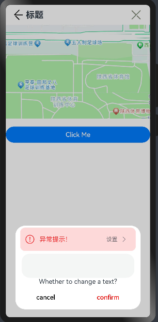

#  @ohos.arkui.advanced.ExceptionPrompt（异常提示组件）

ExceptionPrompt适用于有离线内容可显示的情况。

**说明：**

该组件从API Version 11开始支持。后续版本如有新增内容，则采用上角标单独标记该内容的起始版本。

## 导入模块

```ts
import {
     ExceptionPrompt,
     PromptOptions,
     MarginType
} from '@ohos.arkui.advanced.ExceptionPrompt';
```

##  子组件

无

## 接口

```
ExceptionPrompt ({ options: this.options })
```

从API version 11开始，该接口支持在ArkTS卡片中使用。

##  Component

**装饰器类型：**@Component

**系统能力：** SystemCapability.ArkUI.ArkUI.Full

## 参数

**系统能力：** SystemCapability.ArkUI.ArkUI.Full

| 名称        | 类型 | 必填        | 说明                            |
| ----------- | ---------- | --------------------------------- | --------------------------------- |
| options | PromptOptions | 是 | 指定当前ExceptionPrompt的配置信息 |

##  OptionType

PromptOptions定义options的类型。

| 名称         | 类型        | 必填 | 说明                                            |
| ------------ | ----------- | ---- | ----------------------------------------------- |
| icon         | ResourceStr | 否   | 指定当前ExceptionPrompt的异常图标式样           |
| tip          | ResourceStr | 否   | 指定当前ExceptionPrompt的文字提示内容           |
| marginState  | MarginType  | 是   | 指定当前ExceptionPrompt的边距样式               |
| touchText    | ResourceStr | 否   | 指定当前ExceptionPrompt的右侧图标按钮的文字内容 |
| isTouchShown | boolean     | 否   | 指定当前ExceptionPrompt的右侧图标按钮的显隐状态 |
| marginTop    | number      | 是   | 指定当前ExceptionPrompt的距离顶部的位置         |
| isShown      | boolean     | 否   | 指定当前ExceptionPrompt的显隐状态               |

## marginState

MarginType定义marginState的类型

| 类型           | 说明                                                         |
| :------------- | :----------------------------------------------------------- |
| DEFAULT_MARGIN | 默认边距：边距1：引用ohos_id_card_margin_start，边距2：引用ohos_id_card_margin_end |
| FIT_MARGIN     | 可适配边距： 边距1：引用ohos_id_max_padding_start，边距2：引用ohos_id_max_padding_end |

## 事件

| 名称                             | 功能描述                   |
| -------------------------------- | -------------------------- |
| onTextClick: () => void          | 点击左侧提示文本的回调函数 |
| onIconButtonClick: () =&gt; void | 点击右侧图标按钮的回调函数 |

## 示例 1

```ts
import {
  ExceptionPrompt,
  PromptOptions,
  MarginType
} from '@ohos.arkui.advanced.ExceptionPrompt'

@Entry
@Component
struct Index {
  @State options: PromptOptions = {
    icon: '',
    tip: '',
    marginState: MarginType.DEFAULT_MARGIN
    touchText: '',
    isTouchShown: false,
    marginTop: 80,
    isShown:true
  }

  build() {
    Column() {
      ExceptionPrompt({
        options: this.options,
        onTextClick: () => {
            // Click the text on the left to change into the connecting state
        },
        onIconButtonClick: () => {
            // Click Set Network to open the Set network pop-up interface
        },
      })

```

## 图例1


## 示例 2

```
import {
  ExceptionPrompt,
  PromptOptions,
  MarginType
} from '@ohos.arkui.advanced.ExceptionPrompt'


@CustomDialog
struct CustomDialogExample {
  @Link textValue: string
  @Link inputValue: string
  @State options: PromptOptions = {
    icon: $r('app.media.ic_public_fail'),
    tip: '异常提示！',
    marginState: MarginType.DEFAULT_MARGIN,
    touchText: '设置',
    isTouchShown: true,
    marginTop: 5,
    isShown: true
  }
  controller: CustomDialogController
  // 若尝试在CustomDialog中传入多个其他的Controller，以实现在CustomDialog中打开另一个或另一些CustomDialog，那么此处需要将指向自己的controller放在最后
  cancel: () => void
  confirm: () => void

  build() {
    Column() {
      ExceptionPrompt({
        options: this.options,
      })
      TextInput({ placeholder: '', text: this.textValue }).margin({top:70}).height(60).width('90%')
        .onChange((value: string) => {
          this.textValue = value
        })
      Text('Whether to change a text?').fontSize(16).margin({ bottom: 10 })
      Flex({ justifyContent: FlexAlign.SpaceAround }) {
        Button('cancel')
          .onClick(() => {
            this.controller.close()
            this.cancel()
          }).backgroundColor(0xffffff).fontColor(Color.Black)
        Button('confirm')
          .onClick(() => {
            this.inputValue = this.textValue
            this.controller.close()
            this.confirm()
          }).backgroundColor(0xffffff).fontColor(Color.Red)
      }.margin({ bottom: 10 })
    }
  }
}
@Entry
@Component
struct Index1 {
  @State ButtomText: string = ''
  @State MAP_HEIGHT: string = '30%'
  @State duration: number = 2500
  @State tips: string = ''
  @State touchText: string = ''
  controller: TextInputController = new TextInputController()
  cancel: () => void
  confirm: () => void
  @State options: PromptOptions = {
    icon: $r('app.media.ic_public_fail'),
    tip: '',
    marginState: MarginType.DEFAULT_MARGIN,
    touchText: '',
    isTouchShown: false,
    marginTop: 80,
    isShown: true
  }
  @State textValue: string = ''
  @State inputValue: string = 'click me'
  dialogController: CustomDialogController = new CustomDialogController({
    builder: CustomDialogExample({
      cancel: this.onCancel,
      confirm: this.onAccept,
      textValue: $textValue,
      inputValue: $inputValue
    }),
    cancel: this.existApp,
    autoCancel: true,
    alignment: DialogAlignment.Bottom,
    offset: { dx: 0, dy: -20 },
    gridCount: 4,
    customStyle: false
  })

  aboutToDisappear() {
    this.dialogController = undefined // 将dialogController置空
  }

  onCancel() {
    console.info('Callback when the first button is clicked')
  }

  onAccept() {
    console.info('Callback when the second button is clicked')
  }

  existApp() {
    console.info('Click the callback in the blank area')
  }

  build() {
    Column() {
      Flex({ justifyContent: FlexAlign.SpaceBetween, alignItems: ItemAlign.Center }) {
        Row() {
          Image($r('app.media.ic_public_back'))
            .width('40')
            .margin({ left: 10 })
            .height(50)
            .padding(8)
            .fillColor('#000')
            .onClick(() => {
            })
          Text('标题').fontSize(22)
            .fontWeight(700)
        }

        Image($r('app.media.ic_public_cancel'))
          .width(50)
          .height(50)
          .padding(8)
          .margin({ right: 10 })
          .objectFit(ImageFit.Cover)
          .fillColor('#7e8877')
          .onClick(() => {
          })
      }.position({ x: 0, y: 0 })
      .zIndex(9999)

      Image($r('app.media.map'))
        .margin({ top: 50 })
        .height(this.MAP_HEIGHT)
        .width('100%')
        .objectFit(ImageFit.Cover)
      Button('Click Me')
        .width('100%')
        .margin({top:20})
        .zIndex(999)
        .onClick(()=>{
          if (this.dialogController != undefined) {
            this.dialogController.open()
          }
        })
    }
    .height('100%')
    .width('100%')

  }
}

export { Index1 }
```

## 图例2


