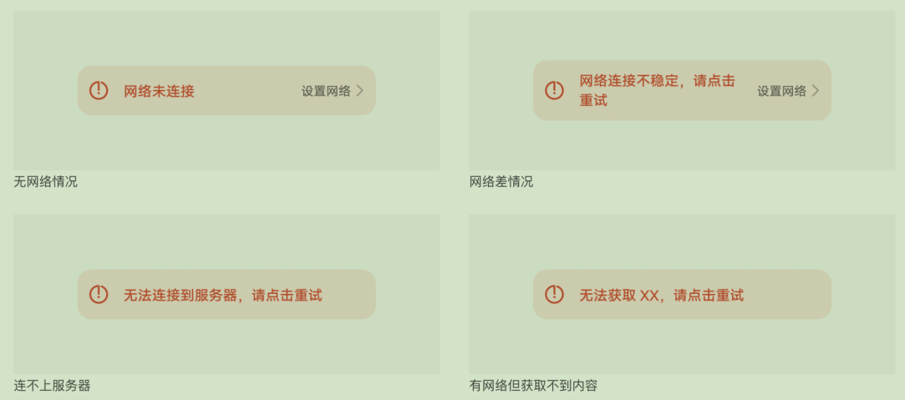

#  @ohos.arkui.advanced.ExceptionPrompt（异常提示组件）

ExceptionPrompt适用于有离线内容可显示的情况。

**说明：**

该组件从API Version 11开始支持。后续版本如有新增内容，则采用上角标单独标记该内容的起始版本。

## 导入模块

```ts
import {
     ExceptionPrompt,
     PromptOptions,
     PromptTypeEnum,
     HardwareStatusType
} from '@ohos.arkui.advanced.ExceptionPrompt';
```

##  子组件

无

## 接口

```
ExceptionPrompt ({ Type: $type,Options: $options })
```

从API version 11开始，该接口支持在ArkTS卡片中使用。

##  Component

**装饰器类型：**@Component

**系统能力：** SystemCapability.ArkUI.ArkUI.Full

## 参数

**系统能力：** SystemCapability.ArkUI.ArkUI.Full

| 名称        | 类型 | 必填        | 说明                            |
| ----------- | ---------- | --------------------------------- | --------------------------------- |
| Type | PromptTypeEnum | 是   | 指定当前ExceptionPrompt的类型。对应不同显示状态 |
| Options | PromptOptions | 是 | 指定当前ExceptionPrompt的配置信息 |

##  OptionType

PromptOptions定义Options的类型。

| 名称            | 类型               | 必填 | 说明                                                         |
| --------------- | ------------------ | ---- | ------------------------------------------------------------ |
| Icon            | ResourceStr        | 否   | 指定当前ExceptionPrompt的异常图标式样                        |
| TipContent      | ResourceStr        | 否   | 指定当前ExceptionPrompt的文字提示式样                        |
| ContentText     | ResourceStr        | 否   | 指定当前ExceptionPrompt有网但是获取不到内容XX，XX包含但不限于“信息”，“资料”，“图片”等 |
| HardwareStatus  | HardwareStatusType | 否   | 指定当前网络硬件开关状态。默认hardwareStatusType.ON：打开状态；HardwareStatusType.OFF：关闭状态 |
| IsPaddingStatus | boolean            | 是   | 指定当前ExceptionPrompt的边距样式，true：默认边距；false：可适配边距 |

## Type

PromptTypeEnum定义Type的类型。

**系统能力：** SystemCapability.ArkUI.ArkUI.Full

| 类型                       | 说明                     |
| :------------------------- | :----------------------- |
| DEFAULT_HIDE               | 默认状态不显示           |
| NETWORK_NOT_CONNECTED      | 网络未连接状态           |
| NETWORK_CONNECTED_UNSTABLE | 网络连接不稳定状态       |
| UNSTABLE_CONNECT_SERVER    | 连不上服务器状态         |
| CUSTOM_NETWORK_TIPS        | 有网但是获取不到内容状态 |
| CUSTOM_TIPS                | 自定义提示内容状态       |
## HardwareStatus

HardwareStatusType定义HardwareStatus的类型

| 类型 | 说明       |
| :--- | :--------- |
| ON   | 网络硬件开 |
| OFF  | 网络硬件关 |


## 事件

| 名称                                                   | 功能描述                             |
| ------------------------------------------------------ | ------------------------------------ |
| ReconnectionFunction: () => void = () => { }           | 点击左侧文本，变为正在连接状态       |
| ConfigureNetworkFunction: () =&gt; void = () =&gt; { } | 点击设置网络跳转到设置网络弹出框界面 |

## 示例 2

```ts
import {
  ExceptionPrompt,
  PromptOptions,
  PromptTypeEnum,
  HardwareStatusType
} from '@ohos.arkui.advanced.ExceptionPrompt'

@Entry
@Component
struct Index {
  @State Type: PromptTypeEnum = PromptTypeEnum.DEFAULT_HIDE
  @State Options: PromptOptions = {
    HardwareStatus: HardwareStatusType.ON,
    Icon: '',
    TipContent: '',
    ContentText: '',
    IsPaddingStatus: true
  }

  build() {
    Column() {
      ExceptionPrompt({
        Type: this.Type,
        Options: this.Options,
        ReconnectionFunction: () => {
        },
        ConfigureNetworkFunction: () => {
        },
      })

```

## 图例1



