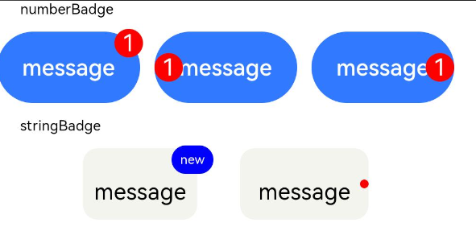

# Badge

可以附加在单个组件上用于信息标记的容器组件。

>  **说明：**
>
> 该组件从API Version 7开始支持。后续版本如有新增内容，则采用上角标单独标记该内容的起始版本。


## 子组件

支持单个子组件。

>  **说明：**
>
>  子组件类型：系统组件和自定义组件，支持渲染控制类型（[if/else](../../quick-start/arkts-rendering-control-ifelse.md)、[ForEach](../../quick-start/arkts-rendering-control-foreach.md)和[LazyForEach](../../quick-start/arkts-rendering-control-lazyforeach.md)）。


## 接口

**方法1：** Badge(value: {count: number, position?: BadgePosition, maxCount?: number, style: BadgeStyle})

创建数字标记组件。

从API version 9开始，该接口支持在ArkTS卡片中使用。

**参数：**

| 参数名 | 参数类型 | 必填 | 参数描述 |
| -------- | -------- | -------- | -------- |
| count | number | 是 | 设置提醒消息数。<br/>**说明：** <br/>小于等于0时不显示信息标记。<br/>取值范围：[-2147483648,2147483647]，非整数时会舍去小数部分取整数部分，如5.5取5。 |
| position | [BadgePosition](#badgeposition枚举说明) | 否 | 设置提示点显示位置。<br/>默认值：BadgePosition.RightTop |
| maxCount | number | 否 | 最大消息数，超过最大消息时仅显示maxCount+。<br/>默认值：99<br/>取值范围：[-2147483648,2147483647]，非整数时会舍去小数部分取整数部分，如5.5取5。 |
| style | [BadgeStyle](#badgestyle对象说明) | 是 | Badge组件可设置样式，支持设置文本颜色、尺寸、圆点颜色和尺寸。 |

**方法2：** Badge(value: {value: string, position?: BadgePosition, style: BadgeStyle})

根据字符串创建标记组件。

从API version 9开始，该接口支持在ArkTS卡片中使用。

**参数：**

| 参数名 | 参数类型 | 必填 | 默认值 | 参数描述 |
| -------- | -------- | -------- | -------- | -------- |
| value | string | 是 | - | 提示内容的文本字符串。 |
| position | [BadgePosition](#badgeposition枚举说明) | 否 | BadgePosition.RightTop | 设置提示点显示位置。 |
| style | [BadgeStyle](#badgestyle对象说明) | 是 | - | Badge组件可设置样式，支持设置文本颜色、尺寸、圆点颜色和尺寸。 |

## BadgePosition枚举说明

从API version 9开始，该接口支持在ArkTS卡片中使用。

| 名称 | 描述 |
| -------- | -------- |
| RightTop | 圆点显示在右上角。 |
| Right | 圆点显示在右侧纵向居中。 |
| Left | 圆点显示在左侧纵向居中。 |

## BadgeStyle对象说明

从API version 9开始，该接口支持在ArkTS卡片中使用。

| 名称                      | 类型                                                         | 必填 | 描述                                                         |
| ------------------------- | ------------------------------------------------------------ | ---- | ------------------------------------------------------------ |
| color                     | [ResourceColor](ts-types.md#resourcecolor)                   | 否   | 文本颜色。<br/>默认值：Color.White                           |
| fontSize                  | number&nbsp;\|&nbsp;string                                   | 否   | 文本大小。<br/>默认值：10<br/>单位：vp<br/>**说明：** <br/>不支持设置百分比。 |
| badgeSize                 | number&nbsp;\|&nbsp;string                                   | 否   | Badge的大小。<br/>默认值：16<br/>单位：vp<br/>**说明：** <br/>不支持设置百分比。当设置为非法值时，按照默认值处理。 |
| badgeColor                | [ResourceColor](ts-types.md#resourcecolor)                   | 否   | Badge的颜色。<br/>默认值：Color.Red                          |
| fontWeight<sup>10+</sup>  | number \|[FontWeight](ts-appendix-enums.md#fontweight) \| string | 否   | 设置文本的字体粗细。<br/>默认值：FontWeight.Normal<br/>**说明：** <br/>不支持设置百分比。 |
| borderColor<sup>10+</sup> | [ResourceColor](ts-types.md#resourcecolor)                   | 否   | 底板描边颜色。                                               |
| borderWidth<sup>10+</sup> | [Length](ts-types.md#length)                                 | 否   | 底板描边粗细。<br/>默认值：1<br/>单位：vp<br/>**说明：** <br/>不支持设置百分比。 |

## 属性

支持[通用属性](ts-universal-attributes-size.md)。

## 事件

支持[通用事件](ts-universal-events-click.md)。

## 示例

```ts
// xxx.ets
@Entry
@Component
struct BadgeExample {
  @Builder TabBuilder(index: number) {
    Column() {
      if (index === 2) {
        Badge({
          value: '',
          style: { badgeSize: 6, badgeColor: '#FA2A2D' }
        }) {
          Image('/common/public_icon_off.svg')
            .width(24)
            .height(24)
        }
        .width(24)
        .height(24)
        .margin({ bottom: 4 })
      } else {
        Image('/common/public_icon_off.svg')
          .width(24)
          .height(24)
          .margin({ bottom: 4 })
      }
      Text('Tab')
        .fontColor('#182431')
        .fontSize(10)
        .fontWeight(500)
        .lineHeight(14)
    }.width('100%').height('100%').justifyContent(FlexAlign.Center)
  }

  @Builder itemBuilder(value: string) {
    Row() {
      Image('common/public_icon.svg').width(32).height(32).opacity(0.6)
      Text(value)
        .width(177)
        .height(21)
        .margin({ left: 15, right: 76 })
        .textAlign(TextAlign.Start)
        .fontColor('#182431')
        .fontWeight(500)
        .fontSize(16)
        .opacity(0.9)
      Image('common/public_icon_arrow_right.svg').width(12).height(24).opacity(0.6)
    }.width('100%').padding({ left: 12, right: 12 }).height(56)
  }

  build() {
    Column() {
      Text('dotsBadge').fontSize(18).fontColor('#182431').fontWeight(500).margin(24)
      Tabs() {
        TabContent()
          .tabBar(this.TabBuilder(0))
        TabContent()
          .tabBar(this.TabBuilder(1))
        TabContent()
          .tabBar(this.TabBuilder(2))
        TabContent()
          .tabBar(this.TabBuilder(3))
      }
      .width(360)
      .height(56)
      .backgroundColor('#F1F3F5')

      Column() {
        Text('stringBadge').fontSize(18).fontColor('#182431').fontWeight(500).margin(24)
        List({ space: 12 }) {
          ListItem() {
            Text('list1').fontSize(14).fontColor('#182431').margin({ left: 12 })
          }
          .width('100%')
          .height(56)
          .backgroundColor('#FFFFFF')
          .borderRadius(24)
          .align(Alignment.Start)

          ListItem() {
            Badge({
              value: 'New',
              position: BadgePosition.Right,
              style: { badgeSize: 16, badgeColor: '#FA2A2D' }
            }) {
              Text('list2').width(27).height(19).fontSize(14).fontColor('#182431')
            }.width(49.5).height(19)
            .margin({ left: 12 })
          }
          .width('100%')
          .height(56)
          .backgroundColor('#FFFFFF')
          .borderRadius(24)
          .align(Alignment.Start)
        }.width(336)

        Text('numberBadge').fontSize(18).fontColor('#182431').fontWeight(500).margin(24)
        List() {
          ListItem() {
            this.itemBuilder('list1')
          }

          ListItem() {
            Row() {
              Image('common/public_icon.svg').width(32).height(32).opacity(0.6)
              Badge({
                count: 1,
                position: BadgePosition.Right,
                style: { badgeSize: 16, badgeColor: '#FA2A2D' }
              }) {
                Text('list2')
                  .width(177)
                  .height(21)
                  .textAlign(TextAlign.Start)
                  .fontColor('#182431')
                  .fontWeight(500)
                  .fontSize(16)
                  .opacity(0.9)
              }.width(240).height(21).margin({ left: 15, right: 11 })

              Image('common/public_icon_arrow_right.svg').width(12).height(24).opacity(0.6)
            }.width('100%').padding({ left: 12, right: 12 }).height(56)
          }

          ListItem() {
            this.itemBuilder('list3')
          }

          ListItem() {
            this.itemBuilder('list4')
          }
        }
        .width(336)
        .height(232)
        .backgroundColor('#FFFFFF')
        .borderRadius(24)
        .padding({ top: 4, bottom: 4 })
        .divider({ strokeWidth: 0.5, color: 'rgba(0,0,0,0.1)', startMargin: 60, endMargin: 12 })
      }.width('100%').backgroundColor('#F1F3F5').padding({ bottom: 12 })
    }.width('100%')
  }
}
```


