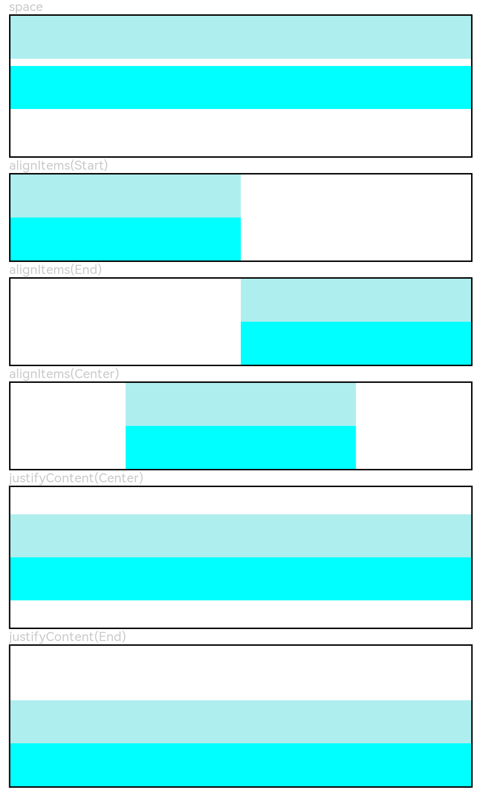

# Column

沿垂直方向布局的容器。

>  **说明：**
>
>  该组件从API Version 7开始支持。后续版本如有新增内容，则采用上角标单独标记该内容的起始版本。


## 子组件

可以包含子组件。


## 接口

Column(value?:&nbsp;{space?: string&nbsp;|&nbsp;number})

从API version 9开始，该接口支持在ArkTS卡片中使用。

**参数：**

| 参数名 | 参数类型 | 必填 | 参数描述 |
| -------- | -------- | -------- | -------- |
| space | string&nbsp;\|&nbsp;number | 否 | 纵向布局元素垂直方向间距。<br/>从API version 9开始，space为负数或者justifyContent设置为FlexAlign.SpaceBetween、FlexAlign.SpaceAround、FlexAlign.SpaceEvenly时不生效。<br/>默认值：0<br/>**说明：**<br/>可选值为大于等于0的数字，或者可以转换为数字的字符串。 |

## 属性

除支持[通用属性](ts-universal-attributes-size.md)外，还支持以下属性：

| 名称 | 参数类型 | 描述 |
| -------- | -------- | -------- |
| alignItems | [HorizontalAlign](ts-appendix-enums.md#horizontalalign) | 设置子组件在水平方向上的对齐格式。<br/>默认值：HorizontalAlign.Center<br/>从API version 9开始，该接口支持在ArkTS卡片中使用。 |
| justifyContent<sup>8+</sup> | [FlexAlign](ts-appendix-enums.md#flexalign) | 设置子组件在垂直方向上的对齐格式。<br/>默认值：FlexAlign.Start<br/>从API version 9开始，该接口支持在ArkTS卡片中使用。 |

## 示例

```ts
// xxx.ets
@Entry
@Component
struct ColumnExample {
  build() {
    Column() {
      // 设置子元素垂直方向间距为5
      Text('space').fontSize(9).fontColor(0xCCCCCC).width('90%')
      Column({ space: 5 }) {
        Column().width('100%').height(30).backgroundColor(0xAFEEEE)
        Column().width('100%').height(30).backgroundColor(0x00FFFF)
      }.width('90%').height(100).border({ width: 1 })

      // 设置子元素水平方向对齐方式
      Text('alignItems(Start)').fontSize(9).fontColor(0xCCCCCC).width('90%')
      Column() {
        Column().width('50%').height(30).backgroundColor(0xAFEEEE)
        Column().width('50%').height(30).backgroundColor(0x00FFFF)
      }.alignItems(HorizontalAlign.Start).width('90%').border({ width: 1 })

      Text('alignItems(End)').fontSize(9).fontColor(0xCCCCCC).width('90%')
      Column() {
        Column().width('50%').height(30).backgroundColor(0xAFEEEE)
        Column().width('50%').height(30).backgroundColor(0x00FFFF)
      }.alignItems(HorizontalAlign.End).width('90%').border({ width: 1 })

      Text('alignItems(Center)').fontSize(9).fontColor(0xCCCCCC).width('90%')
      Column() {
        Column().width('50%').height(30).backgroundColor(0xAFEEEE)
        Column().width('50%').height(30).backgroundColor(0x00FFFF)
      }.alignItems(HorizontalAlign.Center).width('90%').border({ width: 1 })
      
      // 设置子元素垂直方向的对齐方式
      Text('justifyContent(Center)').fontSize(9).fontColor(0xCCCCCC).width('90%')
      Column() {
        Column().width('90%').height(30).backgroundColor(0xAFEEEE)
        Column().width('90%').height(30).backgroundColor(0x00FFFF)
      }.height(100).border({ width: 1 }).justifyContent(FlexAlign.Center)

      Text('justifyContent(End)').fontSize(9).fontColor(0xCCCCCC).width('90%')
      Column() {
        Column().width('90%').height(30).backgroundColor(0xAFEEEE)
        Column().width('90%').height(30).backgroundColor(0x00FFFF)
      }.height(100).border({ width: 1 }).justifyContent(FlexAlign.End)
    }.width('100%').padding({ top: 5 })
  }
}
```


