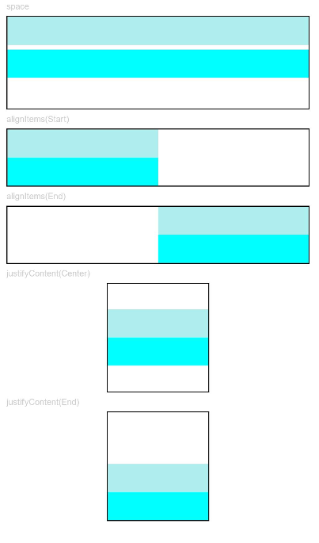

# Column

>  **说明：**
> 该组件从API Version 7开始支持。后续版本如有新增内容，则采用上角标单独标记该内容的起始版本。


沿垂直方向布局的容器。


## 权限列表

无


## 子组件

可以包含子组件。


## 接口

Column(value:{space?: Length})


- 参数
  | 参数名 | 参数类型 | 必填 | 默认值 | 参数描述 | 
  | -------- | -------- | -------- | -------- | -------- |
  | space | Length | 否 | 0 | 纵向布局元素间距。 | 


## 属性

| 名称 | 参数类型 | 默认值 | 描述 |
| -------- | -------- | -------- | -------- |
| alignItems | HorizontalAlign | HorizontalAlign.Center | 设置子组件在水平方向上的对齐格式。 |
| justifyContent8+ | [FlexAlign](ts-container-flex.md) | FlexAlign.Start | 设置子组件在垂直方向上的对齐格式。 |

- HorizontalAlign枚举说明
  | 名称 | 描述 | 
  | -------- | -------- |
  | Start | 按照语言方向起始端对齐。 | 
  | Center | 居中对齐，默认对齐方式。 | 
  | End | 按照语言方向末端对齐。 |


## 示例

```ts
// xxx.ets
@Entry
@Component
struct ColumnExample {
  build() {
    Column() {
        Text('space').fontSize(9).fontColor(0xCCCCCC).width('90%')
        Column({ space: 5 }) {
          Column().width('100%').height(30).backgroundColor(0xAFEEEE)
          Column().width('100%').height(30).backgroundColor(0x00FFFF)
        }.width('90%').height(100).border({ width: 1 })

        Text('alignItems(Start)').fontSize(9).fontColor(0xCCCCCC).width('90%')
        Column() {
          Column().width('50%').height(30).backgroundColor(0xAFEEEE)
          Column().width('50%').height(30).backgroundColor(0x00FFFF)
        }.alignItems(HorizontalAlign.Start).width('90%').border({ width: 1 })

        Text('alignItems(End)').fontSize(9).fontColor(0xCCCCCC).width('90%')
        Column() {
          Column().width('50%').height(30).backgroundColor(0xAFEEEE)
          Column().width('50%').height(30).backgroundColor(0x00FFFF)
        }.alignItems(HorizontalAlign.End).width('90%').border({ width: 1 })

        Text('justifyContent(Center)').fontSize(9).fontColor(0xCCCCCC).width('90%')
        Column() {
          Column().width('30%').height(30).backgroundColor(0xAFEEEE)
          Column().width('30%').height(30).backgroundColor(0x00FFFF)
        }.height('15%').border({ width: 1 }).justifyContent(FlexAlign.Center)

        Text('justifyContent(End)').fontSize(9).fontColor(0xCCCCCC).width('90%')
        Column() {
          Column().width('30%').height(30).backgroundColor(0xAFEEEE)
          Column().width('30%').height(30).backgroundColor(0x00FFFF)
        }.height('15%').border({ width: 1 }).justifyContent(FlexAlign.End)
    }.width('100%').padding({ top: 5 })
  }
}
```


