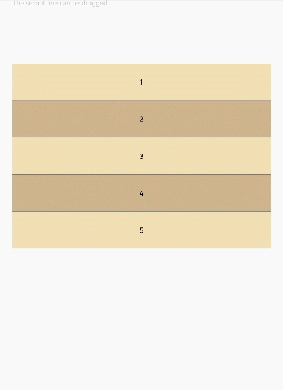

# ColumnSplit<a name="ZH-CN_TOPIC_0000001237475057"></a>

> **说明：** 
>该组件从API Version 7开始支持。后续版本如有新增内容，则采用上角标单独标记该内容的起始版本。

将子组件纵向布局，并在每个子组件之间插入一根横向的分割线。

## 权限列表<a name="section53281531154915"></a>

无

## 子组件<a name="section5989144051714"></a>

可以包含子组件。

## 接口<a name="section1643325819470"></a>

ColumnSplit\(\)

## 属性<a name="section945991855410"></a>

<table><thead align="left"><tr><th class="cellrowborder" valign="top" width="33.333333333333336%" id="mcps1.1.4.1.1"><p>名称</p>
</th>
<th class="cellrowborder" valign="top" width="33.29332933293329%" id="mcps1.1.4.1.2"><p>参数类型</p>
</th>
<th class="cellrowborder" valign="top" width="33.373337333733375%" id="mcps1.1.4.1.3"><p>描述</p>
</th>
</tr>
</thead>
<tbody><tr><td class="cellrowborder" valign="top" width="33.333333333333336%" headers="mcps1.1.4.1.1 "><p>resizeable</p>
</td>
<td class="cellrowborder" valign="top" width="33.29332933293329%" headers="mcps1.1.4.1.2 "><p>boolean</p>
</td>
<td class="cellrowborder" valign="top" width="33.373337333733375%" headers="mcps1.1.4.1.3 "><p>分割线是否可拖拽，默认为false。</p>
</td>
</tr>
</tbody>
</table>

> **说明：** 
>与RowSplit相同，ColumnSplit的分割线最小能拖动到刚好包含子组件。

## 示例<a name="section1078035104913"></a>

```
@Entry
@Component
struct ColumnSplitExample {
  build() {
    Column(){
      Text('The secant line can be dragged').fontSize(9).fontColor(0xCCCCCC).width('90%')
      ColumnSplit() {
        Text('1').width('100%').height(50).backgroundColor(0xF5DEB3).textAlign(TextAlign.Center)
        Text('2').width('100%').height(50).backgroundColor(0xD2B48C).textAlign(TextAlign.Center)
        Text('3').width('100%').height(50).backgroundColor(0xF5DEB3).textAlign(TextAlign.Center)
        Text('4').width('100%').height(50).backgroundColor(0xD2B48C).textAlign(TextAlign.Center)
        Text('5').width('100%').height(50).backgroundColor(0xF5DEB3).textAlign(TextAlign.Center)
      }
      .resizeable(true)
      .width('90%').height('60%')
    }.width('100%')
  }
}
```



