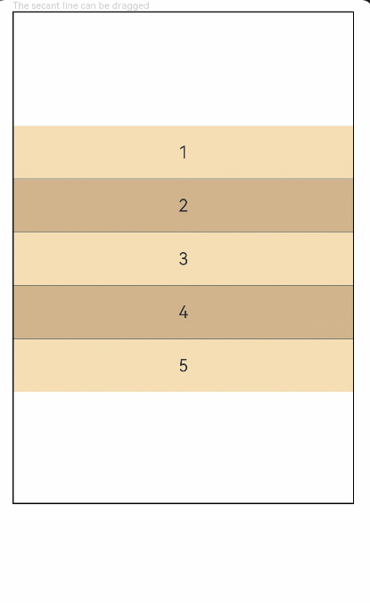

# ColumnSplit

将子组件纵向布局，并在每个子组件之间插入一根横向的分割线。

>  **说明：**
>
> 该组件从API Version 7开始支持。后续版本如有新增内容，则采用上角标单独标记该内容的起始版本。


## 子组件

可以包含子组件。


## 接口

ColumnSplit()


## 属性

| 名称 | 参数类型 | 描述 | 
| -------- | -------- | -------- |
| resizeable | boolean | 分割线是否可拖拽，默认为false。 | 

>  **说明：**
>
> 与RowSplit相同，ColumnSplit的分割线最小能拖动到刚好包含子组件。
>
> 在真机中查看拖动效果，预览器中不支持拖动。
>
> 不支持clip、margin通用属性。

## 示例

```ts
// xxx.ets
@Entry
@Component
struct ColumnSplitExample {
  build() {
    Column(){
      Text('The secant line can be dragged').fontSize(9).fontColor(0xCCCCCC).width('90%')
      ColumnSplit() {
        Text('1').width('100%').height(50).backgroundColor(0xF5DEB3).textAlign(TextAlign.Center)
        Text('2').width('100%').height(50).backgroundColor(0xD2B48C).textAlign(TextAlign.Center)
        Text('3').width('100%').height(50).backgroundColor(0xF5DEB3).textAlign(TextAlign.Center)
        Text('4').width('100%').height(50).backgroundColor(0xD2B48C).textAlign(TextAlign.Center)
        Text('5').width('100%').height(50).backgroundColor(0xF5DEB3).textAlign(TextAlign.Center)
      }
      .borderWidth(1)
      .resizeable(true) // 可拖动
      .width('90%').height('60%')
    }.width('100%')
  }
}
```


