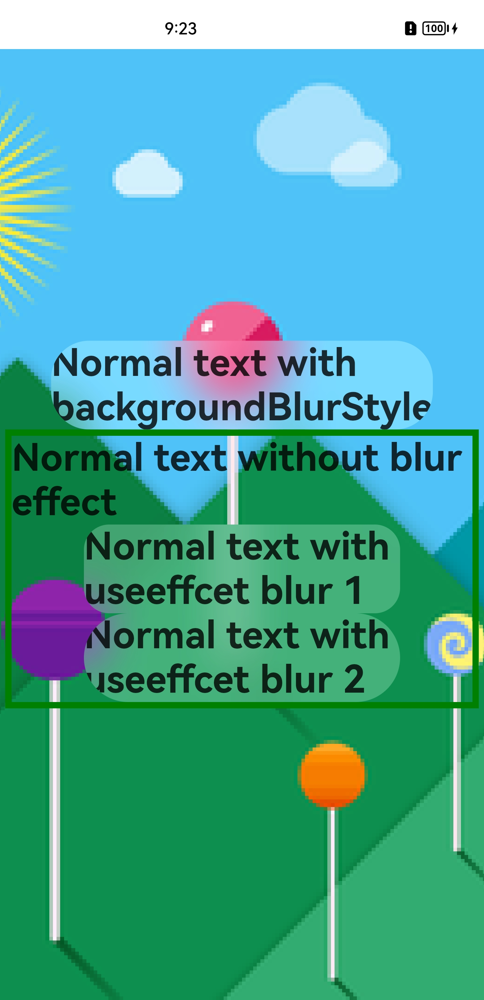

# EffectComponent

特效合并容器组件，用于子节点特效绘制的合并，实现特效的绘制性能优化。

>  **说明：**
>
> - 该组件从API Version 10开始支持。
>
> - 目前该组件仅支持子组件背景模糊效果的合并优化。在对子组件的背景模糊特效进行绘制合并时，需要将子组件的backgroundBlurStyle(BlurStyle)属性替换成userEffect(true)。


## 子组件

可以包含子组件。


## 接口

EffectComponent()

创建特效合并组件，用于对子组件背景模糊特效绘制的合并。

## 事件

无，不支持通用事件。

## 属性

支持通用属性，目前仅支持对backgroundBlurStyle属性做绘制合并优化。

## 示例

```ts
//index.ets
@Entry
@Component
struct Index {
  build() {
    Stack() {
      Image("pages/test1.png")
        .autoResize(true)
      EffectComponent() {
        Column({ space: 20 }) {
          Text("Normal text with backgroundBlurStyle")
            .textAlign(TextAlign.Center)
            .fontSize(16)
            .fontWeight(FontWeight.Medium)
            .backgroundBlurStyle(BlurStyle.Thin)
            .borderRadius(16)
            .width('90%')
            .height('48')

          Text("Normal text without blur effect")
            .textAlign(TextAlign.Center)
            .fontSize(16)
            .fontWeight(FontWeight.Medium)
            .border({ width: 1 })
            .borderRadius(16)
            .width('90%')
            .height('48')

          Text("Normal text with useeffcet blur 1")
            .textAlign(TextAlign.Center)
            .useEffect(true)
            .fontSize(16)
            .fontWeight(FontWeight.Medium)
            .borderRadius(16)
            .width('90%')
            .height('48')

          Text("Normal text with useeffcet blur 2")
            .textAlign(TextAlign.Center)
            .useEffect(true)
            .fontSize(16)
            .fontWeight(FontWeight.Medium)
            .borderRadius(16)
            .width('90%')
            .height('48')
        }
        .width('100%')
      }
      .backgroundBlurStyle(BlurStyle.Thin)
    }
    .backgroundColor(Color.Black)
    .width('100%')
    .height('100%')
  }
}
```

