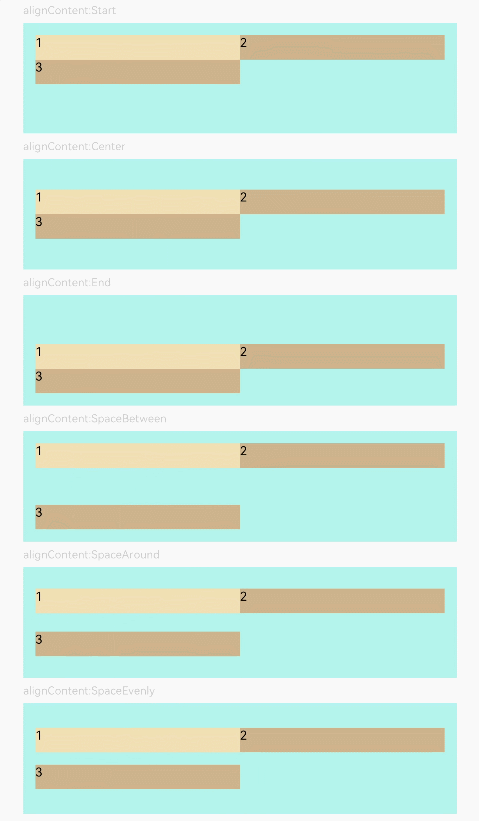

# Flex

> **说明：**
> 该组件从API Version 7开始支持。后续版本如有新增内容，则采用上角标单独标记该内容的起始版本。


弹性布局组件。


## 权限列表

无


## 子组件

可以包含子组件。


## 接口

Flex(options?: { direction?: FlexDirection, wrap?: FlexWrap,  justifyContent?: FlexAlign, alignItems?: ItemAlign, alignContent?: FlexAlign })

标准Flex布局容器。

- 参数
  | 参数名            | 参数类型                                     | 必填   | 默认值               | 参数描述                                     |
  | -------------- | ---------------------------------------- | ---- | ----------------- | ---------------------------------------- |
  | direction      | FlexDirection                            | 否    | FlexDirection.Row | 子组件在Flex容器上排列的方向，即主轴的方向。                 |
  | wrap           | FlexWrap                                 | 否    | FlexWrap.NoWrap   | Flex容器是单行/列还是多行/列排列。                     |
  | justifyContent | FlexAlign                                | 否    | FlexAlign.Start   | 子组件在Flex容器主轴上的对齐格式。                      |
  | alignItems     | [ItemAlign](ts-appendix-enums.md#itemalign枚举说明) | 否    | ItemAlign.Stretch | 子组件在Flex容器交叉轴上的对齐格式。                     |
  | alignContent   | FlexAlign                                | 否    | FlexAlign.Start   | 交叉轴中有额外的空间时，多行内容的对齐方式。仅在wrap为Wrap或WrapReverse下生效。 |

- FlexDirection枚举说明
  | 名称            | 描述               |
  | ------------- | ---------------- |
  | Row           | 主轴与行方向一致作为布局模式。  |
  | RowReverse    | 与Row方向相反方向进行布局。  |
  | Column        | 主轴与列方向一致作为布局模式。  |
  | ColumnReverse | 与Column相反方向进行布局。 |

- FlexWrap枚举说明
  | 名称          | 描述                          |
  | ----------- | --------------------------- |
  | NoWrap      | Flex容器的元素单行/列布局，子项允许超出容器。   |
  | Wrap        | Flex容器的元素多行/列排布，子项允许超出容器。   |
  | WrapReverse | Flex容器的元素反向多行/列排布，子项允许超出容器。 |

- FlexAlign枚举说明
  | 名称           | 描述                                       |
  | ------------ | ---------------------------------------- |
  | Start        | 元素在主轴方向首端对齐,&nbsp;第一个元素与行首对齐，同时后续的元素与前一个对齐。 |
  | Center       | 元素在主轴方向中心对齐，第一个元素与行首的距离与最后一个元素与行尾距离相同。   |
  | End          | 元素在主轴方向尾部对齐,&nbsp;&nbsp;最后一个元素与行尾对齐，其他元素与后一个对齐。 |
  | SpaceBetween | Flex主轴方向均匀分配弹性元素，相邻元素之间距离相同。&nbsp;第一个元素与行首对齐，最后一个元素与行尾对齐。 |
  | SpaceAround  | Flex主轴方向均匀分配弹性元素，相邻元素之间距离相同。&nbsp;第一个元素到行首的距离和最后一个元素到行尾的距离是相邻元素之间距离的一半。 |
  | SpaceEvenly  | Flex主轴方向元素等间距布局，&nbsp;相邻元素之间的间距、第一个元素与行首的间距、最后一个元素到行尾的间距都完全一样。 |


## 示例

```ts
// xxx.ets
@Entry
@Component
struct FlexExample1 {
  build() {
    Column() {
      Column({ space: 5 }) {
        Text('direction:Row').fontSize(9).fontColor(0xCCCCCC).width('90%')
        Flex({ direction: FlexDirection.Row }) {
          Text('1').width('20%').height(50).backgroundColor(0xF5DEB3)
          Text('2').width('20%').height(50).backgroundColor(0xD2B48C)
          Text('3').width('20%').height(50).backgroundColor(0xF5DEB3)
          Text('4').width('20%').height(50).backgroundColor(0xD2B48C)
        }
        .height(70)
        .width('90%')
        .padding(10)
        .backgroundColor(0xAFEEEE)

        Text('direction:RowReverse').fontSize(9).fontColor(0xCCCCCC).width('90%')
        Flex({ direction: FlexDirection.RowReverse }) {
          Text('1').width('20%').height(50).backgroundColor(0xF5DEB3)
          Text('2').width('20%').height(50).backgroundColor(0xD2B48C)
          Text('3').width('20%').height(50).backgroundColor(0xF5DEB3)
          Text('4').width('20%').height(50).backgroundColor(0xD2B48C)
        }
        .height(70)
        .width('90%')
        .padding(10)
        .backgroundColor(0xAFEEEE)

        Text('direction:Column').fontSize(9).fontColor(0xCCCCCC).width('90%')
        Flex({ direction: FlexDirection.Column }) {
          Text('1').width('100%').height(40).backgroundColor(0xF5DEB3)
          Text('2').width('100%').height(40).backgroundColor(0xD2B48C)
          Text('3').width('100%').height(40).backgroundColor(0xF5DEB3)
          Text('4').width('100%').height(40).backgroundColor(0xD2B48C)
        }
        .height(160)
        .width('90%')
        .padding(10)
        .backgroundColor(0xAFEEEE)

        Text('direction:ColumnReverse').fontSize(9).fontColor(0xCCCCCC).width('90%')
        Flex({ direction: FlexDirection.ColumnReverse }) {
          Text('1').width('100%').height(40).backgroundColor(0xF5DEB3)
          Text('2').width('100%').height(40).backgroundColor(0xD2B48C)
          Text('3').width('100%').height(40).backgroundColor(0xF5DEB3)
          Text('4').width('100%').height(40).backgroundColor(0xD2B48C)
        }
        .height(160)
        .width('90%')
        .padding(10)
        .backgroundColor(0xAFEEEE)
      }.width('100%').margin({ top: 5 })
    }.width('100%')
  }
}
```


```ts
// xxx.ets
@Entry
@Component
struct FlexExample2 {
  build() {
    Column() {
      Column({ space: 5 }) {
        Text('Wrap').fontSize(9).fontColor(0xCCCCCC).width('90%')
        Flex({ wrap: FlexWrap.Wrap }) {
          Text('1').width('50%').height(50).backgroundColor(0xF5DEB3)
          Text('2').width('50%').height(50).backgroundColor(0xD2B48C)
          Text('3').width('50%').height(50).backgroundColor(0xD2B48C)
        }
        .width('90%')
        .padding(10)
        .backgroundColor(0xAFEEEE)

        Text('NoWrap').fontSize(9).fontColor(0xCCCCCC).width('90%')
        Flex({ wrap: FlexWrap.NoWrap }) {
          Text('1').width('50%').height(50).backgroundColor(0xF5DEB3)
          Text('2').width('50%').height(50).backgroundColor(0xD2B48C)
          Text('3').width('50%').height(50).backgroundColor(0xF5DEB3)
        }
        .width('90%')
        .padding(10)
        .backgroundColor(0xAFEEEE)

        Text('WrapReverse').fontSize(9).fontColor(0xCCCCCC).width('90%')
        Flex({ wrap: FlexWrap.WrapReverse , direction:FlexDirection.Row }) {
          Text('1').width('50%').height(50).backgroundColor(0xF5DEB3)
          Text('2').width('50%').height(50).backgroundColor(0xD2B48C)
          Text('3').width('50%').height(50).backgroundColor(0xD2B48C)
        }
        .width('90%')
        .height(120)
        .padding(10)
        .backgroundColor(0xAFEEEE)
      }.width('100%').margin({ top: 5 })
    }.width('100%')
  }
}
```


```ts
// xxx.ets
@Component
struct JustifyContentFlex {
  @Prop justifyContent : number

  build() {
    Flex({ justifyContent: this.justifyContent }) {
      Text('1').width('20%').height(50).backgroundColor(0xF5DEB3)
      Text('2').width('20%').height(50).backgroundColor(0xD2B48C)
      Text('3').width('20%').height(50).backgroundColor(0xF5DEB3)
    }
    .width('90%')
    .padding(10)
    .backgroundColor(0xAFEEEE)
  }
}

@Entry
@Component
struct FlexExample3 {
  build() {
    Column() {
      Column({ space: 5 }) {
        Text('justifyContent:Start').fontSize(9).fontColor(0xCCCCCC).width('90%')
        JustifyContentFlex({ justifyContent: FlexAlign.Start })

        Text('justifyContent:Center').fontSize(9).fontColor(0xCCCCCC).width('90%')
        JustifyContentFlex({ justifyContent: FlexAlign.Center })

        Text('justifyContent:End').fontSize(9).fontColor(0xCCCCCC).width('90%')
        JustifyContentFlex({ justifyContent: FlexAlign.End })

        Text('justifyContent:SpaceBetween').fontSize(9).fontColor(0xCCCCCC).width('90%')
        JustifyContentFlex({ justifyContent: FlexAlign.SpaceBetween })

        Text('justifyContent:SpaceAround').fontSize(9).fontColor(0xCCCCCC).width('90%')
        JustifyContentFlex({ justifyContent: FlexAlign.SpaceAround })

        Text('justifyContent:SpaceEvenly').fontSize(9).fontColor(0xCCCCCC).width('90%')
        JustifyContentFlex({ justifyContent: FlexAlign.SpaceEvenly })
      }.width('100%').margin({ top: 5 })
    }.width('100%')
  }
}
```


```ts
// xxx.ets
@Component
struct AlignItemsFlex {
  @Prop alignItems : number

  build() {
    Flex({ alignItems: this.alignItems }) {
      Text('1').width('33%').height(30).backgroundColor(0xF5DEB3)
      Text('2').width('33%').height(40).backgroundColor(0xD2B48C)
      Text('3').width('33%').height(50).backgroundColor(0xF5DEB3)
    }
    .size({width: '90%', height: 80})
    .padding(10)
    .backgroundColor(0xAFEEEE)
  }
}

@Entry
@Component
struct FlexExample4 {
  build() {
    Column() {
      Column({ space: 5 }) {
        Text('alignItems:Auto').fontSize(9).fontColor(0xCCCCCC).width('90%')
        AlignItemsFlex({ alignItems: ItemAlign.Auto })

        Text('alignItems:Start').fontSize(9).fontColor(0xCCCCCC).width('90%')
        AlignItemsFlex({ alignItems: ItemAlign.Start })

        Text('alignItems:Center').fontSize(9).fontColor(0xCCCCCC).width('90%')
        AlignItemsFlex({ alignItems: ItemAlign.Center })

        Text('alignItems:End').fontSize(9).fontColor(0xCCCCCC).width('90%')
        AlignItemsFlex({ alignItems: ItemAlign.End })

        Text('alignItems:Stretch').fontSize(9).fontColor(0xCCCCCC).width('90%')
        AlignItemsFlex({ alignItems: ItemAlign.Stretch })

        Text('alignItems:Baseline').fontSize(9).fontColor(0xCCCCCC).width('90%')
        AlignItemsFlex({ alignItems: ItemAlign.Baseline })
      }.width('100%').margin({ top: 5 })
    }.width('100%')
  }
}
```


```ts
// xxx.ets
@Component
struct AlignContentFlex {
  @Prop alignContent: number

  build() {
    Flex({ wrap: FlexWrap.Wrap, alignContent: this.alignContent }) {
      Text('1').width('50%').height(20).backgroundColor(0xF5DEB3)
      Text('2').width('50%').height(20).backgroundColor(0xD2B48C)
      Text('3').width('50%').height(20).backgroundColor(0xD2B48C)
    }
    .size({ width: '90%', height: 90 })
    .padding(10)
    .backgroundColor(0xAFEEEE)
  }
}

@Entry
@Component
struct FlexExample5 {
  build() {
    Column() {
      Column({ space: 5 }) {
        Text('alignContent:Start').fontSize(9).fontColor(0xCCCCCC).width('90%')
        AlignContentFlex({ alignContent: FlexAlign.Start })

        Text('alignContent:Center').fontSize(9).fontColor(0xCCCCCC).width('90%')
        AlignContentFlex({ alignContent: FlexAlign.Center })

        Text('alignContent:End').fontSize(9).fontColor(0xCCCCCC).width('90%')
        AlignContentFlex({ alignContent: FlexAlign.End })

        Text('alignContent:SpaceBetween').fontSize(9).fontColor(0xCCCCCC).width('90%')
        AlignContentFlex({ alignContent: FlexAlign.SpaceBetween })

        Text('alignContent:SpaceAround').fontSize(9).fontColor(0xCCCCCC).width('90%')
        AlignContentFlex({ alignContent: FlexAlign.SpaceAround })

        Text('alignContent:SpaceEvenly').fontSize(9).fontColor(0xCCCCCC).width('90%')
        AlignContentFlex({ alignContent: FlexAlign.SpaceEvenly })
      }.width('100%').margin({ top: 5 })
    }.width('100%')
  }
}
```


