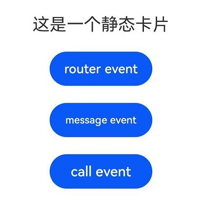

# FormLink

提供静态卡片交互组件，用于静态卡片内部和提供方应用间的交互，当前支持router、message和call三种类型的事件。

> **说明：**
>
> - 该组件从API Version 10开始支持。后续版本如有新增内容，则采用上角标单独标记该内容的起始版本。
>
> - 该组件仅可以在静态卡片中使用。
>

## 权限

无

## 子组件

支持单个子组件

## 接口

FormLink(value: {
  action: string;
  moduleName?: string;
  bundleName?: string;
  abilityName: string;
  params: Object;
})

**参数：**

| 参数名      | 参数类型 | 必填 | 参数描述                                                     |
| ----------- | -------- | ---- | ------------------------------------------------------------ |
| action      | string   | 是   | action的类型，支持三种预定义的类型：<br/>-&nbsp;"router"：跳转到提供方应用的指定UIAbility。<br/>-&nbsp;"message"：自定义消息，触发后会调用提供方FormExtensionAbility的[onFormEvent()](../apis/js-apis-app-form-formExtensionAbility.md#onformevent)生命周期回调。<br/>-&nbsp;"call"：后台启动提供方应用。触发后会拉起提供方应用的指定UIAbility（仅支持launchType为[singleton](../../application-models/uiability-launch-type.md#singleton)的UIAbility，即启动模式为单实例的UIAbility），但不会调度到前台。提供方应用需要具备后台运行权限([ohos.permission.KEEP_BACKGROUND_RUNNING](../../security/permission-list.md#ohospermissionkeep_background_running))。 <br/>**说明：** <br/>不推荐使用router事件刷新卡片UI。|
| moduleName  | string   | 否   | "router"&nbsp;/&nbsp;"call"&nbsp;类型时跳转的模块名，可选。  |
| bundleName  | string   | 否   | "router"&nbsp;/&nbsp;"call"&nbsp;类型时跳转的包名，可选。    |
| abilityName | string   | 是   | "router"&nbsp;/&nbsp;"call"&nbsp;类型时跳转的UIAbility名，必填。 |
| params      | Object   | 是   | 当前action携带的额外参数，内容使用JSON格式的键值对形式。"call"&nbsp;类型时需填入参数'method'，且类型需要为string类型，用于触发UIAbility中对应的方法，必填。 <br/>**说明：** <br/>不推荐通过params传递卡片内部的状态变量。|

## 属性

支持[通用属性](ts-universal-attributes-size.md)

## 事件

不支持[通用事件](ts-universal-events-click.md)

## 示例

```ts
@Entry
@Component
struct FormLinkDemo {
  build() {
    Column() {
      Text("这是一个静态卡片").fontSize(20).margin(10)

      // router事件用于静态卡片跳转到对应的UIAbility
      FormLink({
        action: "router",
        abilityName: "EntryAbility",
        params: {
          'message': 'testForRouter' // 自定义要发送的message
        }
      }) {
        Button("router event").width(120)
      }.margin(10)


      // message事件触发FormExtensionAbility的onFormEvent生命周期
      FormLink({
        action: "message",
        abilityName: "EntryAbility",
        params: {
          'message': 'messageEvent' // 自定义要发送的message
        }
      }) {
        Button("message event").width(120)
      }.margin(10)


      // call事件用于触发UIAbility中对应的方法
      FormLink({
        action: "call",
        abilityName: "EntryAbility",
        params: {
          'method': 'funA', // 在EntryAbility中调用的方法名
          'num': 1 // 需要传递的其他参数
        }
      }) {
        Button("call event").width(120)
      }.margin(10)
    }
    .justifyContent(FlexAlign.Center)
    .width('100%').height('100%')
  }
}
```

