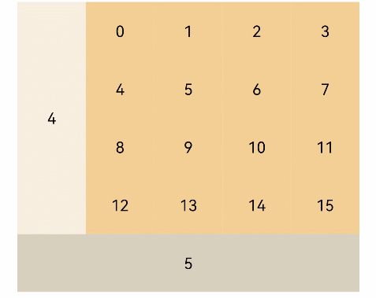

# GridItem

网格容器中单项内容容器。

>  **说明：**
>
>  该组件从API Version 7开始支持。后续版本如有新增内容，则采用上角标单独标记该内容的起始版本。


## 子组件

可以包含子组件。


## 接口

GridItem()


## 属性

| 名称 | 参数类型 | 描述 |
| -------- | -------- | -------- |
| rowStart | number | 指定当前元素起始行号。 |
| rowEnd | number | 指定当前元素终点行号。 |
| columnStart | number | 指定当前元素起始列号。 |
| columnEnd | number | 指定当前元素终点列号。 |
| forceRebuild | boolean | 设置在触发组件build时是否重新创建此节点。<br/>默认值：false |
| selectable<sup>8+</sup> | boolean | 当前GridItem元素是否可以被鼠标框选。<br/>>&nbsp;&nbsp;**说明：**<br/>>&nbsp;外层Grid容器的鼠标框选开启时，GridItem的框选才生效。<br/>默认值：true |


## 事件

| 名称 | 功能描述 |
| -------- | -------- |
| onSelect(event:&nbsp;(isSelected:&nbsp;boolean)&nbsp;=&gt;&nbsp;void)<sup>8+</sup> | GridItem元素被鼠标框选的状态改变时触发回调。<br/>isSelected：进入鼠标框选范围即被选中返回true，&nbsp;移出鼠标框选范围即未被选中返回false。 |


## 示例

```ts
// xxx.ets
@Entry
@Component
struct GridItemExample {
  @State numbers: string[] = Array.apply(null, { length: 16 }).map(function (item, i) {
    return i.toString()
  })

  build() {
    Column() {
      Grid() {
        GridItem() {
          Text('4')
            .fontSize(16)
            .backgroundColor(0xFAEEE0)
            .width('100%')
            .height('100%')
            .textAlign(TextAlign.Center)
        }.rowStart(1).rowEnd(4)

        ForEach(this.numbers, (item) => {
          GridItem() {
            Text(item)
              .fontSize(16)
              .backgroundColor(0xF9CF93)
              .width('100%')
              .height('100%')
              .textAlign(TextAlign.Center)
          }.forceRebuild(false)
        }, item => item)

        GridItem() {
          Text('5')
            .fontSize(16)
            .backgroundColor(0xDBD0C0)
            .width('100%')
            .height('100%')
            .textAlign(TextAlign.Center)
        }.columnStart(1).columnEnd(5)
      }
      .columnsTemplate('1fr 1fr 1fr 1fr 1fr')
      .rowsTemplate('1fr 1fr 1fr 1fr 1fr')
      .width('90%').height(300)
    }.width('100%').margin({ top: 5 })
  }
}
```


