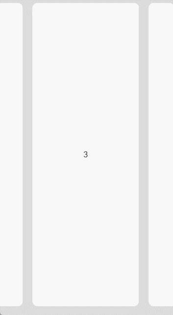

# List

列表包含一系列相同宽度的列表项。适合连续、多行呈现同类数据，例如图片和文本。

> **说明：**
>
> - 该组件从API Version 7开始支持。后续版本如有新增内容，则采用上角标单独标记该内容的起始版本。
> - 该组件回弹的前提是要有滚动。内容小于一屏时，没有回弹效果。


## 子组件

仅支持[ListItem](ts-container-listitem.md)、[ListItemGroup](ts-container-listitemgroup.md)子组件。

> **说明：**
>
> List的子组件的索引值计算规则：
>
> 按子组件的顺序依次递增。
>
> if/else语句中，只有条件成立的分支内的子组件会参与索引值计算，条件不成立的分支内子组件不计算索引值。
>
> ForEach/LazyForEach语句中，会计算展开所有子节点索引值。
>
> [if/else](../../quick-start/arkts-rendering-control-ifelse.md)、[ForEach](../../quick-start/arkts-rendering-control-foreach.md)和[LazyForEach](../../quick-start/arkts-rendering-control-lazyforeach.md)发生变化以后，会更新子节点索引值。
>
> ListItemGroup作为一个整体计算一个索引值，ListItemGroup内部的ListItem不计算索引值。
>
> List子组件visibility属性设置为Hidden或None依然会计算索引值。
>
> List子组件的visibility属性设置为None时不显示，但该子组件上下的space还会生效。


## 接口

List(value?:{space?: number&nbsp;|&nbsp;string, initialIndex?: number, scroller?: Scroller})

从API version 9开始，该接口支持在ArkTS卡片中使用。

**参数：**

| 参数名          | 参数类型                                     | 必填   | 参数描述                                     |
| ------------ | ---------------------------------------- | ---- | ---------------------------------------- |
| space        | number&nbsp;\|&nbsp;string               | 否    | 子组件主轴方向的间隔。<br/>默认值：0<br/>**说明：** <br/>设置为负数或者大于等于List内容区长度时，按默认值显示。<br/>space参数值小于List分割线宽度时，子组件主轴方向的间隔取分割线宽度。 |
| initialIndex | number                                   | 否    | 设置当前List初次加载时视口起始位置显示的item的索引值。<br/>默认值：0<br/>**说明：** <br/>设置为负数或超过了当前List最后一个item的索引值时视为无效取值，无效取值按默认值显示。 |
| scroller     | [Scroller](ts-container-scroll.md#scroller) | 否    | 可滚动组件的控制器。用于与可滚动组件进行绑定。<br/>**说明：** <br/>不允许和其他滚动类组件绑定同一个滚动控制对象。 |

## 属性

除支持[通用属性](ts-universal-attributes-size.md)外，还支持以下属性：

| 名称                                    | 参数类型                                     | 描述                                       |
| ------------------------------------- | ---------------------------------------- | ---------------------------------------- |
| listDirection                         | [Axis](ts-appendix-enums.md#axis)        | 设置List组件排列方向。<br/>默认值：Axis.Vertical<br/>从API version 9开始，该接口支持在ArkTS卡片中使用。 |
| divider                               | {<br/>strokeWidth:&nbsp;[Length](ts-types.md#length),<br/>color?:[ResourceColor](ts-types.md#resourcecolor),<br/>startMargin?:&nbsp;Length,<br/>endMargin?:&nbsp;Length<br/>}&nbsp;\|&nbsp;null | 设置ListItem分割线样式，默认无分割线。<br/>- strokeWidth:&nbsp;分割线的线宽。<br/>- color:&nbsp;分割线的颜色。<br/>- startMargin:&nbsp;分割线与列表侧边起始端的距离。<br/>- endMargin:&nbsp;分割线与列表侧边结束端的距离。<br/>从API version 9开始，该接口支持在ArkTS卡片中使用。<br/>endMargin + startMargin 超过列宽度后startMargin和endMargin会置0。 <br/>strokeWidth, startMargin和endMargin不支持设置百分比。<br/>List的分割线画在主轴方向两个子组件之间，第一个子组件上方和最后一个子组件下方不会绘制分割线。<br/>多列模式下，ListItem与ListItem之间的分割线起始边距从每一列的交叉轴方向起始边开始计算，其他情况从List交叉轴方向起始边开始计算。 |
| scrollBar                             | [BarState](ts-appendix-enums.md#barstate) | 设置滚动条状态。<br/>默认值：BarState.Off<br/>从API version 9开始，该接口支持在ArkTS卡片中使用。<br/>**说明：** <br/>API version 9及以下版本默认值为BarState.Off，API version 10的默认值为BarState.Auto。 |
| cachedCount                           | number                                   | 设置列表中ListItem/ListItemGroup的预加载数量，只在[LazyForEach](../../quick-start/arkts-rendering-control-lazyforeach.md)中生效，其中ListItemGroup将作为一个整体进行计算，ListItemGroup中的所有ListItem会一次性全部加载出来。具体使用可参考[减少应用白块说明](../../performance/arkts-performance-improvement-recommendation.md#减少应用滑动白块)。<br/>默认值：1<br/>从API version 9开始，该接口支持在ArkTS卡片中使用。<br/>**说明：** <br/>单列模式下，会在List显示的ListItem前后各缓存cachedCount个ListItem。<br/>多列模式下， 会在List显示的ListItem前后各缓存cachedCount*列数个ListItem。 |
| editMode<sup>(deprecated)</sup>       | boolean                                  | 声明当前List组件是否处于可编辑模式。<br/>从API version9开始废弃。可参考[示例3](#示例3)实现删除选中的list项。<br/>默认值：false |
| edgeEffect                            | value:[EdgeEffect](ts-appendix-enums.md#edgeeffect), <br/>options?:[EdgeEffectOptions<sup>11+</sup>](ts-container-scroll.md#edgeeffectoptions11对象说明)   | 设置边缘滑动效果。<br/>\- value：设置List组件的边缘滑动效果，支持弹簧效果和阴影效果。<br/>默认值：EdgeEffect.Spring<br/>\- options：设置组件内容大小小于组件自身时，是否开启滑动效果。<br/>默认值：false <br/>从API version 9开始，该接口支持在ArkTS卡片中使用。|
| chainAnimation                        | boolean                                  | 设置当前List是否启用链式联动动效，开启后列表滑动以及顶部和底部拖拽时会有链式联动的效果。链式联动效果：List内的list-item间隔一定距离，在基本的滑动交互行为下，主动对象驱动从动对象进行联动，驱动效果遵循弹簧物理动效。<br/>默认值：false<br/>-&nbsp;false：不启用链式联动。<br/>-&nbsp;true：启用链式联动。<br/>从API version 9开始，该接口支持在ArkTS卡片中使用。<br/>**说明：**<br/>链式动效生效后，List的分割线不显示。<br>链式动效生效需要满足以下前提条件：<br> -&nbsp; List边缘效果为Spring类型<br> -&nbsp; List没有启用多列模式 |
| chainAnimationOptions<sup>10+</sup>   | [ChainAnimationOptions](#chainanimationoptions10对象说明) | 设置链式联动动效参数。<br>**系统API：** 此接口为系统接口。      |
| multiSelectable<sup>8+</sup>          | boolean                                  | 是否开启鼠标框选。<br/>默认值：false<br/>-&nbsp;false：关闭框选。<br/>-&nbsp;true：开启框选。<br/>从API version 9开始，该接口支持在ArkTS卡片中使用。 |
| lanes<sup>9+</sup>                    | number \| [LengthConstrain](ts-types.md#lengthconstrain),<br/>gutter<sup>10+</sup>?:[Dimension](ts-types.md#dimension) | 以列模式为例（listDirection为Axis.Vertical）:<br/>lanes用于决定List组件在交叉轴方向按几列布局。<br/>默认值：1<br/>规则如下：<br/>-&nbsp;lanes为指定的数量时，根据指定的数量与List组件的交叉轴尺寸除以列数作为列的宽度。<br/>-&nbsp;lanes设置了{minLength，maxLength}时，根据List组件的宽度自适应决定lanes数量（即列数），保证缩放过程中lane的宽度符合{minLength，maxLength}的限制。其中，minLength条件会被优先满足，即优先保证符合ListItem的交叉轴尺寸符合最小限制。<br/>-&nbsp;lanes设置了{minLength，maxLength}，如果父组件交叉轴方向尺寸约束为无穷大时，固定按一列排列，列宽度按显示区域内最大的ListItem计算<br/>-&nbsp;ListItemGroup在多列模式下也是独占一行，ListItemGroup中的ListItem按照List组件的lanes属性设置值来布局。<br/>-&nbsp;lanes设置了{minLength，maxLength}时，计算列数会按照ListItemGroup的交叉轴尺寸计算。当ListItemGroup交叉轴尺寸与List交叉轴尺寸不一致时ListItemGroup中的列数与List中的列数可能不一样。<br/>gutter为列间距，当列数大于1时生效。<br />默认值为 0<br/>该接口支持在ArkTS卡片中使用。 |
| alignListItem<sup>9+</sup>            | [ListItemAlign](#listitemalign9枚举说明)     | List交叉轴方向宽度大于ListItem交叉轴宽度 * lanes时，ListItem在List交叉轴方向的布局方式，默认为首部对齐。<br/>默认值：ListItemAlign.Start<br/>该接口支持在ArkTS卡片中使用。 |
| sticky<sup>9+</sup>                   | [StickyStyle](#stickystyle9枚举说明)         | 配合[ListItemGroup](ts-container-listitemgroup.md)组件使用，设置ListItemGroup中header和footer是否要吸顶或吸底。<br/>默认值：StickyStyle.None<br/>该接口支持在ArkTS卡片中使用。<br/>**说明：**<br/>sticky属性可以设置为 StickyStyle.Header \| StickyStyle.Footer 以同时支持header吸顶和footer吸底。 |
| scrollSnapAlign<sup>10+</sup>         | [ScrollSnapAlign](#scrollsnapalign10枚举说明) | 设置列表项滚动结束对齐效果。<br/>默认值：ScrollSnapAlign.NONE<br/>**说明：**<br/>只支持ListItem等高情况下，设置列表项滚动结束对齐效果。<br/>触控板和鼠标滑动List结束后不支持对齐效果。 |
| enableScrollInteraction<sup>10+</sup> | boolean                                  | 设置是否支持滚动手势，当设置为false时，无法通过手指或者鼠标滚动，但不影响控制器的滚动接口。<br/>默认值：true |
| nestedScroll<sup>10+</sup>            | [NestedScrollOptions](ts-container-scroll.md#nestedscrolloptions10对象说明) | 嵌套滚动选项。设置向前向后两个方向上的嵌套滚动模式，实现与父组件的滚动联动。   |
| friction<sup>10+</sup>                | number \| [Resource](ts-types.md#resource) | 设置摩擦系数，手动划动滚动区域时生效，只对惯性滚动过程有影响，对惯性滚动过程中的链式效果有间接影响。<br/>默认值：非可穿戴设备为0.6，可穿戴设备为0.9<br/>**说明：** <br/>设置为小于等于0的值时，按默认值处理 |
| scrollBarWidth<sup>11+</sup>   | string&nbsp;\|&nbsp;number         | 设置滚动条的宽度，不支持百分比设置。<br/>默认值：4<br/>单位：vp<br/>**说明：** <br/>如果滚动条的宽度超过其高度，则滚动条的宽度会变为默认值。 |
| scrollBarColor<sup>11+</sup>   | string&nbsp;\|&nbsp;number&nbsp;\|&nbsp;[Color](ts-appendix-enums.md#color)   | 设置滚动条的颜色。 |

## ListItemAlign<sup>9+</sup>枚举说明

该接口支持在ArkTS卡片中使用。

| 名称     | 描述                        |
| ------ | ------------------------- |
| Start  | ListItem在List中，交叉轴方向首部对齐。 |
| Center | ListItem在List中，交叉轴方向居中对齐。 |
| End    | ListItem在List中，交叉轴方向尾部对齐。 |

## StickyStyle<sup>9+</sup>枚举说明

该接口支持在ArkTS卡片中使用。

| 名称     | 描述                                 |
| ------ | ---------------------------------- |
| None   | ListItemGroup的header不吸顶，footer不吸底。 |
| Header | ListItemGroup的header吸顶，footer不吸底。  |
| Footer | ListItemGroup的footer吸底，header不吸顶。  |

## ChainEdgeEffect<sup>10+</sup>枚举说明

设置链式动效边缘效果。

**系统API：** 此接口为系统接口

| 名称      | 描述                                       |
| ------- | ---------------------------------------- |
| DEFAULT | 默认效果，列表滚动到边缘以后继续拖动，拖拽方向上的列表项间距缩小，拖拽反方向上的列表项间距扩大。 |
| STRETCH | 列表滚动到边缘以后继续拖动，所有列表项间距扩大。                 |

## chainAnimationOptions<sup>10+</sup>对象说明

链式联动动效属性集合，用于设置List最大间距、最小间距、动效强度、传导系数和边缘效果。

**系统API：** 此接口为系统接口

| 名称           | 类型                                       | 必填   | 说明                                       |
| ------------ | ---------------------------------------- | ---- | ---------------------------------------- |
| minSpace     | [Length](ts-types.md#length)             | 是    | 设置链式联动动效最小间距。                            |
| maxSpace     | [Length](ts-types.md#length)             | 是    | 设置链式联动动效最大间距。                            |
| conductivity | number                                   | 否    | 设置链式联动动效传导系数。取值范围[0,1]，数值越大，动效传导范围越远。<br/>默认为0.7。 |
| intensity    | number                                   | 否    | 设置链式联动动效效果强度。取值范围[0,1]，数值越大，动效效果越明显。<br/>默认为0.3。 |
| edgeEffect   | [ChainEdgeEffect](#chainedgeeffect10枚举说明) | 否    | 设置链式联动动效边缘效果。<br/>默认为ChainEdgeEffect.DEFAULT。 |

> **说明：** 
>
> List组件[通用属性clip](ts-universal-attributes-sharp-clipping.md)的默认值为true。

## ScrollSnapAlign<sup>10+</sup>枚举说明

设置列表项滚动结束对齐效果。

从API version 10开始，该接口支持在ArkTS卡片中使用。

左右和上下这种两端对齐的样式：当列表位移至末端，则需要将末端的item完整显示，同时不能露出边界空白区域，此时另一端可以出现不限位对齐的现象。

只支持item等高场景限位，不等高场景可能存在不准确的情况。

| 名称     | 描述                                       |
| ------ | ---------------------------------------- |
| NONE   | 默认无项目滚动对齐效果。            |
| START  | 视图中的第一项将在列表的开头对齐。<br/>**说明：**<br/>当列表位移至末端，需要将末端的item完整显示，可能出现开头不对齐的情况。 |
| CENTER | 视图中的中间项将在列表中心对齐。<br/>**说明：**<br/>顶端和末尾的item都可以在列表中心对齐，列表显示可能露出空白，第一个或最后一个item会对齐到中间位置。 |
| END    | 视图中的最后一项将在列表末尾对齐。<br/>**说明：**<br/>当列表位移至顶端，需要将顶端的item完整显示，可能出现末尾不对齐的情况。 |
## CloseAllSwipeActions<sup>11+</sup>对象说明

收起[EXPANDED](ts-container-listitem.md#swipeactionstate11枚举说明)状态[ListItem](ts-container-listitem.md)回调事件集合，用于设置收起动画完成后回调事件。

| 名称     | 类型     | 必填 | 说明                   |
| :------- | -------- | ---- | ---------------------- |
| onFinish | ()=>void | 否   | 在收起动画完成后触发。 |

## 事件

| 名称                                       | 功能描述                                     |
| ---------------------------------------- | ---------------------------------------- |
| onItemDelete<sup>(deprecated)</sup>(event: (index: number) => boolean) | 当List组件在编辑模式时，点击ListItem右边出现的删除按钮时触发。<br/>从API version9开始废弃。<br/>- index: 被删除的列表项的索引值。 |
| onScroll(event: (scrollOffset: number, scrollState: [ScrollState](#scrollstate枚举说明)) => void) | 列表滑动时触发。<br/>- scrollOffset: 每帧滚动的偏移量，List的内容向上滚动时偏移量为正，向下滚动时偏移量为负。<br/>- scrollState: 当前滑动状态。<br/>从API version 9开始，该接口支持在ArkTS卡片中使用。 |
| onScrollIndex(event: (start: number, end: number, center<sup>10+</sup>: number) => void) | 有子组件划入或划出List显示区域时触发。从API version 10开始，List显示区域中间位置子组件变化时也会触发。<br/>计算索引值时，ListItemGroup作为一个整体占一个索引值，不计算ListItemGroup内部ListItem的索引值。<br/>- start: List显示区域内第一个子组件的索引值。<br/>- end: List显示区域内最后一个子组件的索引值。<br/>- center: List显示区域内中间位置子组件的索引值。<br/>触发该事件的条件：列表初始化时会触发一次，List显示区域内第一个子组件的索引值或最后一个子组件的索引值有变化时会触发。从API version 10开始，List显示区域中间位置子组件变化时也会触发。<br/>List的边缘效果为弹簧效果时，在List划动到边缘继续划动和松手回弹过程不会触发onScrollIndex事件。<br/>从API version 9开始，该接口支持在ArkTS卡片中使用。 |
| onReachStart(event: () => void)          | 列表到达起始位置时触发。<br/>从API version 9开始，该接口支持在ArkTS卡片中使用。<br/>**说明：** <br>List初始化时如果initialIndex为0会触发一次，List滚动到起始位置时触发一次。List边缘效果为弹簧效果时，划动经过起始位置时触发一次，回弹回起始位置时再触发一次。 |
| onReachEnd(event: () => void)            | 列表到底末尾位置时触发。<br/>从API version 9开始，该接口支持在ArkTS卡片中使用。<br/>**说明：** <br/>List边缘效果为弹簧效果时，划动经过末尾位置时触发一次，回弹回末尾位置时再触发一次。 |
| onScrollFrameBegin<sup>9+</sup>(event: (offset: number, state: ScrollState) => { offsetRemain }) | 列表开始滑动时触发，事件参数传入即将发生的滑动量，事件处理函数中可根据应用场景计算实际需要的滑动量并作为事件处理函数的返回值返回，列表将按照返回值的实际滑动量进行滑动。<br/>\- offset：即将发生的滑动量，单位vp。<br/>\- state：当前滑动状态。<br/>- offsetRemain：实际滑动量，单位vp。<br/>触发该事件的条件：手指拖动List、List惯性划动时每帧开始时触发；List超出边缘回弹、使用滚动控制器的滚动不会触发。<br/>该接口支持在ArkTS卡片中使用。<br/>**说明：** <br/>当listDirection的值为Axis.Vertical时，返回垂直方向滑动量，当listDirection的值为Axis.Horizontal时，返回水平方向滑动量。 |
| onScrollStart<sup>9+</sup>(event: () => void) | 列表滑动开始时触发。手指拖动列表或列表的滚动条触发的滑动开始时，会触发该事件。使用[Scroller](ts-container-scroll.md#scroller)滑动控制器触发的带动画的滑动，动画开始时会触发该事件。<br/>该接口支持在ArkTS卡片中使用。 |
| onScrollStop(event: () => void)          | 列表滑动停止时触发。手拖动列表或列表的滚动条触发的滑动，手离开屏幕并且滑动停止时会触发该事件；使用[Scroller](ts-container-scroll.md#scroller)滑动控制器触发的带动画的滑动，动画停止会触发该事件。<br/>从API version 9开始，该接口支持在ArkTS卡片中使用。 |
| onItemMove(event: (from: number, to: number) => boolean) | 列表元素发生移动时触发。<br/>- from: 移动前索引值。<br/>- to: 移动后索引值。 |
| onItemDragStart(event: (event: ItemDragInfo, itemIndex: number) => ((() => any) \| void) | 开始拖拽列表元素时触发。<br/>- event: 见[ItemDragInfo对象说明](ts-container-grid.md#itemdraginfo对象说明)。<br/>- itemIndex: 被拖拽列表元素索引值。 |
| onItemDragEnter(event: (event: ItemDragInfo) => void) | 拖拽进入列表元素范围内时触发。<br/>- event: 见[ItemDragInfo对象说明](ts-container-grid.md#itemdraginfo对象说明)。 |
| onItemDragMove(event: (event: ItemDragInfo, itemIndex: number, insertIndex: number) => void) | 拖拽在列表元素范围内移动时触发。<br/>- event: 见[ItemDragInfo对象说明](ts-container-grid.md#itemdraginfo对象说明)。<br/>- itemIndex: 拖拽起始位置。<br/>- insertIndex: 拖拽插入位置。 |
| onItemDragLeave(event: (event: ItemDragInfo, itemIndex: number) => void) | 拖拽离开列表元素时触发。<br/>- event: 见[ItemDragInfo对象说明](ts-container-grid.md#itemdraginfo对象说明)。<br/>- itemIndex: 拖拽离开的列表元素索引值。 |
| onItemDrop(event: (event: ItemDragInfo, itemIndex: number, insertIndex: number, isSuccess: boolean) => void) | 绑定该事件的列表元素可作为拖拽释放目标，当在列表元素内停止拖拽时触发。<br/>- event: 见[ItemDragInfo对象说明](ts-container-grid.md#itemdraginfo对象说明)。<br/>- itemIndex: 拖拽起始位置。<br/>- insertIndex: 拖拽插入位置。<br/>- isSuccess: 是否成功释放。<br/>**说明：** <br/>跨List拖拽时，当拖拽释放的位置绑定了onItemDrop时会返回true，否则为false。List内部拖拽时，isSuccess为onItemMove事件的返回值。 |

## ScrollState枚举说明

从API version 9开始，该接口支持在ArkTS卡片中使用。

| 名称     | 描述                                       |
| ------ | ---------------------------------------- |
| Idle   | 空闲状态。使用控制器提供的方法控制滚动时触发，拖动滚动条滚动时触发。<br/>**说明：** <br/> 从API version 10开始，调整为滚动状态回归空闲时触发，控制器提供的无动画方法控制滚动时触发。 |
| Scroll | 滚动状态。使用手指拖动List滚动时触发。<br/>**说明：** <br/> 从API version 10开始，拖动滚动条滚动和滚动鼠标滚轮时也会触发。 |
| Fling  | 惯性滚动状态。快速划动松手后进行惯性滚动和划动到边缘回弹时触发。<br/>**说明：** <br/> 从API version 10开始，由动画控制的滚动都触发。包括快速划动松手后的惯性滚动，划动到边缘回弹的滚动，快速拖动内置滚动条松手后的惯性滚动，使用滚动控制器提供的带动画的方法控制的滚动。 |

ScrollState枚举变更如下。

| 场景            | API version 9及以下 | API version 10开始 |
| ------------- | ---------------- | ---------------- |
| 手指拖动滑动        | Scroll           | Scroll           |
| 惯性滚动          | Fling            | Fling            |
| 过界回弹          | Fling            | Fling            |
| 鼠标滚轮滚动        | Idle             | Scroll           |
| 拖动滚动条         | Idle             | Scroll           |
| 滚动控制器滚动（带动画）  | Idle             | Fling            |
| 滚动控制器滚动（不带动画） | Idle             | Idle             |

>  **说明：**
>
>  要使List处于可编辑模式需配合onItemDelete事件和ListItem的editable属性，即可编辑模式实现删除列表项功能，需满足以下条件（该功能从API9开始废弃）：
>
>  - editMode属性设置为true。
>
>  - 绑定onItemDelete事件，且事件回调返回true。
>
>  - ListItem的editable属性设置为true。
>
>  实现ListItem拖拽，需满足以下条件：
>
>  - editMode属性设置为true（从API9开始无需设置editMode属性）。
>
>  - 绑定onDragStart事件，且事件回调中返回浮动UI布局。

## ListScroller<sup>11+</sup>

List组件的滚动控制器，通过它控制List组件的滚动，仅支持一对一绑定到List组件。


>  **说明：**
>
>  ListScroller继承自[Scroller](ts-container-scroll.md#scroller)，具有[Scroller](ts-container-scroll.md#scroller)的全部方法。

### 导入对象

```
listScroller: ListScroller = new ListScroller()
```


### getItemRectInGroup<sup>11+</sup>

getItemRectInGroup(index: number, indexInGroup: number): RectResult

获取[ListItemGroup](ts-container-listitemgroup.md)中的[ListItem](ts-container-listitem.md)的大小和相对于List的位置。

**参数：**

| 参数名   | 参数类型   | 必填   | 参数描述              |
| ----- | ------ | ---- | ----------------- |
| index | number | 是    | ListItemGroup在List中的索引值。 |
| indexInGroup | number | 是    | ListItem在ListItemGroup中的索引值。 |

> **说明：**
>
> - index必须是当前显示区域显示的子组件的索引值，否则视index为非法值。
> - 索引值为index的子组件必须是ListItemGroup，否则视index为非法值。
> - indexInGroup必须是当前显示区域内ListItemGroup中显示的ListItem的索引值，否则视indexInGroup为非法值。
> - index或者indexInGroup为非法值时返回的大小和位置均为0。

**返回值：**

| 类型       | 说明       |
| -------------------  | -------- |
| [RectResult](ts-types.md#rectresult10) | ListItemGroup中的ListItem的大小和相对于List的位置。 |

### scrollToItemInGroup<sup>11+</sup>

scrollToItemInGroup(index: number, indexInGroup:number, smooth?: boolean, align?: ScrollAlign): void

滑动到指定的ListItemGroup中指定的ListItem。

开启smooth动效时，会对经过的所有item进行加载和布局计算，当大量加载item时会导致性能问题。

**参数：**

| 参数名                | 参数类型 | 必填 | 参数描述                                                     |
| --------------------- | -------- | ---- | ------------------------------------------------------------ |
| index                 | number   | 是   | 要滑动到的目标元素所在的ListItemGroup在当前容器中的索引值。      <br/>**说明：** <br/>index值设置成负值或者大于当前容器子组件的最大索引值，视为异常值，本次跳转不生效。                     |
| indexInGroup          | number   | 是   | 要滑动到的目标元素在index指定的ListItemGroup中的索引值。      <br/>**说明：** <br/>indexInGroup值设置成负值或者大于index指定的ListItemGroup容器子组件的最大索引值，视为异常值，本次跳转不生效。|
| smooth                | boolean  | 否   | 设置滑动到列表项在列表中的索引值时是否有动效，true表示有动效，false表示没有动效。<br/>默认值：false。 |
| align                 | [ScrollAlign](ts-container-scroll.md#scrollalign10枚举说明)  | 否   | 指定滑动到的元素与当前容器的对齐方式。<br/>默认值：ScrollAlign.START。 |

### closeAllSwipeActions<sup>11+</sup>

closeAllSwipeActions(options?: [CloseSwipeActionOptions](#closeallswipeactions11对象说明)): void

将[EXPANDED](ts-container-listitem.md#swipeactionstate11枚举说明)状态的[ListItem](ts-container-listitem.md)收起，并设置回调事件。

**参数：**

| 参数名  | 参数类型                                                   | 必填 | 参数描述                                                     |
| ------- | ---------------------------------------------------------- | ---- | ------------------------------------------------------------ |
| options | [CloseSwipeActionOptions](#closeallswipeactions11对象说明) | 否   | 收起[EXPANDED](ts-container-listitem.md#swipeactionstate11枚举说明)状态的[ListItem](ts-container-listitem.md)的回调事件集合。 |

> **说明：**
>
> - ListScroller必须绑定到List组件上。

## 示例

### 示例1

```ts
// xxx.ets
@Entry
@Component
struct ListExample {
  private arr: number[] = [0, 1, 2, 3, 4, 5, 6, 7, 8, 9]

  build() {
    Column() {
      List({ space: 20, initialIndex: 0 }) {
        ForEach(this.arr, (item: number) => {
          ListItem() {
            Text('' + item)
              .width('100%').height(100).fontSize(16)
              .textAlign(TextAlign.Center).borderRadius(10).backgroundColor(0xFFFFFF)
          }
        }, (item: string) => item)
      }
      .listDirection(Axis.Vertical) // 排列方向
      .scrollBar(BarState.Off)
      .friction(0.6)
      .divider({ strokeWidth: 2, color: 0xFFFFFF, startMargin: 20, endMargin: 20 }) // 每行之间的分界线
      .edgeEffect(EdgeEffect.Spring) // 边缘效果设置为Spring
      .onScrollIndex((firstIndex: number, lastIndex: number, centerIndex: number) => {
        console.info('first' + firstIndex)
        console.info('last' + lastIndex)
        console.info('center' + centerIndex)
      })
      .onScroll((scrollOffset: number, scrollState: ScrollState) => {
        console.info(`onScroll scrollState = ScrollState` + scrollState + `, scrollOffset = ` + scrollOffset)
      })
      .width('90%')
    }
    .width('100%')
    .height('100%')
    .backgroundColor(0xDCDCDC)
    .padding({ top: 5 })
  }
}
```


### 示例2

```ts
// xxx.ets
@Entry
@Component
struct ListLanesExample {
  @State arr: string[] = ["0", "1", "2", "3", "4", "5", "6", "7", "8", "9", "10", "11", "12", "13", "14", "15", "16", "17", "18", "19"]
  @State alignListItem: ListItemAlign = ListItemAlign.Start

  build() {
    Column() {
      List({ space: 20, initialIndex: 0 }) {
        ForEach(this.arr, (item: string) => {
          ListItem() {
            Text('' + item)
              .width('100%')
              .height(100)
              .fontSize(16)
              .textAlign(TextAlign.Center)
              .borderRadius(10)
              .backgroundColor(0xFFFFFF)
          }
          .border({ width: 2, color: Color.Green })
        }, (item: string) => item)
      }
      .height(300)
      .width("90%")
      .friction(0.6)
      .border({ width: 3, color: Color.Red })
      .lanes({ minLength: 40, maxLength: 40 })
      .alignListItem(this.alignListItem)
      .scrollBar(BarState.Off)

      Button("点击更改alignListItem:" + this.alignListItem).onClick(() => {
        if (this.alignListItem == ListItemAlign.Start) {
          this.alignListItem = ListItemAlign.Center
        } else if (this.alignListItem == ListItemAlign.Center) {
          this.alignListItem = ListItemAlign.End
        } else {
          this.alignListItem = ListItemAlign.Start
        }
      })
    }.width('100%').height('100%').backgroundColor(0xDCDCDC).padding({ top: 5 })
  }
}
```


### 示例3

```ts
// xxx.ets
@Entry
@Component
struct ListExample {
  @State arr: number[] = [0, 1, 2, 3, 4, 5, 6, 7, 8, 9]
  @State editFlag: boolean = false

  build() {
    Stack({ alignContent: Alignment.TopStart }) {
      Column() {
        List({ space: 20, initialIndex: 0 }) {
          ForEach(this.arr, (item: number, index?: number) => {
            ListItem() {
              Flex({ direction: FlexDirection.Row, alignItems: ItemAlign.Center }) {
                Text('' + item)
                  .width('100%')
                  .height(80)
                  .fontSize(20)
                  .textAlign(TextAlign.Center)
                  .borderRadius(10)
                  .backgroundColor(0xFFFFFF)
                  .flexShrink(1)
                if (this.editFlag) {
                  Button() {
                    Text("delete").fontSize(16)
                  }.width('30%').height(40)
                  .onClick(() => {
                    if (index != undefined) {
                      console.info(this.arr[index] + 'Delete')
                      this.arr.splice(index, 1)
                      console.info(JSON.stringify(this.arr))
                      this.editFlag = false
                    }
                  }).stateEffect(true)
                }
              }
            }
          }, (item: string) => item)
        }.width('90%')
        .scrollBar(BarState.Off)
        .friction(0.6)
      }.width('100%')

      Button('edit list')
        .onClick(() => {
          this.editFlag = !this.editFlag
        }).margin({ top: 5, left: 20 })
    }.width('100%').height('100%').backgroundColor(0xDCDCDC).padding({ top: 5 })
  }
}
```


### 示例4

```ts
// xxx.ets
@Entry
@Component
struct ListExample {
  private arr: number[] = []
  private scrollerForList: Scroller = new Scroller()

  aboutToAppear() {
    for (let i = 0; i < 20; i++) {
      this.arr.push(i)
    }
  }
  build() {
    Column() {
      Row() {
        List({ space: 20, initialIndex: 3, scroller: this.scrollerForList }) {
          ForEach(this.arr, (item: number) => {
            ListItem() {
              Text('' + item)
                .width('100%').height(100).fontSize(16)
                .textAlign(TextAlign.Center)
            }
            .borderRadius(10).backgroundColor(0xFFFFFF)
            .width('60%')
            .height('80%')
          }, (item: number) => JSON.stringify(item))
        }
        .chainAnimationOptions({
          minSpace: 20,
          maxSpace: 60,
          edgeEffect: ChainEdgeEffect.STRETCH
        })
        .chainAnimation(true)
        .edgeEffect(EdgeEffect.Spring)
        .listDirection(Axis.Horizontal)
        .height('100%')
        .width('100%')
        .scrollSnapAlign(ScrollSnapAlign.CENTER)
        .borderRadius(10)
        .backgroundColor(0xDCDCDC)
      }
      .width('100%')
      .height('100%')
      .backgroundColor(0xDCDCDC)
      .padding({ top: 10 })
    }
  }
}

```

