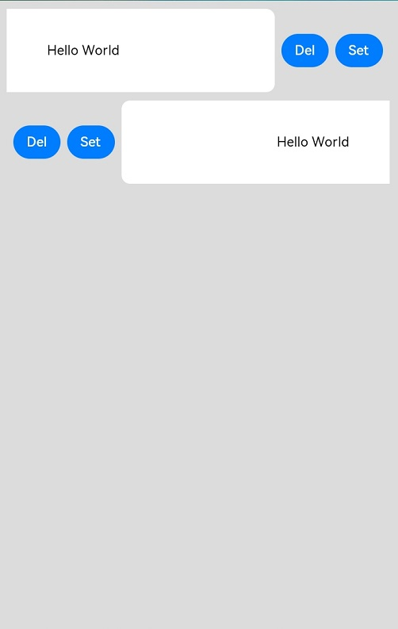

# ListItem

用来展示列表具体item，必须配合List来使用。

>  **说明：**
>
>  该组件从API Version 7开始支持。后续版本如有新增内容，则采用上角标单独标记该内容的起始版本。


## 子组件

可以包含单个子组件。


## 接口

ListItem(value?: string)

从API version 9开始，该接口支持在ArkTS卡片中使用。

## 属性

除支持[通用属性](ts-universal-attributes-size.md)外，还支持以下属性：

| 名称 | 参数类型 | 描述 |
| -------- | -------- | -------- |
| sticky<sup>(deprecated)</sup> | [Sticky](#stickydeprecated枚举说明) | 设置ListItem吸顶效果。<br/>默认值：Sticky.None<br/>从API version9开始废弃，推荐使用[List组件sticky属性](ts-container-list.md#属性)。 |
| editable<sup>(deprecated)</sup>  | boolean&nbsp;\|&nbsp;[EditMode](#editmodedeprecated枚举说明) | 当前ListItem元素是否可编辑，进入编辑模式后可删除或移动列表项。<br/>从API version9开始废弃。<br/>默认值：false |
| selectable<sup>8+</sup> | boolean | 当前ListItem元素是否可以被鼠标框选。<br/>**说明：**<br/>外层List容器的鼠标框选开启时，ListItem的框选才生效。<br/>默认值：true |
<<<<<<< Updated upstream
| swipeAction<sup>9+</sup> | {<br/>start?:&nbsp;CustomBuilder,<br/>end?:CustomBuilder,<br/>edgeEffect?:&nbsp;[SwipeEdgeEffect](#swipeedgeeffect9枚举说明),<br/>startDeleteArea?:&nbsp;[SwipeDeleteArea](#SwipeDeleteArea10对象说明),<br/>endDeleteArea?:&nbsp;[SwipeDeleteArea](#SwipeDeleteArea10对象说明),<br/>} | 用于设置ListItem的划出组件。<br/>- start:&nbsp;ListItem向右划动时item左边的组件（List垂直布局时）或ListItem向下划动时item上方的组件（List水平布局时）。<br/>- end:&nbsp;ListItem向左划动时item右边的组件（List垂直布局时）或ListItem向上划动时item下方的组件（List水平布局时）。<br/>- edgeEffect:&nbsp;滑动效果。<br/>- startDeleteArea:&nbsp;ListItem向右划动时item左边的组件长距离滑动删除选项（List垂直布局时）或ListItem向下划动时item上方的组件长距离滑动删除选项（List水平布局时）。<br/>- endDeleteArea:&nbsp;ListItem向左划动时item右边的组件长距离滑动删除选项（List垂直布局时）或ListItem向上划动时item下方的组件长距离滑动删除选项（List水平布局时）。<br/>**说明：** <br/>start和end对应的@builder函数中顶层必须是单个组件，不能是if/else、ForEach、LazyForEach语句。<br/>startDeleteArea和endDeleteArea必须有对应的start和end搭配使用。 |
=======
| swipeAction<sup>9+</sup> | {<br/>start?:&nbsp;CustomBuilder&nbsp;\|&nbsp;[SwipeActionItem](#SwipeActionItem10对象说明),<br/>end?:CustomBuilder&nbsp;\|&nbsp;[SwipeActionItem](#SwipeActionItem10对象说明),<br/>edgeEffect?:&nbsp;[SwipeEdgeEffect](#swipeedgeeffect9枚举说明),<br/>} | 用于设置ListItem的划出组件。<br/>- start:&nbsp;ListItem向右划动时item左边的组件（List垂直布局时）或ListItem向下划动时item上方的组件（List水平布局时）。<br/>- end:&nbsp;ListItem向左划动时item右边的组件（List垂直布局时）或ListItem向上划动时item下方的组件（List水平布局时）。<br/>- edgeEffect:&nbsp;滑动效果。<br/>- swipeActionItem:&nbsp;ListItem向右或向左划动时item左边或右边的组件长距离滑动删除选项（List垂直布局时）ListItem向下或向上划动时item上方或下方的组件长距离滑动删除选项（List水平布局时）。<br/>**说明：** <br/>start和end对应的@builder函数中顶层必须是单个组件，不能是if/else、ForEach、LazyForEach语句。 |
>>>>>>> Stashed changes

## Sticky<sup>(deprecated)</sup>枚举说明
从API version9开始废弃，推荐使用[List组件stickyStyle枚举](ts-container-list.md#stickystyle9枚举说明)。
| 名称 | 描述 |
| -------- | -------- |
| None | 无吸顶效果。 |
| Normal | 当前item吸顶。 |
| Opacity | 当前item吸顶显示透明度变化效果。 |

## EditMode<sup>(deprecated)</sup>枚举说明
从API version9开始废弃。
| 名称     | 描述        |
| ------ | --------- |
| None   | 编辑操作不限制。    |
| Deletable | 可删除。 |
| Movable | 可移动。 |

## SwipeEdgeEffect<sup>9+</sup>枚举说明
| 名称 | 描述 |
| -------- | -------- |
| Spring | ListItem划动距离超过划出组件大小后可以继续划动，松手后按照弹簧阻尼曲线回弹。 |
| None | ListItem划动距离不能超过划出组件大小。 |

<<<<<<< Updated upstream
## SwipeDeleteArea<sup>10+</sup>对象说明

| 名称                 | 参数类型                                                     | 必填 | 描述                                                         |
| -------------------- | ------------------------------------------------------------ | ---- | ------------------------------------------------------------ |
| deleteAreaDistance | [Length](ts-types.md#length) | 是 | 设置组件长距离滑动删除距离阈值 |
| onDelete | () => **void** | 是 | 组件进入长距删除区后删除ListItem时调用。<br/>进入长距删除区后，抬手时触发；或者滑动速度大于初始速度阈值时触发 |
| onEntryDeleteArea | () => **void** | 否 | 在滑动条目进入删除区域时调用，只触发一次，当再次进入时仍触发。 |
| onExitDeleteArea | () => **void** | 否 |当滑动条目退出删除区域时调用，只触发一次，当再次退出时仍触发。 |
=======
## SwipeActionItem<sup>10+</sup>对象说明

| 名称                 | 参数类型                                                     | 必填 | 描述                                                         |
| -------------------- | ------------------------------------------------------------ | ---- | ------------------------------------------------------------ |
| deleteAreaDistance | [Length](ts-types.md#length) | 否 | 设置组件长距离滑动删除距离阈值 |
| onDelete | () => **void** | 否 | 组件进入长距删除区后删除ListItem时调用。<br/>进入长距删除区后，抬手时触发；或者滑动速度大于初始速度阈值时触发 |
| onEntryDeleteArea | () => **void** | 否 | 在滑动条目进入删除区域时调用，只触发一次，当再次进入时仍触发。 |
| onExitDeleteArea | () => **void** | 否 |当滑动条目退出删除区域时调用，只触发一次，当再次退出时仍触发。 |
| builder |  CustomBuilder | 否 |当列表项向右或向右滑动（当列表方向为“垂直”时），向下或向下滑动（当列方向为“水平”时）时显示的操作项。 |
| useDefaultDeleteAnimation | boolean | 否 |设置是否使用默认的删除动画。 |
>>>>>>> Stashed changes
## 事件

| 名称 | 功能描述 |
| -------- | -------- |
| onSelect(event:&nbsp;(isSelected:&nbsp;boolean)&nbsp;=&gt;&nbsp;void)<sup>8+</sup> | ListItem元素被鼠标框选的状态改变时触发回调。<br/>isSelected：进入鼠标框选范围即被选中返回true，&nbsp;移出鼠标框选范围即未被选中返回false。 |


## 示例

```ts
// xxx.ets
@Entry
@Component
struct ListItemExample {
  private arr: number[] = [0, 1, 2, 3, 4, 5, 6, 7, 8, 9]

  build() {
    Column() {
      List({ space: 20, initialIndex: 0 }) {
        ForEach(this.arr, (item) => {
          ListItem() {
            Text('' + item)
              .width('100%').height(100).fontSize(16)
              .textAlign(TextAlign.Center).borderRadius(10).backgroundColor(0xFFFFFF)
          }
        }, item => item)
      }.width('90%')
    }.width('100%').height('100%').backgroundColor(0xDCDCDC).padding({ top: 5 })
  }
}
```


```ts
// xxx.ets
@Entry
@Component
struct ListItemExample2 {
  @State message: string = 'Hello World'

  @Builder itemEnd() {
    Row () {
      Button("Del").margin("4vp")
      Button("Set").margin("4vp")
    }.padding("4vp").justifyContent(FlexAlign.SpaceEvenly)
  }

  build() {
    Column() {
      List({space:10}) {
        ListItem() {
          Text(this.message)
          .width('100%')
          .height(100)
          .fontSize(16)
          .textAlign(TextAlign.Center)
          .borderRadius(10)
          .backgroundColor(0xFFFFFF)
        }
        .swipeAction({ end:this.itemEnd})

        ListItem() {
          Text(this.message)
          .width('100%')
          .height(100)
          .fontSize(16)
          .textAlign(TextAlign.Center)
          .borderRadius(10)
          .backgroundColor(0xFFFFFF)
        }
        .swipeAction({ start:this.itemEnd})
      }
    }
    .padding(10)
    .backgroundColor(0xDCDCDC)
    .width('100%')
    .height('100%')
  }
}
```


```ts
// xxx.ets
@Entry
@Component
struct ListItemExample3 {
  @State arr: number[] = [0, 1, 2, 3, 4]
<<<<<<< Updated upstream
  @State enterStartDeleteAreaString: string = "not enterStartDeleteArea"
  @State enterEndDeleteAreaString: string = "not enterEndDeleteArea"
  @State exitStartDeleteAreaString: string = "not exitStartDeleteArea"
=======
  @State enterEndDeleteAreaString: string = "not enterEndDeleteArea"
>>>>>>> Stashed changes
  @State exitEndDeleteAreaString: string = "not exitEndDeleteArea"

  @Builder itemEnd(index: number) {
    Row () {
      Button("Del").margin("4vp")
        .onClick( ()=> {
          this.arr.splice(index, 1)
        }
        )
      Button("Set").margin("4vp")
    }.padding("4vp").justifyContent(FlexAlign.SpaceEvenly)
  }

  build() {
    Column() {
      List({space:10}) {
        ForEach(this.arr, (item, index) => {
          ListItem() {
            Text("item" + item)
              .width('100%')
              .height(100)
              .fontSize(16)
              .textAlign(TextAlign.Center)
              .borderRadius(10)
              .backgroundColor(0xFFFFFF)
          }
<<<<<<< Updated upstream
          .swipeAction({ end:this.itemEnd.bind(this, index)})
          .swipeAction({endDeleteArea:{
            onDelete:()=>{
              this.arr.splice(index, 1)
            },
            deleteAreaDistance:80,
            onEntryDeleteArea:()=>{
=======
          .swipeAction({end:{
            builder:this.itemEnd.bind(this, index),
            useDefaultDeleteAnimation:true,
            onDelete:()=>{
              this.arr.splice(index, 1)
            },
            deleteAreaDistance:150,
            onEnterDeleteArea:()=>{
>>>>>>> Stashed changes
              this.enterEndDeleteAreaString = "enterEndDeleteArea"
              this.exitEndDeleteAreaString = "not exitEndDeleteArea"
            },
            onExitDeleteArea:()=>{
              this.enterEndDeleteAreaString = "not enterEndDeleteArea"
              this.exitEndDeleteAreaString = "exitEndDeleteArea"
            }
          }
          })
        }, item => item)
      }
<<<<<<< Updated upstream
      Text(this.enterStartDeleteAreaString).fontSize(20)
      Text(this.enterEndDeleteAreaString).fontSize(20)
      Text(this.exitStartDeleteAreaString).fontSize(20)
=======
      Text(this.enterEndDeleteAreaString).fontSize(20)
>>>>>>> Stashed changes
      Text(this.exitEndDeleteAreaString).fontSize(20)
    }
    .padding(10)
    .backgroundColor(0xDCDCDC)
    .width('100%')
    .height('100%')
  }
}
```
