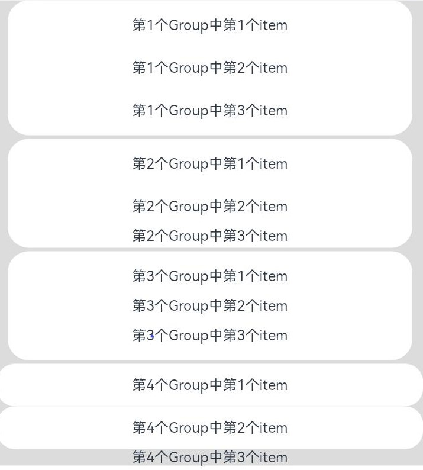

# ListItemGroup

该组件用来展示列表item分组，宽度默认充满[List](ts-container-list.md)组件，必须配合List组件来使用。

> **说明：**
>
> - 该组件从API Version 9开始支持。后续版本如有新增内容，则采用上角标单独标记该内容的起始版本。
> - 该组件的父组件只能是[List](ts-container-list.md)。

## 使用说明

当ListItemGroup的父组件List的listDirection属性为Axis.Vertical时，不允许设置ListItemGroup组件的height属性。ListItemGroup的高度为header高度、footer高度和所有ListItem布局后总高度之和。当父组件List的listDirection属性为Axis.Horizontal时，不允许设置ListItemGroup组件的width属性。ListItemGroup的宽度为header宽度、footer宽度和所有ListItem布局后总宽度之和。

当前ListItemGroup内部的ListItem组件不支持编辑、拖拽功能，即ListItem组件的editable属性不生效。

## 子组件

包含[ListItem](ts-container-listitem.md)子组件。


## 接口

ListItemGroup(options?: {header?: CustomBuilder, footer?: CustomBuilder, space?: number | string, style?: ListItemGroupStyle})

**参数：**

| 参数名              | 参数类型                                            | 必填 | 参数描述                                                     |
| ------------------- | --------------------------------------------------- | ---- | ------------------------------------------------------------ |
| header              | [CustomBuilder](ts-types.md#custombuilder8)         | 否   | 设置ListItemGroup头部组件。                                  |
| footer              | [CustomBuilder](ts-types.md#custombuilder8)         | 否   | 设置ListItemGroup尾部组件。                                  |
| space               | number&nbsp;\|&nbsp;string                          | 否   | 列表项间距。只作用于ListItem与ListItem之间，不作用于header与ListItem、footer与ListItem之间。 |
| style<sup>10+</sup> | [ListItemGroupStyle](#listitemgroupstyle10枚举说明) | 否   | 设置List组件卡片样式。<br/>默认值: ListItemGroupStyle.NONE<br/>设置为ListItemGroupStyle.NONE时无样式。<br/>设置为ListItemStyle.CARD时，必须配合[ListItem](ts-container-listitem.md)的ListItemStyle.CARD同时使用，显示默认卡片样式。 <br/>卡片样式下, 为卡片内的列表选项提供了默认的focus、hover、press、selected和disable样式。<br/>**说明：**<br/>当前卡片模式下，不支持listDirection属性设置，使用默认Axis.Vertical排列方向。<br/>当前卡片模式下，List属性alignListItem默认为ListItemAlign.Center，居中对齐显示。<br/>当前卡片模式下，ListItemGroup不支持设置头部组件header和尾部组件footer。<br/>若仅设置ListItemGroupStyle.CARD，未设置ListItemStyle.CARD时，只显示部分卡片样式及功能。 |

## 属性

| 名称 | 参数类型 |  描述 |
| -------- | -------- | -------- |
| divider | {<br/>strokeWidth:&nbsp;[Length](ts-types.md#length),<br/>color?:&nbsp;[ResourceColor](ts-types.md#resourcecolor),<br/>startMargin?:&nbsp;[Length](ts-types.md#length),<br/>endMargin?:&nbsp;[Length](ts-types.md#length)<br/>}&nbsp;\|&nbsp;null | 用于设置ListItem分割线样式，默认无分割线。<br/>strokeWidth:&nbsp;分割线的线宽。<br/>color:&nbsp;分割线的颜色。<br/>startMargin：&nbsp;分割线距离列表侧边起始端的距离。<br/>endMargin:&nbsp;分割线距离列表侧边结束端的距离。<br/>strokeWidth, startMargin和endMargin不支持设置百分比。 |

## ListItemGroupStyle<sup>10+</sup>枚举说明

| 名称 | 描述               |
| ---- | ------------------ |
| NONE | 无样式。           |
| CARD | 显示默认卡片样式。 |

> **说明：** 
>
> ListItemGroup组件不支持设置[通用属性aspectRatio](ts-universal-attributes-layout-constraints.md)。
>
> ListItemGroup组件如果主轴方向是垂直方向时，设置[通用属性height](ts-universal-attributes-size.md)属性不生效。
>
> ListItemGroup组件如果主轴方向是水平方向时，设置[通用属性width](ts-universal-attributes-size.md)属性不生效。


## 示例

```ts
// xxx.ets
@Entry
@Component
struct ListItemGroupExample {
  private timetable: TimeTable[] = [
    {
      title: '星期一',
      projects: ['语文', '数学', '英语']
    },
    {
      title: '星期二',
      projects: ['物理', '化学', '生物']
    },
    {
      title: '星期三',
      projects: ['历史', '地理', '政治']
    },
    {
      title: '星期四',
      projects: ['美术', '音乐', '体育']
    }
  ]

  @Builder
  itemHead(text: string) {
    Text(text)
      .fontSize(20)
      .backgroundColor(0xAABBCC)
      .width("100%")
      .padding(10)
  }

  @Builder
  itemFoot(num: number) {
    Text('共' + num + "节课")
      .fontSize(16)
      .backgroundColor(0xAABBCC)
      .width("100%")
      .padding(5)
  }

  build() {
    Column() {
      List({ space: 20 }) {
        ForEach(this.timetable, (item: TimeTable) => {
          ListItemGroup({ header: this.itemHead(item.title), footer: this.itemFoot(item.projects.length) }) {
            ForEach(item.projects, (project: string) => {
              ListItem() {
                Text(project)
                  .width("100%")
                  .height(100)
                  .fontSize(20)
                  .textAlign(TextAlign.Center)
                  .backgroundColor(0xFFFFFF)
              }
            }, (item: string) => item)
          }
          .divider({ strokeWidth: 1, color: Color.Blue }) // 每行之间的分界线
        })
      }
      .width('90%')
      .sticky(StickyStyle.Header | StickyStyle.Footer)
      .scrollBar(BarState.Off)
    }.width('100%').height('100%').backgroundColor(0xDCDCDC).padding({ top: 5 })
  }
}

interface TimeTable {
  title: string;
  projects: string[];
}
```


- 示例2

```ts
// xxx.ets
@Entry
@Component
struct ListItemGroupExample2 {
  private arr: ArrObject[] = [
    {
      style: ListItemGroupStyle.CARD,
      itemStyles: [ListItemStyle.CARD, ListItemStyle.CARD, ListItemStyle.CARD]
    },
    {
      style: ListItemGroupStyle.CARD,
      itemStyles: [ListItemStyle.CARD, ListItemStyle.CARD, ListItemStyle.NONE]
    },
    {
      style: ListItemGroupStyle.CARD,
      itemStyles: [ListItemStyle.CARD, ListItemStyle.NONE, ListItemStyle.CARD]
    },
    {
      style: ListItemGroupStyle.NONE,
      itemStyles: [ListItemStyle.CARD, ListItemStyle.CARD, ListItemStyle.NONE]
    }
  ]

  build() {
    Column() {
      List({ space: "4vp", initialIndex: 0 }) {
        ForEach(this.arr, (item: ArrObject, index?: number) => {
          ListItemGroup({ style: item.style }) {
            ForEach(item.itemStyles, (itemStyle: number, itemIndex?: number) => {
              ListItem({ style: itemStyle }) {
                if (index != undefined && itemIndex != undefined) {
                  Text("第" + (index + 1) + "个Group中第" + (itemIndex + 1) + "个item")
                    .width("100%")
                    .textAlign(TextAlign.Center)
                }
              }
            }, (item: string) => item)
          }
        })
      }
      .width('100%')
      .multiSelectable(true)
      .backgroundColor(0xDCDCDC) // 浅蓝色的List
    }
    .width('100%')
    .padding({ top: 5 })
  }
}

interface ArrObject {
  style: number;
  itemStyles: number[];
}
```
