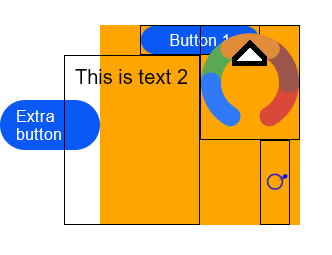

# RelativeContainer

相对布局组件，用于复杂场景中元素对齐的布局。

>  **说明：**
>
> 该组件从API Version 9开始支持。后续版本如有新增内容，则采用上角标单独标记该内容的起始版本。


## 规则说明  

 * 容器内子组件区分水平方向，垂直方向：  
   * 水平方向为left， middle， right，对应容器的HorizontalAlign.Start， HorizontalAlign.Center， HorizontalAlign.End。
   * 垂直方向为top， center， bottom，对应容器的VerticalAlign.Top， VerticalAlign.Center， VerticalAlign.Bottom。
 * 子组件可以将容器或者其他子组件设为锚点：  
   * 参与相对布局的容器内组件必须设置id，不设置id的组件不显示，容器id固定为__container__。
   * 此子组件某一方向上的三个位置可以将容器或其他子组件的同方向三个位置为锚点，同方向上两个以上位置设置锚点以后会跳过第三个。
   * 前端页面设置的子组件尺寸大小不会受到相对布局规则的影响。
   * 对齐后需要额外偏移可设置offset。
 * 特殊情况
   * 互相依赖，环形依赖时容器内子组件全部不绘制。
   * 同方向上两个以上位置设置锚点但锚点位置逆序时此子组件大小为0，即不绘制。

## 子组件

支持多个子组件。


## 接口

RelativeContainer()

## 示例

```ts
@Entry
@Component
struct Index {
  build() {
    Row() {
      Button("Extra button").width(100).height(50)

      RelativeContainer() {
        Button("Button 1")
          .width(120)
          .height(30)
          .alignRules({
            middle: { anchor: "__container__", align: HorizontalAlign.Center },
          })
          .id("bt1")
          .borderWidth(1)
          .borderColor(Color.Black)

        Text("This is text 2")
          .fontSize(20)
          .padding(10)
          .alignRules({
            bottom: { anchor: "__container__", align: VerticalAlign.Bottom },
            top: { anchor: "bt1", align: VerticalAlign.Bottom },
            right: { anchor: "bt1", align: HorizontalAlign.Center }
          })
          .id("tx2")
          .borderWidth(1)
          .borderColor(Color.Black)
          .height(30)

        Button("Button 3")
          .width(100)
          .height(100)
          .alignRules({
            left: { anchor: "bt1", align: HorizontalAlign.End },
            top: { anchor: "tx2", align: VerticalAlign.Center },
            bottom: { anchor: "__container__", align: VerticalAlign.Bottom }
          })
          .id("bt3")
          .borderWidth(1)
          .borderColor(Color.Black)

        Text("This is text 4")
          .fontSize(20)
          .padding(10)
          .alignRules({
            left: { anchor: "tx2", align: HorizontalAlign.End },
            right: { anchor: "__container__", align: HorizontalAlign.End },
            top: { anchor: "__container__", align: VerticalAlign.Top },
            bottom: { anchor: "bt3", align: VerticalAlign.Top }
          })
          .id("tx4")
          .borderWidth(1)
          .borderColor(Color.Black)
      }
      .width(200).height(200)
      .backgroundColor(Color.Orange)
    }
    .height('100%')
  }
}
```
