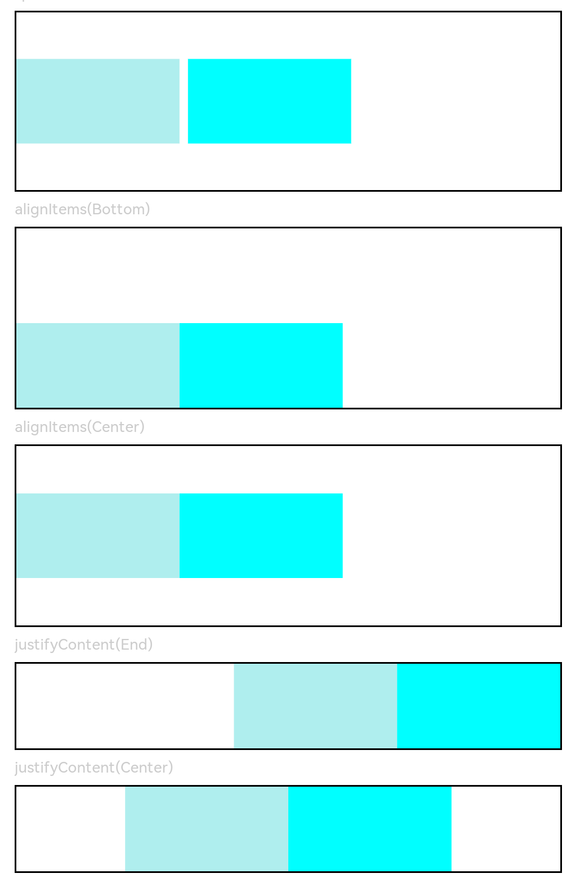

# Row

沿水平方向布局容器。

>  **说明：**
>
>  该组件从API Version 7开始支持。后续版本如有新增内容，则采用上角标单独标记该内容的起始版本。


## 子组件

可以包含子组件。


## 接口

Row(value?:{space?:  number&nbsp;|&nbsp;string })

从API version 9开始，该接口支持在ArkTS卡片中使用。

**参数：**

| 参数名 | 参数类型 | 必填 | 参数描述 |
| -------- | -------- | -------- | -------- |
| space | string&nbsp;\|&nbsp;number | 否 | 横向布局元素间距。<br/>从API version 9开始，space为负数或者justifyContent设置为FlexAlign.SpaceBetween、FlexAlign.SpaceAround、FlexAlign.SpaceEvenly时不生效。<br/>默认值：0，单位vp<br/>**说明：** <br/>可选值为大于等于0的数字，或者可以转换为数字的字符串。 |


## 属性

除支持[通用属性](ts-universal-attributes-size.md)外，还支持以下属性：

| 名称 | 参数类型 | 描述 |
| -------- | -------- | -------- |
| alignItems | [VerticalAlign](ts-appendix-enums.md#verticalalign) | 设置子组件在垂直方向上的对齐格式。<br/>默认值：VerticalAlign.Center <br/>从API version 9开始，该接口支持在ArkTS卡片中使用。|
| justifyContent<sup>8+</sup> | [FlexAlign](ts-appendix-enums.md#flexalign) | 设置子组件在水平方向上的对齐格式。<br/>默认值：FlexAlign.Start <br/>从API version 9开始，该接口支持在ArkTS卡片中使用。 |

>  **说明：**    
>
>  Row布局时若子组件不设置flexShrink则默认不会压缩子组件，即所有子组件主轴大小累加可超过容器主轴。

## 事件

支持[通用事件](ts-universal-events-click.md)。

## 示例

```ts
// xxx.ets
@Entry
@Component
struct RowExample {
  build() {
    Column({ space: 5 }) {
      // 设置子组件水平方向的间距为5
      Text('space').width('90%')
      Row({ space: 5 }) {
        Row().width('30%').height(50).backgroundColor(0xAFEEEE)
        Row().width('30%').height(50).backgroundColor(0x00FFFF)
      }.width('90%').height(107).border({ width: 1 })

      // 设置子元素垂直方向对齐方式
      Text('alignItems(Bottom)').width('90%')
      Row() {
        Row().width('30%').height(50).backgroundColor(0xAFEEEE)
        Row().width('30%').height(50).backgroundColor(0x00FFFF)
      }.width('90%').alignItems(VerticalAlign.Bottom).height('15%').border({ width: 1 })

      Text('alignItems(Center)').width('90%')
      Row() {
        Row().width('30%').height(50).backgroundColor(0xAFEEEE)
        Row().width('30%').height(50).backgroundColor(0x00FFFF)
      }.width('90%').alignItems(VerticalAlign.Center).height('15%').border({ width: 1 })

      // 设置子元素水平方向对齐方式
      Text('justifyContent(End)').width('90%')
      Row() {
        Row().width('30%').height(50).backgroundColor(0xAFEEEE)
        Row().width('30%').height(50).backgroundColor(0x00FFFF)
      }.width('90%').border({ width: 1 }).justifyContent(FlexAlign.End)

      Text('justifyContent(Center)').width('90%')
      Row() {
        Row().width('30%').height(50).backgroundColor(0xAFEEEE)
        Row().width('30%').height(50).backgroundColor(0x00FFFF)
      }.width('90%').border({ width: 1 }).justifyContent(FlexAlign.Center)
    }.width('100%')
  }
}
```


