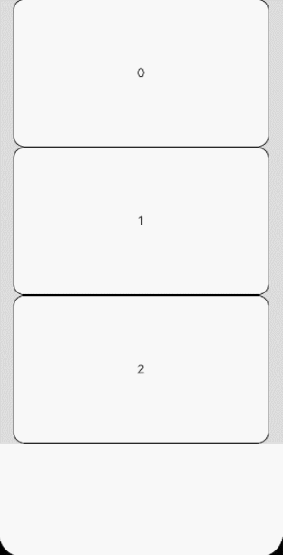

# Scroll

可滚动的容器组件，当子组件的布局尺寸超过父组件的尺寸时，内容可以滚动。

>  **说明：**
>  - 该组件从API version 7开始支持。后续版本如有新增内容，则采用上角标单独标记该内容的起始版本。
>  - 该组件嵌套List子组件滚动时，若List不设置宽高，则默认全部加载，在对性能有要求的场景下建议指定List的宽高。
>  - 该组件滚动的前提是主轴方向大小小于内容大小。
>  - 该组件回弹的前提是要有滚动。内容小于一屏时，没有回弹效果。


## 子组件

支持单个子组件。


## 接口

Scroll(scroller?: Scroller)

**参数：**

| 参数名 | 参数类型 | 必填 | 参数描述 |
| -------- | -------- | -------- | -------- |
| scroller | [Scroller](#scroller) | 否 | 可滚动组件的控制器。用于与可滚动组件进行绑定。 |

## 属性

除支持[通用属性](ts-universal-attributes-size.md)外，还支持以下属性：

| 名称             | 参数类型                                     | 描述        |
| -------------- | ---------------------------------------- | --------- |
| scrollable     | [ScrollDirection](#scrolldirection枚举说明)                        | 设置滚动方向。<br/>默认值：ScrollDirection.Vertical |
| scrollBar      | [BarState](ts-appendix-enums.md#barstate) | 设置滚动条状态。<br/>默认值：BarState.Auto<br/>**说明：** <br/>如果容器组件无法滚动，则滚动条不显示。如果容器组件的子组件大小为无穷大，则滚动条不支持拖动和伴随滚动。 |
| scrollBarColor | string&nbsp;\|&nbsp;number&nbsp;\|&nbsp;[Color](ts-appendix-enums.md#color)   | 设置滚动条的颜色。 |
| scrollBarWidth | string&nbsp;\|&nbsp;number         | 设置滚动条的宽度，不支持百分比设置。<br/>默认值：4<br/>单位：vp<br/>**说明：** <br/>如果滚动条的宽度超过其高度，则滚动条的宽度会变为默认值。 |
| scrollSnap<sup>10+</sup>     | [ScrollSnapOptions](#scrollsnapoptions10)                     | 设置Scroll组件的限位滚动模式。 |
| edgeEffect     | value:[EdgeEffect](ts-appendix-enums.md#edgeeffect),<br/>options?:[EdgeEffectOptions<sup>11+</sup>](#edgeeffectoptions11对象说明)        | 设置边缘滑动效果。<br/>\- value：设置Scroll组件的边缘滑动效果，支持弹簧效果和阴影效果。<br/>默认值：EdgeEffect.None <br/>\- options：设置组件内容大小小于组件自身时，是否开启滑动效果。<br/>默认值：true |
| enableScrollInteraction<sup>10+</sup>  |  boolean  |   设置是否支持滚动手势，当设置为false时，无法通过手指或者鼠标滚动，但不影响控制器的滚动接口。<br/>默认值：true      |
| nestedScroll<sup>10+</sup>                 | [NestedScrollOptions](#nestedscrolloptions10对象说明)         | 嵌套滚动选项。设置向前向后两个方向上的嵌套滚动模式，实现与父组件的滚动联动。 |
| friction<sup>10+</sup> | number \| [Resource](ts-types.md#resource)    | 设置摩擦系数，手动划动滚动区域时生效，只对惯性滚动过程有影响，对惯性滚动过程中的链式效果有间接影响。<br/>默认值：非可穿戴设备为0.6，可穿戴设备为0.9<br/>**说明：** <br/>设置为小于等于0的值时，按默认值处理 |

## ScrollDirection枚举说明
| 名称       | 描述                     |
| ---------- | ------------------------ |
| Horizontal | 仅支持水平方向滚动。     |
| Vertical   | 仅支持竖直方向滚动。     |
| None       | 不可滚动。               |
| Free<sup>(deprecated) </sup> | 支持竖直或水平方向滚动<br/> 从API version 9开始废弃|

## ScrollSnapOptions<sup>10+</sup>
| 名称       | 参数类型       | 描述       |
| ---------- | ---------------------------------------- | -------- |
| snapAlign  | [ScrollSnapAlign](ts-container-list.md#scrollsnapalign10枚举说明)   | 设置Scroll组件限位滚动时的对其方式。<br/>**说明：** <br/>1.该属性默认值为ScrollSnapAlign.NONE。<br/>2.该接口仅当snapPagination属性为Dimension时生效，不支持Array\<Dimension\>。 |
| snapPagination | Dimension&nbsp;\|&nbsp;Array\<Dimension\> | 设置Scroll组件限位滚动时的限位点，限位点即为Scroll组件能滑动停靠的偏移量。<br/>**说明：** <br/>1.当属性为Dimension时，表示每页的大小，系统会安装该大小来自动计算每个限位点的位置：如当Dimension为500时，实际的限位点即为[0,500,1000,1500,...]。<br/>2.当属性为Array\<Dimension\>时，每个Dimension代表限位点的位置。每个Dimension的范围为[0,可滑动距离]，0和可滑动距离的底部自动成为限位点。<br/>3.当该属性不填或者Dimension为小于等于0的输入时，按异常值，无限位滚动处理。当该属性值为Array\<Dimension\>数组时，数组中的数值必须为单调递增。<br/>4.当输入为百分比时，实际的大小为Scroll组件的视口与百分比数值之积。 |
| enableSnapToStart | boolean   | 在Scroll组件限位滚动模式下，该属性设置为false后，运行Scroll在开头和第一个限位点间自由滑动。<br/>**说明：** <br/>1.该属性值默认为true。<br/>2.该属性仅当snapPagination属性为Array\<Dimension\>时生效，不支持Dimension。 |
| enableSnapToEnd | boolean   | 在Scroll组件限位滚动模式下，该属性设置为false后，运行Scroll在最后一个限位点和末尾间自由滑动。<br/>**说明：** <br/>1.该属性值默认为true。<br/>2.该属性仅当snapPagination属性为Array\<Dimension\>时生效，不支持Dimension。 |

## 事件

| 名称                                                         | 功能描述                                                     |
| ------------------------------------------------------------ | ------------------------------------------------------------ |
| onScrollFrameBegin<sup>9+</sup>(event: (offset: number, state: ScrollState) => { offsetRemain }) | 每帧开始滚动时触发，事件参数传入即将发生的滚动量，事件处理函数中可根据应用场景计算实际需要的滚动量并作为事件处理函数的返回值返回，Scroll将按照返回值的实际滚动量进行滚动。<br/>\- offset：即将发生的滚动量。<br/>\- state：当前滚动状态。<br/>- offsetRemain：实际滚动量。<br/>触发该事件的条件 ：<br/>1、滚动组件触发滚动时触发，包括键鼠操作等其他触发滚动的输入设置。<br/>2、调用控制器接口时不触发。<br/>3、越界回弹不触发。<br/>**说明：** <br/>支持offsetRemain为负值。<br/>若通过onScrollFrameBegine事件和scrollBy方法实现容器嵌套滚动，需设置子滚动节点的EdgeEffect为None。如Scroll嵌套List滚动时，List组件的edgeEffect属性需设置为EdgeEffect.None。 |
| onScroll(event: (xOffset: number, yOffset: number) => void)  | 滚动事件回调,&nbsp;返回滚动时水平、竖直方向偏移量。<br/>触发该事件的条件 ：<br/>1、滚动组件触发滚动时触发，支持键鼠操作等其他触发滚动的输入设置。<br/>2、通过滚动控制器API接口调用。<br/>3、越界回弹。 |
| onScrollEdge(event: (side: Edge) => void)                    | 滚动到边缘事件回调。<br/>触发该事件的条件 ：<br/>1、滚动组件滚动到边缘时触发，支持键鼠操作等其他触发滚动的输入设置。<br/>2、通过滚动控制器API接口调用。<br/>3、越界回弹。 |
| onScrollEnd<sup>(deprecated) </sup>(event: () => void)       | 滚动停止事件回调。<br>该事件从API version 9开始废弃，使用onScrollStop事件替代。<br/>触发该事件的条件 ：<br/>1、滚动组件触发滚动后停止，支持键鼠操作等其他触发滚动的输入设置。<br/>2、通过滚动控制器API接口调用后停止，带过渡动效。 |
| onScrollStart<sup>9+</sup>(event: () => void)                | 滚动开始时触发。手指拖动Scroll或拖动Scroll的滚动条触发的滚动开始时，会触发该事件。使用[Scroller](#scroller)滚动控制器触发的带动画的滚动，动画开始时会触发该事件。<br/>触发该事件的条件 ：<br/>1、滚动组件开始滚动时触发，支持键鼠操作等其他触发滚动的输入设置。<br/>2、通过滚动控制器API接口调用后开始，带过渡动效。 |
| onScrollStop<sup>9+</sup>(event: () => void)                 | 滚动停止时触发。手拖动Scroll或拖动Scroll的滚动条触发的滚动，手离开屏幕并且滚动停止时会触发该事件。使用[Scroller](#scroller)滚动控制器触发的带动画的滚动，动画停止时会触发该事件。<br/>触发该事件的条件 ：<br/>1、滚动组件触发滚动后停止，支持键鼠操作等其他触发滚动的输入设置。<br/>2、通过滚动控制器API接口调用后开始，带过渡动效。 |

>  **说明：**
>
>  若通过onScrollFrameBegin事件和scrollBy方法实现容器嵌套滚动，需设置子滚动节点的EdgeEffect为None。如Scroll嵌套List滚动时，List组件的edgeEffect属性需设置为EdgeEffect.None。

## Scroller

可滚动容器组件的控制器，可以将此组件绑定至容器组件，然后通过它控制容器组件的滚动，同一个控制器不可以控制多个容器组件，目前支持绑定到List、Scroll、ScrollBar、Grid、WaterFlow上。


### 导入对象

```
scroller: Scroller = new Scroller()
```


### scrollTo

scrollTo(value: { xOffset: number | string, yOffset: number | string, animation?: { duration?: number, curve?: Curve | ICurve } | boolean }): void


滑动到指定位置。

**参数：** 

| 参数名    | 参数类型                                                     | 必填 | 参数描述                                                     |
| --------- | ------------------------------------------------------------ | ---- | ------------------------------------------------------------ |
| xOffset   | number&nbsp;\|&nbsp;string                                   | 是   | 水平滑动偏移。<br/>**说明：** <br/>该参数值不支持设置百分比。<br/>当值小于0时，不带动画的滚动，按0处理。带动画的滚动，滚动到起始位置后停止。<br/>仅滚动轴为x轴时生效。 |
| yOffset   | number&nbsp;\|&nbsp;string                                   | 是   | 垂直滑动偏移。<br/>**说明：** <br/>该参数值不支持设置百分比。<br/>当值小于0时，不带动画的滚动，按0处理。带动画的滚动，滚动到起始位置后停止。<br/>仅滚动轴为y轴时生效。 |
| animation | {duration?:&nbsp;number, curve?:&nbsp;[Curve](ts-appendix-enums.md#curve)&nbsp;\|&nbsp;[ICurve](../apis/js-apis-curve.md#icurve)<sup>10+ </sup>}&nbsp;\|&nbsp;boolean<sup>10+ </sup> | 否   | 动画配置：<br/>-&nbsp;duration:&nbsp;滚动时长设置。<br/>-&nbsp;curve:&nbsp;滚动曲线设置。<br/>- boolean:&nbsp;使能默认弹簧动效。<br/>默认值： <br/>{<br/>duration:&nbsp;1000,<br/>curve:&nbsp;Curve.Ease<br/>}<br/>boolean:&nbsp;false<br/>**说明：** <br/>设置为小于0的值时，按默认值显示。<br/>当前List、Scroll、Grid、WaterFlow均支持boolean类型和ICurve曲线。 |


### scrollEdge

scrollEdge(value: Edge): void


滚动到容器边缘，不区分滚动轴方向，Edge.Top和Edge.Start表现相同，Edge.Bottom和Edge.End表现相同。

**参数：**

| 参数名   | 参数类型 | 必填   | 参数描述      |
| ----- | ---- | ---- | --------- |
| value | [Edge](ts-appendix-enums.md#edge) | 是    | 滚动到的边缘位置。 |


### scrollPage

scrollPage(value: { next: boolean, direction?: Axis }): void

滚动到下一页或者上一页。

**参数：**

| 参数名       | 参数类型    | 必填   | 参数描述                           |
| --------- | ------- | ---- | ------------------------------ |
| next      | boolean | 是    | 是否向下翻页。true表示向下翻页，false表示向上翻页。 |
| direction<sup>(deprecated) </sup> | [Axis](ts-appendix-enums.md#axis)    | 否    | 设置滚动方向为水平或竖直方向。<br/> 从API version 9开始废弃                |


### currentOffset

currentOffset(): { xOffset: number, yOffset: number }


返回当前的滚动偏移量。

**返回值**

| 类型                                                       | 描述                                                         |
| ---------------------------------------------------------- | ------------------------------------------------------------ |
| {<br/>xOffset:&nbsp;number,<br/>yOffset:&nbsp;number<br/>} | xOffset:&nbsp;水平滑动偏移;<br/>yOffset:&nbsp;竖直滑动偏移。<br/>**说明：** <br/>返回值单位为vp。 |


### scrollToIndex

scrollToIndex(value: number, smooth?: boolean, align?: ScrollAlign): void

滑动到指定Index。

开启smooth动效时，会对经过的所有item进行加载和布局计算，当大量加载item时会导致性能问题。


>  **说明：**
>
>  仅支持Grid、List、WaterFlow组件。

**参数：**

| 参数名                | 参数类型 | 必填 | 参数描述                                                     |
| --------------------- | -------- | ---- | ------------------------------------------------------------ |
| value                 | number   | 是   | 要滑动到的目标元素在当前容器中的索引值。      <br/>**说明：** <br/>value值设置成负值或者大于当前容器子组件的最大索引值，视为异常值，本次跳转不生效。                     |
| smooth<sup>10+ </sup> | boolean  | 否   | 设置滑动到列表项在列表中的索引值时是否有动效，true表示有动效，false表示没有动效。<br/>默认值：false。<br/>**说明：** <br/>当前仅List组件支持该参数。 |
| align<sup>10+ </sup> | [ScrollAlign](#scrollalign10枚举说明)  | 否   | 指定滑动到的元素与当前容器的对齐方式。<br/>List中的默认值为：ScrollAlign.START。Grid中默认值为：ScrollAlign.AUTO<br/>**说明：** <br/>当前仅List、Grid组件支持该参数。 |

### scrollBy<sup>9+</sup>

scrollBy(dx: Length, dy: Length): void


滑动指定距离。


>  **说明：**
>
>  支持Scroll、List、Grid、WaterFlow组件。

**参数：**

| 参数名   | 参数类型   | 必填   | 参数描述              |
| ----- | ------ | ---- | ----------------- |
| dx | Length | 是    | 水平方向滚动距离，不支持百分比形式。 |
| dy | Length | 是    | 竖直方向滚动距离，不支持百分比形式。 |

### isAtEnd<sup>10+</sup>

isAtEnd(): boolean

查询组件是否滚动到底部。

>  **说明：**
>
>  支持Scroll、List、Grid、WaterFlow组件。

**返回值**

| 类型         | 描述          |
| ------- | -------- |
| boolean | true表示组件已经滚动到底部，false表示组件还没滚动到底部。 |

### getItemRect<sup>11+</sup>

getItemRect(index: number): RectResult

获取子组件的大小位置。

>  **说明：**
>
>  支持Scroll、List、Grid、WaterFlow组件。

**参数：**

| 参数名   | 参数类型   | 必填   | 参数描述              |
| ----- | ------ | ---- | ----------------- |
| index | number | 是    | 子组件的索引值。 |

> **说明：**
>
> - index必须是当前显示区域显示的子组件的索引值，否则视为非法值。
> - 非法值返回的大小和位置均为0。

**返回值：**

| 类型       | 说明       |
| -------------------  | -------- |
| [RectResult](ts-types.md#rectresult10) | 子组件的大小和相对于组件的位置。 |

## ScrollAlign<sup>10+</sup>枚举说明

| 名称     | 描述                             |
| ------ | ------------------------------ |
| START   | 首部对齐。指定item首部与List首部对齐。  |
| CENTER | 居中对齐。指定item主轴方向居中对齐于List。        |
| END  | 尾部对齐。指定item尾部与List尾部对齐。 |
| AUTO  | 自动对齐。<br/>若指定item完全处于显示区，不做调整。否则依照滑动距离最短的原则，将指定item首部对齐或尾部对齐于List,使指定item完全处于显示区。|

## NestedScrollOptions<sup>10+ </sup>对象说明
| 名称   | 类型   | 描述              |
| ----- | ------ | ----------------- |
| scrollForward | NestedScrollMode | 可滚动组件往末尾端滚动时的嵌套滚动选项。 |
| scrollBackward | NestedScrollMode |  可滚动组件往起始端滚动时的嵌套滚动选项。 |

## NestedScrollMode<sup>10+ </sup>枚举说明
| 名称     | 描述                             |
| ------ | ------------------------------ |
| SELF_ONLY   | 只自身滚动，不与父组件联动。  |
| SELF_FIRST | 自身先滚动，自身滚动到边缘以后父组件滚动。父组件滚动到边缘以后，如果父组件有边缘效果，则父组件触发边缘效果，否则子组件触发边缘效果。        |
| PARENT_FIRST  | 父组件先滚动，父组件滚动到边缘以后自身滚动。自身滚动到边缘后，如果有边缘效果，会触发自身的边缘效果，否则触发父组件的边缘效果。 |
| PARALLEL  | 自身和父组件同时滚动，自身和父组件都到达边缘以后，如果自身有边缘效果，则自身触发边缘效果，否则父组件触发边缘效果。|

## EdgeEffectOptions<sup>11+ </sup>对象说明
| 参数名   | 类型   | 描述              |
| ----- | ------ | ----------------- |
| alwaysEnabled | boolean | 组件内容大小小于组件自身时，设置是否开启滑动效果|


## 示例
### 示例1

```ts
// xxx.ets
import Curves from '@ohos.curves'

@Entry
@Component
struct ScrollExample {
  scroller: Scroller = new Scroller()
  private arr: number[] = [0, 1, 2, 3, 4, 5, 6, 7, 8, 9]

  build() {
    Stack({ alignContent: Alignment.TopStart }) {
      Scroll(this.scroller) {
        Column() {
          ForEach(this.arr, (item: number) => {
            Text(item.toString())
              .width('90%')
              .height(150)
              .backgroundColor(0xFFFFFF)
              .borderRadius(15)
              .fontSize(16)
              .textAlign(TextAlign.Center)
              .margin({ top: 10 })
          }, (item: string) => item)
        }.width('100%')
      }
      .scrollable(ScrollDirection.Vertical) // 滚动方向纵向
      .scrollBar(BarState.On) // 滚动条常驻显示
      .scrollBarColor(Color.Gray) // 滚动条颜色
      .scrollBarWidth(10) // 滚动条宽度
      .friction(0.6)
      .edgeEffect(EdgeEffect.None)
      .onScroll((xOffset: number, yOffset: number) => {
        console.info(xOffset + ' ' + yOffset)
      })
      .onScrollEdge((side: Edge) => {
        console.info('To the edge')
      })
      .onScrollEnd(() => {
        console.info('Scroll Stop')
      })

      Button('scroll 150')
        .height('5%')
        .onClick(() => { // 点击后下滑指定距离150.0vp
          this.scroller.scrollBy(0, 150)
        })
        .margin({ top: 10, left: 20 })
      Button('scroll 100')
        .height('5%')
        .onClick(() => { // 点击后滑动到指定位置，即下滑100.0vp的距离
          const yOffset: number = this.scroller.currentOffset().yOffset;
          this.scroller.scrollTo({ xOffset: 0, yOffset: yOffset + 100 })
        })
        .margin({ top: 60, left: 20 })
      Button('scroll 100')
        .height('5%')
        .onClick(() => { // 点击后滑动到指定位置，即下滑100.0vp的距离，滑动过程配置有动画
          let curve = Curves.interpolatingSpring(100, 1, 228, 30) //创建一个阶梯曲线
          const yOffset: number = this.scroller.currentOffset().yOffset;
          this.scroller.scrollTo({ xOffset: 0, yOffset: yOffset + 100, animation: { duration: 1000, curve: curve } })
        })
        .margin({ top: 110, left: 20 })
      Button('back top')
        .height('5%')
        .onClick(() => { // 点击后回到顶部
          this.scroller.scrollEdge(Edge.Top)
        })
        .margin({ top: 160, left: 20 })
      Button('next page')
        .height('5%')
        .onClick(() => { // 点击后滑到下一页
          this.scroller.scrollPage({ next: true })
        })
        .margin({ top: 210, left: 20 })
    }.width('100%').height('100%').backgroundColor(0xDCDCDC)
  }
}
```


### 示例2
```ts
@Entry
@Component
struct NestedScroll {
  @State listPosition: number = 0; // 0代表滚动到List顶部，1代表中间值，2代表滚动到List底部。
  private arr: number[] = [1, 2, 3, 4, 5, 6, 7, 8, 9, 10]
  private scrollerForScroll: Scroller = new Scroller()
  private scrollerForList: Scroller = new Scroller()

  build() {
    Flex() {
      Scroll(this.scrollerForScroll) {
        Column() {
          Text("Scroll Area")
            .width("100%")
            .height("40%")
            .backgroundColor(0X330000FF)
            .fontSize(16)
            .textAlign(TextAlign.Center)
            .onClick(() => {
              this.scrollerForList.scrollToIndex(5)
            })

          List({ space: 20, scroller: this.scrollerForList }) {
            ForEach(this.arr, (item: number) => {
              ListItem() {
                Text("ListItem" + item)
                  .width("100%")
                  .height("100%")
                  .borderRadius(15)
                  .fontSize(16)
                  .textAlign(TextAlign.Center)
                  .backgroundColor(Color.White)
              }.width("100%").height(100)
            }, (item: string) => item)
          }
          .width("100%")
          .height("50%")
          .edgeEffect(EdgeEffect.None)
          .friction(0.6)
          .onReachStart(() => {
            this.listPosition = 0
          })
          .onReachEnd(() => {
            this.listPosition = 2
          })
          .onScrollFrameBegin((offset: number) => {
            if ((this.listPosition == 0 && offset <= 0) || (this.listPosition == 2 && offset >= 0)) {
              this.scrollerForScroll.scrollBy(0, offset)
              return { offsetRemain: 0 }
            }
            this.listPosition = 1
            return { offsetRemain: offset };
          })

          Text("Scroll Area")
            .width("100%")
            .height("40%")
            .backgroundColor(0X330000FF)
            .fontSize(16)
            .textAlign(TextAlign.Center)
        }
      }
      .width("100%").height("100%")
    }.width('100%').height('100%').backgroundColor(0xDCDCDC).padding(20)
  }
}
```


### 示例3
```ts
@Entry
@Component
struct StickyNestedScroll {
  @State message: string = 'Hello World'
  @State arr: number[] = []

  @Styles
  listCard() {
    .backgroundColor(Color.White)
    .height(72)
    .width("100%")
    .borderRadius(12)
  }

  build() {
    Scroll() {
      Column() {
        Text("Scroll Area")
          .width("100%")
          .height("40%")
          .backgroundColor('#0080DC')
          .textAlign(TextAlign.Center)
        Tabs({ barPosition: BarPosition.Start }) {
          TabContent() {
            List({ space: 10 }) {
              ForEach(this.arr, (item: number) => {
                ListItem() {
                  Text("item" + item)
                    .fontSize(16)
                }.listCard()
              }, (item: string) => item)
            }.width("100%")
            .edgeEffect(EdgeEffect.Spring)
            .nestedScroll({
              scrollForward: NestedScrollMode.PARENT_FIRST,
              scrollBackward: NestedScrollMode.SELF_FIRST
            })
          }.tabBar("Tab1")

          TabContent() {
          }.tabBar("Tab2")
        }
        .vertical(false)
        .height("100%")
      }.width("100%")
    }
    .edgeEffect(EdgeEffect.Spring)
    .friction(0.6)
    .backgroundColor('#DCDCDC')
    .scrollBar(BarState.Off)
    .width('100%')
    .height('100%')
  }

  aboutToAppear() {
    for (let i = 0; i < 30; i++) {
      this.arr.push(i)
    }
  }
}
```

### 示例4
```ts
@Entry
@Component
struct Index {
  scroller: Scroller = new Scroller;
  private arr: number[] = [0, 1, 2, 3, 4, 5, 6, 7, 8, 9, 10, 11, 12, 13, 14, 15]
  build() {
    Scroll(this.scroller) {
      Column() {
        ForEach(this.arr, (item: number) => {
          Text(item.toString())
            .width('90%')
            .height(200)
            .backgroundColor(0xFFFFFF)
            .borderWidth(1)
            .borderColor(Color.Black)
            .borderRadius(15)
            .fontSize(16)
            .textAlign(TextAlign.Center)
        }, (item: string) => item)
      }.width('100%').backgroundColor(0xDCDCDC)
    }
    .backgroundColor(Color.Yellow)
    .height('100%')
    .edgeEffect(EdgeEffect.Spring)
    .scrollSnap({snapAlign:ScrollSnapAlign.START, snapPagination:400, enableSnapToStart:true, enableSnapToEnd:true})
  }
}
```

