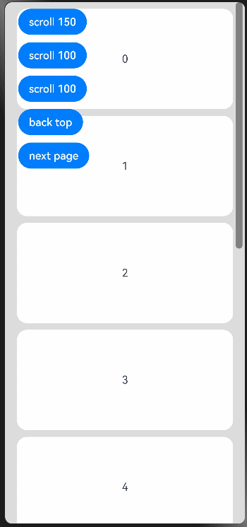
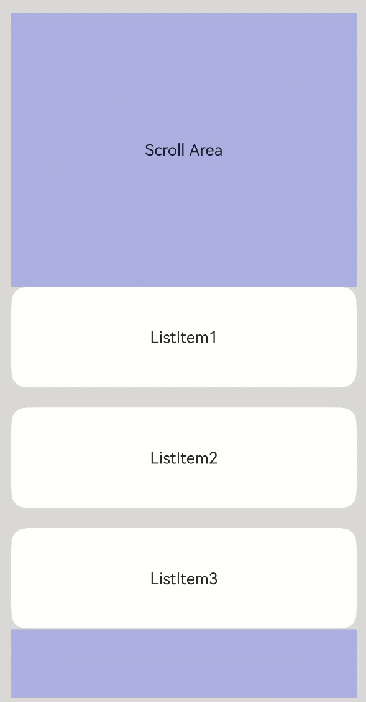

# Scroll

可滚动的容器组件，当子组件的布局尺寸超过父组件的尺寸时，内容可以滚动。

>  **说明：**
>  - 该组件从API version 7开始支持。后续版本如有新增内容，则采用上角标单独标记该内容的起始版本。
>  - 该组件嵌套List子组件滚动时，若List不设置宽高，则默认全部加载，在对性能有要求的场景下建议指定List的宽高。
>  - 该组件滚动的前提是主轴方向大小小于内容大小。
>  - 该组件回弹的前提是要有滚动。内容小于一屏时，没有回弹效果。


## 子组件

支持单个子组件。


## 接口

Scroll(scroller?: Scroller)

## 属性

除支持[通用属性](ts-universal-attributes-size.md)外，还支持以下属性：

| 名称             | 参数类型                                     | 描述        |
| -------------- | ---------------------------------------- | --------- |
| scrollable     | [ScrollDirection](#scrolldirection枚举说明)                        | 设置滚动方向。<br/>默认值：ScrollDirection.Vertical |
| scrollBar      | [BarState](ts-appendix-enums.md#barstate) | 设置滚动条状态。<br/>默认值：BarState.Auto |
| scrollBarColor | string&nbsp;\|&nbsp;number&nbsp;\|&nbsp;[Color](ts-appendix-enums.md#color)   | 设置滚动条的颜色。 |
| scrollBarWidth | string&nbsp;\|&nbsp;number         | 设置滚动条的宽度。 |
| edgeEffect     | [EdgeEffect](ts-appendix-enums.md#edgeeffect)            | 设置滑动效果，目前支持的滑动效果参见EdgeEffect的枚举说明。<br/>默认值：EdgeEffect.None |

## ScrollDirection枚举说明
| 名称       | 描述                     |
| ---------- | ------------------------ |
| Horizontal | 仅支持水平方向滚动。     |
| Vertical   | 仅支持竖直方向滚动。     |
| None       | 不可滚动。               |
| Free<sup>(deprecated) </sup> | 支持竖直或水平方向滚动<br/> 从API version 9开始废弃|

## 事件

| 名称                                                         | 功能描述                                                     |
| ------------------------------------------------------------ | ------------------------------------------------------------ |
| onScrollBegin<sup>9+</sup>(event: (dx: number, dy: number) => { dxRemain: number, dyRemain: number }) | 滚动开始事件回调。<br>参数：<br>- dx：即将发生的水平方向滚动量。<br>- dy：即将发生的竖直方向滚动量。<br>返回值：<br>- dxRemain：水平方向滚动剩余量。<br>- dyRemain：竖直方向滚动剩余量。 |
| onScroll(event: (xOffset: number, yOffset: number) => void)  | 滚动事件回调,&nbsp;返回滚动时水平、竖直方向偏移量。          |
| onScrollEdge(event: (side: Edge) => void)                    | 滚动到边缘事件回调。                                         |
| onScrollEnd(event: () => void)                               | 滚动停止事件回调。                                           |

>  **说明：**
>
>  若通过onScrollBegin事件和scrollBy方法实现容器嵌套滚动，需设置子滚动节点的EdgeEffect为None。如Scroll嵌套List滚动时，List组件的edgeEffect属性需设置为EdgeEffect.None。

## Scroller

可滚动容器组件的控制器，可以将此组件绑定至容器组件，然后通过它控制容器组件的滚动，同一个控制器不可以控制多个容器组件，目前支持绑定到List、Scroll、ScrollBar上。


### 导入对象

```
scroller: Scroller = new Scroller()
```


### scrollTo

scrollTo(value: { xOffset: number | string, yOffset: number | string, animation?: { duration: number, curve: Curve } }): void


滑动到指定位置。

**参数：**

| 参数名    | 参数类型                                                     | 必填 | 参数描述                                                     |
| --------- | ------------------------------------------------------------ | ---- | ------------------------------------------------------------ |
| xOffset   | Length                                                       | 是   | 水平滑动偏移。                                               |
| yOffset   | Length                                                       | 是   | 竖直滑动偏移。                                               |
| animation | {<br/>duration:&nbsp;number,<br/>curve:&nbsp;[Curve](ts-animatorproperty.md)<br/>} | 否   | 动画配置：<br/>-&nbsp;duration:&nbsp;滚动时长设置。<br/>-&nbsp;curve:&nbsp;滚动曲线设置。 |


### scrollEdge

scrollEdge(value: Edge): void


滚动到容器边缘。

**参数：**

| 参数名   | 参数类型 | 必填   | 参数描述      |
| ----- | ---- | ---- | --------- |
| value | [Edge](ts-appendix-enums.md#edge) | 是    | 滚动到的边缘位置。 |


### scrollPage

scrollPage(value: { next: boolean, direction?: Axis }): void

滚动到下一页或者上一页。

**参数：**

| 参数名       | 参数类型    | 必填   | 参数描述                           |
| --------- | ------- | ---- | ------------------------------ |
| next      | boolean | 是    | 是否向下翻页。true表示向下翻页，false表示向上翻页。 |
| direction<sup>(deprecated) </sup> | [Axis](ts-appendix-enums.md#axis)    | 否    | 设置滚动方向为水平或竖直方向。<br/> 从API version 9开始废弃                |


### currentOffset

currentOffset()


返回当前的滚动偏移量。

**返回值**

| 类型                                       | 描述                                       |
| ---------------------------------------- | ---------------------------------------- |
| {<br/>xOffset:&nbsp;number,<br/>yOffset:&nbsp;number<br/>} | xOffset:&nbsp;水平滑动偏移;<br/>yOffset:&nbsp;竖直滑动偏移。 |


### scrollToIndex

scrollToIndex(value: number): void


滑动到指定Index。


>  **说明：**
>
>  仅支持list组件。

**参数：**

| 参数名 | 参数类型 | 必填 | 参数描述                           |
| ------ | -------- | ---- | ---------------------------------- |
| value  | number   | 是   | 要滑动到的列表项在列表中的索引值。 |


### scrollBy<sup>9+</sup>

scrollBy(dx: Length, dy: Length): void


滑动指定距离。


>  **说明：**
>
>  仅支持Scroll组件。

**参数：**

| 参数名   | 参数类型   | 必填   | 参数描述              |
| ----- | ------ | ---- | ----------------- |
| dx | Length | 是    | 水平方向滚动距离，不支持百分比形式。 |
| dy | Length | 是    | 竖直方向滚动距离，不支持百分比形式。 |


## 示例
### 示例1

```ts
// xxx.ets
@Entry
@Component
struct ScrollExample {
  scroller: Scroller = new Scroller()
  private arr: number[] = [0, 1, 2, 3, 4, 5, 6, 7, 8, 9]

  build() {
    Stack({ alignContent: Alignment.TopStart }) {
      Scroll(this.scroller) {
        Column() {
          ForEach(this.arr, (item) => {
            Text(item.toString())
              .width('90%')
              .height(150)
              .backgroundColor(0xFFFFFF)
              .borderRadius(15)
              .fontSize(16)
              .textAlign(TextAlign.Center)
              .margin({ top: 10 })
          }, item => item)
        }.width('100%')
      }
      .scrollable(ScrollDirection.Vertical)  // 滚动方向纵向
      .scrollBar(BarState.On)  // 滚动条常驻显示
      .scrollBarColor(Color.Gray)  // 滚动条颜色
      .scrollBarWidth(30) // 滚动条宽度
      .edgeEffect(EdgeEffect.None)
      .onScroll((xOffset: number, yOffset: number) => {
        console.info(xOffset + ' ' + yOffset)
      })
      .onScrollEdge((side: Edge) => {
        console.info('To the edge')
      })
      .onScrollEnd(() => {
        console.info('Scroll Stop')
      })

      Button('scroll 150')
        .onClick(() => { // 点击后下滑指定距离150.0vp
          this.scroller.scrollBy(0,150)
        })
        .margin({ top: 10, left: 20 })
      Button('scroll 100')
        .onClick(() => { // 点击后滑动到指定位置，即下滑100.0vp的距离
          this.scroller.scrollTo({ xOffset: 0, yOffset: this.scroller.currentOffset().yOffset + 100 })
        })
        .margin({ top: 60, left: 20 })
      Button('back top')
        .onClick(() => { // 点击后回到顶部
          this.scroller.scrollEdge(Edge.Top)
        })
        .margin({ top: 110, left: 20 })
      Button('next page')
        .onClick(() => { // 点击后滑到下一页
          this.scroller.scrollPage({ next: true })
        })
        .margin({ top: 170, left: 20 })
    }.width('100%').height('100%').backgroundColor(0xDCDCDC)
  }
}
```



### 示例2
```ts
@Entry
@Component
struct NestedScroll {
  @State listPosition: number = 0; // 0代表滚动到List顶部，1代表中间值，2代表滚动到List底部。
  private arr: number[] = [1, 2, 3, 4, 5, 6, 7, 8, 9, 10]
  private scroller: Scroller = new Scroller()

  build() {
    Flex() {
      Scroll(this.scroller) {
        Column() {
          Text("Scroll Area")
            .width("100%").height("40%").backgroundColor(0X330000FF)
            .fontSize(16).textAlign(TextAlign.Center)

          List({ space: 20 }) {
            ForEach(this.arr, (item) => {
              ListItem() {
                Text("ListItem" + item)
                  .width("100%").height("100%").borderRadius(15)
                  .fontSize(16).textAlign(TextAlign.Center).backgroundColor(Color.White)
              }.width("100%").height(100)
            }, item => item)
          }
          .width("100%").height("50%").edgeEffect(EdgeEffect.None)
          .onReachStart(() => {
            this.listPosition = 0
          })
          .onReachEnd(() => {
            this.listPosition = 2
          })
          .onScrollBegin((dx: number, dy: number) => {
            if ((this.listPosition == 0 && dy >= 0) || (this.listPosition == 2 && dy <= 0)) {
              this.scroller.scrollBy(0, -dy)
              return { dxRemain: dx, dyRemain: 0 }
            }
            this.listPosition = 1
            return { dxRemain: dx, dyRemain: dy };
          })

          Text("Scroll Area")
            .width("100%").height("40%").backgroundColor(0X330000FF)
            .fontSize(16).textAlign(TextAlign.Center)
        }
      }
      .width("100%").height("100%")
    }.width('100%').height('100%').backgroundColor(0xDCDCDC).padding(20)
  }
}
```

