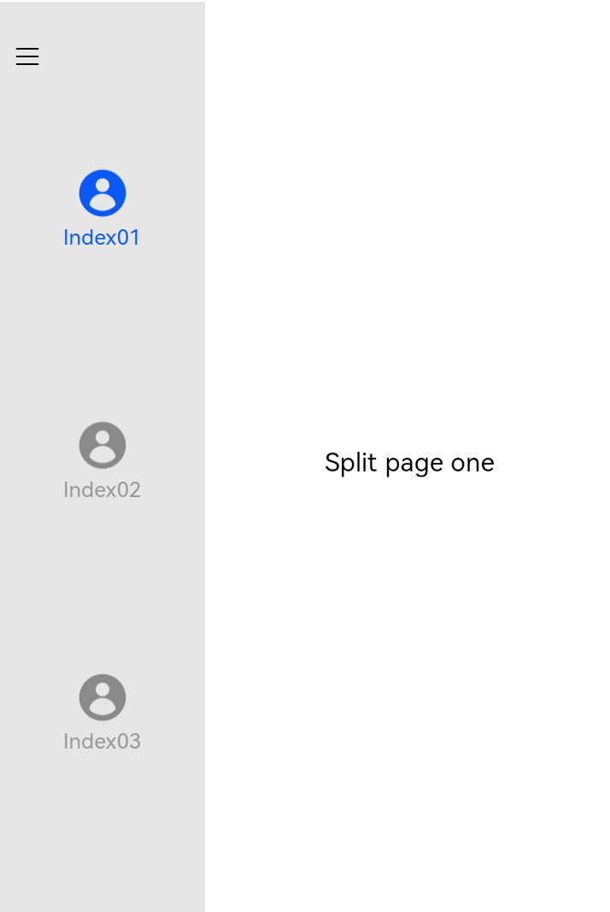

# SideBarContainer

提供侧边栏可以显示和隐藏的侧边栏容器，通过子组件定义侧边栏和内容区，第一个子组件表示侧边栏，第二个子组件表示内容区。

>  **说明：**
>
>  该组件从API Version 8开始支持。后续版本如有新增内容，则采用上角标单独标记该内容的起始版本。


## 子组件

可以包含子组件。


## 接口

SideBarContainer( type?: SideBarContainerType )

**参数：**

| 参数名 | 参数类型 | 必填 | 参数描述 |
| -------- | -------- | -------- | -------- |
| type | SideBarContainerType | 否 | 设置侧边栏的显示类型。<br/>默认值：SideBarContainerType.Embed |

## SideBarContainerType枚举说明

| 名称 | 描述 |
| -------- | -------- |
| Embed | 侧边栏嵌入到组件内，和内容区并列显示。 |
| Overlay | 侧边栏浮在内容区上面。 |

## 属性

| 名称 | 参数类型 | 描述 |
| -------- | -------- | -------- |
| showSideBar | boolean | 设置是否显示侧边栏。<br/>默认值：true |
| controlButton | ButtonStyle                                                | 设置侧边栏控制按钮的属性。 |
| showControlButton | boolean | 设置是否显示控制按钮。<br/>默认值：true |
| sideBarWidth | number&nbsp;\|&nbsp;Length<sup>9+</sup> | 设置侧边栏的宽度。<br/>默认值：200，单位vp |
| minSideBarWidth | number&nbsp;\|&nbsp;Length<sup>9+</sup> | 设置侧边栏最小宽度。<br/>默认值：200，单位vp |
| maxSideBarWidth | number&nbsp;\|&nbsp;Length<sup>9+</sup> | 设置侧边栏最大宽度。<br/>默认值：280，单位vp |
| autoHide<sup>9+</sup> | boolean | 设置当侧边栏拖拽到小于最小宽度后，是否自动隐藏。<br/>默认值：true |
| sideBarPosition<sup>9+</sup> | SideBarPosition | 设置侧边栏显示位置。<br/>默认值：SideBarPosition.Start |

## ButtonStyle对象说明

| 名称 | 参数类型 | 必填 | 描述 |
| -------- | -------- | -------- | -------- |
| left | number | 否 | 设置侧边栏控制按钮距离容器左界限的间距。<br/>默认值：16，单位vp |
| top | number | 否 | 设置侧边栏控制按钮距离容器上界限的间距。<br/>默认值：48，单位vp |
| width | number | 否 | 设置侧边栏控制按钮的宽度。<br/>默认值：32，单位vp |
| height | number | 否 | 设置侧边栏控制按钮的高度。<br/>默认值：32，单位vp |
| icons | {<br/>shown:&nbsp;string \| PixelMap \| [Resource](ts-types.md) ,<br/>hidden:&nbsp;string \| PixelMap \| [Resource](ts-types.md) ,<br/>switching?:&nbsp;string \| PixelMap \| [Resource](ts-types.md) <br/>} | 否 | 设置侧边栏控制按钮的图标：<br/> </p> - shown: 设置侧边栏显示时控制按钮的图标。<br>- hidden: 设置侧边栏隐藏时控制按钮的图标。<br>- switching:设置侧边栏显示和隐藏状态切换时控制按钮的图标。 |

## SideBarPosition<sup>9+</sup>枚举说明

| 名称 | 描述 |
| -------- | -------- |
| Start | 侧边栏位于容器左侧。 |
| End | 侧边栏位于容器右侧。 |

## 事件

| 名称 | 功能描述 |
| -------- | -------- |
| onChange(callback: (value: boolean) =&gt; void) | 当侧边栏的状态在显示和隐藏之间切换时触发回调。<p> true表示显示，false表示隐藏。 |


## 示例

```ts
// xxx.ets
@Entry
@Component
struct SideBarContainerExample {
  normalIcon : Resource = $r("app.media.icon")
  selectedIcon: Resource = $r("app.media.icon")
  @State arr: number[] = [1, 2, 3]
  @State current: number = 1

  build() {
    SideBarContainer(SideBarContainerType.Embed)
    {
      Column() {
        ForEach(this.arr, (item, index) => {
          Column({ space: 5 }) {
            Image(this.current === item ? this.selectedIcon : this.normalIcon).width(64).height(64)
            Text("Index0" + item)
              .fontSize(25)
              .fontColor(this.current === item ? '#0A59F7' : '#999')
              .fontFamily('source-sans-pro,cursive,sans-serif')
          }
          .onClick(() => {
            this.current = item
          })
        }, item => item)
      }.width('100%')
      .justifyContent(FlexAlign.SpaceEvenly)
      .backgroundColor('#19000000')


      Column() {
        Text('SideBarContainer content text1').fontSize(25)
        Text('SideBarContainer content text2').fontSize(25)
      }
      .margin({ top: 50, left: 20, right: 30 })
    }
    .sideBarWidth(150)
    .minSideBarWidth(50)
    .maxSideBarWidth(300)
    .onChange((value: boolean) => {
      console.info('status:' + value)
    })
  }
}
```


