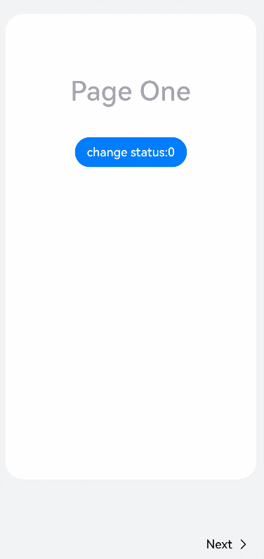

# Stepper<a name="ZH-CN_TOPIC_0000001237475075"></a>

> **说明：** 
>该组件从API Version 8开始支持。后续版本如有新增内容，则采用上角标单独标记该内容的起始版本。

步骤导航器。


## 权限列表<a name="section988262631714"></a>

无

## 子组件<a name="section5989144051714"></a>

仅能包含子组件[StepperItem](ts-container-stepperitem.md)。

## 接口<a name="section121394874010"></a>

Stepper\(value?: \{ index?: number \}\)

-   参数

    <table><thead align="left"><tr><th class="cellrowborder" valign="top" width="16.11%" id="mcps1.1.6.1.1"><p>参数名</p>
    </th>
    <th class="cellrowborder" valign="top" width="19.3%" id="mcps1.1.6.1.2"><p>参数类型</p>
    </th>
    <th class="cellrowborder" valign="top" width="9.77%" id="mcps1.1.6.1.3"><p>必填</p>
    </th>
    <th class="cellrowborder" valign="top" width="18.6%" id="mcps1.1.6.1.4"><p>默认值</p>
    </th>
    <th class="cellrowborder" valign="top" width="36.22%" id="mcps1.1.6.1.5"><p>参数描述</p>
    </th>
    </tr>
    </thead>
    <tbody><tr><td class="cellrowborder" valign="top" width="16.11%" headers="mcps1.1.6.1.1 "><p>index</p>
    </td>
    <td class="cellrowborder" valign="top" width="19.3%" headers="mcps1.1.6.1.2 "><p>number</p>
    </td>
    <td class="cellrowborder" valign="top" width="9.77%" headers="mcps1.1.6.1.3 "><p>否</p>
    </td>
    <td class="cellrowborder" valign="top" width="18.6%" headers="mcps1.1.6.1.4 "><p>0</p>
    </td>
    <td class="cellrowborder" valign="top" width="36.22%" headers="mcps1.1.6.1.5 "><p>设置步骤导航器显示第几个StepperItem。</p>
    </td>
    </tr>
    </tbody>
    </table>


## 属性<a name="section1328124354614"></a>

无

## 事件<a name="section39758242515"></a>

<table><thead align="left"><tr><th class="cellrowborder" valign="top" width="50%" id="mcps1.1.3.1.1"><p>名称</p>
</th>
<th class="cellrowborder" valign="top" width="50%" id="mcps1.1.3.1.2"><p>描述</p>
</th>
</tr>
</thead>
<tbody><tr><td class="cellrowborder" valign="top" width="50%" headers="mcps1.1.3.1.1 "><p>onFinish(callback: () =&gt; void)</p>
</td>
<td class="cellrowborder" valign="top" width="50%" headers="mcps1.1.3.1.2 "><p>步骤导航器最后一个StepperItem的nextLabel被点击时触发该回调 。</p>
</td>
</tr>
<tr><td class="cellrowborder" valign="top" width="50%" headers="mcps1.1.3.1.1 "><p>onSkip(callback: () =&gt; void)</p>
</td>
<td class="cellrowborder" valign="top" width="50%" headers="mcps1.1.3.1.2 "><p>当前显示的StepperItem状态为ItemState.Skip时，nextLabel被点击时触发该回调。</p>
</td>
</tr>
<tr><td class="cellrowborder" valign="top" width="50%" headers="mcps1.1.3.1.1 "><p>onChange(callback: (prevIndex?: number, index?: number) =&gt; void)</p>
</td>
<td class="cellrowborder" valign="top" width="50%" headers="mcps1.1.3.1.2 "><p>点击左边或者右边文本按钮进行步骤切换时触发该事件。</p>
<ul><li>prevIndex：切换前的步骤页索引值。</li><li>index：切换后的步骤页（前一页或者下一页）索引值。</li></ul>
</td>
</tr>
</tbody>
</table>

## 示例<a name="section1512314422316"></a>

```
@Entry
@Component
struct StepperExample {
  @State currentIndex: number = 0
  @State firstState: ItemState = ItemState.Normal
  @State secondState: ItemState = ItemState.Normal

  build() {
    Stepper({
      index: this.currentIndex
    }) {
      StepperItem() {
        Text('Page One')
          .fontSize(35)
          .fontColor(Color.Blue)
          .width(200)
          .lineHeight(50)
          .margin({top:250})
      }
      .nextLabel('')
      .position({x: '35%', y: 0})
      StepperItem() {
        Text('Page Two')
          .fontSize(35)
          .fontColor(Color.Blue)
          .width(200)
          .lineHeight(50)
          .margin({top:250})
          .onClick(()=>{
            this.firstState = this.firstState === ItemState.Skip ? ItemState.Normal : ItemState.Skip
          })
      }
      .nextLabel('Next')
      .prevLabel('Previous')
      .status(this.firstState)
      .position({x: '35%', y: 0})
      StepperItem() {
        Text('Page Three')
          .fontSize(35)
          .fontColor(Color.Blue)
          .width(200)
          .lineHeight(50)
          .margin({top:250})
          .onClick(()=>{
            this.secondState = this.secondState === ItemState.Waiting ? ItemState.Normal : ItemState.Waiting
          })
      }
      .position({x: '35%', y: 0})
      .status(this.secondState)
      StepperItem() {
        Text('Page four')
          .fontSize(35)
          .fontColor(Color.Blue)
          .width(200)
          .lineHeight(50)
          .margin({top:250})
      }
      .position({x: '35%', y: 0})
      .nextLabel('Finish')
    }
    .onFinish(() => {
      console.log('onFinish')
    })
    .onSkip(() => {
      console.log('onSkip')
    })
    .onChange((prevIndex: number, index: number) => {
      this.currentIndex = index
    })
    .align(Alignment.Center)
  }
}
```




