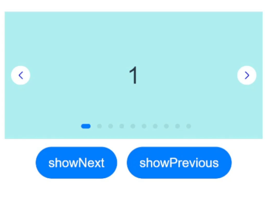

# Swiper

 滑块视图容器，提供子组件滑动轮播显示的能力。 

> **说明：**
>
> 该组件从API Version 7开始支持。后续版本如有新增内容，则采用上角标单独标记该内容的起始版本。


## 子组件

可以包含子组件。

>  **说明：** 
>
>  子组件类型：系统组件和自定义组件，支持渲染控制类型（[if/else](../../quick-start/arkts-rendering-control-ifelse.md)、[ForEach](../../quick-start/arkts-rendering-control-foreach.md)和[LazyForEach](../../quick-start/arkts-rendering-control-lazyforeach.md)）。
>
>  Swiper子组件的visibility属性设置为None，Swiper的displayMode属性设置为SwiperDisplayMode.AutoLinear或displayCount属性设置为'auto'时，对应子组件在视窗内不占位，但不影响导航点个数。
>
>  Swiper子组件的visibility属性设置为None，或者visibility属性设置为Hidden时，对应子组件不显示，但依然会在视窗内占位。
>
>  当Swiper子组件个数小于等于Swiper组件内容区内显示的节点总个数(totalDisplayCount = DisplayCount + prevMargin? (1 : 0 ) + nextMargin? (1 : 0 ))时，按照非循环模式布局处理，此时，前后边距对应子组件不显示，但依然会在视窗内占位。Swiper组件按照totalDisplayCount个数判断测算规格。
>
>  当Swiper子组件设置了offset属性时，会按照子组件的层级进行绘制，层级高的子组件会覆盖层级低的子组件。例如，Swiper包含3个子组件，其中第3个子组件设置了offset({ x : 100 })，那么在横向循环滑动中，第3个子组件会覆盖第1个子组件，此时可设置第1个子组件的zIndex属性值大于第3个子组件，使第1个子组件层级高于第3个子组件。


## 接口

Swiper(controller?: SwiperController)

**参数：** 

| 参数名        | 参数类型                                  | 必填   | 参数描述                 |
| ---------- | ------------------------------------- | ---- | -------------------- |
| controller | [SwiperController](#swipercontroller) | 否    | 给组件绑定一个控制器，用来控制组件翻页。 |


## 属性

除支持[通用属性](ts-universal-attributes-size.md)外，还支持以下属性，不支持[Menu控制](ts-universal-attributes-menu.md)。 

| 名称                                    | 参数类型                                     | 描述                                       |
| ------------------------------------- | ---------------------------------------- | ---------------------------------------- |
| index                                 | number                                   | 设置当前在容器中显示的子组件的索引值。<br/>默认值：0<br/>**说明：** <br/>设置小于0或大于等于子组件数量时，按照默认值0处理。<br />从API version 10开始，该属性支持[$$](../../quick-start/arkts-two-way-sync.md)双向绑定变量。 |
| autoPlay                              | boolean                                  | 子组件是否自动播放。<br/>默认值：false<br/>**说明：** <br/>loop为false时，自动轮播到最后一页时停止轮播。手势切换后不是最后一页时继续播放。 |
| interval                              | number                                   | 使用自动播放时播放的时间间隔，单位为毫秒。<br/>默认值：3000       |
| indicator<sup>10+</sup>               | [DotIndicator](#dotindicator10) \| [DigitIndicator](#digitindicator10) \| boolean | 设置可选导航点指示器样式。<br/> \- DotIndicator：圆点指示器样式。<br/> \- DigitIndicator：数字指示器样式。<br/> \- boolean：是否启用导航点指示器。<br/>&nbsp;&nbsp;默认值：true<br/>&nbsp;&nbsp;默认类型：DotIndicator |
| loop                                  | boolean                                  | 是否开启循环。<br>设置为true时表示开启循环，在LazyForEach懒循环加载模式下，加载的组件数量建议大于5个。<br/>默认值：true |
| duration                              | number                                   | 子组件切换的动画时长，单位为毫秒。<br/>默认值：400            |
| vertical                              | boolean                                  | 是否为纵向滑动。<br/>默认值：false                   |
| itemSpace                             | number&nbsp;\|&nbsp;string               | 设置子组件与子组件之间间隙。<br/>默认值：0<br/>**说明：** <br/>不支持设置百分比。 |
| displayMode                           | [SwiperDisplayMode](#swiperdisplaymode枚举说明) | 主轴方向上元素排列的模式，优先以displayCount设置的个数显示，displayCount未设置时本属性生效。<br/>默认值：SwiperDisplayMode.Stretch |
| cachedCount<sup>8+</sup>              | number                                   | 设置预加载子组件个数。<br/>默认值：1 |
| disableSwipe<sup>8+</sup>             | boolean                                  | 禁用组件滑动切换功能。<br/>默认值：false                |
| curve<sup>8+</sup>                    | [Curve](ts-appendix-enums.md#curve)  \| string | 设置Swiper的动画曲线，默认为淡入淡出曲线，常用曲线参考[Curve枚举说明](ts-appendix-enums.md#curve)，也可以通过[插值计算](../apis/js-apis-curve.md)模块提供的接口创建自定义的插值曲线对象。<br/>默认值：Curve.Linear |
| indicatorStyle<sup>(deprecated)</sup> | {<br/>left?:&nbsp;[Length](ts-types.md#length),<br/>top?:&nbsp;[Length](ts-types.md#length),<br/>right?:&nbsp;[Length](ts-types.md#length),<br/>bottom?:&nbsp;[Length](ts-types.md#length),<br/>size?:&nbsp;[Length](ts-types.md#length),<br/>mask?:&nbsp;boolean,<br/>color?:&nbsp;[ResourceColor](ts-types.md#resourcecolor),<br/>selectedColor?:&nbsp;[ResourceColor](ts-types.md#resourcecolor)<br/>} | 设置导航点样式：<br/>\- left: 设置导航点距离Swiper组件左边的距离。<br/>\- top: 设置导航点距离Swiper组件顶部的距离。<br/>\- right: 设置导航点距离Swiper组件右边的距离。<br/>\- bottom: 设置导航点距离Swiper组件底部的距离。<br/>\- size: 设置导航点的直径，不支持设置百分比。默认值：6vp。<br/>\- mask: 设置是否显示导航点蒙层样式。<br/>\- color: 设置导航点的颜色。<br/>\- selectedColor: 设置选中的导航点的颜色。 <br/>从API version 8开始支持，从API version 10开始不再维护，建议使用[indicator](#indicator10)代替。 |
| displayCount<sup>8+</sup>   | number \| string \| <br />[SwiperAutoFill](#swiperautofill10)<sup>10+</sup> | 设置一页内元素显示个数。<br/>默认值：1<br/>**说明：** <br/>字符串类型仅支持设置为'auto'，显示效果同SwiperDisplayMode.AutoLinear。<br/>使用number类型且设置小于等于0时，按默认值1显示。<br/>使用number类型时，子组件按照主轴均分Swiper宽度（减去displayCount-1个itemSpace）的方式进行主轴拉伸（收缩）布局。<br/> 使用SwiperAutoFill类型时，通过设置一个子组件最小宽度值minSize，会根据Swiper当前宽度和minSize值自动计算并更改一页内元素显示个数。当minSize为空或者小于等于0时，Swiper显示1列。 |
| effectMode<sup>8+</sup>               | [EdgeEffect](ts-appendix-enums.md#edgeeffect) | 边缘滑动效果，loop = false时生效。 目前支持的滑动效果参见EdgeEffect的枚举说明。<br/>默认值：EdgeEffect.Spring<br/>**说明：** <br/>控制器接口调用时不生效回弹。 |
| displayArrow<sup>10+</sup>            | value:[ArrowStyle](#arrowstyle10) \| boolean,<br/>isHoverShow?: boolean | 设置导航点箭头样式。<br/>-value: 支持设置箭头和底板样式，异常场景使用ArrowStyle对象中的默认值。<br/>\-isHoverShow：设置鼠标悬停时是否显示箭头。<br/>默认值：false<br/>**说明：**<br/>isHoverShow为false时，常驻显示箭头，支持点击翻页。<br/>isHoverShow为true时，只有在鼠标悬停时才会显示箭头，并支持点击翻页。 |
| nextMargin<sup>10+</sup>    | <br/>[Length](ts-types.md#length)<br/> | 后边距，用于露出后一项的一小部分。<br/>默认值：0<br/>**说明：** <br/>仅当SwiperDisplayMode为STRETCH模式时生效。<br/>当主轴方向为横向布局时，nextmargin/prevmargin中任意一个大于子组件测算的宽度，nextmargin和prevmargin均不显示。<br/>当主轴方向为纵向布局时，nextmargin/prevmargin中任意一个大于子组件测算的高度，nextmargin和prevmargin均不显示。 |
| prevMargin<sup>10+</sup>    | <br/>[Length](ts-types.md#length)<br/> | 前边距，用于露出前一项的一小部分。<br/>默认值：0<br/>**说明：** <br/>仅当SwiperDisplayMode为STRETCH模式时生效。<br/>当主轴方向为横向布局时，nextmargin/prevmargin中任意一个大于子组件测算的宽度，prevmargin和nextmargin均不显示。<br/>当主轴方向为纵向布局时，nextmargin/prevmargin中任意一个大于子组件测算的高度，nextmargin和prevmargin均不显示。 |

## SwiperDisplayMode枚举说明

| 名称                                | 描述                                       |
| --------------------------------- | ---------------------------------------- |
| Stretch<sup>(deprecated)</sup>    | Swiper滑动一页的宽度为Swiper组件自身的宽度。<br>从API version 10开始不再维护，建议使用STRETCH代替。 |
| AutoLinear<sup>(deprecated)</sup> | Swiper滑动一页的宽度为子组件宽度中的最大值。<br>从API version 10开始不再维护，建议使用AUTO_LINEAR代替。 |
| STRETCH<sup>10+</sup>             | Swiper滑动一页的宽度为Swiper组件自身的宽度。             |
| AUTO_LINEAR<sup>10+</sup>         | Swiper滑动一页的宽度为视窗内最左侧子组件的宽度。              |

## SwiperController

Swiper容器组件的控制器，可以将此对象绑定至Swiper组件，然后通过它控制翻页。

### showNext

showNext(): void

翻至下一页。翻页带动效切换过程，时长通过duration指定。

### showPrevious

showPrevious(): void

翻至上一页。翻页带动效切换过程，时长通过duration指定。

### finishAnimation

finishAnimation(callback?: () => void): void

停止播放动画。

**参数：**

| 参数名      | 参数类型       | 必填项  | 参数描述     |
| -------- | ---------- | ---- | -------- |
| callback | () => void | 否    | 动画结束的回调。 |

## Indicator<sup>10+</sup>

设置导航点距离Swiper组件距离。

| 参数名    | 参数类型                         | 必填项  | 参数描述                                     |
| ------ | ---------------------------- | ---- | ---------------------------------------- |
| left   | [Length](ts-types.md#length) | 否    | 设置导航点距离Swiper组件左边的距离。<br/>默认值：0<br/>单位：vp |
| top    | [Length](ts-types.md#length) | 否    | 设置导航点距离Swiper组件顶部的距离。<br/>默认值：0<br/>单位：vp |
| right  | [Length](ts-types.md#length) | 否    | 设置导航点距离Swiper组件右边的距离。<br/>默认值：0<br/>单位：vp |
| bottom | [Length](ts-types.md#length) | 否    | 设置导航点距离Swiper组件底部的距离。<br/>默认值：0<br/>单位：vp |

## DotIndicator<sup>10+</sup>

圆点指示器属性及功能继承自Indicator。

| 参数名                | 参数类型                                     | 必填项  | 参数描述                                     |
| ------------------ | ---------------------------------------- | ---- | ---------------------------------------- |
| itemWidth          | [Length](ts-types.md#length)             | 否    | 设置Swiper组件圆点导航指示器的宽，不支持设置百分比。<br/>默认值：6<br/>单位：vp |
| itemHeight         | [Length](ts-types.md#length)             | 否    | 设置Swiper组件圆点导航指示器的高，不支持设置百分比。<br/>默认值：6<br/>单位：vp |
| selectedItemWidth  | [Length](ts-types.md#length)             | 否    | 设置选中Swiper组件圆点导航指示器的宽，不支持设置百分比。<br/>默认值：12<br/>单位：vp |
| selectedItemHeight | [Length](ts-types.md#length)             | 否    | 设置选中Swiper组件圆点导航指示器的高，不支持设置百分比。<br/>默认值：6<br/>单位：vp |
| mask               | boolean                                  | 否    | 设置是否显示Swiper组件圆点导航指示器的蒙版样式。<br/>默认值：false |
| color              | [ResourceColor](ts-types.md#resourcecolor) | 否    | 设置Swiper组件圆点导航指示器的颜色。<br/>默认值：'\#182431'（10%透明度） |
| selectedColor      | [ResourceColor](ts-types.md#resourcecolor) | 否    | 设置选中Swiper组件圆点导航指示器的颜色。<br/>默认值：'\#007DFF' |

## DigitIndicator<sup>10+</sup>

数字指示器属性及功能继承自Indicator。

| 参数名               | 参数类型                                     | 必填项  | 参数描述                                     |
| ----------------- | ---------------------------------------- | ---- | ---------------------------------------- |
| fontColor         | [ResourceColor](ts-types.md#resourcecolor) | 否    | 设置Swiper组件数字导航点的字体颜色。<br/>默认值：'\#ff182431' |
| selectedFontColor | [ResourceColor](ts-types.md#resourcecolor) | 否    | 设置选中Swiper组件数字导航点的字体颜色。<br/>默认值：'\#ff182431' |
| digitFont         | {<br/>size?:[Length](ts-types.md#length)<br/>weight?:number \| [FontWeight](ts-appendix-enums.md#fontweight) \| string<br/>} | 否    | 设置Swiper组件数字导航点的字体样式：<br/>\- size：数字导航点指示器的字体大小，不支持设置百分比。<br/>默认值：14vp<br/>\- weight：数字导航点指示器的字重。 |
| selectedDigitFont | {<br/>size?:[Length](ts-types.md#length)<br/>weight?:number \| [FontWeight](ts-appendix-enums.md#fontweight) \| string<br/>} | 否    | 设置选中Swiper组件数字导航点的字体样式：<br/>\- size：数字导航点选中指示器的字体大小，不支持设置百分比。<br/>默认值：14vp<br/>\- weight：数字导航点选中指示器的字重。 |

## ArrowStyle<sup>10+</sup>
左右箭头属性。

| 参数名              | 参数类型                                     | 必填项  | 参数描述                                     |
| ---------------- | ---------------------------------------- | ---- | ---------------------------------------- |
| showBackground   | boolean                                  | 否    | 设置箭头底板是否显示。<br/>默认值：false                |
| isSidebarMiddle  | boolean                                  | 否    | 设置箭头显示位置。<br/>默认值：false <br/>默认显示在导航点指示器两侧。 |
| backgroundSize   | [Length](ts-types.md#length)             | 否    | 设置底板大小。<br/>在导航点两侧显示：<br/>默认值：24vp<br/>在组件两侧显示：<br/>默认值：32vp<br/>不支持设置百分比。 |
| backgroundColor  | [ResourceColor](ts-types.md#resourcecolor) | 否    | 设置底板颜色。<br/>在导航点两侧显示：<br/>默认值：'\#00000000'<br/>在组件两侧显示：<br/>默认值：'\#19182431' |
| arrowSize        | [Length](ts-types.md#length)             | 否    | 设置箭头大小。<br/>在导航点两侧显示时：<br/>默认值：18vp<br/>在组件两侧显示时：<br/>默认值：24vp<br/>**说明：**<br/>showBackground为true时，arrowSize为backgroundSize的3/4。<br/>不支持设置百分比。 |
| arrowColor       | [ResourceColor](ts-types.md#resourcecolor) | 否    | 设置箭头颜色。<br/>默认值：'\#182431'                 |

## SwiperAutoFill<sup>10+</sup>

自适应属性。

| 参数名  | 参数类型             | 必填项 | 参数描述                             |
| ------- | -------------------- | ------ | ------------------------------------ |
| minSize | [VP](ts-types.md#vp10) | 是     | 设置元素显示最小宽度。<br/>默认值：0 |

## 事件

除支持[通用事件](ts-universal-events-click.md)外，还支持以下事件：

| 名称                                       | 功能描述                                     |
| ---------------------------------------- | ---------------------------------------- |
| onChange(event: (index: number) => void) | 当前显示的子组件索引变化时触发该事件,返回值为当前显示的子组件的索引值。<br/>-&nbsp;index:当前显示元素的索引。<br/>**说明：** <br>Swiper组件结合LazyForEach使用时，不能在onChange事件里触发子页面UI的刷新。 |
| onAnimationStart<sup>9+</sup>(event: (index: number, targetIndex<sup>10+</sup>: number, extraInfo<sup>10+</sup>: [SwiperAnimationEvent](ts-types.md#swiperanimationevent10)) => void) | 切换动画开始时触发该回调。<br/>-&nbsp;index:当前显示元素的索引。<br/>-&nbsp;targetIndex:切换动画目标元素的索引。<br/>-&nbsp;extraInfo:动画相关信息，包括主轴方向上当前显示元素和目标元素相对Swiper起始位置的位移，以及离手速度。<br/>**说明：** <br/>参数为动画开始前的index值（不是最终结束动画的index值），多列Swiper时，index为最左侧组件的索引。 |
| onAnimationEnd<sup>9+</sup>(event: (index: number, extraInfo: [SwiperAnimationEvent](ts-types.md#swiperanimationevent10)) => void) | 切换动画结束时触发该回调。<br/>-&nbsp;index:当前显示元素的索引。<br/>-&nbsp;extraInfo:动画相关信息，只返回主轴方向上当前显示元素相对于Swiper起始位置的位移。<br/>**说明：** <br/>当Swiper切换动效结束时触发，包括动画过程中手势中断，通过SwiperController调用finishAnimation。参数为动画结束后的index值，多列Swiper时，index为最左侧组件的索引。 |
| onGestureSwipe<sup>10+</sup>(event: (index: number, extraInfo: [SwiperAnimationEvent](ts-types.md#swiperanimationevent10)) => void) | 在页面跟手滑动过程中，逐帧触发该回调。<br/>-&nbsp;index:当前显示元素的索引。<br/>-&nbsp;extraInfo:动画相关信息，只返回主轴方向上当前显示元素相对于Swiper起始位置的位移。<br/>**说明：** <br/>多列Swiper时，index为最左侧组件的索引。 |

## 示例

### 示例1
```ts
// xxx.ets
class MyDataSource implements IDataSource {
  private list: number[] = []

  constructor(list: number[]) {
    this.list = list
  }

  totalCount(): number {
    return this.list.length
  }

  getData(index: number): number {
    return this.list[index]
  }

  registerDataChangeListener(listener: DataChangeListener): void {
  }

  unregisterDataChangeListener() {
  }
}

@Entry
@Component
struct SwiperExample {
  private swiperController: SwiperController = new SwiperController()
  private data: MyDataSource = new MyDataSource([])

  aboutToAppear(): void {
    let list: number[] = []
    for (let i = 1; i <= 10; i++) {
      list.push(i);
    }
    this.data = new MyDataSource(list)
  }

  build() {
    Column({ space: 5 }) {
      Swiper(this.swiperController) {
        LazyForEach(this.data, (item: string) => {
          Text(item.toString())
            .width('90%')
            .height(160)
            .backgroundColor(0xAFEEEE)
            .textAlign(TextAlign.Center)
            .fontSize(30)
        }, (item: string) => item)
      }
      .cachedCount(2)
      .index(1)
      .autoPlay(true)
      .interval(4000)
      .loop(true)
      .duration(1000)
      .itemSpace(0)
      .indicator( // 设置圆点导航点样式
        new DotIndicator()
          .itemWidth(15)
          .itemHeight(15)
          .selectedItemWidth(15)
          .selectedItemHeight(15)
          .color(Color.Gray)
          .selectedColor(Color.Blue))
      .displayArrow({ // 设置导航点箭头样式
        showBackground: true,
        isSidebarMiddle: true,
        backgroundSize: 24,
        backgroundColor: Color.White,
        arrowSize: 18,
        arrowColor: Color.Blue
      }, false)
      .curve(Curve.Linear)
      .onChange((index: number) => {
        console.info(index.toString())
      })
      .onGestureSwipe((index: number, extraInfo: SwiperAnimationEvent) => {
        console.info("index: " + index)
        console.info("current offset: " + extraInfo.currentOffset)
      })
      .onAnimationStart((index: number, targetIndex: number, extraInfo: SwiperAnimationEvent) => {
        console.info("index: " + index)
        console.info("targetIndex: " + targetIndex)
        console.info("current offset: " + extraInfo.currentOffset)
        console.info("target offset: " + extraInfo.targetOffset)
        console.info("velocity: " + extraInfo.velocity)
      })
      .onAnimationEnd((index: number, extraInfo: SwiperAnimationEvent) => {
        console.info("index: " + index)
        console.info("current offset: " + extraInfo.currentOffset)
      })

      Row({ space: 12 }) {
        Button('showNext')
          .onClick(() => {
            this.swiperController.showNext()
          })
        Button('showPrevious')
          .onClick(() => {
            this.swiperController.showPrevious()
          })
      }.margin(5)
    }.width('100%')
    .margin({ top: 5 })
  }
}
```



### 示例2
```ts
// xxx.ets
class MyDataSource implements IDataSource {
  private list: number[] = []

  constructor(list: number[]) {
    this.list = list
  }

  totalCount(): number {
    return this.list.length
  }

  getData(index: number): number {
    return this.list[index]
  }

  registerDataChangeListener(listener: DataChangeListener): void {
  }

  unregisterDataChangeListener() {
  }
}

@Entry
@Component
struct SwiperExample {
  private swiperController: SwiperController = new SwiperController()
  private data: MyDataSource = new MyDataSource([])

  aboutToAppear(): void {
    let list: number[] = []
    for (let i = 1; i <= 10; i++) {
      list.push(i);
    }
    this.data = new MyDataSource(list)
  }

  build() {
    Column({ space: 5 }) {
      Swiper(this.swiperController) {
        LazyForEach(this.data, (item: string) => {
          Text(item.toString())
            .width('90%')
            .height(160)
            .backgroundColor(0xAFEEEE)
            .textAlign(TextAlign.Center)
            .fontSize(30)
        }, (item: string) => item)
      }
      .cachedCount(2)
      .index(1)
      .autoPlay(true)
      .interval(4000)
      .indicator(Indicator.digit() // 设置数字导航点样式
        .right("43%")
        .top(200)
        .fontColor(Color.Gray)
        .selectedFontColor(Color.Gray)
        .digitFont({ size: 20, weight: FontWeight.Bold })
        .selectedDigitFont({ size: 20, weight: FontWeight.Normal }))
      .loop(true)
      .duration(1000)
      .itemSpace(0)
      .displayArrow(true, false)

      Row({ space: 12 }) {
        Button('showNext')
          .onClick(() => {
            this.swiperController.showNext()
          })
        Button('showPrevious')
          .onClick(() => {
            this.swiperController.showPrevious()
          })
      }.margin(5)
    }.width('100%')
    .margin({ top: 5 })
  }
}
```
