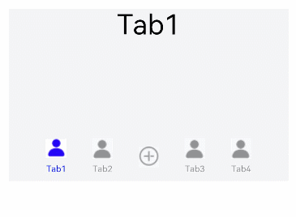

# TabContent

仅在Tabs中使用，对应一个切换页签的内容视图。

>  **说明：**
>
>  该组件从API Version 7开始支持。后续版本如有新增内容，则采用上角标单独标记该内容的起始版本。


## 子组件

支持单个子组件。


## 接口

TabContent()


## 属性

除支持[通用属性](ts-universal-attributes-size.md)外，还支持以下属性：

| 名称 | 参数类型 | 描述 |
| -------- | -------- | -------- |
| tabBar | string&nbsp;\|&nbsp;Resource&nbsp;\|&nbsp;{<br/>icon?:&nbsp;string&nbsp;\|&nbsp;Resource,<br/>text?:&nbsp;string&nbsp;\|&nbsp;Resource<br/>}<br/>\|&nbsp;[CustomBuilder](ts-types.md)<sup>8+</sup> | 设置TabBar上显示内容。<br/>CustomBuilder:&nbsp;构造器，内部可以传入组件（API8版本以上适用）。<br/>>&nbsp;&nbsp;**说明：**<br/>>&nbsp;如果icon采用svg格式图源，则要求svg图源删除其自有宽高属性值。如采用带有自有宽高属性的svg图源，icon大小则是svg本身内置的宽高属性值大小。 |

>  **说明：**
> - TabContent组件不支持设置通用宽度属性，其宽度默认撑满Tabs父组件。
> - TabContent组件不支持设置通用高度属性，其高度由Tabs父组件高度与TabBar组件高度决定。
> - TabContent组件不支持[触摸热区设置](ts-universal-attributes-touch-target.md)。


## 示例

```ts
// xxx.ets
@Entry
@Component
struct TabContentExample {
  @State fontColor: string = 'rgba(0, 0, 0, 0.4)'
  @State selectedFontColor: string = 'rgba(10, 30, 255, 1)'
  @State currentIndex: number = 0
  private controller: TabsController = new TabsController()

  @Builder TabBuilder(index: number) {
    Column() {
      Image(this.currentIndex === index ? '/resources/ic_public_contacts_filled_selected.png' : '/resources/ic_public_contacts_filled.png')
        .width(24)
        .height(24)
        .margin(6)
        .opacity(this.currentIndex === index ? 1 : 0.4)
        .objectFit(ImageFit.Contain)
      Text(`Tab${(index > 2 ? (index - 1) : index) + 1}`)
        .fontColor(this.currentIndex === index ? this.selectedFontColor : this.fontColor)
        .fontSize(10)
    }.width('100%')
  }

  @Builder AddBuilder() {
    Column() {
      Image(this.currentIndex === 2 ? '/resources/ic_public_add_norm_filled_selected.png' : '/resources/ic_public_add_norm_filled.png')
        .width(this.currentIndex === 2 ? 26 : 24)
        .height(this.currentIndex === 2 ? 26 : 24)
        .opacity(this.currentIndex === 2 ? 1 : 0.4)
        .objectFit(ImageFit.Contain)
    }.width('100%').height('100%').justifyContent(FlexAlign.Center)
  }

  build() {
    Column() {
      Tabs({ barPosition: BarPosition.End, controller: this.controller }) {
        TabContent() {
          Column() {
            Text('Tab1').fontSize(32)
          }.width('100%')
        }.tabBar(this.TabBuilder(0))

        TabContent() {
          Column() {
            Text('Tab2').fontSize(32)
          }.width('100%')
        }.tabBar(this.TabBuilder(1))

        TabContent() {
          Column() {
            Text('Add').fontSize(32)
          }.width('100%')
        }.tabBar(this.AddBuilder())

        TabContent() {
          Column() {
            Text('Tab3').fontSize(32)
          }.width('100%')
        }.tabBar(this.TabBuilder(3))

        TabContent() {
          Column() {
            Text('Tab4').fontSize(32)
          }.width('100%')
        }.tabBar(this.TabBuilder(4))
      }
      .vertical(false)
      .barWidth(300)
      .barHeight(56)
      .onChange((index: number) => {
        this.currentIndex = index
      })
      .width('90%')
      .backgroundColor('rgba(241, 243, 245, 0.95)')
    }.width('100%').height(200).margin({ top: 15 })
  }
}
```

