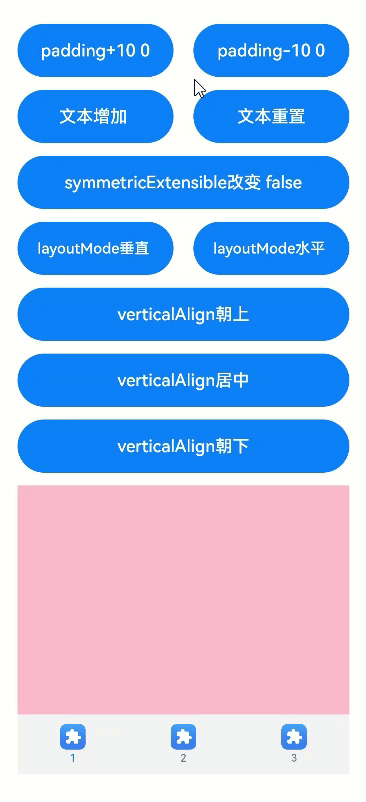

# TabContent

仅在Tabs中使用，对应一个切换页签的内容视图。

>  **说明：**
>
>  该组件从API Version 7开始支持。后续版本如有新增内容，则采用上角标单独标记该内容的起始版本。


## 子组件

支持单个子组件。

>  **说明：**
>
>  可内置系统组件和自定义组件，支持渲染控制类型（[if/else](../../quick-start/arkts-rendering-control-ifelse.md)、[ForEach](../../quick-start/arkts-rendering-control-foreach.md)和[LazyForEach](../../quick-start/arkts-rendering-control-lazyforeach.md)）。


## 接口

TabContent()


## 属性

除支持[通用属性](ts-universal-attributes-size.md)外，还支持以下属性：

| 名称 | 参数类型 | 描述 |
| -------- | -------- | -------- |
| tabBar | string&nbsp;\|&nbsp;[Resource](ts-types.md#resource)&nbsp;\|&nbsp;{<br/>icon?:&nbsp;string&nbsp;\|&nbsp;[Resource](ts-types.md#resource),<br/>text?:&nbsp;string&nbsp;\|&nbsp;[Resource](ts-types.md#resource)<br/>}<br/>\|&nbsp;[CustomBuilder](ts-types.md#custombuilder8)<sup>8+</sup> | 设置TabBar上显示内容。<br/>CustomBuilder:&nbsp;构造器，内部可以传入组件（API8版本以上适用）。<br/>>&nbsp;&nbsp;**说明：**<br/>>&nbsp;如果icon采用svg格式图源，则要求svg图源删除其自有宽高属性值。如采用带有自有宽高属性的svg图源，icon大小则是svg本身内置的宽高属性值大小。<br>设置的内容超出tabbar页签时进行裁切。 |
| tabBar<sup>9+</sup> | [SubTabBarStyle](#subtabbarstyle) \| [BottomTabBarStyle](#bottomtabbarstyle) | 设置TabBar上显示内容。<br/>SubTabBarStyle:&nbsp;子页签样式，参数为文字。<br/>BottomTabBarStyle:&nbsp;底部页签和侧边页签样式，参数为文字和图片。<br/>**说明：** <br/>底部样式没有下划线效果。<br/>icon异常时显示灰色图块。 |

>  **说明：**
>
>  - TabContent组件不支持设置通用宽度属性，其宽度默认撑满Tabs父组件。
>  - TabContent组件不支持设置通用高度属性，其高度由Tabs父组件高度与TabBar组件高度决定。
>  - vertical属性为false值，交换上述2个限制。
>  - TabContent组件不支持内容过长时页面的滑动，如需页面滑动，可嵌套List使用。

## SubTabBarStyle<sup>9+</sup>

子页签样式。

### constructor

constructor(content: string | Resource)

SubTabBarStyle的构造函数。

**参数：**

| 参数名 | 参数类型         | 必填 | 参数描述 |
| -------- | -------- | -------- | -------- |
| content | string \| [Resource](ts-types.md#resource) | 是 | 页签内的文字内容。从API version 10开始，content类型为ResourceStr。 |

### of<sup>10+</sup>

static of(content: ResourceStr)

SubTabBarStyle的静态构造函数。

**参数：**

| 参数名  | 参数类型                                   | 必填 | 参数描述           |
| ------- | ------------------------------------------ | ---- | ------------------ |
| content | [ResourceStr](ts-types.md#resourcestr) | 是   | 页签内的文字内容。 |

### 属性

支持以下属性：

| 名称         | 参数类型                                                     | 描述                                                         |
| ------------ | ------------------------------------------------------------ | ------------------------------------------------------------ |
| indicator<sup>10+</sup> | [IndicatorStyle](#indicatorstyle10对象说明)| 设置选中子页签的下划线风格。子页签的下划线风格仅在水平模式下有效。|
| selectedMode<sup>10+</sup> | [SelectedMode](#selectedmode10枚举说明)   | 设置选中子页签的显示方式。<br />默认值：SelectedMode.INDICATOR |
| board<sup>10+</sup> | [BoardStyle](#boardstyle10对象说明)   | 设置选中子页签的背板风格。子页签的背板风格仅在水平模式下有效。|
| labelStyle<sup>10+</sup> | [LabelStyle](#labelstyle10对象说明) | 设置子页签的label文本和字体的样式。 |
| padding<sup>10+</sup> | [Padding](ts-types.md#padding) \| [Dimension](ts-types.md#dimension10) | 设置子页签的内边距属性（不支持百分比设置）。使用Dimension时，四个方向内边距同时生效。<br/>默认值：{left:8.0vp,right:8.0vp,top:17.0vp,bottom:18.0vp} |

## IndicatorStyle<sup>10+</sup>对象说明

| 名称 | 参数类型 | 必填 | 描述 |
| -------- | -------- | -------- | -------------------------------- |
| color | [ResourceColor](ts-types.md#resourcecolor) | 否 | 下划线的颜色和背板颜色。<br/>默认值:#FF007DFF |
| height | [Length](ts-types.md#length) | 否 | 下划线的高度（不支持百分比设置）。<br/>默认值:2.0<br/>单位：vp |
| width | [Length](ts-types.md#length) | 否 | 下划线的宽度（不支持百分比设置）。<br/>默认值：0.0<br/>单位：vp <br/>**说明：** <br/>宽度设置为0时，按页签文本宽度显示。|
| borderRadius | [Length](ts-types.md#length) | 否 | 下划线的圆角半径（不支持百分比设置）。<br/>默认值：0.0<br/>单位：vp |
| marginTop | [Length](ts-types.md#length) | 否 | 下划线与文字的间距（不支持百分比设置）。<br/>默认值：8.0<br/>单位：vp |

## SelectedMode<sup>10+</sup>枚举说明
| 名称       | 描述                     |
| ---------- | ------------------------ |
| INDICATOR | 使用下划线模式。     |
| BOARD   | 使用背板模式。     |

## BoardStyle<sup>10+</sup>对象说明

| 名称 | 参数类型 | 必填 | 描述 |
| -------- | -------- | -------- | ------------------------------------ |
| borderRadius | [Length](ts-types.md#length) | 否 | 背板的圆角半径（不支持百分比设置）。<br/>默认值：8.0<br/>单位：vp |

## LabelStyle<sup>10+</sup>对象说明

| 名称                 | 参数类型                                                     | 必填 | 描述                                                         |
| -------------------- | ------------------------------------------------------------ | ---- | ------------------------------------------------------------ |
| overflow             | [TextOverflow](ts-appendix-enums.md#textoverflow)            | 否   | 设置Label文本超长时的显示方式。默认值是省略号截断。 |
| maxLines             | number                                                       | 否   | 设置Label文本的最大行数。如果指定此参数，则文本最多不会超过指定的行。如果有多余的文本，可以通过textOverflow来指定截断方式。默认值是1。 |
| minFontSize          | number \| [ResourceStr](ts-types.md#resourcestr)             | 否   | 设置Label文本最小显示字号（不支持百分比设置）。需配合maxFontSize以及maxLines或布局大小限制使用。自适应文本大小生效后，font.size不生效。默认值是0.0fp。|
| maxFontSize          | number \| [ResourceStr](ts-types.md#resourcestr)             | 否   | 设置Label文本最大显示字号（不支持百分比设置）。需配合minFontSize以及maxLines或布局大小限制使用。自适应文本大小生效后，font.size不生效。默认值是0.0fp。||
| heightAdaptivePolicy | [TextHeightAdaptivePolicy](ts-appendix-enums.md#textheightadaptivepolicy10) | 否   | 设置Label文本自适应高度的方式。默认值是最大行数优先。                              |
| font                 | [Font](ts-types.md#font)                                     | 否   | 设置Label文本字体样式。<br/>当页签为子页签时，默认值是字体大小16.0fp、字体类型'HarmonyOS Sans'，字体风格正常，字重正常。<br/>当页签为底部页签时，默认值是字体大小10.0fp、字体类型'HarmonyOS Sans'，字体风格正常，字重中等。      |

## BottomTabBarStyle<sup>9+</sup>

底部页签和侧边页签样式。

### constructor

constructor(icon: string | Resource, content: string | Resource)

BottomTabBarStyle的构造函数。

**参数：**

| 参数名 | 参数类型         | 必填 | 参数描述 |
| -------- | -------- | -------- | -------- |
| icon | string \| [Resource](ts-types.md#resource) | 是 | 页签内的图片内容。从API version 10开始，icon类型为ResourceStr。 |
| text | string \| [Resource](ts-types.md#resource) | 是 | 页签内的文字内容。从API version 10开始，text类型为ResourceStr。 |

### of<sup>10+</sup>

static of(icon: ResourceStr, text: ResourceStr)
BottomTabBarStyle的静态构造函数。

**参数：**

| 参数名 | 参数类型         | 必填 | 参数描述 |
| -------- | -------- | -------- | -------- |
| icon | [ResourceStr](ts-types.md#resourcestr) | 是 | 页签内的图片内容。 |
| text | [ResourceStr](ts-types.md#resourcestr) | 是 | 页签内的文字内容。 |

### 属性

支持以下属性：

| 名称         | 参数类型                                                     | 描述                                                         |
| ------------ | ------------------------------------------------------------ | ------------------------------------------------------------ |
| padding<sup>10+</sup> | [Padding](ts-types.md#padding) \| [Dimension](ts-types.md#dimension10) | 设置底部页签的内边距属性（不支持百分比设置）。使用Dimension时，四个方向内边距同时生效。<br/>默认值：{left:4.0vp,right:4.0vp,top:0.0vp,bottom:0.0vp} |
| verticalAlign<sup>10+</sup> |  [VerticalAlign](ts-appendix-enums.md#verticalalign) | 设置底部页签的图片、文字在垂直方向上的对齐格式。<br/>默认值：VerticalAlign.Center |
| layoutMode<sup>10+</sup> |  [LayoutMode](#layoutmode10枚举说明) | 设置底部页签的图片、文字排布的方式，具体参照LayoutMode枚举。<br/>默认值：LayoutMode.VERTICAL |
| symmetricExtensible<sup>10+</sup> |  boolean | 设置底部页签的图片、文字是否可以对称借左右底部页签的空余位置中的最小值，仅fixed水平模式下在底部页签之间有效。<br/>默认值：false |
| labelStyle<sup>10+</sup> | [LabelStyle](#labelstyle10对象说明) | 设置子页签的label文本和字体的样式。 |

## LayoutMode<sup>10+</sup>枚举说明

| 名称         | 描述                                       |
| ----------  | ---------------------------------------- |
| AUTO        | 若页签宽度大于104vp，页签内容为左右排布，否则页签内容为上下排布。仅TabBar为垂直模式或Fixed水平模式时有效。 |
| VERTICAL    | 页签内容上下排布。 |
| HORIZONAL   | 页签内容左右排布。 |


## 示例

### 示例1

```ts
// xxx.ets
@Entry
@Component
struct TabContentExample {
  @State fontColor: string = '#182431'
  @State selectedFontColor: string = '#007DFF'
  @State currentIndex: number = 0
  private controller: TabsController = new TabsController()

  @Builder tabBuilder(index: number) {
    Column() {
      Image(this.currentIndex === index ? '/common/public_icon_on.svg' : '/common/public_icon_off.svg')
        .width(24)
        .height(24)
        .margin({ bottom: 4 })
        .objectFit(ImageFit.Contain)
      Text(`Tab${index + 1}`)
        .fontColor(this.currentIndex === index ? this.selectedFontColor : this.fontColor)
        .fontSize(10)
        .fontWeight(500)
        .lineHeight(14)
    }.width('100%')
  }

  build() {
    Column() {
      Tabs({ barPosition: BarPosition.End, controller: this.controller }) {
        TabContent() {
          Column() {
            Text('Tab1')
              .fontSize(36)
              .fontColor('#182431')
              .fontWeight(500)
              .opacity(0.4)
              .margin({ top: 30, bottom: 56.5 })
            Divider()
              .strokeWidth(0.5)
              .color('#182431')
              .opacity(0.05)
          }.width('100%')
        }.tabBar(this.tabBuilder(0))

        TabContent() {
          Column() {
            Text('Tab2')
              .fontSize(36)
              .fontColor('#182431')
              .fontWeight(500)
              .opacity(0.4)
              .margin({ top: 30, bottom: 56.5 })
            Divider()
              .strokeWidth(0.5)
              .color('#182431')
              .opacity(0.05)
          }.width('100%')
        }.tabBar(this.tabBuilder(1))

        TabContent() {
          Column() {
            Text('Tab3')
              .fontSize(36)
              .fontColor('#182431')
              .fontWeight(500)
              .opacity(0.4)
              .margin({ top: 30, bottom: 56.5 })
            Divider()
              .strokeWidth(0.5)
              .color('#182431')
              .opacity(0.05)
          }.width('100%')
        }.tabBar(this.tabBuilder(2))

        TabContent() {
          Column() {
            Text('Tab4')
              .fontSize(36)
              .fontColor('#182431')
              .fontWeight(500)
              .opacity(0.4)
              .margin({ top: 30, bottom: 56.5 })
            Divider()
              .strokeWidth(0.5)
              .color('#182431')
              .opacity(0.05)
          }.width('100%')
        }.tabBar(this.tabBuilder(3))
      }
      .vertical(false)
      .barHeight(56)
      .onChange((index: number) => {
        this.currentIndex = index
      })
      .width(360)
      .height(190)
      .backgroundColor('#F1F3F5')
      .margin({ top: 38 })
    }.width('100%')
  }
}
```


### 示例2

```ts
// xxx.ets
@Entry
@Component
struct TabContentExample {
  @State fontColor: string = '#182431'
  @State selectedFontColor: string = '#007DFF'
  @State currentIndex: number = 0
  private controller: TabsController = new TabsController()

  @Builder tabBuilder(index: number) {
    Column() {
      Image(this.currentIndex === index ? '/common/public_icon_on.svg' : '/common/public_icon_off.svg')
        .width(24)
        .height(24)
        .margin({ bottom: 4 })
        .objectFit(ImageFit.Contain)
      Text('Tab')
        .fontColor(this.currentIndex === index ? this.selectedFontColor : this.fontColor)
        .fontSize(10)
        .fontWeight(500)
        .lineHeight(14)
    }.width('100%').height('100%').justifyContent(FlexAlign.Center)
  }

  build() {
    Column() {
      Tabs({ barPosition: BarPosition.Start, controller: this.controller }) {
        TabContent()
          .tabBar(this.tabBuilder(0))
        TabContent()
          .tabBar(this.tabBuilder(1))
        TabContent()
          .tabBar(this.tabBuilder(2))
        TabContent()
          .tabBar(this.tabBuilder(3))
      }
      .vertical(true)
      .barWidth(96)
      .barHeight(414)
      .onChange((index: number) => {
        this.currentIndex = index
      })
      .width(96)
      .height(414)
      .backgroundColor('#F1F3F5')
      .margin({ top: 52 })
    }.width('100%')
  }
}
```


### 示例3

```ts
// xxx.ets
@Entry
@Component
struct TabBarStyleExample {
  build() {
    Column({ space: 5 }) {
      Text("子页签样式")
      Column() {
        Tabs({ barPosition: BarPosition.Start }) {
          TabContent() {
            Column().width('100%').height('100%').backgroundColor(Color.Pink)
          }.tabBar(new SubTabBarStyle('Pink'))

          TabContent() {
            Column().width('100%').height('100%').backgroundColor(Color.Yellow)
          }.tabBar(new SubTabBarStyle('Yellow'))

          TabContent() {
            Column().width('100%').height('100%').backgroundColor(Color.Blue)
          }.tabBar(new SubTabBarStyle('Blue'))

          TabContent() {
            Column().width('100%').height('100%').backgroundColor(Color.Green)
          }.tabBar(new SubTabBarStyle('Green'))
        }
        .vertical(false)
        .scrollable(true)
        .barMode(BarMode.Fixed)
        .onChange((index: number) => {
          console.info(index.toString())
        })
        .width('100%')
        .backgroundColor(0xF1F3F5)
      }.width('100%').height(200)
      Text("底部页签样式")
      Column() {
        Tabs({ barPosition: BarPosition.End }) {
          TabContent() {
            Column().width('100%').height('100%').backgroundColor(Color.Pink)
          }.tabBar(new BottomTabBarStyle($r('sys.media.ohos_app_icon'), 'pink'))

          TabContent() {
            Column().width('100%').height('100%').backgroundColor(Color.Yellow)
          }.tabBar(new BottomTabBarStyle($r('sys.media.ohos_app_icon'), 'Yellow'))

          TabContent() {
            Column().width('100%').height('100%').backgroundColor(Color.Blue)
          }.tabBar(new BottomTabBarStyle($r('sys.media.ohos_app_icon'), 'Blue'))

          TabContent() {
            Column().width('100%').height('100%').backgroundColor(Color.Green)
          }.tabBar(new BottomTabBarStyle($r('sys.media.ohos_app_icon'), 'Green'))
        }
        .vertical(false)
        .scrollable(true)
        .barMode(BarMode.Fixed)
        .onChange((index: number) => {
          console.info(index.toString())
        })
        .width('100%')
        .backgroundColor(0xF1F3F5)
      }.width('100%').height(200)
      Text("侧边页签样式")
      Column() {
        Tabs({ barPosition: BarPosition.Start }) {
          TabContent() {
            Column().width('100%').height('100%').backgroundColor(Color.Pink)
          }.tabBar(new BottomTabBarStyle($r('sys.media.ohos_app_icon'), 'pink'))

          TabContent() {
            Column().width('100%').height('100%').backgroundColor(Color.Yellow)
          }.tabBar(new BottomTabBarStyle($r('sys.media.ohos_app_icon'), 'Yellow'))

          TabContent() {
            Column().width('100%').height('100%').backgroundColor(Color.Blue)
          }.tabBar(new BottomTabBarStyle($r('sys.media.ohos_app_icon'), 'Blue'))

          TabContent() {
            Column().width('100%').height('100%').backgroundColor(Color.Green)
          }.tabBar(new BottomTabBarStyle($r('sys.media.ohos_app_icon'), 'Green'))
        }
        .vertical(true).scrollable(true).barMode(BarMode.Fixed)
        .onChange((index: number) => {
          console.info(index.toString())
        })
        .width('100%')
        .backgroundColor(0xF1F3F5)
      }.width('100%').height(400)
    }
  }
}
```


### 示例4

```ts
// xxx.ets
@Entry
@Component
struct TabsAttr {
  private controller: TabsController = new TabsController()
  @State indicatorColor: Color = Color.Blue;
  @State indicatorWidth: number = 40;
  @State indicatorHeight: number = 10;
  @State indicatorBorderRadius: number = 5;
  @State indicatorSpace: number = 10;
  @State subTabBorderRadius: number = 20;
  @State selectedMode: SelectedMode = SelectedMode.INDICATOR;
  private colorFlag: boolean = true;
  private widthFlag: boolean = true;
  private heightFlag: boolean = true;
  private borderFlag: boolean = true;
  private spaceFlag: boolean = true;

  build() {
    Column() {
      Button("下划线颜色变化").width('100%').margin({ bottom: '12vp' })
        .onClick((event?: ClickEvent) => {
          // 对Button组件的宽高属性进行动画配置
          if (this.colorFlag) {
            animateTo({
              duration: 1000, // 动画时长
              curve: Curve.Linear, // 动画曲线
              delay: 200, // 动画延迟
              iterations: 1, // 播放次数
              playMode: PlayMode.Normal, // 动画模式
              onFinish: () => {
                console.info('play end')
              }
            }, () => {
              this.indicatorColor = Color.Red
            })
          } else {
            animateTo({
              duration: 1000, // 动画时长
              curve: Curve.Linear, // 动画曲线
              delay: 200, // 动画延迟
              iterations: 1, // 播放次数
              playMode: PlayMode.Normal, // 动画模式
              onFinish: () => {
                console.info('play end')
              }
            }, () => {
              this.indicatorColor = Color.Yellow
            })
          }
          this.colorFlag = !this.colorFlag
        })
      Button("下划线高度变化").width('100%').margin({ bottom: '12vp' })
        .onClick((event?: ClickEvent) => {
          // 对Button组件的宽高属性进行动画配置
          if (this.heightFlag) {
            animateTo({
              duration: 1000, // 动画时长
              curve: Curve.Linear, // 动画曲线
              delay: 200, // 动画延迟
              iterations: 1, // 播放次数
              playMode: PlayMode.Normal, // 动画模式
              onFinish: () => {
                console.info('play end')
              }
            }, () => {
              this.indicatorHeight = 20
            })
          } else {
            animateTo({
              duration: 1000, // 动画时长
              curve: Curve.Linear, // 动画曲线
              delay: 200, // 动画延迟
              iterations: 1, // 播放次数
              playMode: PlayMode.Normal, // 动画模式
              onFinish: () => {
                console.info('play end')
              }
            }, () => {
              this.indicatorHeight = 10
            })
          }
          this.heightFlag = !this.heightFlag
        })
      Button("下划线宽度变化").width('100%').margin({ bottom: '12vp' })
        .onClick((event?: ClickEvent) => {
          // 对Button组件的宽高属性进行动画配置
          if (this.widthFlag) {
            animateTo({
              duration: 1000, // 动画时长
              curve: Curve.Linear, // 动画曲线
              delay: 200, // 动画延迟
              iterations: 1, // 播放次数
              playMode: PlayMode.Normal, // 动画模式
              onFinish: () => {
                console.info('play end')
              }
            }, () => {
              this.indicatorWidth = 30
            })
          } else {
            animateTo({
              duration: 1000, // 动画时长
              curve: Curve.Linear, // 动画曲线
              delay: 200, // 动画延迟
              iterations: 1, // 播放次数
              playMode: PlayMode.Normal, // 动画模式
              onFinish: () => {
                console.info('play end')
              }
            }, () => {
              this.indicatorWidth = 50
            })
          }
          this.widthFlag = !this.widthFlag
        })
      Button("下划线圆角半径变化").width('100%').margin({ bottom: '12vp' })
        .onClick((event?: ClickEvent) => {
          // 对Button组件的宽高属性进行动画配置
          if (this.borderFlag) {
            animateTo({
              duration: 1000, // 动画时长
              curve: Curve.Linear, // 动画曲线
              delay: 200, // 动画延迟
              iterations: 1, // 播放次数
              playMode: PlayMode.Normal, // 动画模式
              onFinish: () => {
                console.info('play end')
              }
            }, () => {
              this.indicatorBorderRadius = 0
            })
          } else {
            animateTo({
              duration: 1000, // 动画时长
              curve: Curve.Linear, // 动画曲线
              delay: 200, // 动画延迟
              iterations: 1, // 播放次数
              playMode: PlayMode.Normal, // 动画模式
              onFinish: () => {
                console.info('play end')
              }
            }, () => {
              this.indicatorBorderRadius = 5
            })
          }
          this.borderFlag = !this.borderFlag
        })
      Button("下划线间距变化").width('100%').margin({ bottom: '12vp' })
        .onClick((event?: ClickEvent) => {
          // 对Button组件的宽高属性进行动画配置
          if (this.spaceFlag) {
            animateTo({
              duration: 1000, // 动画时长
              curve: Curve.Linear, // 动画曲线
              delay: 200, // 动画延迟
              iterations: 1, // 播放次数
              playMode: PlayMode.Normal, // 动画模式
              onFinish: () => {
                console.info('play end')
              }
            }, () => {
              this.indicatorSpace = 20
            })
          } else {
            animateTo({
              duration: 1000, // 动画时长
              curve: Curve.Linear, // 动画曲线
              delay: 200, // 动画延迟
              iterations: 1, // 播放次数
              playMode: PlayMode.Normal, // 动画模式
              onFinish: () => {
                console.info('play end')
              }
            }, () => {
              this.indicatorSpace = 10
            })
          }
          this.spaceFlag = !this.spaceFlag
        })
      Tabs({ barPosition: BarPosition.End, controller: this.controller }) {
        TabContent() {
          Column().width('100%').height('100%').backgroundColor(Color.Pink).borderRadius('12vp')
        }.tabBar(SubTabBarStyle.of('pink')
          .indicator({
            color: this.indicatorColor, //下划线颜色
            height: this.indicatorHeight, //下划线高度
            width: this.indicatorWidth, //下划线宽度
            borderRadius: this.indicatorBorderRadius, //下划线圆角半径
            marginTop: this.indicatorSpace //下划线与文字间距
          })
          .selectedMode(this.selectedMode)
          .board({ borderRadius: this.subTabBorderRadius })
          .labelStyle({})
        )

        TabContent() {
          Column().width('100%').height('100%').backgroundColor(Color.Yellow).borderRadius('12vp')
        }.tabBar('yellow')

        TabContent() {
          Column().width('100%').height('100%').backgroundColor(Color.Blue).borderRadius('12vp')
        }.tabBar('blue')

        TabContent() {
          Column().width('100%').height('100%').backgroundColor(Color.Green).borderRadius('12vp')
        }.tabBar('green')

        TabContent() {
          Column().width('100%').height('100%').backgroundColor(Color.Gray).borderRadius('12vp')
        }.tabBar('gray')

        TabContent() {
          Column().width('100%').height('100%').backgroundColor(Color.Orange).borderRadius('12vp')
        }.tabBar('orange')
      }
      .vertical(false)
      .scrollable(true)
      .barMode(BarMode.Scrollable)
      .barHeight(140)
      .animationDuration(400)
      .onChange((index: number) => {
        console.info(index.toString())
      })
      .backgroundColor(0xF5F5F5)
      .height(320)
    }.width('100%').height(250).padding({ top: '24vp', left: '24vp', right: '24vp' })
  }
}
```


### 示例5

```ts
// xxx.ets
@Entry
@Component
struct TabsTextOverflow {
  @State message: string = 'Hello World'
  private controller: TabsController = new TabsController()
  @State subTabOverflowOpaque: boolean = true;
  build() {
    Column() {
      Tabs({ barPosition: BarPosition.Start, controller: this.controller }) {
        TabContent() {
          Column(){
            Text('单行省略号截断').fontSize(30).fontColor(0xFF000000)
          }.width('100%').height('100%').backgroundColor(Color.Pink)
        }.tabBar(SubTabBarStyle.of('开始【单行省略号截断单行省略号截断单行省略号截断单行省略号截断单行省略号截断单行省略号截断单行省略号截断单行省略号截断单行省略号截断单行省略号截断】结束')
          .labelStyle({ overflow: TextOverflow.Ellipsis, maxLines: 1, minFontSize: 10, heightAdaptivePolicy: TextHeightAdaptivePolicy.MAX_LINES_FIRST,
            font: { size: 20 } }))
        TabContent() {
          Column()
          {
            Text('先缩小再截断').fontSize(30).fontColor(0xFF000000)
          }.width('100%').height('100%').backgroundColor(Color.Pink)
        }.tabBar(SubTabBarStyle.of('开始【先缩小再截断先缩小再截断先缩小再截断先缩小再截断先缩小再截断先缩小再截断先缩小再截断先缩小再截断先缩小再截断先缩小再截断先缩小再截断先缩小再截断先缩小再截断先缩小再截断】结束')
          .labelStyle({ overflow: TextOverflow.Clip, maxLines: 1, minFontSize: 15, maxFontSize: 15, heightAdaptivePolicy: TextHeightAdaptivePolicy.MIN_FONT_SIZE_FIRST,
            font: { size: 20 } }))
        TabContent() {
          Column(){
            Text('先缩小再换行再截断').fontSize(30).fontColor(0xFF000000)
          }.width('100%').height('100%').backgroundColor(Color.Pink)
        }.tabBar(SubTabBarStyle.of('开始【先缩小再换行再截断先缩小再换行再截断先缩小再换行再截断先缩小再换行再截断先缩小再换行再截断先缩小再换行再截断先缩小再换行再截断先缩小再换行再截断】结束')
          .labelStyle({ overflow: TextOverflow.Clip, maxLines: 2, minFontSize: 15, maxFontSize: 15, heightAdaptivePolicy: TextHeightAdaptivePolicy.MIN_FONT_SIZE_FIRST,
            font: { size: 20 } }))
        TabContent() {
          Column() {
            Text('换行').fontSize(30).fontColor(0xFF000000)
          }
          .width('100%').height('100%').backgroundColor(Color.Pink)
        }.tabBar(SubTabBarStyle.of('开始【换行换行换行换行换行换行换行换行换行换行换行换行换行换行换行】结束')
          .labelStyle({ overflow: TextOverflow.Clip, maxLines: 10, minFontSize: 10, heightAdaptivePolicy: TextHeightAdaptivePolicy.MAX_LINES_FIRST,
            font: { size: 20 } }))
      }
      .vertical(true).scrollable(true)
      .barMode(BarMode.Fixed)
      .barHeight(720)
      .barWidth(200).animationDuration(400)
      .onChange((index: number) => {
        console.info(index.toString())
      })
      .height('100%').width('100%')
    }
    .height('100%')
  }
}
```


### 示例6

```ts
// xxx.ets
@Entry
@Component
struct TabContentExample6 {
  private controller: TabsController = new TabsController()
  @State text: string = "2"
  @State tabPadding: number = 0;
  @State symmetricExtensible: boolean = false;
  @State layoutMode: LayoutMode = LayoutMode.VERTICAL;
  @State verticalAlign: VerticalAlign = VerticalAlign.Center;

  build() {
    Column() {
      Row() {
        Button("padding+10 " + this.tabPadding)
          .width('47%')
          .height(50)
          .margin({ top: 5 })
          .onClick((event?: ClickEvent) => {
            this.tabPadding += 10
          })
          .margin({ right: '6%', bottom: '12vp' })
        Button("padding-10 " + this.tabPadding)
          .width('47%')
          .height(50)
          .margin({ top: 5 })
          .onClick((event?: ClickEvent) => {
            this.tabPadding -= 10
          })
          .margin({ bottom: '12vp' })
      }

      Row() {
        Button("文本增加 ")
          .width('47%')
          .height(50)
          .margin({ top: 5 })
          .onClick((event?: ClickEvent) => {
            this.text += '文本增加'
          })
          .margin({ right: '6%', bottom: '12vp' })
        Button("文本重置")
          .width('47%')
          .height(50)
          .margin({ top: 5 })
          .onClick((event?: ClickEvent) => {
            this.text = "2"
          })
          .margin({ bottom: '12vp' })
      }

      Row() {
        Button("symmetricExtensible改变 " + this.symmetricExtensible)
          .width('100%')
          .height(50)
          .margin({ top: 5 })
          .onClick((event?: ClickEvent) => {
            this.symmetricExtensible = !this.symmetricExtensible
          })
          .margin({ bottom: '12vp' })
      }

      Row() {
        Button("layoutMode垂直 ")
          .width('47%')
          .height(50)
          .margin({ top: 5 })
          .onClick((event?: ClickEvent) => {
            this.layoutMode = LayoutMode.VERTICAL;
          })
          .margin({ right: '6%', bottom: '12vp' })
        Button("layoutMode水平 ")
          .width('47%')
          .height(50)
          .margin({ top: 5 })
          .onClick((event?: ClickEvent) => {
            this.layoutMode = LayoutMode.HORIZONTAL;
          })
          .margin({ bottom: '12vp' })
      }

      Row() {
        Button("verticalAlign朝上")
          .width('100%')
          .height(50)
          .margin({ top: 5 })
          .onClick((event?: ClickEvent) => {
            this.verticalAlign = VerticalAlign.Top;
          })
          .margin({ bottom: '12vp' })
      }

      Row() {
        Button("verticalAlign居中")
          .width('100%')
          .height(50)
          .margin({ top: 5 })
          .onClick((event?: ClickEvent) => {
            this.verticalAlign = VerticalAlign.Center;
          })
          .margin({ bottom: '12vp' })
      }

      Row() {
        Button("verticalAlign朝下")
          .width('100%')
          .height(50)
          .margin({ top: 5 })
          .onClick((event?: ClickEvent) => {
            this.verticalAlign = VerticalAlign.Bottom;
          })
          .margin({ bottom: '12vp' })
      }


      Tabs({ barPosition: BarPosition.End, controller: this.controller }) {
        TabContent() {
          Column().width('100%').height('100%').backgroundColor(Color.Pink)
        }.tabBar(BottomTabBarStyle.of($r("sys.media.ohos_app_icon"), "1"))

        TabContent() {
          Column().width('100%').height('100%').backgroundColor(Color.Green)
        }.tabBar(BottomTabBarStyle.of($r("sys.media.ohos_app_icon"), this.text)
          .padding(this.tabPadding)
          .verticalAlign(this.verticalAlign)
          .layoutMode(this.layoutMode)
          .symmetricExtensible(this.symmetricExtensible))

        TabContent() {
          Column().width('100%').height('100%').backgroundColor(Color.Blue)
        }.tabBar(BottomTabBarStyle.of($r("sys.media.ohos_app_icon"), "3"))
      }
      .animationDuration(300)
      .height('60%')
      .backgroundColor(0xf1f3f5)
      .barMode(BarMode.Fixed)
    }
    .width('100%')
    .height(500)
    .margin({ top: 5 })
    .padding('24vp')
  }
}
```

